# 使用 Node.js 和标准库构建一个 Slack 应用程序，通过 4 个步骤分配 GitHub 问题

> 原文：<https://medium.com/hackernoon/build-a-slack-app-to-assign-github-issues-in-4-steps-with-node-js-and-standard-library-5daad80a19f9>

GitHub 问题是一个神奇的[工具](https://hackernoon.com/tagged/tool)来帮助管理[软件](https://hackernoon.com/tagged/software)项目。无论您的存储库是公共的还是私有的，issues 都提供了一个很好的方法来跟踪任务、增强，当然还有 bug。但是，众所周知，[懈怠](https://slack.com)，是*工作发生的地方。因此，如果我们能把 GitHub 的一些功能引入 Slack，那就太好了，反正很多人在 Slack 上花了很多时间。*

本指南将引导您在[标准库](https://stdlib.com)上设置一个 API，当问题被创建或关闭时，该 API 从 GitHub 接收消息。这些消息随后被发送到 Slack，在那里，渠道中的人们可以了解最新发生的事情，或者指派一名维护者来解决这个问题。

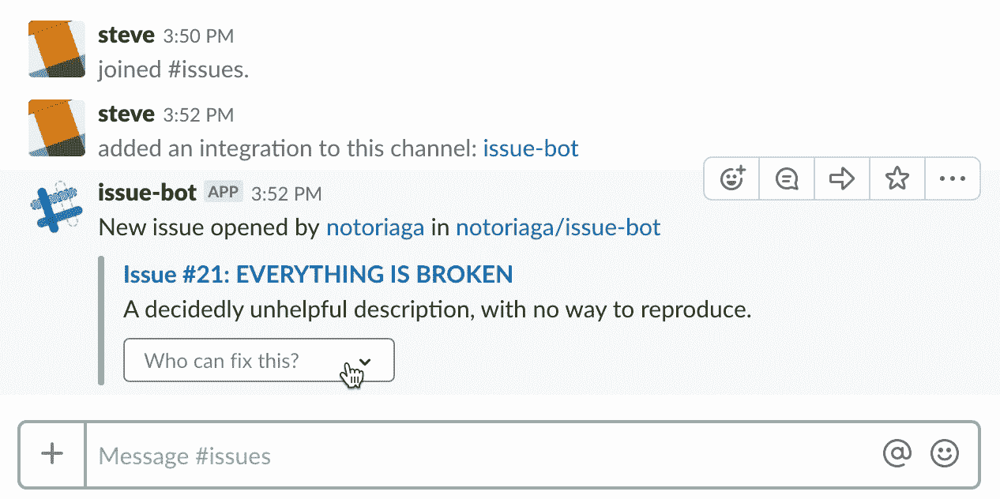

如果你不熟悉[标准库](https://www.stdlib.com)，我们是一个无服务器平台，让每个人都能在几秒钟内构建、发布和集成可扩展的 API。借助我们的在线开发环境，[标准库上的代码，](https://code.stdlib.com/)您可以直接从浏览器进行构建和部署。

## 步骤 1:创建一个 Slack 应用程序

导航到您的 [Slack 应用仪表板](https://api.slack.com/apps)，并点击屏幕右上角的**创建新应用**。你很快就会被重定向到标有“**基本信息**的页面。在屏幕左侧，您会看到“**功能**类别下的“**传入 Webhooks** ”。

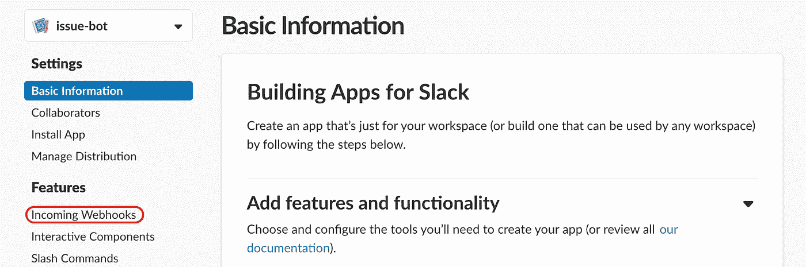

基于每个通道，传入的 webhooks 是将消息发布到 Slack 的最简单的方法。它们给你一个唯一的 URL，可以代表你的机器人向一个特定的频道发布消息。除了创建它们之外，发布消息不需要认证，所以要确保保密。

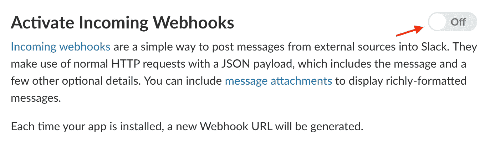

通过点击下一个屏幕上的开关启用传入的 webhooks。向下滚动到标题为“**您的工作区的 web hook URL**”的部分，并单击“**向工作区添加新的 web hook**”。选择一个渠道，点击**授权**。

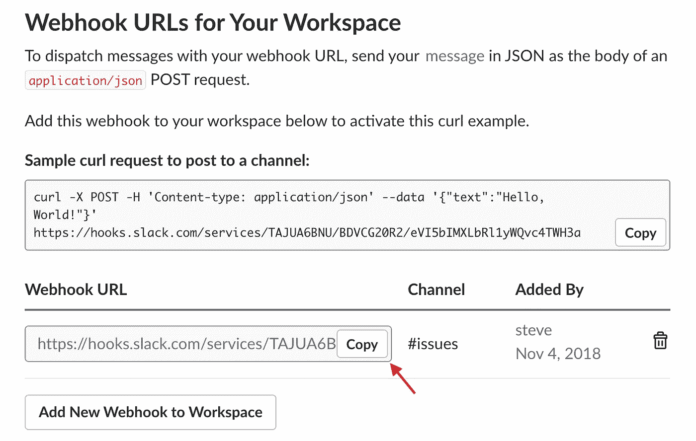

请注意“ **Webhook URL** ”，因为稍后会用到它。

## 步骤 2:部署发布 Bot API

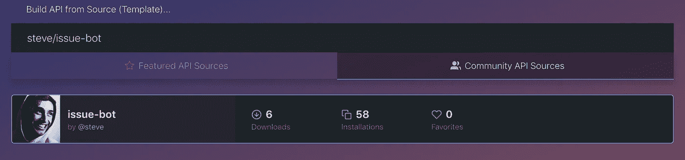

松弛部分都整理好之后，在标准库上打开[代码。如果您单击该链接，将自动打开 issue-bot API 的模板。如果没有，导航到“**社区 API 源**”选项卡并搜索“ **steve/issue-bot** ”。打开`env.json`文件，您会发现三个变量。将步骤 1 中的 Slack webhook URL 输入到`dev`部分下的`SLACK_WEBHOOK_URL`中。](https://code.stdlib.com/?src=@steve/issue-bot)

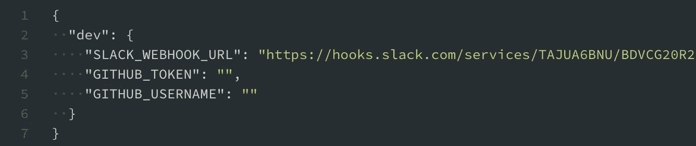

现在点击 **cmd/ctrl + R** 来部署您的 API。您将看到一个“**参数错误**，因为您的`functions/__main__.js`端点需要三个参数。这三个参数，`action`、`issue`和`repository`，将由 GitHub 提供(关于这些的更多信息，请查看[这些文档](https://developer.github.com/v3/activity/events/types/#issuesevent))。说到 GitHub，您需要注意您的 API 的“ **API 端点 URL** ”，您将把它交给 GitHub。

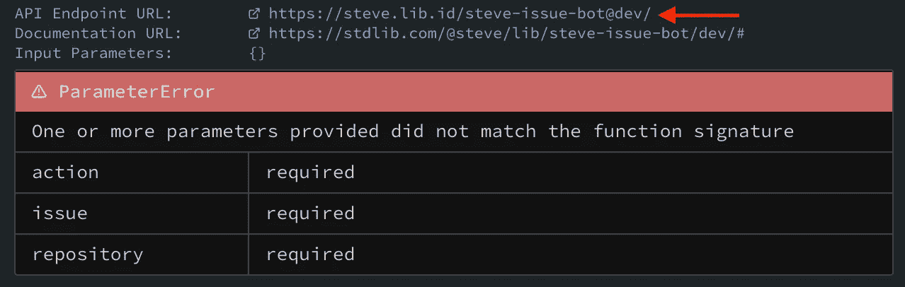

## 步骤 3:配置 GitHub Webhook

转到您要转发问题的 GitHub repo，然后单击屏幕最右侧的“**设置**选项卡。在那里，点击屏幕左侧的“ **Webhooks** ”部分。

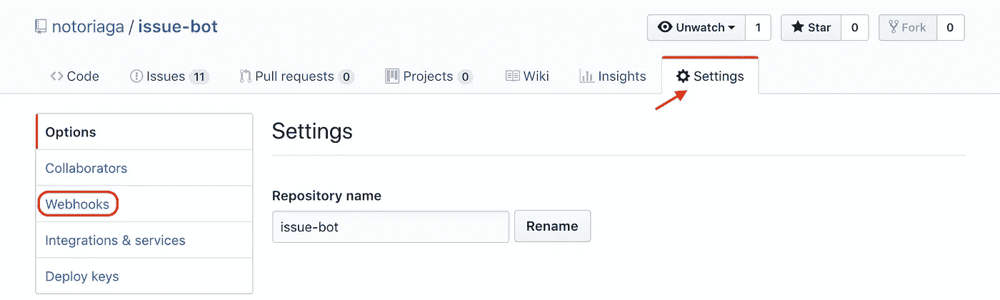

点击右上角的**添加 webhook** 后，系统会提示您填写表格。对于第一部分，输入步骤 2 中的“ **API 端点 URL** ”作为“**有效负载 URL** ”，并选择“**应用程序/json** ”作为内容类型。

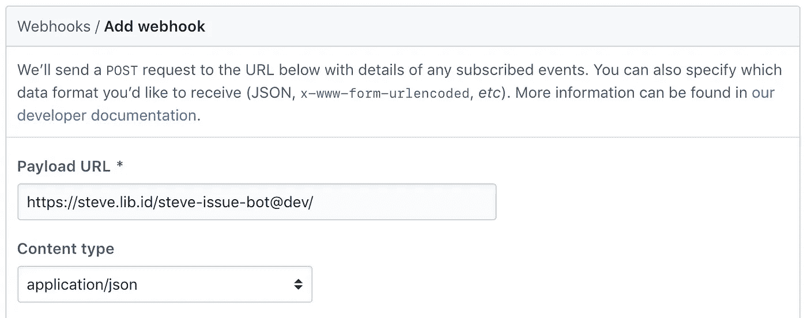

向下滚动一点后，您可以选择将哪些事件转发到您的 webhook。选择单个事件，并确保检查“**问题**”。

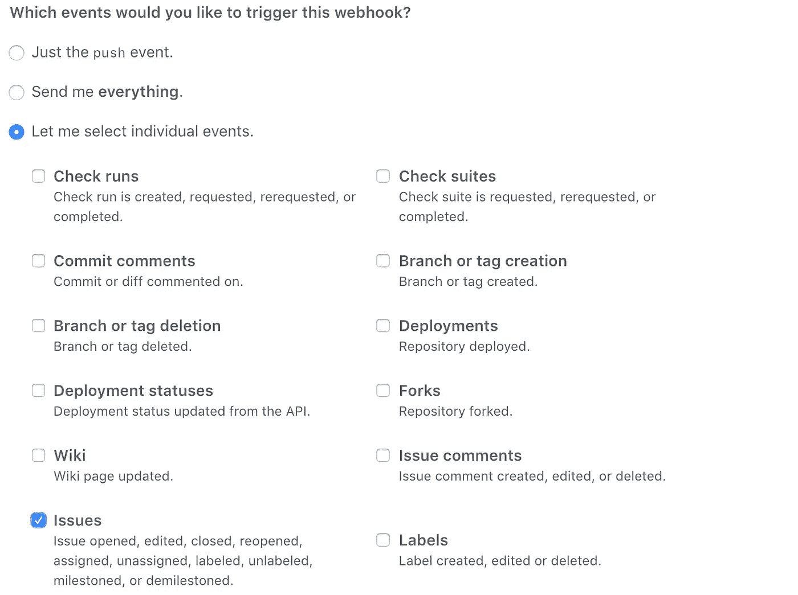

再次检查 webhook 是否标记为“**活动”**，并点击“**添加 webhook** ”。现在来测试一下:到你的 GitHub repo 打开一个问题！

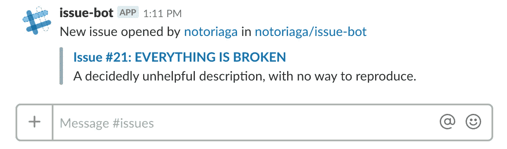

用户、存储库和问题元素都是将在浏览器中打开其各自页面的链接。目前，您的 API 还被配置为在问题关闭时转发。回到 GitHub，关闭刚刚打开的问题。

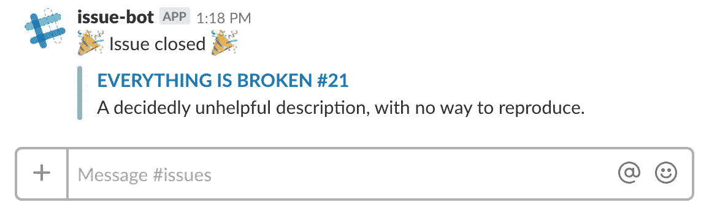

## 步骤 4:分配问题

所以，现在你的团队正在更新你的一个回复。下一个合乎逻辑的步骤是从 Slack 中指派一个维护者来解决这个问题。为了在 Slack 中启用交互式消息，您需要返回到应用仪表板，并导航到“**功能**”类别下标题为“**交互式组件**”的部分。一旦启用，您需要配置“**请求 URL** ”。这将与步骤 2 中的“ **API 端点 URL** 相同，但是在末尾添加了`/assign/`。当用户指定维护者时，这将是被击中的 API 端点。

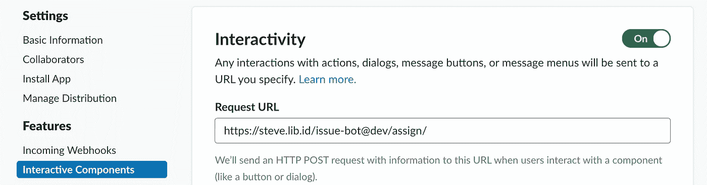

Slack 的最后一步是启用动态内容。这将让机器人预先填充一个下拉列表，其中包含有资格被分配到某个问题的人员列表。滚动到“**交互组件**页面的底部，到标题为“**消息菜单**的部分。作为“**选项加载 URL** ”，输入步骤 2 中的“ **API 端点 URL** ”，并在末尾添加`/assign/list/`。

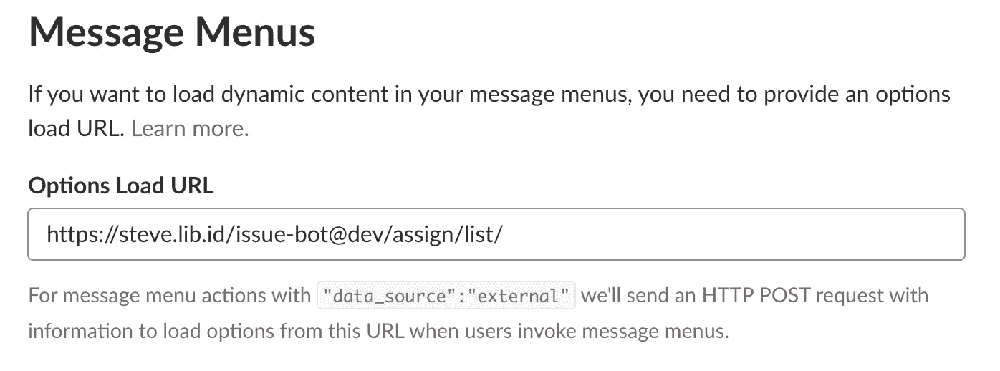

交互组件设置好了，GitHub 这边还有一些工作要做。将问题分配给某人需要对 GitHub 进行经过身份验证的 API 调用，因此您需要创建一个访问令牌。导航到您的[个人资料设置页面](https://github.com/settings/profile)，点击左下角的**开发者设置**。在这里，您需要单击左侧的最后一个选项“个人访问令牌”。

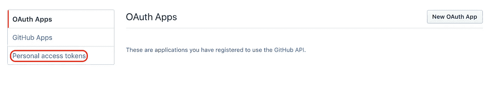

在下一页，点击**生成新令牌**。您需要命名这个令牌，并给它一个范围。令牌需要回购访问权限来分配问题，因此选择该选项。

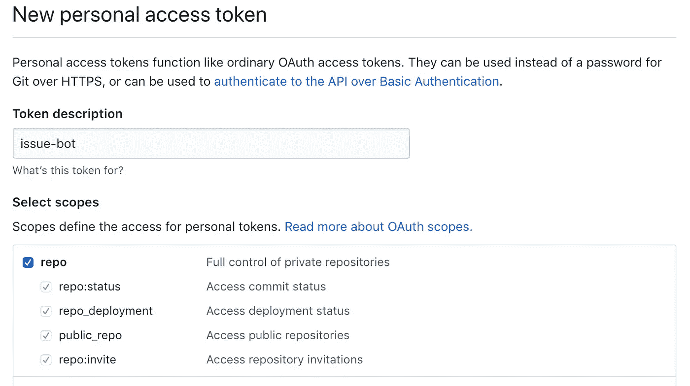

一旦创建，复制令牌并返回到标准库上的[代码。将令牌以及与令牌相关联的用户名复制到`GITHUB_TOKEN`和`GITHUB_USERNAME`下的`env.json`文件中。](https://code.stdlib.com/)

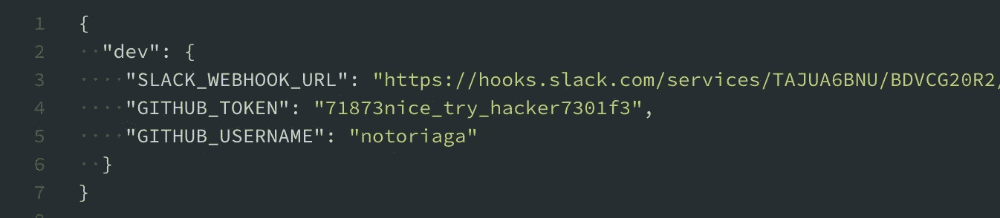

点击 **cmd/ctrl + R** 来重新部署您的 API。为了测试新功能，创建另一个问题，或者更好的是，进入回购的 webhooks 页面，向下滚动到“**最近交付**”。在那里你会看到 GitHub 发出的所有事件。找到您打开第一期时生成的邮件，然后单击“**重新发送”。**

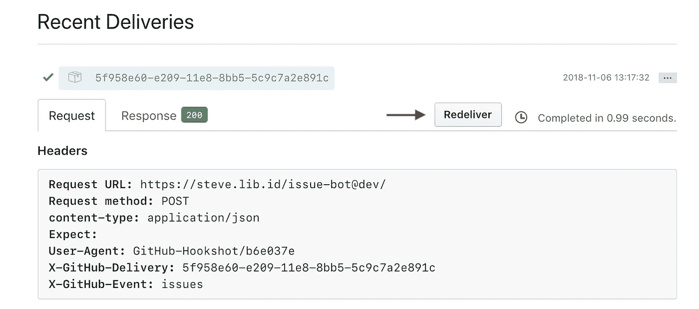

过一会儿，你会在 Slack 中看到一条新消息，与第一条相似，但有一个新的下拉菜单。

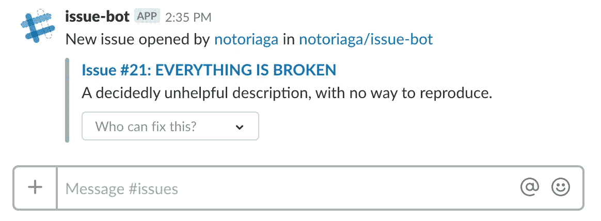

下拉列表将填充可能的受托人的 GitHub 用户名(即具有推送访问权限的帐户)。选择一个，过一会儿消息会更新以反映变化。当然，您的 GitHub 问题页面会显示新的受让人。

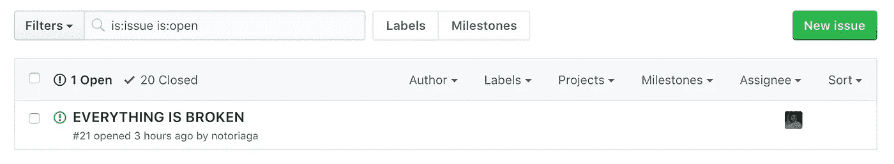

## 仅此而已！

我希望这篇教程有助于向您展示开始使用[标准库](https://stdlib.com)是多么容易。关于如何自动化你的工作流程、合并各种集成等等的其他想法，你可以在这里查看由团队[撰写的更多指南。如果你有一个好主意想要分享，请通过电子邮件直接联系我:【steve@stdlib.com】T4，或者在 Twitter 上关注](https://medium.com/stdlibhq)[标准库](https://twitter.com/stdlibhq)团队和[我](https://twitter.com/notoriaga)。

*Steve Meyer 是 Oberlin 学院的应届毕业生，也是标准图书馆的软件工程师。当他不编程的时候，你可以发现他在烤面包，或者玩红色死亡救赎 II。*