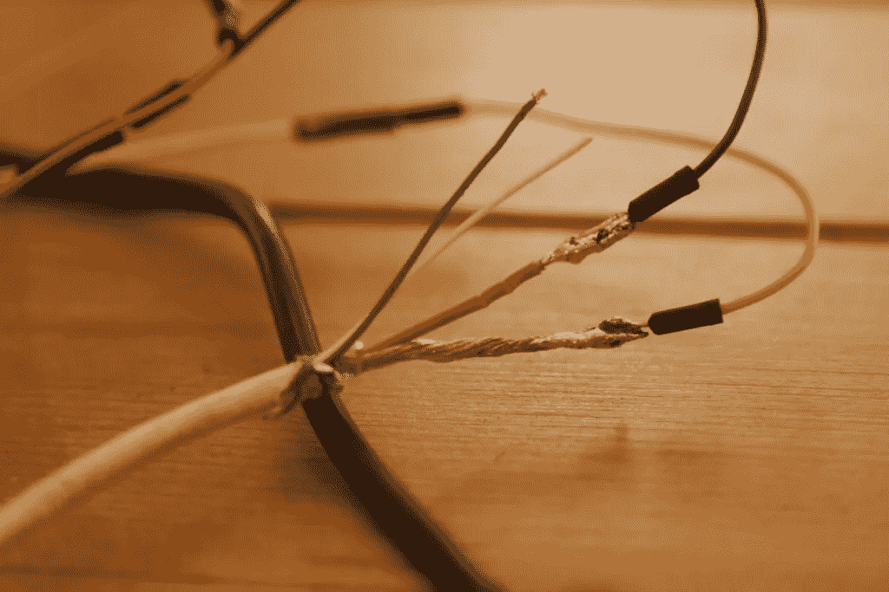
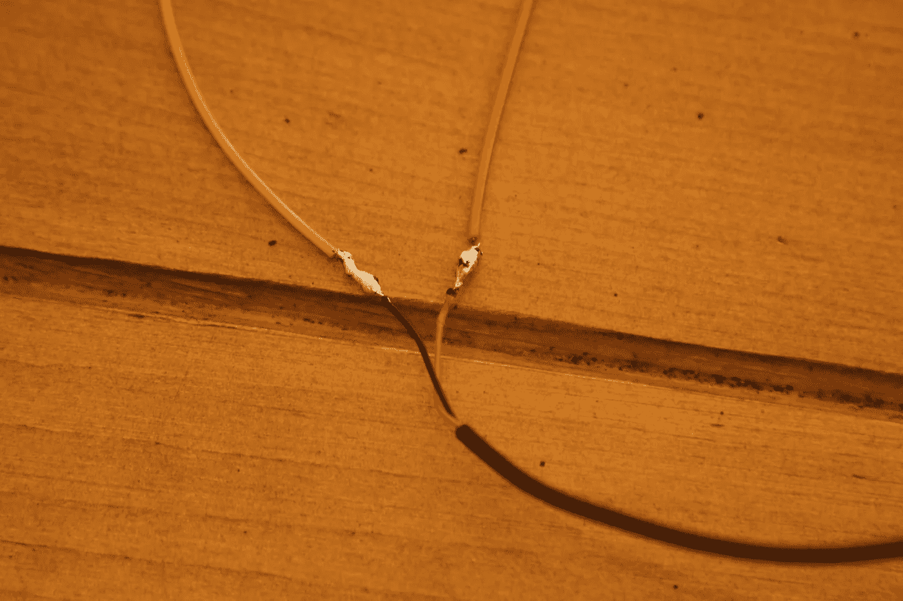
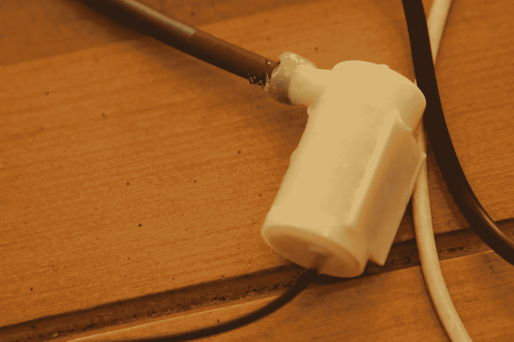
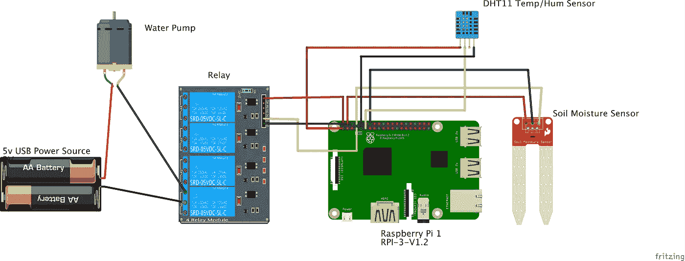
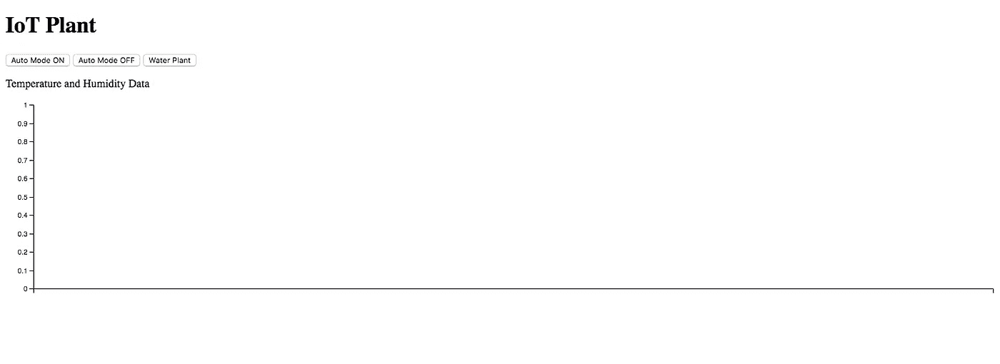
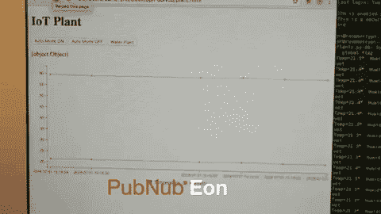

# 使用 Raspberry Pi 和 PubNub 构建智能、自动化的物联网植物灌溉系统

> 原文：<https://medium.com/hackernoon/build-a-smart-automated-iot-plant-irrigation-system-with-raspberry-pi-and-pubnub-b9b7b41d36c>

随着物联网和云计算的兴起，我们的技术变得越来越互联，我们不仅造福了我们的生活，也造福了我们的星球。智能农业席卷了整个世界，因为农民们已经学会了拥抱物联网世界，而不是拒绝它。这些农民已经能够精确地监控他们的产品状况以及控制他们的每一毫升资源。

像 [Illuminum 温室](https://illuminumgreenhouses.com/)这样的农业科技公司已经能够解决快速增长的人口对可持续食品和农业的需求问题；

> *“我们利用当地可用的材料和太阳能传感器，为小农户建造负担得起的现代温室，并安装自动化滴灌套件。”*
> 
> *-肯尼亚 Illuminum 温室*

随着世界人口即将达到 100 亿，我们需要更多地采用技术、保守的方法来养活大众，物联网是必由之路。

我们在 PubNub 与许多农业技术公司合作，如智能拖拉机、气候监测等等。我们甚至写了一些文章，展示如何将云计算的力量用于智能农业。

至于这个项目的灵感，我们已经创建了这个演示项目，展示了如何使用我们的实时数据基础设施来创建自我维持的植物系统。

# 你需要什么

*   [3-6V 水泵](https://www.aliexpress.com/item/Mini-Micro-Submersible-Motor-Pump-New-Water-Pumps-DC-3-6V-120L-H-Low/32692496265.html?src=google&albslr=220353225&isdl=y&aff_short_key=UneMJZVf&source=%7Bifdyn:dyn%7D%7Bifpla:pla%7D%7Bifdbm:DBM&albch=DID%7D&src=google&albch=shopping&acnt=708-803-3821&isdl=y&albcp=653153647&albag=34728528644&slnk=&trgt=61865531738&plac=&crea=en32692496265&netw=g&device=c&mtctp=&aff_platform=google&gclid=EAIaIQobChMI3-Kc_LS93AIViNdkCh2ZrgyxEAQYASABEgJatPD_BwE&gclsrc=aw.ds)
*   [硅胶管](https://www.amazon.com/gp/product/B0002AQI9K/ref=pe_370960_293375560_em_1p_8_ti)
*   5V 电源(手机充电线即可)
*   [树莓派 3](https://www.raspberrypi.org/products/raspberry-pi-3-model-b/)
*   [温度/湿度传感器](https://www.google.com/shopping/product/11256644188417662406?q=A0Song+Am2302&biw=1440&bih=826&prds=paur:ClkAsKraX-pK2DSJ2AEkYZ4QBdLXkt0WgYTXFnxoN92cYq21EhvWHLbDsahr2rsU6ncjVUkzSwFNECAhDNd4iGaH0cjjDB8UQpCBQSOkAHmUUv49FAankCKUARIZAFPVH71LKgKLnt2Ahhq_JYbszLZ5jId6ug&sa=X&ved=0ahUKEwil79yJtvTbAhUqqlkKHRGYD2sQ8wIIgQI)
*   [土壤湿度传感器](https://www.sparkfun.com/products/13637)

# 设置

# 接线

首先，如果你没有专用的 5V 电源，你可以很容易地用旧手机充电线做一个。简单地说，剪断手机适配器的头部，剥去大约 5 英寸的橡胶外壳，露出电线。

电线会很脆弱，所以将一些母头线焊接到裸露的电话电缆线上会是一个好主意。



这将是一个好主意，这样做也为泵的暴露电线。



如果你担心硅胶管无法密封在泵上，你可以在管口周围涂上热胶水来创造一个完美的密封。



现在您已经准备好开始连接您的组件了！按照这个图，并确保您插入额外的公-公电线到我们之前焊接的母接头，以将所有东西连接在一起。



请注意，我们在电路中使用了一个继电器，因为 Raspberry Pi 只能安全地承受 3.3V 以下的输入电压，因此，我们需要隔离 5V 电源，以免损坏 Pi。

# 五金器具

# 泵

该泵是一种潜水式水泵，这意味着它必须完全浸没在蓄水池中才能抽水。因此，对于这个项目，您将需要在任何时候都在植物旁边留出一个碗(或任何方法的蓄水池)。

*注意:只要 RPI 上没有水，电线末端弄湿也没关系！*

# DHT 传感器

DHT11 temp/hum sensory 是一款标准传感器，除了与您的工厂处于同一环境之外，不需要安装在任何特定的位置。由于温度和湿度在 5 英尺半径范围内变化不大，因此可以将传感器插入 RPI，而不是紧挨着植物。

# 土壤湿度传感器

土壤湿度传感器是一个标准的湿度传感器，在潮湿时输出电压，在干燥时不输出电压。您可以使用传感器上的电位计来调节传感器的灵敏度。

# 让我们开始编码吧！

在你做任何事情之前，确保你[注册了一个免费的 PubNub 账户](https://dashboard.pubnub.com/signup)，这样我们就不会遇到任何问题。

# 步骤 1:启用 SSH

安全外壳协议(SSH)允许用户通过 wifi 从他们的计算机远程访问他们的 Raspberry Pi 终端。如果辅以 GitHub，用户可以将代码从他们的计算机推送到一个远程存储库，SSH 到 Pi 终端，并以无线方式提取代码。这允许更快和更平滑的开发过程。

要在 RPI 上启用 SSH，[按照简单快速的说明进行操作。](https://www.raspberrypi.org/documentation/remote-access/ssh/)

# 步骤 2:下载设备库和依赖项

虽然我们可能有 3 个器件，但我们只需要读取其中 2 个器件的模拟电压。泵只需要在 GPIO 开关上操作。因此，我们只需要为温度/湿度传感器和土壤湿度传感器提取专用设备库。

**注意:**记住，这些库必须通过 SSH 进入您的设备并运行下面的命令安装到 RPI 上。

## DHT 温度湿度传感器

在您的项目目录中，克隆并输入传感器的代码库。

```
git clone [https://github.com/adafruit/Adafruit_Python_DHT.git](https://github.com/adafruit/Adafruit_Python_DHT.git) cd Adafruit_Python_DHT
```

安装一些 Python 依赖项。

```
sudo apt-get upgrade 
sudo apt-get install build-essential python-dev
```

现在，安装传感器的库。

```
sudo python setup.py install
```

这将编译库的代码并将其安装在您的设备上，这样任何 Python 程序都可以访问 Adafruit_DHT python 模块。

如果您想快速测试传感器以查看传感器是否工作，请输入以下命令:

```
cd examples sudo ./AdafruitDHT.py 2302 4
```

您应该会看到类似如下的读数:


## Raspberry Pi GPIO 库

对于我们的潜水泵，我们需要从 RPI 操作一个 1 或 0 的**输出**电压来打开它。相反，土壤湿度传感器根据是湿还是干给 RPI 一个**输入**电压 1 或 0。这两种功能都需要使用 RPI 的 GPIO 引脚。

由于我们将用 Python 编码，安装 GPIO Zero 库将会很有用，这将允许我们进行简单的函数调用来激活管脚。

```
sudo apt install python-gpiozero
```

# 步骤 3:用 PubNub 函数构建你的应用程序

这个项目的完整代码位于这个参考库:[https://github.com/Cakhavan/IoT_Plant](https://github.com/Cakhavan/IoT_Plant)

首先，让我们导入我们的库和其他依赖项来启用设备和 PubNub 功能

```
#Device Libraries 
import sys 
import Adafruit_DHT from gpiozero 
import LED, Button from time 
import sleep #PubNub 
import pubnub from pubnub.pnconfiguration 
import PNConfiguration from pubnub.pubnub 
import PubNub from pubnub.callbacks 
import SubscribeCallback from pubnub.enums 
import PNOperationType, PNStatusCategory
```

接下来，我们需要将传感器和泵初始化为它们对应的 RPI pin 号

```
#Pump is connected to GPIO4 as an LED 
pump = LED(4) #DHT Sensor (model type 22) is connected to GPIO17 
sensor = 22 
pin = 17#Soil Moisture sensor is connected to GPIO14 as a button 
soil = Button(14)
```

注意:由于泵需要发送 on 或 off 的输出电压(就像我们通常对 LED 做的那样)，我们将其初始化为一个 LED 实例。此外，我们将土壤湿度传感器初始化为一个按钮，因为当潮湿时，它会发出 1 的连续输入电压(就像按住按钮一样)。

为程序第一次启动时设置一些初始条件也是一个好主意:一个标志变量将程序的状态切换到自动模式或手动模式，并在程序启动时关闭泵。

```
#flag variable to toggle between Auto and Manual mode 
flag = 1 #always make sure the program starts with the pump turned off
#(conventions are backwards for the pump i.e. .on()=='off' and #.off()=='on') pump.on()
```

为了确保我们的物联网工厂能够与客户端通信，我们需要启用 PubNub 的双向发布订阅功能。为了确保我们可以接收消息，我们需要添加一个侦听器来处理传入的消息，并声明一个订阅来侦听特定的通道。

```
class MySubscribeCallback(SubscribeCallback):
    def status(self, pubnub, status):
        pass
        # The status object returned is always related to subscribe but could contain
        # information about subscribe, heartbeat, or errors
        # use the operationType to switch on different options
        if status.operation == PNOperationType.PNSubscribeOperation \
                or status.operation == PNOperationType.PNUnsubscribeOperation:
            if status.category == PNStatusCategory.PNConnectedCategory:
                pass
                # This is expected for a subscribe, this means there is no error or issue whatsoever
            elif status.category == PNStatusCategory.PNReconnectedCategory:
                pass
                # This usually occurs if subscribe temporarily fails but reconnects. This means
                # there was an error but there is no longer any issue
            elif status.category == PNStatusCategory.PNDisconnectedCategory:
                pass
                # This is the expected category for an unsubscribe. This means there
                # was no error in unsubscribing from everything
            elif status.category == PNStatusCategory.PNUnexpectedDisconnectCategory:
                pass
                # This is usually an issue with the internet connection, this is an error, handle
                # appropriately retry will be called automatically
            elif status.category == PNStatusCategory.PNAccessDeniedCategory:
                pass
                # This means that PAM does allow this client to subscribe to this
                # channel and channel group configuration. This is another explicit error
            else:
                pass
                # This is usually an issue with the internet connection, this is an error, handle appropriately
                # retry will be called automatically
        elif status.operation == PNOperationType.PNSubscribeOperation:
            # Heartbeat operations can in fact have errors, so it is important to check first for an error.
            # For more information on how to configure heartbeat notifications through the status
            # PNObjectEventListener callback, consult <link to the PNCONFIGURATION heartbeart config>
            if status.is_error():
                pass
                # There was an error with the heartbeat operation, handle here
            else:
                pass
                # Heartbeat operation was successful
        else:
            pass
            # Encountered unknown status type

    def presence(self, pubnub, presence):
        pass  # handle incoming presence data

    def message(self, pubnub, message):
        if message.message == 'ON':
        global flag
        flag = 1
        elif message.message == 'OFF':
      global flag
      flag = 0
        elif message.message == 'WATER':
        pump.off()
        sleep(5)
        pump.on()

pubnub.add_listener(MySubscribeCallback())
pubnub.subscribe().channels('ch1').execute()Then, to enable sending out messages, we declare a publisher callbackdef publish_callback(result, status): pass
```

现在，我们需要一种方法来检查我们的传感器是湿的还是干的。由于我们将土壤传感器声明为一个按钮，函数调用“is _ held”只是意味着我们应该检查土壤传感器何时输出连续的“1”(是干的)。

```
def get_status():
  #Soil sensor acts as button. is_held == sensor outputting a 1 for dryness
  if soil.is_held: 
    print("dry")
    return True
  else:
    print("wet")
    return False
```

接下来，让我们实现我们程序的实质。我们将需要 RPI 连续轮询来检查传感器数据，因此让我们实现一个连续的 while 循环:

```
while True:
```

我们现在需要设置状态条件，检查标志变量是 1 还是 0(也就是自动模式还是手动模式)

```
if flag == 1: 
#to be implemented
elif flag == 0: 
#to be implemented
```

就像我们之前做的一样，让我们从 DHT 传感器获取数据，并将其打印到终端

```
if flag == 1:    
     # Try to grab a sensor reading.  Use the read_retry method which will retry up
     # to 15 times to get a sensor reading (waiting 2 seconds between each retry).
     humidity, temperature = Adafruit_DHT.read_retry(sensor, pin)
     DHT_Read = ('Temp={0:0.1f}*  Humidity=                              {1:0.1f}%'.format(temperature, humidity))
     print(DHT_Read)
```

现在，我们可以将这些数据发布到 PubNub，供未来的物联网使用。我们将在一个特定的通道上发布，所以让我们发布到一个名为“ch2”的东西，因为“ch1”是为监听标志变量而保留的。

```
pubnub.publish().channel('ch2').message([DHT_Read]).async(publish_callback)
```

然后检查土壤传感器的状态，并相应地打开或关闭泵

```
wet = get_status()
if wet == True:
    print("turning on")
    pump.off()
    sleep(5)
    print("pump turning off")
    pump.on()
    sleep(1)
else:
    pump.on()
sleep(1)
```

注意:记住。在()和上。off()方法调用

最后，让我们实现手动模式 elif 条件，这只是确保泵总是关闭的

```
elif flag == 0: 
     pump.on()
     sleep(3)
```

# 步骤 4:如何上传您的代码

就像我们在上一节中讨论的 Git 的使用一样，您应该总是将您的代码提交到您的存储库中，然后将它拉到您的 Raspberry Pi 中。该过程始终遵循以下顺序

1.)将您的代码保存在您的计算机上

2.)使用以下命令将它提交给云

```
git add . 
git commit -m "updates" 
git push
```

3.)SSH 到您的 RPI，cd 到正确的目录

```
ssh pi@<YOUR IP ADDRESS> 
cd <your directory>
```

4.)从云中取出代码并运行它

```
git pull python Plant.py
```

# 步骤 5:创建客户端

我们现在将创建一个前端 HTML 页面来与我们的物联网工厂进行交互，然后在步骤 6 中可视化其数据。我们将构建类似这样的东西。



首先，让我们从将设备置于自动状态、手动模式状态或水厂状态的 3 个按钮开始。这将通过让每个按钮发布一条消息来完成，工厂将相应地改变其标志变量。

让我们首先给我们的页面一个标题

```
<!DOCTYPE html>
<html>
  <body>
            <h1>IoT Plant</h1>
  </body>
</html>
```

在 HTML 文件的主体中，插入 3 个按钮，用 PubNub SDK 发布消息，如下所示

```
<button type="button" onclick="publish('ON')">Auto Mode ON</button>
<button type="button" onclick="publish('OFF')">Auto Mode OFF</button>
<button type="button" onclick="publish('WATER')">Water Plant</button>
```

在这些按钮下面，让我们的网站不断更新屏幕，显示步骤 4 中“ch2”通道发布的准确温度和湿度数据。为了做到这一点，我们给一个

标签一个名为“sensorData”的 id，这样程序就可以在以后使用“getElementByID”和“changeInnerElement”函数调用注入

标签的内容。一会儿你就会明白我在说什么了。

```
<p id="sensorData">Temperature and Humidity Data</p>
```

现在让我们导入 PubNub JavaScript SDK，以便实际使用“publish”方法和其他方法。

```
<script src="https://cdn.pubnub.com/sdk/javascript/pubnub.4.20.2.js"></script>
```

然后用 API 键实例化一个 PubNub 实例

```
var pubnub = new PubNub({
  publishKey : 'YOUR PUB KEY',
  subscribeKey : 'YOUR SUB KEY',
  });
```

然后创建一个发布回调，将按钮数据发布到 RPI。注意我们如何为按钮数据保留“ch1 ”,为 RPI 数据保留“ch2”。

```
function publish(a){
  var publishConfig = 
    {
      channel : "ch1",
      message : a
    };
    pubnub.publish(publishConfig, function(status, response){
      console.log(status, response);
    });

  }
```

接下来，我们实例化一个监听器和订阅者来获取 RPI 传感器数据。注意使用前面介绍的“getElementById”和“innerHTML”函数调用的那一行。这允许我们获取任何 PubNub 消息，并用相应的 id 标签更新屏幕上的任何变量。这对实时物联网仪表盘来说太棒了！

```
pubnub.addListener({
    message: function(m) {
        // handle message
        var channelName = m.channel; // The channel for which the message belongs
        var channelGroup = m.subscription; // The channel group or wildcard subscription match (if exists)
        var pubTT = m.timetoken; // Publish timetoken
        var msg = m.message; // The Payload
        var publisher = m.publisher; //The Publisher
        //inject the sensor data msg into the sensorData tag declared earlier for real-time updates
        document.getElementById("sensorData").innerHTML = msg;
        console.log(msg)
    },
    presence: function(p) {
        // handle presence
        var action = p.action; // Can be join, leave, state-change or timeout
        var channelName = p.channel; // The channel for which the message belongs
        var occupancy = p.occupancy; // No. of users connected with the channel
        var state = p.state; // User State
        var channelGroup = p.subscription; //  The channel group or wildcard subscription match (if exists)
        var publishTime = p.timestamp; // Publish timetoken
        var timetoken = p.timetoken;  // Current timetoken
        var uuid = p.uuid; // UUIDs of users who are connected with the channel
    },
    status: function(s) {
        var affectedChannelGroups = s.affectedChannelGroups;
        var affectedChannels = s.affectedChannels;
        var category = s.category;
        var operation = s.operation;
    }
});
pubnub.subscribe({
    channels: ['ch2'],

});
```

# 步骤 6:用 PubNub EON 绘制你的输入数据

现在是我们项目中最炫最酷的部分: [EON](https://www.pubnub.com/developers/eon/) ！PubNub EON 允许用户通过放下脚本标签来轻松呈现实时数据图。

通过将 EON 整合到我们的项目中，我们将得到类似这样的东西



## HTML 设置

因为此时您很可能已经打开了 HTML 页面，所以让我们先从这里开始实现 EON。

要将 PubNub EON 添加到任何 HTML 页面，只需在您的主体中添加这个 div 标记，它将注入实际的图表

```
<div id="chart"></div>
```

然后导入脚本标签 SDK

```
<script src="[https://pubnub.github.io/eon/v/eon/1.0.0/eon.js](https://pubnub.github.io/eon/v/eon/1.0.0/eon.js)"></script>
<link rel="stylesheet" href="[https://pubnub.github.io/eon/v/eon/1.0.0/eon.css](https://pubnub.github.io/eon/v/eon/1.0.0/eon.css)"/>
```

然后订阅你将要发布数据的 eon-chart 频道

```
eon.chart({
        channels: ['eon-chart'],
        history: true,
        flow: true,
        pubnub: pubnub,
        generate: {
          bindto: '#chart',
          data: {
            labels: false
          }
        }
      });
```

就是这样！就这么简单！

现在，让我们实现最后一步，即格式化传感器的发布者，以便 EON 知道如何绘制数据。

## Python 设置

这部分就更简单了。就两行啊！

回到你的 Plant.py python 代码。现在，为了用 python 正确地发布到 eon-chart API，您需要创建一个这种类型的字典

```
dictionary = {"eon": {"DATA NAME": DATA, "DATA 2 NAME": DATA 2 etc...}}
```

所以在我们的例子中，我们的字典看起来像这样

```
dictionary = {"eon": {"Temperature": temperature, "Humidity": humidity}}
```

将此粘贴到将传感器数据发布到 ch2 的那一行的正上方。

现在我们需要将这本字典发布到我们的图表将要读取的通道。在我们的例子中，eon-chart 频道。

```
pubnub.publish().channel("eon-chart").message(dictionary).async(publish_callback)
```

这就对了。你已经成功地创造了一个自我维持的系统来永远保存生命…..直到你需要重新装满水。

*最初发表于*[T5【www.pubnub.com】](https://www.pubnub.com/blog/smart-automated-iot-plant-irrigation-system-raspberry-pi-pubnub/)*。*