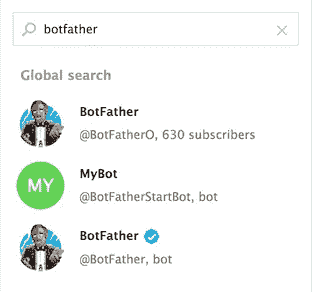
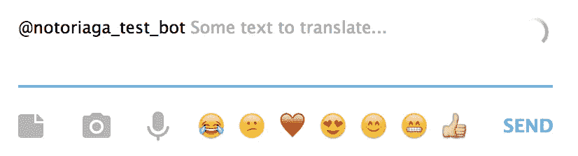
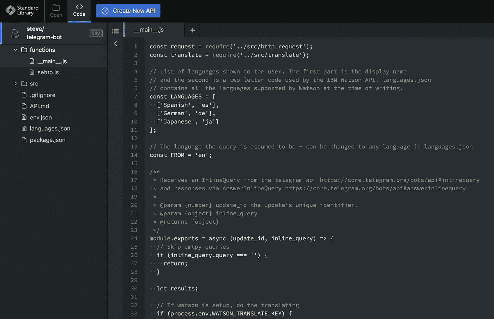
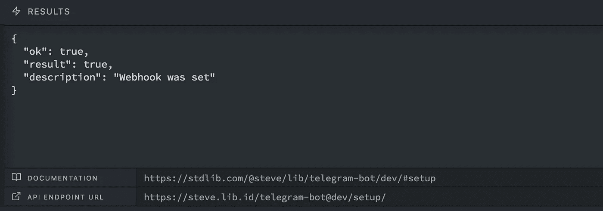
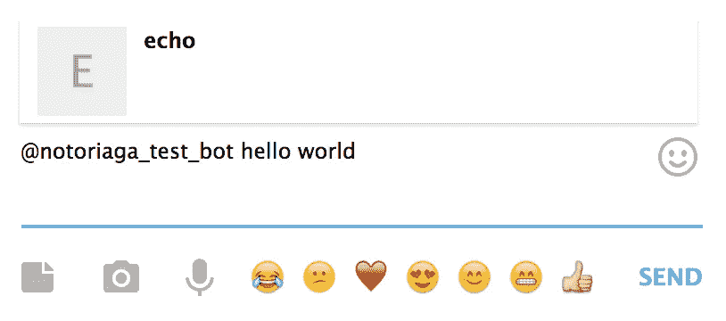
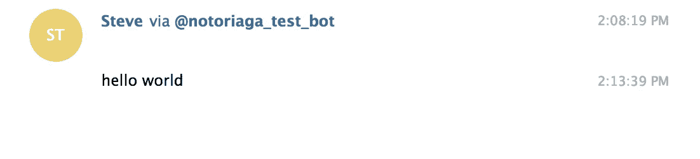
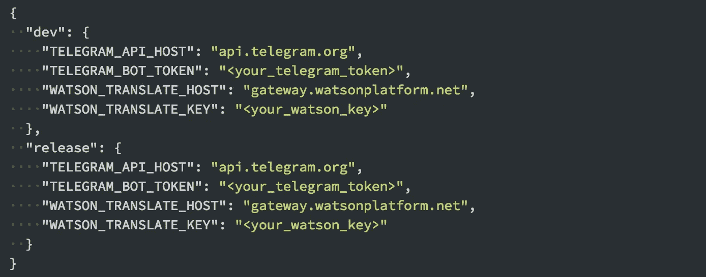
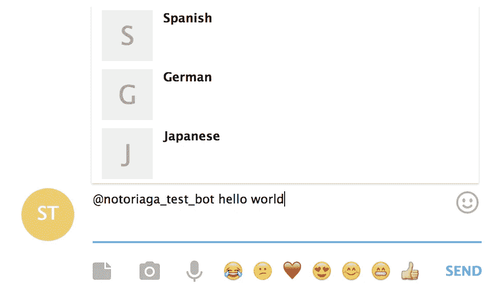

# 构建一个电报机器人，用 Node.js 和 Code.xyz 分三步翻译文本

> 原文：<https://medium.com/hackernoon/build-a-telegram-bot-that-translates-text-in-3-steps-with-node-js-and-code-xyz-fa9d6309b659>

[Telegram](https://telegram.org/) 是一种注重隐私的即时消息和语音服务。碰巧的是，他们也有一个非常漂亮的界面来创建机器人。这一切都是通过与另一个名为“机器人父亲”的机器人对话，在应用程序中完成的。

本教程将带你创建一个可以将文本翻译成几种不同语言的电报机器人。翻译将由 IBM Watson 的[语言翻译器](https://www.ibm.com/watson/services/language-translator/)处理。[电报机器人 API](https://core.telegram.org/bots/api) 和 Watson 将由[标准库](https://stdlib.com/)汇集在一起。

如果您不熟悉[标准库](https://stdlib.com)，我们结合了一个可扩展的计算层，以及自动生成的文档、身份验证、计费等。我们努力让任何人都能在几秒钟内将简单的 [JavaScript](https://hackernoon.com/tagged/javascript) 函数转化为生产就绪的 API。在我们的在线编辑器 [Code.xyz](https://code.xyz) 的帮助下，您可以在本地机器上进行零设置或安装，就可以发布到标准库。

## 你事先需要什么

*   1x 电报帐户
*   **≈** 5x 分钟

## 第一步:咨询机器人父亲

这是父亲女儿结婚的日子。你有机会要求一件礼物，他当然不会拒绝。你选择要求你自己的电报机器人。无论你使用 Telegram [网络应用程序、](https://web.telegram.org)还是你手机各自的客户端，去搜索栏输入“僵尸父亲”。可能有几个选项，请确保选择带有“已验证”复选标记的选项。

Imposters! You want the one with the blue check.

对话开始后，输入`/newbot`,机器人父亲会询问你的名字。这不是机器人的用户名，所以它不必是唯一的。我和`notoriaga_test_bot`一起去的。接下来，僵尸父亲会要求输入用户名(即`@BotFather`)。人们会这样称呼你的机器人，所以它必须是独一无二的。我还是选择了`notoriaga_test_bot`，但是你必须选择不同的。在这一步之后，机器人父亲将返回一个用来控制你的机器人的令牌。把它抄下来，我们马上就要用到。

现在我们需要为机器人启用[内联模式](https://core.telegram.org/bots/api#inline-mode)。这使得人们可以在任何聊天中输入`@<bot-name>`来使用你的机器人，而不是像我们使用机器人父亲那样打开聊天。键入`/setinline`，然后点击你刚刚创建的机器人。机器人父亲会要求一些占位符文本。我选择了`Some text to translate…`,它是这样展示的—

## 步骤 2:用标准库添加一些基本功能

[Code.xyz](http://code.xyz) — Standard Library’s free online editor for APIs

在开始翻译之前，让我们先看一个基本的“hello world”示例。前往 [Code.xyz，](https://code.xyz/?src=@telegram/bot)标准库的在线代码编辑器。它预装了(几乎)让你的机器人运行所需的一切。您可以通过该链接或点击登录页面上的“特色 API 源代码”选项卡来找到代码。

加载后，打开`env.json`文件。你会看到四个不同的变量。目前，我们只关心`TELEGRAM_BOT_TOKEN`。这是之前令牌。如果因为某种原因找不到，可以一边和僵尸爸爸说话，一边用`/token`做一个新的。无论哪种方式，将令牌放入您的`env.json`中。

现在前往`function/setup.js`。这个函数在运行时将项目中的`functions/__main__.js`文件注册为所有 bot 内联查询的接收者。点击 run 后，您应该会收到 Telegram 的响应，表示一切正常—

现在回到电报给你的机器人一个尝试。键入`@<bot_name> hello world`，过一会儿会出现一个弹出窗口，显示`echo`

点击弹出菜单，然后—

成功！设置好基本功能后，让我们让机器人做一些更有用的事情。

## 步骤 3:用 IBM Watson 翻译内联查询

打开你的 IBM Bluemix 仪表板(如果你没有的话，创建一个账户)。在您的仪表板上，点击右上角附近的`Create resource`。从左边的分类侧边栏点击`AI`，然后点击`Language Translator`。为您的服务命名并点击`Create`。现在，您的服务页面应该有两个凭证。第一个是`API Key`。简单地把它复制到你的`env.json`中作为`WATSON_TRANSLATE_KEY`。现在对于`Url`，你只对主机感兴趣，也就是`https://`和`/language-translator/api`之间的部分。将主机作为`WATSON_TRANSLATE_HOST`复制到您的`env.json`中。

The complete env.json

有了这些新的环境变量，回到`functions/setup.js`并再次点击 run。现在，关键时刻到了。回到电报，再次输入`@<bot_name> hello-world`。这次你应该看到—

当然，点击一个就会把翻译输入到聊天中——

## 仅此而已！

我希望本教程有助于向您展示使用标准库组合不同的服务是多么容易。关于如何更好地使用标准库的更多灵感，你可以在这里查看团队编写的更多指南。如果你有好的想法想要分享，请直接通过电子邮件联系我:**steve@stdlib.com**，或者在 Twitter 上关注[我](https://twitter.com/notoriaga)和[标准库](https://twitter.com/stdlibhq)团队。

Steve Meyer 是 Oberlin 学院的应届毕业生，也是标准图书馆的软件工程师。当他不在 [*编程*](https://hackernoon.com/tagged/programming) *的时候，你可以找他烤面包，或者玩蜘蛛侠。*