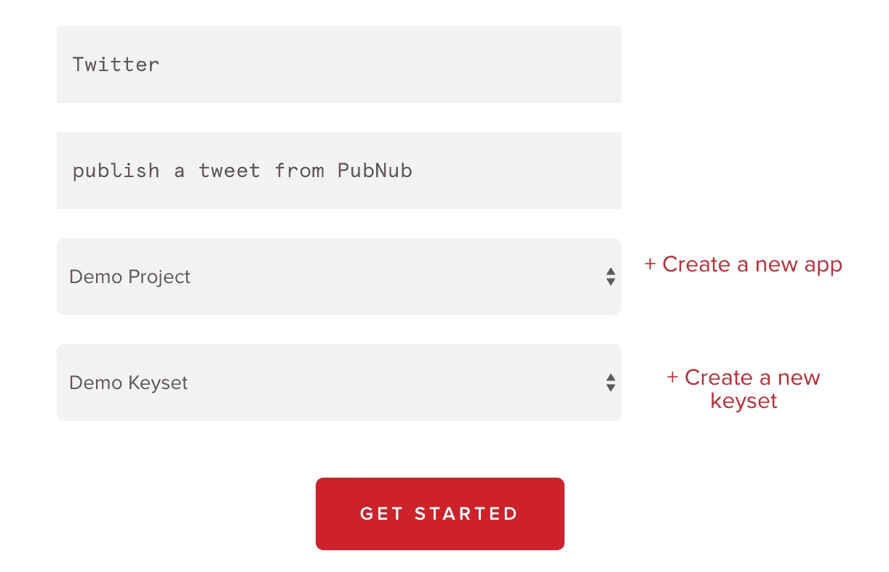

# 建立一个具有 PubNub 功能的 Twitter 聊天机器人

> 原文：<https://medium.com/hackernoon/build-a-twitter-chatbot-with-pubnub-functions-3e7030748810>


> 披露: [**PubNub**](https://goo.gl/KhF2cY) ，由 API 提供动力，通过全球基础设施交付，此前曾赞助过黑客 Noon。

所以你想创建一个 [Twitter](https://hackernoon.com/tagged/twitter) 机器人来自动与你的客户*互动。*这可以使用 PubNub 函数和我们的 [Twitter 块](https://www.pubnub.com/docs/blocks-catalog/twitter?utm_source=Syndication&utm_medium=Medium&utm_campaign=SYN-CY18-Q2-Medium-Hackernoon-Sponsorship&utm_content=twitter-chatbot)来配置和部署。

# 实际使用案例

[Open Growth SDK](https://github.com/pubnub/open-growth) 使用[机器学习](https://hackernoon.com/tagged/machine-learning)智能地与您的客户实时联系。不再有电子邮件爆炸，不再有观察线索，不再有通信延迟。一旦客户注册了你的服务，他们就会被分类以确定他们的需求。**愉悦引擎**自动为客户可能的使用案例提供特定资源。外联是为每个人量身定制的。

Open Growth 通过电子邮件、短信、Twitter 甚至蛋糕发送个性化介绍🍰！本指南展示了如何配置贵公司的 Twitter 账户，以便向您的客户自动发布@tweets(遵循[文档](https://dev.twitter.com/oauth/pin-based)):

*   [注册一个 Twitter 账户](https://www.twitter.com/)，或者登录一个现有账户。
*   登录并进入 [Twitter 应用管理仪表板](https://apps.twitter.com/)，点击**创建新应用**，填写除**回调 URL** 之外的所有字段。
*   点击**创建您的 Twitter 应用**。
*   转到**权限**选项卡，确保应用程序的权限设置为**读写**。
*   接下来，您需要授权访问并获得一个 OAuth 令牌。您可以通过点击**创建我的访问令牌**按钮，在**密钥和访问令牌**页面获取消费者密钥并生成令牌。
*   快好了！现在，您可以使用 Twitter 块通过发布 PubNub 消息或 REST API 调用来发布 Tweet。

[](https://apps.twitter.com/)

# 测试和调试

除了点击**创建我的访问令牌**按钮，您还可以使用基于 PIN 的授权。你可以使用 [Twurl](https://github.com/twitter/twurl) 进行授权和调试，Twurl 是一个类似 Curl 的命令行工具，但是是为 Twitter 定制的。如果您安装了 Ruby，您可以在命令行上使用以下命令安装 Twurl:

```
gem install twurl
```

*   从 Twitter 应用程序页面上的**键和访问令牌**选项卡准备好您的钥匙。

```
twurl authorize --consumer-key "Your app’s consumer key" \ --consumer-secret "Your app’s consumer secret"
```

*   命令行上将返回一个 URL。在网络浏览器中访问该 URL，就会出现一个 pin。在命令行上输入 pin，应用程序的令牌就可以使用了。
*   返回到**密钥和访问令牌**页面，找到您的新访问令牌。

配置完 Twitter 应用程序后，就可以配置 PubNub Functions 事件处理程序了。 [**如果你还没有报名参加 PubNub**](https://admin.pubnub.com/#/register?utm_source=Syndication&utm_medium=Medium&utm_campaign=SYN-CY18-Q2-Medium-Hackernoon-Sponsorship&utm_content=twitter-chatbot) ！

接下来，我们将通过单击**立即尝试**按钮[此处](https://www.pubnub.com/docs/blocks-catalog/twitter?utm_source=Syndication&utm_medium=Medium&utm_campaign=SYN-CY18-Q2-Medium-Hackernoon-Sponsorship&utm_content=twitter-chatbot)导入 Twitter 函数事件处理程序代码。

[](https://www.pubnub.com/docs/blocks-catalog/twitter?utm_source=Syndication&utm_medium=Medium&utm_campaign=SYN-CY18-Q2-Medium-Hackernoon-Sponsorship&utm_content=twitter-chatbot)

按照[管理仪表板 UI](https://admin.pubnub.com/?utm_source=Syndication&utm_medium=Medium&utm_campaign=SYN-CY18-Q2-Medium-Hackernoon-Sponsorship&utm_content=twitter-chatbot) 将代码导入到您的一个 PubNub 应用中。

[](https://admin.pubnub.com/#/register?utm_source=Syndication&utm_medium=Medium&utm_campaign=SYN-CY18-Q2-Medium-Hackernoon-Sponsorship&utm_content=twitter-chatbot)

从推特应用程序**的钥匙和[https://apps.twitter.com/](https://apps.twitter.com/)上的访问令牌**标签中取出 4 个秘密，并将它们放入你的[功能库](https://www.pubnub.com/docs/blocks/vault-module?utm_source=Syndication&utm_medium=Medium&utm_campaign=SYN-CY18-Q2-Medium-Hackernoon-Sponsorship&utm_content=twitter-chatbot)。这可以从左侧的函数事件处理程序编辑器中访问。

[](https://admin.pubnub.com/#/register?utm_source=Syndication&utm_medium=Medium&utm_campaign=SYN-CY18-Q2-Medium-Hackernoon-Sponsorship&utm_content=twitter-chatbot)

点击**我的秘密**，按照 Twitter 事件处理程序代码将您的密钥和值输入到保险库中。

[](https://admin.pubnub.com/#/register?utm_source=Syndication&utm_medium=Medium&utm_campaign=SYN-CY18-Q2-Medium-Hackernoon-Sponsorship&utm_content=twitter-chatbot)

接下来点击右边的**启动模块**按钮，**提交测试负载**(左)，然后**查看你的 Twitter** ！

您已经启用了自动推文！使用 PubNub [REST API](https://www.pubnub.com/docs/pubnub-rest-api-documentation?utm_source=Syndication&utm_medium=Medium&utm_campaign=SYN-CY18-Q2-Medium-Hackernoon-Sponsorship&utm_content=twitter-chatbot) 或任何 [SDK](https://www.pubnub.com/docs?utm_source=Syndication&utm_medium=Medium&utm_campaign=SYN-CY18-Q2-Medium-Hackernoon-Sponsorship&utm_content=twitter-chatbot) ，你可以程序化地发布推文！

> 最初发表于 www.pubnub.com。
> 
> [**PubNub**](https://goo.gl/n1TrNG) **，**我们的每周赞助商，让您能够构建身临其境的交互式应用。聊天、地图、仪表盘、智能设备控制— [**由 API 支持，通过全球基础设施交付。**](https://goo.gl/n1TrNG)
> 
> 了解更多关于成为[黑客午间周刊赞助商](https://weeklysponsor.paperform.co/)的信息。