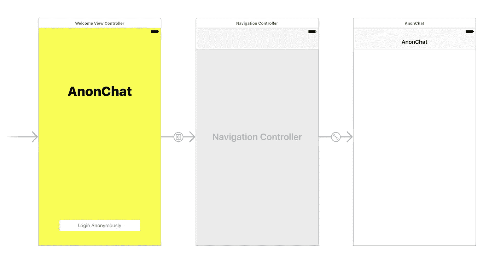

# 在 Swift 中建立一个打字指示器

> 原文：<https://medium.com/hackernoon/build-a-typing-indicator-in-swift-8a1854a3d7f4>

> 遵循本教程需要对 Swift 和 Node.js 有基本的了解。

在之前的教程中，我们介绍了[如何创建一个公开的匿名 iOS 聊天应用](https://blog.pusher.com/create-anonymous-public-ios-chat-app/)。我们能够使用 Swift 和 Pusher 创建应用程序，因此应用程序不会保存状态。

在本文中，我们将扩展该应用程序，并向该应用程序添加一个输入指示器。如果您还没有阅读前一篇文章，我建议您阅读，但是如果您不想阅读，那么您可以在这里获取文章的[源代码并跟随阅读。](https://github.com/neoighodaro/anonymous-ios-app-pusher/tree/v1.0)

# 我们将会建造什么

如前所述，我们将在应用程序中添加一个输入指示器。这个功能表明有人正在另一端键入消息——就像 WhatsApp、微信或即时通讯客户端一样。


# 设置应用程序

打开上面你下载的源代码的根目录，然后打开目录中包含的`.xcworkspace`文件；这应该会启动 XCode。现在我们已经有了一个故事板。在故事板中，我们有一个进入控制器，它有一个匿名登录的按钮。点击按钮，导航控制器加载`ChatViewController`。



> ***注意*** *:为了测试应用程序，您可能需要在 web app 目录下的* `*ChatViewController*` *和* `*index.js*` *文件中定制 Pusher 应用程序凭证。您还需要在 webapp 目录下运行* `*node index.js*` *来启动一个本地 web 服务器。*

# 我们需要做的是

为了让这个应用程序做我们需要它做的事情，我们需要做一些新的事情。首先，我们将向 web 服务器应用程序添加一个新的端点，一旦有人开始输入，它将触发 Pusher。我们将在应用程序中添加一个新的监听器，在有人打字时监听，最后，当有人在“新消息”字段中输入文本时，我们将触发新的端点。

# 在 web 服务器上添加端点

现在，我们想在 web 服务器上添加一个端点，每当有人输入时，它就会触发 Pusher 事件。在您选择的编辑器上打开`webapp`目录中的`index.js`。现在可以将`/typing`端点添加到代码中，如下所示:

```
app.post('/typing', function (req, res) {
  var message = {
    sender: req.body.sender,
    text: req.body.sender + " is typing..."
  };
  pusher.trigger('chatroom', 'user_typing', message);
  res.json({success: 200})
})
```

所以现在，每当我们点击`/typing`端点时，它应该用消息`senderId is typing…`触发 Pusher。太好了。

# 打字时从应用程序触发推送器

接下来要做的事情是每当当前用户在应用程序上输入时触发 Pusher。这基本上会触及我们刚刚创建的以`username`作为`sender`参数的`/typing`端点。

为了确保我们的代码保持干燥，我们对代码进行了一点重构。我们已经将到达终点的部分抽象成一个叫做`hitEndpoint`的方法，现在只要我们想到达终点就使用它。

```
var isBusySendingEvent : Bool = falseprivate func postMessage(name: String, message: String) {
    let params: Parameters = ["sender": name, "text": message]
    hitEndpoint(url: ChatViewController.API_ENDPOINT + "/messages", parameters: params)
}private func sendIsTypingEvent(forUser: String) {
    if isBusySendingEvent == false {
        isBusySendingEvent = true
        let params: Parameters = ["sender": forUser]
        hitEndpoint(url: ChatViewController.API_ENDPOINT + "/typing", parameters: params)
    } else {
        print("Still sending something")
    }
}private func hitEndpoint(url: String, parameters: Parameters) {
    Alamofire.request(url, method: .post, parameters: parameters).validate().responseJSON { response in
        switch response.result {
        case .success:
            self.isBusySendingEvent = false
            // Succeeded, do something
            print("Succeeded")
        case .failure(let error):
            self.isBusySendingEvent = false
            // Failed, do something
            print(error)
        }
    }
}override func textViewDidChange(_ textView: UITextView) {
    super.textViewDidChange(textView)
    sendIsTypingEvent(forUser: senderId)
}
```

在`sendIsTypingEvent`中，我们有一个快速标志，用于阻止应用程序发送过多的请求，尤其是在最后一个请求没有完成的情况下。因为每当有人在文本字段上更改某些内容时我们都会触发这个方法，所以这个检查是必要的。

# 添加一个监听器，以便在其他人打字时接听

这个难题的最后一部分是添加一个监听器，它在其他人打字时拾取并将视图控制器的标题栏更改为`someone is typing…`。为此，我们将在`PusherChannel`对象上使用`subscribe`方法。

```
override func viewDidLoad() {
    super.viewDidLoad() let n = Int(arc4random_uniform(1000)) senderId = "anonymous" + String(n)
    senderDisplayName = senderId inputToolbar.contentView.leftBarButtonItem = nil incomingBubble = JSQMessagesBubbleImageFactory().incomingMessagesBubbleImage(with: UIColor.jsq_messageBubbleBlue())
    outgoingBubble = JSQMessagesBubbleImageFactory().outgoingMessagesBubbleImage(with: UIColor.jsq_messageBubbleGreen()) collectionView!.collectionViewLayout.incomingAvatarViewSize = CGSize.zero
    collectionView!.collectionViewLayout.outgoingAvatarViewSize = CGSize.zero automaticallyScrollsToMostRecentMessage = true collectionView?.reloadData()
    collectionView?.layoutIfNeeded() listenForNewMessages() isTypingEventLifetime = Timer.scheduledTimer(timeInterval: 2.0,
                                                 target: self,
                                                 selector: #selector(isTypingEventExpireAction),
                                                 userInfo: nil,
                                                 repeats: true)}private func listenForNewMessages() {
    let options = PusherClientOptions(
        host: .cluster("PUSHER_CLUSTER")
    ) pusher = Pusher(key: "PUSHER_ID", options: options) let channel = pusher.subscribe("chatroom") channel.bind(eventName: "new_message", callback: { (data: Any?) -> Void in
        if let data = data as? [String: AnyObject] {
            let author = data["sender"] as! String if author != self.senderId {
                let text = data["text"] as! String
                self.addMessage(senderId: author, name: author, text: text)
                self.finishReceivingMessage(animated: true)
            }
        }
    }) channel.bind(eventName: "user_typing", callback: { (data: Any?) -> Void in
        if let data = data as? [String: AnyObject] {
            let author = data["sender"] as! String
            if author != self.senderId {
                let text = data["text"] as! String
                self.navigationItem.title = text
            }
        }
    }) pusher.connect()
}public func isTypingEventExpireAction() {
    navigationItem.title = "AnonChat"
}
```

上面我们做了一些改变。在`listenForNewMessages`中，我们向`user_typing`事件添加了一个新的订阅，在`viewDidLoad`方法中，我们添加了一个定时器，它只是按时间间隔运行，并重置应用程序的标题。基本上，订阅者从 Pusher 获取事件中的变化，更新导航标题，然后计时器每 x 秒重置一次标题。

至此，我们已经完成了我们的任务，我们应该有打字指示器功能的工作。

# 结论

很明显，您可以添加许多改进来使体验更加无缝，但这演示了如何将该功能轻松实现到您的 iOS 应用程序中。

这个帖子最初是发布给[推手](https://pusher.com/tutorials/typing-indicator-swift/)的。