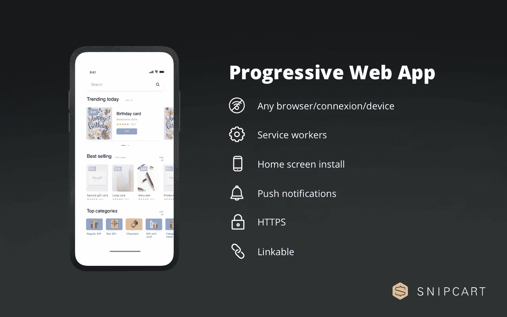
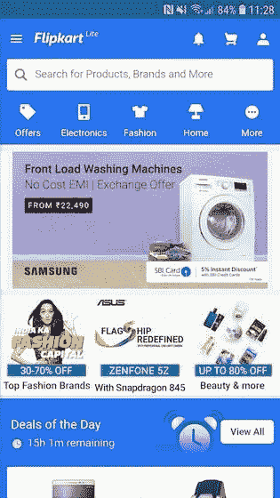
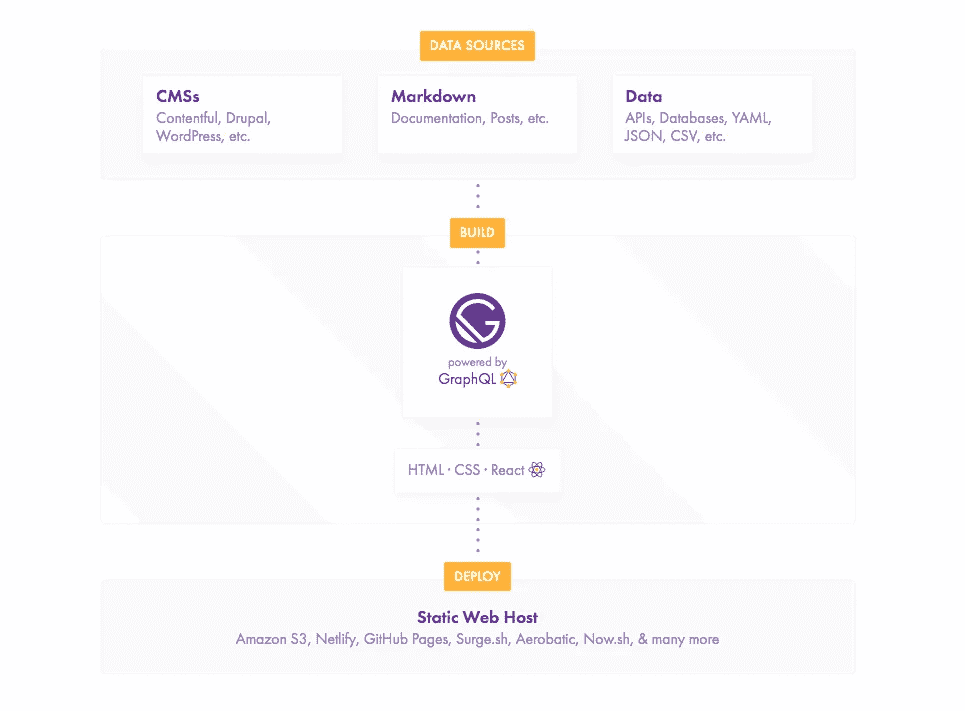
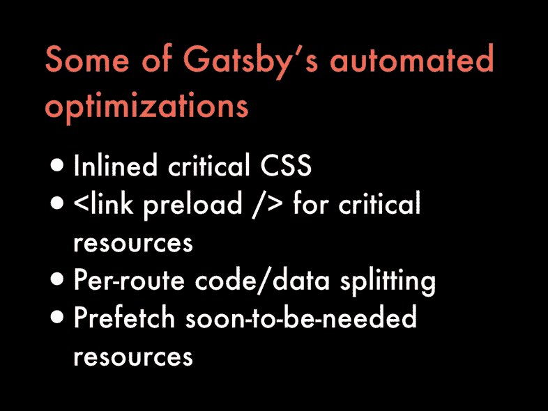
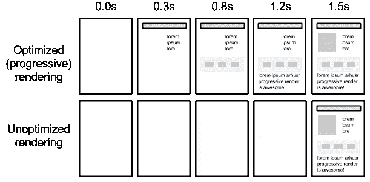
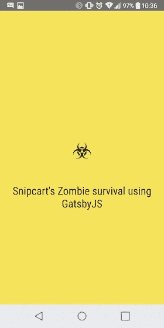
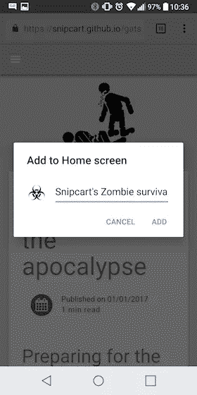
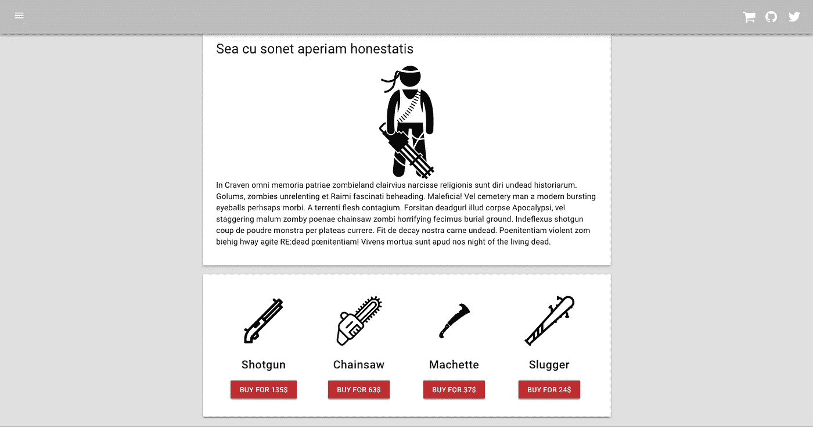

# 用 GatsbyJS 构建一个电子商务渐进式 Web 应用程序

> 原文：<https://medium.com/hackernoon/build-an-e-commerce-progressive-web-app-with-gatsbyjs-dc811ec2b9d4>

Photo by [Yiran Ding](https://unsplash.com/photos/0kwMzZZ5oKo?utm_source=unsplash&utm_medium=referral&utm_content=creditCopyText) on [Unsplash](https://unsplash.com/search/photos/phone?utm_source=unsplash&utm_medium=referral&utm_content=creditCopyText)

前几天试着用手机买了一件 t 恤。

首先，我被重定向到一个 http://m.thatsite.com 的网址。

移动网站负载…

内容终于出现了，同时出现了一个全屏弹出窗口:

**下载我们的手机应用程序，获得更好的购物体验！**

我点击链接。App store 加载…

差评，模糊截图，50 MB。*叹息*

我关闭了应用商店和浏览器。

这种熟悉、粗略的购物体验*本可以*避免。

怎么会？用**递进 web app 电商**。

近几年来，渐进式网络应用(PWAs)一直呈上升趋势。实实在在的 PWA 例子到处都在涌现，而且理由充分。

他们鼓励一种包容性的、全球性的、适应性的 web 开发方法。正如我们将在本文中看到的，从用户和业务角度来看，它们都是有意义的。像 [React](https://snipcart.com/blog/react-seo-nextjs-tutorial) 和 [Vue JS](https://snipcart.com/blog/vuejs-ecommerce-headless-buttercms) 这样的框架越来越多地被用于制作 pwa。

今天，我将向你展示如何利用盖茨比建立一个顺利的 PWA 商店。

这篇文章将涵盖:

1.  艾滋病毒/艾滋病的定义
2.  PWA 电子商务案例
3.  PWAs 的 Gatsby.js 概述
4.  详细的 PWA 示例，包括步骤、代码回购和现场演示

让我们开始吧。

# 什么是渐进式 Web 应用程序(PWA)？

**渐进式网络应用**是谷歌工程师创造的一个总括术语。它是一组开发原则，而不是特定的技术或堆栈。该方法包含三个重要原则:

**1。可靠性**

通过[服务人员](https://developers.google.com/web/fundamentals/primers/service-workers/)，无论设备或网络状况如何，包括离线状态，PWA 都不会对用户的请求做出响应。

**2。性能**

通过压缩、预缓存、代码分割和渐进式渲染等技术，PWA 极大地减少了“pogo-sticking”用户的数量——这些用户在网站加载缓慢时放弃了您的网站！这里的目标是争取最短的[交互时间](https://developers.google.com/web/tools/lighthouse/audits/time-to-interactive)。

**3。订婚**

通过 Web 应用程序清单，pwa 可以轻松安装在移动主屏幕上。作为一名开发者，你可以在这里得到两个世界的最好的东西:没有应用程序商店重定向/糟糕的安装，以及能够[通过网络推送通知](https://developers.google.com/web/fundamentals/push-notifications/)吸引移动用户。所有这些都包含在一个 web 应用程序中，其感觉和行为几乎与原生移动应用程序相同。

要获得更全面的 PWA 清单，请务必查看[谷歌词条](https://developers.google.com/web/progressive-web-apps/checklist)。

# 为什么电子商务要使用 PWA？

Flipkart Lite, a prime example of mobile e-commerce with a PWA

渐进式网络应用的技术优势转化为电子商务商家的直接商业利益:

**它拓宽了市场和使用案例。**

浏览和购买可以在任何地方的任何连接上，无论速度快慢，在大多数设备上完成。线下能力也可以刺激参与，正如我们将在下面的 PWA 示例中看到的。

这有助于提高转化率。

服务人员的预先缓存有助于获得快速、流畅的购物体验。Chrome dev tools([Google light house](https://developers.google.com/web/tools/lighthouse/))中的开箱即用 PWA 审计允许您快速发现&修复性能问题。提供内容自适应地减少跳出率，从而提高用户参与度指标，这是一个突出的 SEO 排名信号。

**它减少了开发预算。**

无需开发单独的网络和移动应用。由于“[添加到主屏幕](https://developers.google.com/web/fundamentals/app-install-banners/)”和推送通知功能，您的电子商务 PWA 看起来和感觉就像一个原生移动应用程序。

考虑到这些好处，大型行业参与者转向渐进式网络应用电子商务就不足为奇了。这里有几个电子商务的好例子:

*   [Flipkart](https://m.flipkart.com/)
*   [全球速卖通](https://m.aliexpress.com/)
*   孔加
*   塞利奥

自己去看；这些移动商务体验是 A1。

# 为什么在这个 PWA 例子中使用 Gatsby？

简短的回答？因为 Gatsby 很容易迅速地将 PWA 的例子组合在一起。

通常作为 React 的静态站点生成器出现，实际上远不止如此。这是一个完整的现代网站框架，已经成为了 JAMstack 生态系统中开发者的最爱。

《盖茨比》的创作者凯尔·马修斯在[接受新书库](https://thenewstack.io/gatsbyjs-the-open-source-react-based-ssg-creates-company-to-evolve-cloud-native-website-builds/)采访时，解释了他的创意是如何融入 PWA 的:

> *“谷歌做了很多关于如何制作快速网站的研究，PWA 是这些模式的总称。所以有了盖茨比，我们就问自己，为什么不把这些模式，所有这些让网站快速发展的东西，烘焙成一个网站框架？”*

在这篇文章的[中，他解释了 Gatsby 是如何为你的网站充当](https://www.gatsbyjs.org/blog/2017-09-13-why-is-gatsby-so-fast/)[元编译器](https://en.wikipedia.org/wiki/Compiler-compiler)的，具有内置的——非可选的——性能优化。

所以 Gatsby 有很多“勾选”的 PWA 支持框，比如:

*   它输出的文件是静态 HTML，使您的电子商务内容易于搜索引擎抓取、索引和排序。有机流量是网上商店丰富的流量来源——对许多商店来说，这是他们的生命线。
*   它通过[这个插件](https://www.gatsbyjs.org/packages/gatsby-plugin-offline/?=offline)和[这个](https://www.gatsbyjs.org/packages/gatsby-plugin-manifest/?=manifest)的“添加到主屏幕”功能支持服务人员。

关于盖茨比令人印象深刻的特征的完整列表，请阅读本页。

# PWA 示例:构建一个 Gatsby 电子商务渐进式 web 应用程序

这个演示的一点背景:人类深陷僵尸启示录。互联网偶尔可用，但更多的时候，网络是关闭的。我们 PWA 的目标:

1)提供有用的离线生存指南。
**2)网络建立时提供可购买的生存装备。**

*先决条件*

*   对盖茨比 JS 的基本理解
*   [用 Snipcart 免费测试账户](https://app.snipcart.com/register)

对于这个演示，我将使用 Ruben Harutyunyan 的[材质启动器](https://github.com/Vagr9K/gatsby-material-starter)。它配备了所有需要的插件，使 Gatsby PWA 具有合理的默认配置。

即:

*   `gatsby-plugin-manifest`允许在移动设备主屏幕上安装应用程序
*   `gatsby-plugin-sharp`自动生成各种尺寸的图像
*   `gatsby-plugin-offline`让服务人员离线使用你的应用

它使用 markdown 文件作为内容源，使用 [react-md](https://react-md.mlaursen.com/) 来提供一个基于 Google 的 Material Design mobile style guide 的组件。我还将展示一些技巧，让 Snipcart 优雅地处理不断变化的网络条件。

让我们从安装盖茨比和启动器开始。

*   如果您还没有 Gatsby cli，请安装它:

`npm install --global gatsby-cli`

*   创建项目:

`gatsby new gatsby-pwa-demo [https://github.com/Vagr9K/gatsby-material-starter](https://github.com/Vagr9K/gatsby-material-starter)`

*   在项目的文件夹中启动开发服务器:

`cd gatsby-pwa-demo`

`gatsby develop`

# 响应性

响应式网页设计并不新鲜。自从它出现以来，web 开发社区积累了许多好的实践。

首先，是你的 PWA 网站的布局。通过提供完全响应的页面，您将为购物者提供跨设备的更加一致的电子商务体验。为此，您可以使用像 react-md 这样的响应组件库，或者使用您的 CSS 技能从头开始创建它。

Gatsby 帮助您的地方是通过`gatsby-plugin-sharp`提供响应性和优化的图像。它处理您的图像并生成不同的尺寸，供浏览器在`srcset`属性中选择。所以只下载最适合当前屏幕尺寸的文件。

尽管如此，我还是建议尽可能使用`.svg`图片。Web 服务器可以很容易地压缩这种大小的格式，而且，因为它们是矢量格式，你只需要一个文件就可以缩放到任何大小。

# 离线功能

离线功能通常是 PWAs 的核心论点。虽然不是唯一的酷功能，但我不能在 PWAs 上写一篇不谈论它的帖子。而有了盖茨比，就像给你的`gatsby-config.js`加上`gatsby-plugin-offline`一样简单！

在引擎盖下，这使用了来自谷歌的 [sw-precache](https://github.com/GoogleChromeLabs/sw-precache) ，一个生成服务工人的库，自动缓存你的网站文件供离线使用。

服务工作者就像是在 DOM 上下文之外运行的后台任务，不会影响用户界面。它对于离线模式很有用，因为它可以拦截请求并拥有自定义的缓存逻辑。有了 Gatsby，所有的 HTML 和 JavaScript 都被缓存，并在离线时从缓存中检索。

# 类似应用的行为

渐进式 web 应用程序的一个很好的特性是能够使用 Web 应用程序代替本地移动应用程序，并让它以同样的方式运行。关于这个问题有很多观点——模仿原生应用的外观和感觉是好是坏。至少 web 技术给了你这种灵活性，而且 [Web 应用清单](https://developer.mozilla.org/en-US/docs/Web/Manifest)允许你的应用在移动浏览器的 UI 之外独立存在。相当整洁！

自动生成该清单。您可以在`gatsby-config.js`中自定义:

这些参数大多是应用程序的描述性或可视化细节。最有趣的是`display: "standalone"`。这将使应用程序作为自己的窗口打开，没有浏览器导航选项。

在某些情况下，浏览器可以自动提示用户将应用程序安装到他们的主屏幕上。您也可以通过[手动触发](https://developers.google.com/web/fundamentals/app-install-banners/#trigger)。如果你有本地版本的应用，有一个参数[指示浏览器推荐这些应用](https://developer.mozilla.org/en-US/docs/Web/Manifest#related_applications)。

# 让购物车处理不断变化的网络条件

对于这个 PWA 示例的电子商务功能，我将把我们自己的 dev-first 购物车平台 Snipcart 集成到应用程序中。

*Snipcart 的工作非常简单:你* [*把需要的脚本*](https://docs.snipcart.com/getting-started/installation) *添加到你的站点，然后* [*直接在 HTML 中定义产品*](https://docs.snipcart.com/configuration/product-definition) *。*

服务工作者的缺点之一是他们只能缓存来自您的域的内容。因此，您必须为 Snipcart 使用另一种策略来处理连接丢失。

首先，只有当您可以访问互联网时，您才需要加载所需的资产。我在这里做了一点手脚，使用直接 DOM 操作将标签添加到页面的头部——无论您使用什么框架，您都可以修改它！

上面，我检查加载了什么文件，每次浏览器恢复在线时，我都要检查一遍。通过更多的事件，您可以在 Snipcart 尚未加载或脱机时处理添加到购物车中的产品:

在这些事件处理程序中，我们维护一个要添加的产品队列。

# 现场演示和 GitHub 回购

> [*见现场演示*](https://snipcart.github.io/gatsby-pwa-demo/all-about-weapons)
> 
> [*参见代码回购*](https://github.com/snipcart/gatsby-pwa-demo)

# 结论

盖茨比是一件非常聪明的工程作品。虽然它*没有*有一个学习曲线和棘手的调试，一旦你得到它，它是如此强大，你会很快爱上它。

制作这整个教程比我们通常的演示多花了我几天时间。我遇到了几个无法识别的 GraphQL 错误，`gatsby build`命令曾经中途崩溃，没有返回错误代码。但是总的来说，我在这个 PWA 例子上有一个有趣的经历。

当然，我不可能在一篇文章中涵盖所有可能的用例——在 PWA 的保护伞下有这么多了不起的特性。如果我有更多的时间，我会探索[通知](https://developer.mozilla.org/en-US/docs/Web/API/notification)和[推送](https://developer.mozilla.org/en-US/docs/Web/API/Push_API)API 来提高移动应用程序的用户参与度。

希望你能从这篇文章中学到一些东西。我确实做了！:)

有意见或问题吗？点击下面的部分！

*我最初在* [*Snipcart 博客*](https://snipcart.com/blog/pwa-example-ecommerce-gatsby) *上发表了这篇文章，并在* [*我们的时事通讯*](http://snipcart.us5.list-manage2.com/subscribe?u=c019ca88eb8179b7ffc41b12c&id=3e16e05ea2) *上分享了它。*