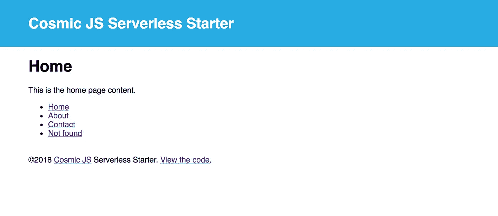

# 构建并部署一个由 Cosmic JS 支持的无服务器 Node.js 应用程序

> 原文：<https://medium.com/hackernoon/build-and-deploy-a-serverless-node-js-app-powered-by-cosmic-js-21b45eaea32e>


无服务器应用程序开发越来越受欢迎，这在很大程度上是因为“构建应用程序，而不是基础设施”这一吸引人的主张。这种构建应用程序的方式提供了许多好处，包括不必管理服务器基础架构、无限的可伸缩性以及不必为空闲的服务器时间付费，只需在使用您的服务时付费。

[无服务器](https://serverless.com/company/team/)平台进一步将构建无服务器应用抽象为愉快的开发人员体验，帮助您快速启动并运行基于云功能的应用。

[Cosmic JS](https://cosmicjs.com) 为团队提供了一个 CMS API 来管理任何新的或现有的应用程序的内容。 [Cosmic JS 无服务器启动应用](https://github.com/cosmicjs/serverless-starter)让你启动并运行一个连接到 Cosmic JS CMS 的无服务器应用。

在本教程中，我将向你展示如何在几分钟内开始使用[宇宙 JS 无服务器启动应用](https://github.com/cosmicjs/serverless-starter)。另外，我将向您展示将任何 Node.js 应用程序转换为无限可扩展的 Node.js 无服务器应用程序的步骤。让我们开始吧。

# TL；速度三角形定位法(dead reckoning)

[在 GitHub 上查看宇宙 JS 无服务器启动器](https://github.com/cosmicjs/serverless-starter)

# 安装无服务器启动器

要安装 Cosmic JS 无服务器启动程序，请运行以下命令:

```
npm i -g cosmic-cli
cosmic login
cosmic init serverless-starter
```

这些命令执行以下操作:
1 .安装[宇宙 CLI](https://www.npmjs.com/package/cosmic-cli)2。登录你的[宇宙 JS 账户](https://cosmicjs.com/)(你可能需要创建一个新的桶，如果是这样，它会带你完成这个过程😀)
3。下载[无服务器启动器](https://github.com/cosmicjs/serverless-starter)并将演示内容导入您选择的存储桶。

下载完成后，系统会提示您使用以下命令启动应用程序:

```
cd serverless-starter
cosmic develop
```

您的应用程序现在应该运行在 [http://localhost:3000](http://localhost:3000/)



# 准备起飞

既然我们已经在本地运行了我们的应用程序，让我们准备好将它发布到 AWS cloud。首先，我们需要连接我们的 AWS 凭证。为了在你的 AWS 账户上找到这些， [Serverless 在他们的网站](https://serverless.com/framework/docs/providers/aws/guide/credentials/)上有一个很棒的展示。

检索到 AWS 密钥后，运行以下命令:

```
export AWS_ACCESS_KEY_ID=your-aws-key-id
export AWS_SECRET_ACCESS_KEY=your-aws-secret-key
```

现在，我们已经准备好向 AWS 发布我们的无服务器启动器。运行以下命令登录到无服务器服务并部署我们的应用程序:

```
npm i -g serverless
serverless login
COSMIC_BUCKET=your-bucket-slug serverless deploy
```

无服务器部署命令为我们完成了所有繁重的工作。它使用我们的 AWS 帐户在幕后执行一些魔法，然后一旦我们的应用程序可用，它将提供端点来找到部署的应用程序。添加环境变量`COSMIC_BUCKET`，通过 Cosmic JS API 将我们部署的应用程序连接到我们的 Cosmic JS Bucket。这使我们能够从[宇宙 JS 管理仪表板](https://cosmicjs.com/cms-api)管理我们新部署的无服务器应用程序的内容。


从上面的输出中，您可以看到我们可用的**端点**，这里部署了我们的无服务器应用程序。

# 使任何 Node.js 应用程序无服务器就绪

所以我们运行了几个命令，把 Cosmic JS 无服务器启动应用推送到 AWS……酷。但是，让我们更深入一点，看看我们如何转换 [Node Starter 应用程序](https://github.com/cosmicjs/node-starter)，以及我们如何将大多数 any Node.js 应用程序转换为无服务器应用程序。

**编辑 serverless.yml**
要将[节点启动器](https://github.com/cosmicjs/node-starter)转换为无服务器应用程序，我们必须创建一个 [serverless.yml](https://github.com/cosmicjs/serverless-starter/blob/master/serverless.yml) 文件，并设置配置以处理动态路由。这是在功能>应用>事件区域中完成的，以指示动态 http 事件。看起来是这样的:

**编辑 app.js**
接下来我们需要编辑 app 的入口点， [app.js 文件](https://github.com/cosmicjs/serverless-starter/blob/master/app.js)以导出主处理函数。我们还包含了[无服务器-http 节点模块](https://www.npmjs.com/package/serverless-http)来包装我们的 Express 应用程序以供无服务器使用。下面是转换为无服务器的 app.js 文件:

# 最后

通过一些编辑，您可以快速将 Node.js 应用程序转换为无服务器应用程序。[无服务器](https://serverless.com/)平台将 AWS 帐户配置的复杂性抽象化，为您提供愉快的开发体验。添加 Cosmic JS 支持的内容，您就有了一个无限可扩展的无服务器应用程序，其内容通过 Cosmic JS API 进行管理。无需管理服务器，无需维护 CMS。构建应用而非基础设施才是未来！

如果你对用 Cosmic JS 构建无服务器应用有任何意见或问题，[在 Twitter 上联系我们](https://twitter.com/cosmic_js)和[在 Slack 上加入对话](https://cosmicjs.com/community)。