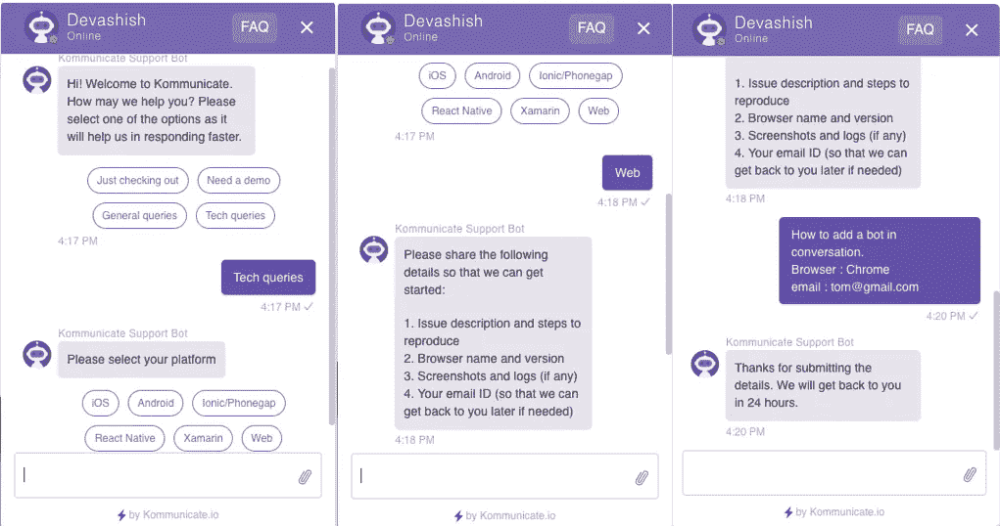
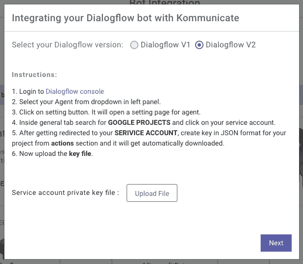

# 用 Dialogflow (API.ai)构建 Android 聊天机器人

> 原文：<https://medium.com/hackernoon/build-android-chatbot-with-dialogflow-api-ai-97d15eefe6>

在本文中，我们将分享将 [dialogflow](https://dialogflow.com/) chatbot 集成到您的 [Android](https://hackernoon.com/tagged/android) 应用程序中的步骤。为 android 应用程序构建一个示例[聊天机器人](https://hackernoon.com/tagged/chatbot)只需要 [Dialogflow](https://dialogflow.com/) 和[komunicate。](https://www.kommunicate.io/)

下面是一个使用 Dialogflow 在 android 中开发的**komunicate 支持机器人**的例子。我们实际上在我们的网站上使用这个机器人。如果你想看机器人的现场表演，点击[这里](https://www.kommunicate.io/)。

可操作的富消息驱动的机器人可以根据用户是否在聊天中进行一般查询、技术查询或安排演示来回复。

[**创建免费聊天机器人**](https://dashboard.kommunicate.io/signup)

您可以使用现有的 dialogflow bot 或 checkout [bot samples](https://docs.kommunicate.io/docs/bot-samples) 来构建自己的合格 bot。从[这里](https://docs.kommunicate.io/samples/kommunicate-support-bot-sample.zip)下载通信支持机器人，并导入到你的 Dialogflow 账户。



# 第一步:在[通信](https://dashboard.kommunicate.io/signup)中设置一个账户

这相当简单。你可以在[com municate](https://www.kommunicate.io)获得一个免费账号。注册并导航到[机器人部分](https://dashboard.kommunicate.io/bot)。点击对话框中的**设置**。



上传您的 Dialogflow 提供的客户端密钥。如果您使用的是 Dialogflow V1，您可以复制粘贴您的客户端和开发令牌。不过，我们建议使用 Dialogflow V2 获得最新的功能。

# 第二步:将 Dialogflow 集成的 Android 聊天机器人 SDK 安装到您的应用程序中

# 将 Android SDK 添加到您的应用中

在你的 Android 应用中安装 Kommunicate 既简单又快捷。Kommunicate SDK 附带预配置的 dialogflow 集成。

**安装**

```
**implementation** 'io.kommunicate:kommunicate:1.9.0'
```

**初始化 SDK** Gradle sync 完成通信依赖后，您可以通过调用以下方法来初始化 SDK:

```
Kommunicate.init(context, APP_ID);
```

你可以在[通信仪表板](https://dashboard.kommunicate.io/signup)上注册获得 APP_ID。
如需完整文档，请参考此处的。

# 带有 Dialogflow 聊天机器人的示例 Android 应用程序

这是一个集成了 dialogflow 聊天机器人的 android 应用程序示例。[下载](https://github.com/Kommunicate-io/Kommunicate-Android-Chat-SDK)并在 android studio 中运行。

# 第三步:使用 Dialogflow 集成聊天机器人启动 Android 聊天应用程序

现在，您可以通过聊天屏幕向 dialogflow 发送有效负载，并从 Dialogflow 代理获得文本响应。
komunicate 提供了一个现成的聊天用户界面，因此在这一步中只需要启动聊天屏幕。

[**30 天免费试用**](https://dashboard.kommunicate.io/signup)

以下是使用 Dialogflow bot 启动聊天的说明:

```
List<String> agentList = new ArrayList();
agentList.add("agent1@yourdomain.com"); //add your agentIDList<String> botList = new ArrayList();
botList.add("bot1"); //enter your integrated bot IdsKommunicate.launchSingleChat(context, "Support", Kommunicate.getVisitor(), false, true, agentList, botList, new KmCallback(){
                    @Override
                    public void onSuccess(Object message) {
                        Log.d(context, "ChatLaunch", "Success : " + message);
                    }@Override
                    public void onFailure(Object error) {
                        Log.d(context, "ChatLaunch", "Failure : " + error);
                    }
                });
```

仅此而已！运行 Android 应用程序并与 Dialogflow bot 聊天。您可以通过几个简单的步骤轻松地将 Dialogflow 集成到 Android 应用程序中。如果您需要更多信息，您可以查看[通信文档。](https://docs.kommunicate.io/docs/android-installation)

# Dialogflow Android SDK

Dialogflow 提供了 Android 客户端 SDK，可以轻松地将语音识别与 API 集成在一起。Android 设备上的 AI 自然语言处理 API。如果您希望开发自己的聊天实现，并在不使用 kommunicate SDK 的情况下将 dialogflow 直接集成到您的 android 应用程序中，请集成以下 SDK。
[Github—dialog flow Android 客户端 SDK](https://github.com/dialogflow/dialogflow-android-client)

在此阅读有关 dialogflow 和 bot 集成的更多信息:

1.  [将 Dialogflow (Api.ai) Bot 集成到网站](https://www.kommunicate.io/blog/how-to-integrate-bot-using-dialogflow-in-kommunicate-1ac32911a7d0/)
2.  [使用 Dialogflow 创建聊天机器人的初学者指南](https://www.kommunicate.io/blog/beginners-guide-to-creating-chatbots-using-dialogflow/)

[**免费试用**](https://dashboard.kommunicate.io/signup)

本文原载[此处](https://www.kommunicate.io/blog/build-chatbot-with-dialogflow-android-sdk/)。