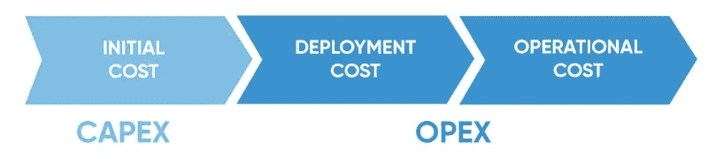

# 构建/购买/合作伙伴

> 原文：<https://medium.com/hackernoon/build-buy-partner-d35a28f267dd>

Making a wedding cake out of a cupcake. Illustration: [Adrian Hogan](http://adrianhogan.com/)

当面对一个需要通过技术解决的客户问题时，一个涉及[工程](https://hackernoon.com/tagged/engineering) &产品的老问题以及一个可能对[科技](https://hackernoon.com/tagged/technology)公司的成功产生重大影响的问题是，是建立、购买还是合作。

从一个角度来看，如果做得好，它可以使内部团队快速移动。从另一个角度来看，它可以管理第三方平台的成本。从第三个角度来看，它可以带来有价值的内部知识产权，创造竞争优势，可以围绕您正在构建的产品创建一个护城河，并防止竞争对手太容易突破城堡。

对我来说(在我们财务团队的热情支持下)，在决定是构建还是合作时(我们还没有到可以购买的地步)，这个决定很容易做出——目的和功能集**是否是产品和平台的核心**？如果不是，我们会寻找最佳平台与之合作；如果是，我们会利用我们内部的优秀团队来构建、迭代并不时关爱地关注，以确保技术债务不会累积到拖累我们的地步。

我们合作的功能/平台示例包括:

*   **身份**(安全和个人信息存储太重要了，不能三心二意)——我们选择了 Auth0 (soundbite 为什么[在这里](https://www.theaustralian.com.au/business/technology/identity-management-startup-auth0-logs-in-to-asiapacific-id/news-story/0b3a5bf511583f6ffc925427b68c8305))
*   与**电话或短信**(我们不是电信运营商)——我们选择了拥有 Twilio 的 Seranova 平台
*   与**日志记录、警报和监控**有关的任何事情(信任自主开发的工具太重要了)——我们主要使用 New Relic 和 Logz.io
*   **分析**(没有必要重新发明轮子)——扫雪机和谷歌分析 360 是首选的主要工具
*   **代码质量工具**(因为机器在二进制方面比人做得更好)——我们喜欢代码
*   **云计算**(因为本地托管已经过时了)——我们在 AWS 上运行我们的工作负载

另一方面，我们在内部信任团队，比如:

*   **数据**(我们视之为长期竞争优势)
*   建筑(这样我们就能掌握自己的命运，快速前进)——我们混合使用 CircleCI、Helm 和 Kubernetes
*   编码——我非常相信，在编码方面，你可以在便宜、快速和良好中选择其二，如果这是体验的核心，我宁愿不要便宜的编码。投资的中长期回报远远超过通过做一些便宜和/或快速的事情而获得的任何短期战术胜利

我之前提到过，我们在财务团队的支持下做出决策。从这个意义上说，我们很幸运，他们支持我们的判断，他们相信我们知道什么时候构建和维护某些东西从长远来看是有害的。这篇来自 Intercom 的[博客](https://www.intercom.com/blog/when-a-cupcake-becomes-a-wedding-cake/)的文章是我一直以来最喜欢的短语之一:

> “**五官就像孩子……一旦他们出生，你就不得不照顾他们，为他们的大学学费存钱。”**

它是如此真实。与第三方平台相比，构建存储用户名/密码和一些基本数据的身份平台的成本可能听起来微不足道。但是，资本支出成本并不是对等的。对其进行迭代有一个隐藏的运营支出成本，“只是”添加一个可以根据配置文件存储的新字段，定期确保它符合个人信息存储的监管标准，更重要的是，确保工程和产品组织内的知识共享是持续的，以便平台不会随着时间的推移成为一个单一的黑匣子，工程师们害怕触及这个黑匣子，因为他们担心某个地方的某个东西会损坏，并在没有人的时候发出像森林中的一棵树倒下一样的声音。

我们都曾为那些制造了他们本应购买或合作的产品的公司工作过，我们也有过同样的经历，那些购买或合作的团队和公司认为保持控制权并掌握自己的命运更重要。

下一次当你处于十字路口时，想想你要解决的下一个问题对业务有多重要，并仔细考虑你是想建立/购买还是合作。它可以让企业和团队走向成功，也可以很容易地导致拖累，阻碍未来的成功。

查看我们的筹码[这里](https://stackshare.io/carsguide/carsguide)和[这里](https://stackshare.io/autotrader/autotrader)。

这个故事最初发布在我们的[工程博客](https://engineering.carsguide.com.au/build-buy-partner-40ab934b42e1)上。