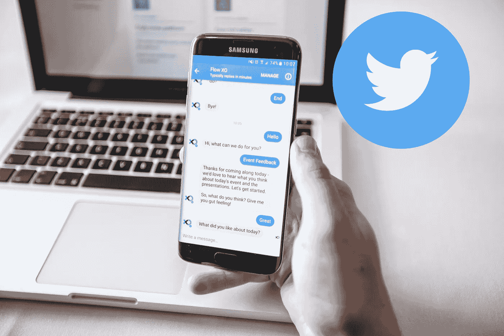
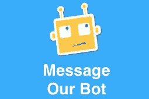
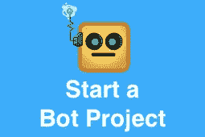

# 为 Twitter 直接消息构建聊天机器人

> 原文：<https://medium.com/hackernoon/build-chatbot-for-twitter-direct-message-e308ee9cda08>

# 步骤 1:获取开发者账户

[https://developer.twitter.com/en/apply-for-access](https://developer.twitter.com/en/apply-for-access)
注:审核&批准通常需要 10-15 天。

# 步骤 2:创建 Twitter 应用和开发环境

[https://developer.twitter.com/en/account/get-started](https://developer.twitter.com/en/account/get-started)

# 步骤 3:使用 twitter 开发人员门户为直接消息生成应用程序访问令牌

注意:将应用程序权限更改为“读取、写入和定向消息”，并生成访问令牌。

# 步骤 4:创建节点模块并运行它。

运行命令:node app.js

> 运筹学

使用开源开发者友好的 Twitter 连接器。

 [## iconicbot/iconic-narada

### 面向社交媒体/消息平台(脸书、Facebook Messenger、Twitter、Twitter 等)的开源 Webhook 样板文件

github.com](https://github.com/iconicbot/iconic-narada) 

# 最受欢迎的 3 篇 Bot 设计文章:

> [1。设计聊天机器人对话](https://chatbotslife.com/designing-chatbot-conversations-7fd94b2a78d8)
> 
> [2。分发 slack app](https://chatbotslife.com/distributing-a-slack-app-d5b4cf9ee317)
> 
> [3。聊天机器人——对话式用户界面的兴起](https://chatbotslife.com/chatbots-the-rise-of-conversational-ui-8a59078e2f95)
> 
> [4。AI & NLP 车间](https://chatbotslife.com/ai-nlp-workshop-fa39e2eac049)

# 步骤 5:使用 Ngrok 隧道连接到您的本地主机 webhook

使用终端/命令提示符在同一个目录上运行以下命令: **ngrok http 1337**
复制“https”URL。(会是类似[**https://XXXXXX . ngrok . io**](https://46c154de.ngrok.io))

# 步骤 6:下载帐户活动仪表板

https://github.com/twitterdev/account-activity-dashboard 的克隆体。git
在终端/命令提示符下使用“npm start”运行模块

# 步骤 7:连接 Webhook

在浏览器上打开“localhost:5000”。
点击“管理 Webhook”
将“ngrok url”粘贴到“创建或更新 web hook”字段&点击提交

# 步骤 8:添加用户/页面订阅

打开终端/命令提示符
转到“账户活动仪表板”文件夹
执行“节点 example _ scripts/subscription _ management/Add-subscription-app-owner . js-e<TWITTER _ DEV _ ENV _ NAME>”
**注意:**为拥有 app 的用户添加用户订阅。

> 转到 Twitter DM &开始和你的机器人说话

# 感谢阅读！:)如果你喜欢这篇文章，点击❤下面的心形按钮对我来说意义重大，它有助于其他人看到这个故事。
在
[insta gram](https://www.instagram.com/sandeshbsuvarna/)|[Twitter](https://twitter.com/sandeshsuvarna)|[脸书](https://www.facebook.com/sandesh.b.suvarna) | [LinkedIN](https://www.linkedin.com/in/sandesh-b-suvarna-8a3b5654/)

