# 通过 6 个简单的步骤，使用标准库和 Node.js 构建和部署 API

> 原文：<https://medium.com/hackernoon/build-deploy-and-publish-an-api-using-code-xyz-and-node-js-in-6-steps-8aa3e8ec334b>

API，软件的构建模块，运行着我们的世界。它们是软件系统相互通信的方式，也是我们人类与软件通信的方式。知道如何构建 API 不仅是软件开发人员的一项关键技能，也是一般编码素养的基础部分——这项技能可以在职业生涯中帮助任何人。

在本教程中，您将学习如何使用在线 API 编辑器标准库上的[代码，直接从 web 浏览器构建 API——不需要其他工具。无论您是软件开发的新手，还是寻找更快方法来发布代码的老手，我都将展示如何快速地用标准库](https://code.stdlib.com)上的[代码构建一个可用的 API。我们将使用标准库](https://code.stdlib.com)上的[代码构建一个全功能的 SMS 服务，该服务连接](https://code.stdlib.com) [AscenDB 的 Peaks API 用于识别山脉信息](https://stdlib.com/@ascendb/lib/peaks/)和 [MessageBird 的 API 用于发送 SMS 消息](https://stdlib.com/@messagebird/lib/sms/)。

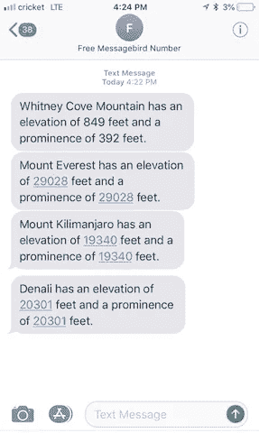

我们的 API 将接收任何山的名称，并从 AscendDB 检索该山的海拔和突出度。 [AscenDB 的 Peaks API](https://stdlib.com/@ascendb/lib/peaks/) 提供了全球超过 700 万个峰值的数据——你可以[在这里的标准库上查看他们的文档](https://stdlib.com/@ascendb/lib/peaks/)。您也可以使用您选择的任何 API 来复制这些步骤，以创建您自己的 SMS 服务！

# 你事先需要什么

*   1x 美国手机号码
*   1x 创意和大胆的灵魂

# 步骤 1:从标准库代码开始

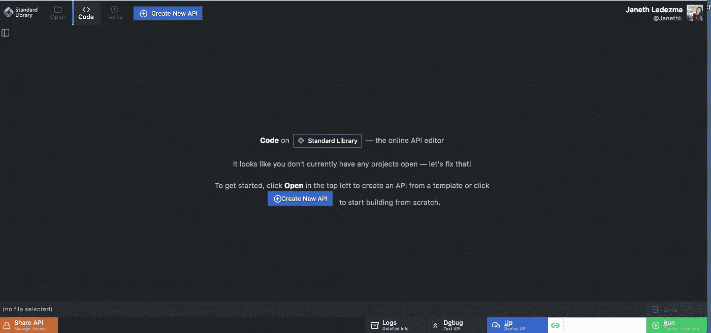

第一步是阅读标准库上的[代码。](https://code.stdlib.com)[标准库上的代码](https://code.stdlib.com)是由[标准库](https://stdlib.com/)的团队构建的在线 API 编辑器——一个用于轻松构建 API、webhooks 和工作流自动化任务的嵌入式开发环境。

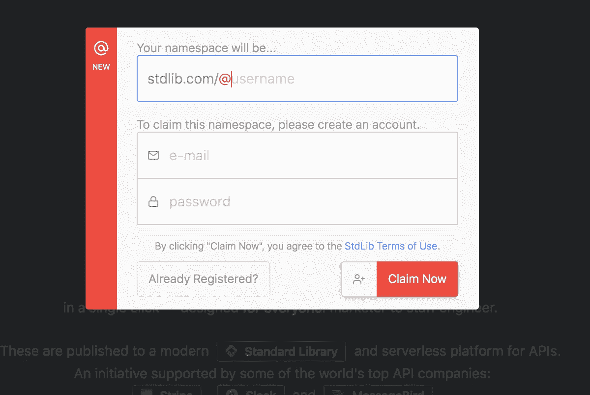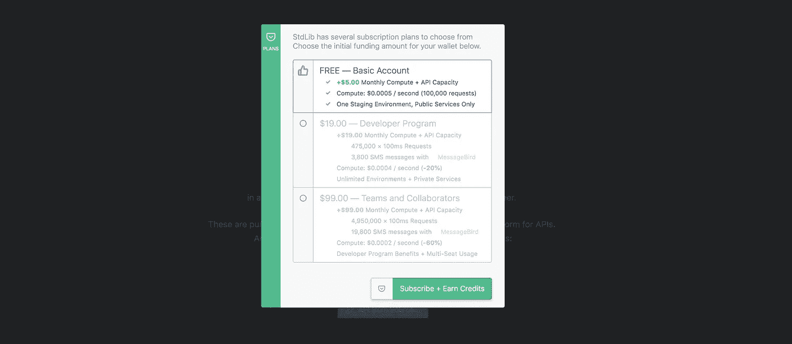

在标准库上[代码的右上角点击**(签到)**。如果你有一个标准图书馆帐户，点击**已经注册**并使用你的凭证登录。会弹出一个模块提示你声明一个名称空间(这是你的用户名)。输入您的电子邮件并选择密码。](https://code.stdlib.com)

创建帐户后，将出现一个不同的模块，列出订购计划。你只需要一个免费账户就可以开始了。

一旦你点击**订阅+赚取积分**，你应该会看到一个确认信息弹出。

点击**继续**返回到标准库登陆页面的[代码。](https://code.stdlib.com)

# 步骤 2:与你的第一个 API 交互

*   点击**创建新的 API(空白)**
*   输入 API 的名称。出于本教程的目的，我建议您将其命名为 **MyFirstAPI** 并点击**ok**(或按回车键)。

一旦您点击 enter，您将在左侧栏(一个文件夹树视图)看到一个自动生成的服务项目框架。此时，您可能已经注意到里面有一个“hello world”Javascript 函数(`__main__.js`)。要测试您的功能，只需点击右下角的**运行**:

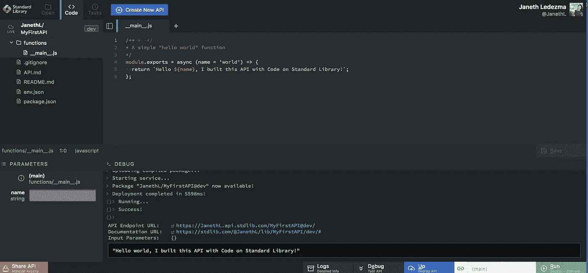

点击“运行”，在几秒钟内将您的函数变成一个无限可扩展的 API 端点！在“结果”区域，你会注意到一个文档门户——点击它可以看到你的 API 在标准库上的信息。您还会看到一个 API 端点 URL，单击它，一个新的选项卡将会打开，显示您的“hello world”消息。

# **第三步:替换默认的“Hello World”函数&设置你的** STDLIB_LIBRARY_TOKEN

现在，让我们创建我们的 SMS 服务，它将把任何山峰的高度和突出程度发送回文本。首先，我们将替换`__main__.js`中默认的“hello world”功能。**将我提供给你的以下代码复制粘贴到`__main__.js`文件中:**

一旦你将代码粘贴到你的`__main__.js`文件中，你会注意到你对**lib**(`require('lib')`行)的依赖是自动添加的，没有必要通过你的终端运行 npm 安装——标准库上的代码会自动修改你的`package.json`文件并将任何 npm 包安装到你的服务目录中。

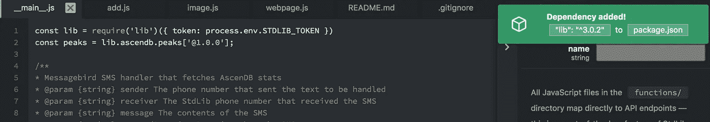

如果您浏览我提供的代码，您会注意到`lib`的定义包含一个`process.env.STDLIB_LIBRARY_TOKEN`环境变量。我们必须将所需的令牌添加到`env.json` 文件中，以使我们的服务工作。

导航到`env.json`文件(点击左边树形视图中的 **env.json** ，在那里你会看到`"dev"`和`"release"`环境在等你输入你的`"STDLIB_LIBRARY_TOKEN"`。

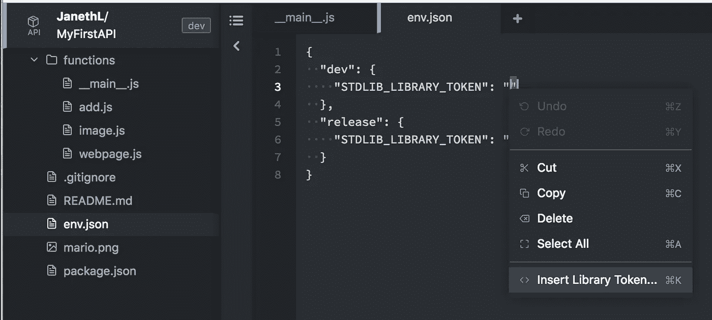

Right-click between the quotation marks next to “STDLIB_LIBRARY TOKEN” to open up the context menu

将光标放在引号之间(见上图),右击并选择**插入库令牌…** 或使用快捷键⌘ + K

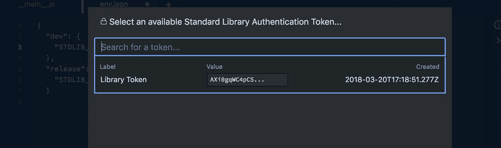

选择**库令牌**来填充开发和发布环境。

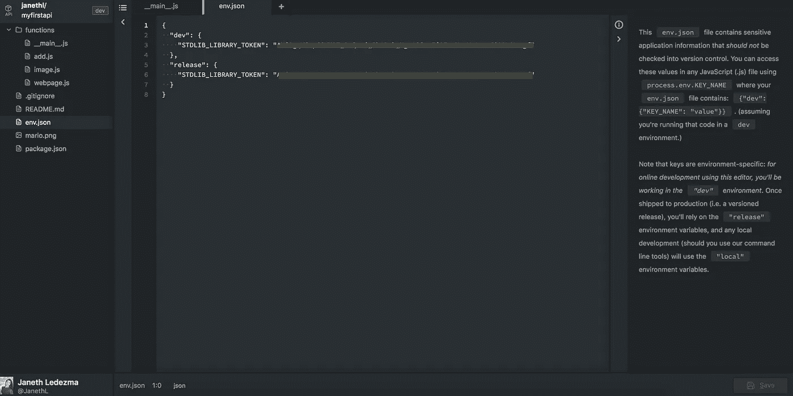

确保用'⌘ + s 保存更改(或点击右下角的**保存**)。

# 第四步:申请你的免费短信信息鸟号码

我们快到了！接下来，您将索取您的免费 MessageBird 电话号码。我们将使用 [MessageBird SMS API](https://stdlib.com/@messagebird/lib/numbers) 来发送和接收文本消息。[标准库](https://code.stdlib.com)让你初始化一个号码，发送和接收消息真的很容易。

保持标准库上的[代码打开。在不同的选项卡中，导航到标准库](https://code.stdlib.com)上的 [MessageBird Numbers API，并接受服务条款(顶部的橙色条)。](https://stdlib.com/@messagebird/lib/numbers)

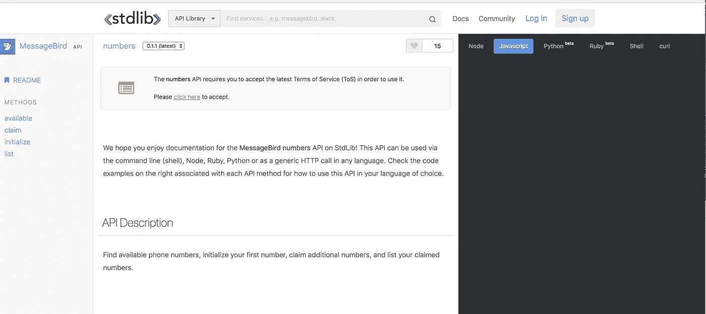

Accept the MessageBird terms of service — it’s the orange notification at the top of the API reference

完成后，您可以直接从浏览器领取您的第一个号码！向下滚动页面到`numbers` API 上的`available`方法:

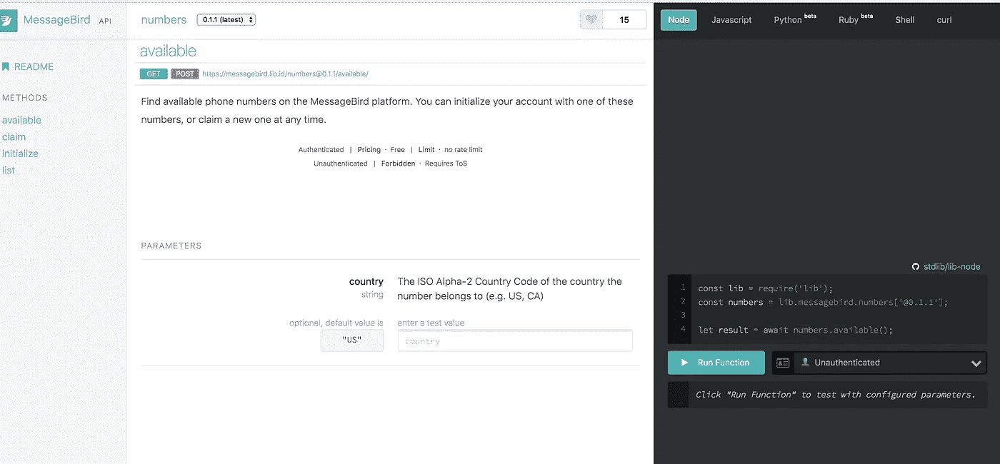

The “available” method in the MessageBird Numbers API

目前，只有加拿大和美国的号码可用——根据您的位置选择合适的国家代码(如果您想查看添加的特定地区或国家，[发送电子邮件给我们](mailto:contact@stdlib.com)！)从右边的下拉列表中选择一个标准库令牌(应该显示为**未认证**)，然后按下**运行功能**按钮查看可用数字列表。

从列表中复制一个电话号码，然后向下滚动到`initialize`方法。

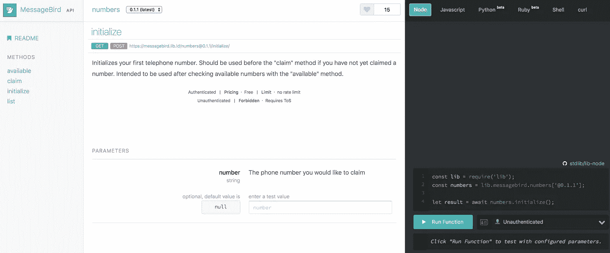

The “initialize” method in the messagebird.numbers API

API 的`initialize`方法将要求一个供个人使用的初始电话号码，并且是免费的。将您在上面复制的号码输入到号码参数输入中，从运行功能旁边的下拉列表中选择一个令牌，然后按“运行功能”认领您的号码。

恭喜你！您已经在标准库上成功初始化了 MessageBird！您可以通过使用`messagebird.sms`服务发送文本消息来测试这一点。导航到 [MessageBird SMS API 参考](https://stdlib.com/@messagebird/lib/sms)，以您的个人电话号码为接收方尝试`create`功能——您应该会收到一条来自您刚刚申请的号码的短信！

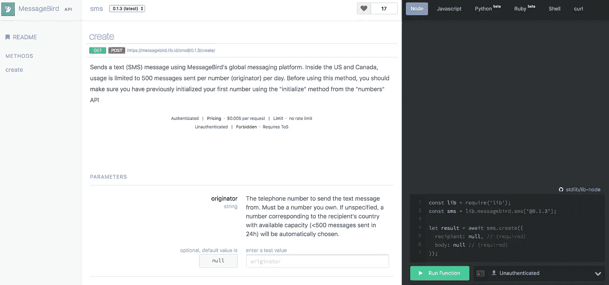

The “create” method in the messagebird.sms API

# 步骤 5:从标准库中的代码测试您的服务

既然您已经申请了免费号码，我们可以测试您的短信服务。

返回到位于“MyFirstAPI”服务中的`__main__.js`文件。我们将填写位于右侧栏的请求参数部分。MessageBird 向 SMS 处理程序传递四个参数。这些是接收消息的 MessageBird 号码，这将是您之前声明的号码，发送传入消息的外线号码，消息的内容，以及消息发送的时间。

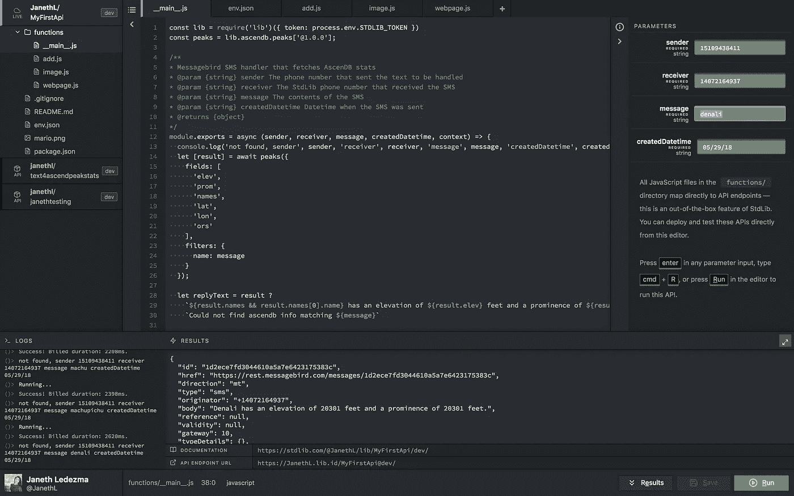

`sender:`你接收短信的手机号码

`receiver:`收到短信的标准图书馆电话号码

`message:`您正在查询的山峰的名称和高度信息。(例如*德纳里*)

`createdDatetime:`发送短信的日期

点击**运行**。

几秒钟之内，您将收到一条来自您之前声称的 MessageBird 号码的短信。

很漂亮吧？但是我们还没有完成！现在您的服务已经创建，我们将把它设置为您之前申请的 MessageBird 电话号码的[处理程序](https://stdlib.com/@messagebird/lib/handlers/)。

# 步骤 6:用 MessageBird 和标准库设置 SMS 消息响应处理程序

当您使用 [MessageBird handlers API](https://stdlib.com/@messagebird/lib/handlers/) 将您的服务设置为您刚刚声明的号码的处理程序时，它将在该号码收到文本消息时触发。我们将使用`[messagebird.handlers.sms.set](https://stdlib.com/@messagebird/lib/handlers/#sms-set)` API 方法。您可以直接从浏览器中完成此操作！前往 https://stdlib.com/@messagebird/lib/handlers/[。](https://stdlib.com/@messagebird/lib/handlers/)

向下滚动，直到看到两个参数`number`和`identifier`

`Number:`您在第 4 步中申请的 MessageBird 号码

`Identifier:`T26【你的 _ 用户名】T27。MyFirstAPI[@dev]

(**注:** <你的 _ 用户名>当然是你的用户名，还有”。MyFirstAPI[@dev]"假设您在最初的步骤中将 API 命名为“MyFirstAPI”)

输入所需参数后，点击**运行功能**。

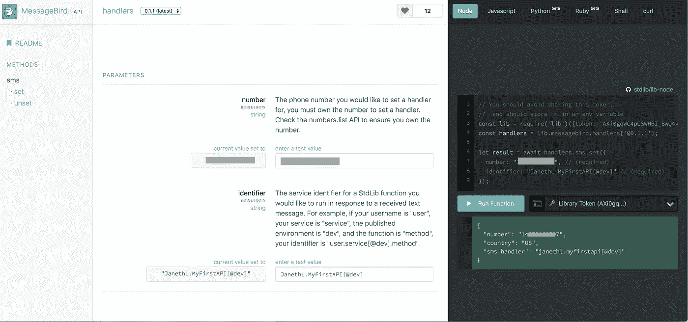

**就是这样！**要测试您的服务，请向您的 MessageBird 号码发送一条带有任何山峰名称的短信。您应该会在几秒钟内收到回复！

您可以定制处理程序来运行您喜欢的任何类型的代码——并从其他 API 返回响应。只需安装您需要的任何 npm 包，并用您想要的任何逻辑修改`functions/__main__.js`处理程序。您的短信服务已经可以测试了！

**建议的步骤——清理您的代码**

默认的示例 API 包(空白)可能有一些您不需要的额外端点和文件(比如除了您的`__main__.js`端点之外的`functions/`文件夹中的任何东西)——您最终会想要清理它们。要删除(或管理)文件，右击您想要删除的文件或文件夹，然后点击**删除**。

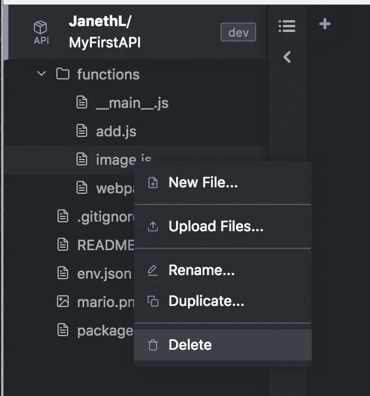

# 就这样，也谢谢大家！

感谢阅读！我很高兴看到你想出了什么好的服务来添加到标准库。你可以用你选择的任何 API 来重复这些步骤，来创建一个像这个[加密价格检查器](/@jacoblee93/build-a-serverless-sms-crypto-price-checker-in-6-minutes-with-messagebird-and-stdlib-a96e826e29aa)一样酷的服务！

我希望您能在这里、**发表评论，或者给我发电子邮件至 Janeth [at] stdlib [dot] com** ，或者在 Twitter 上关注标准图书馆、 [@StdLibHQ](https://twitter.com/StdLibHQ) 。如果你有什么令人兴奋的东西想让标准图书馆团队展示或分享，请告诉我——我很乐意帮忙！

Janeth Ledezma 是标准图书馆的社区经理，刚刚从加州大学伯克利分校——go bears 毕业。当她不学习阿拉伯语或健身时，你可以在她的 cbr500r 上发现她在探索城镇和咖啡馆。通过 Twitter[*@ MSS _ lede zma*](https://twitter.com/mss_ledezma)*跟随她与标准库的旅程。*