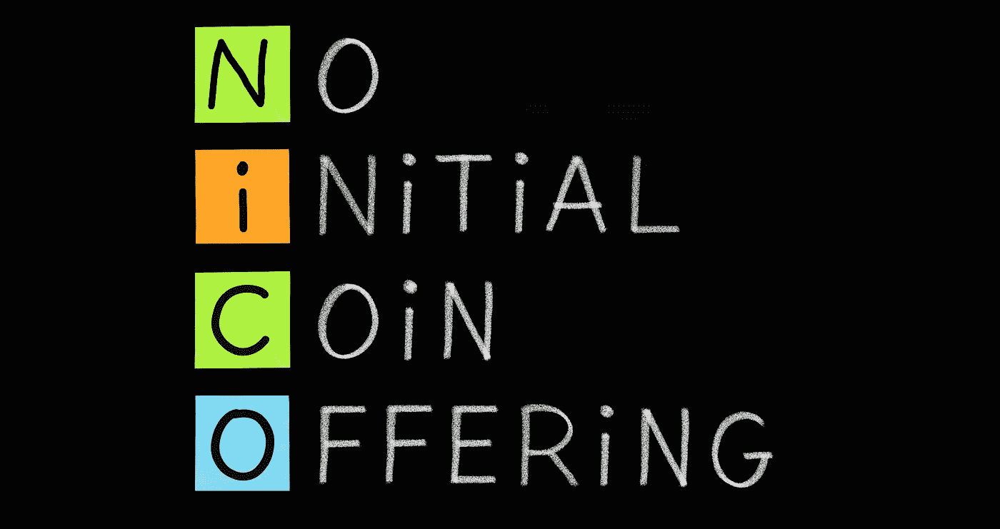

# 为什么我们使用 stablecoins 而不是我们自己的令牌

> 原文：<https://medium.com/hackernoon/build-first-hodl-never-why-were-calling-off-our-token-and-using-stable-coins-instead-46af203af697>

## 先建，后建

*本文包含了来自* [*MythX*](https://mythx.io) *团队的项目更新以及我自己的一些看法。其内容不一定反映公司理事会的意见。*

如果你在过去几周关注了加密新闻，你可能已经注意到在 ConsenSys 的事情已经变得动荡不安。我认为公平地说，ConsenSys mesh 的许多成员——包括我们这些有幸保住工作的人——最近有理由进行一些反思。

信不信由你，但 ConsenSys 的大多数人确实相信分散式基础设施的潜力。互联网上的 P2P 价值转移。允许任意图灵完全计算的分布式一致性机器。承诺是无止境的！但很明显，我们尚未实现这些目标，至少没有以一种可以证明 2017 年和 2018 年初过高的加密估值合理的方式实现。

No coin offerings, please move along.

2017-2018 年的史诗般的泡沫是由 ICO 热潮和 FOMO 将军引起的，但这项技术还没有为主流采用做好准备。这里有一些显而易见的教训:

*   我们不应该在半生不熟的白皮书上筹集数百万美元，而应该致力于扩展以太坊基础设施，并构建有助于现实世界采用的有用的东西。
*   令牌允许我们建立伟大的密码经济激励系统(例如[令牌管理的注册中心](https://hackernoon.com/token-curated-registry-tcr-design-patterns-4de6d18efa15)),但是大多数项目不需要定制令牌。在许多情况下，令牌所做的只是提高用户的准入门槛，最终对所有人都不利。
*   我们不应该忘记将我们带入太空的理想，即使是在快速赚钱的强烈动机下。也就是说，我们在前进的道路上也需要务实。革命不会在一夜之间发生。我们必须打持久战，而不是追求短期收益。

我们相信 ConsenSys 对基础设施和工具的贡献对以太坊的成功至关重要。以太坊拥有最大的开发者社区并非偶然——这是由像[松露](https://truffleframework.com)、[加纳切](https://truffleframework.com/ganache)、[因夫拉](https://infura.io)和[超屏蔽](https://metamask.io)这样的人才可能实现的。是的，有些东西是集中的，但不是盲目的。例如，虽然 Infura 现在使以太坊更容易访问，但 ConsenSys 的其他人正在开发轻客户端，这意味着未来对 Infura 的依赖将会减少。

在过去的两年里，我全心全意地打造 Mythril(安全分析器，而不是社交网络)。反正现在它将被称为神话，因为托尔金庄园受到了兽人长期围攻的威胁。Mythril/MythX 将安全性引入智能合约开发生命周期。我们认为更好的安全性(从而增加最终用户的信任)与更高的 TPS 和更好的可用性一样重要。

除了刚刚突破 30 万总下载量的 Mythril 开源工具之外，MythX 团队一直在开发一个 SaaS 平台，该平台采用了一种新颖的基于令牌的 SaaS 订阅模式。想法是建立一个“智能契约安全的 INFURA ”,允许任何人建立与开发和测试环境的集成。根据我们的白皮书，最终用户将购买以神话令牌命名的“令牌化许可证”,我们将把部分收益返还给工具开发者。

到目前为止，没有什么特别的，但现在出现了转折:我们的令牌将在路线图结束时通过债券曲线市场合约*发布，而不是做 ICO。*我们称之为“实用令牌 2.0”。这将是一种革命性的新方式，启动我们的生态系统，激励社区生产高质量的工具，扩大我们的用户群。我们的口号是“先建，后建”。

然而，在过去的几个月里，该团队一直在反思该计划，并重新评估将另一个实用工具令牌带到这个世界的潜在缺点。例如，即使我们进行了广泛的模拟，价格发现机制也不能保证在现实世界中有效——合法用户可能会被投机者定价，我们的令牌(以及 ETH)固有的波动性可能会对我们的社区和用户不利。

更重要的是，我们还发现在混合中包含一个令牌只会让用户体验更差。购买自定义令牌来为 API“加油”的要求让用户感到困惑，坦率地说，在 ETH 中支付要方便得多。

因此，我们决定取消神话令牌，而是接受 ETH，戴和其他潜在的稳定硬币支付。通过使用与美元挂钩的价格，我们将降低准入门槛，并创建一个对新开发者和用户更具吸引力的系统。同时，我们仍然能够利用公共区块链基础设施提供的主要优势:

*   任何有互联网连接的人，即使没有银行账户，也可以参与我们的安全工具市场。
*   **信用卡处理商和银行没有从我们的经济中榨取任何价值。**
*   **收入共享可以以透明(并最终完全分散)的方式实现。**

我们的新座右铭是*“先造，后做”。*

**TL；博士**

我们认为以太坊最有前途的应用之一是实现透明和无中介的价值转移。我们还认为，引入实用程序令牌会给最终用户带来太多风险和不利因素。因此，我们正在取消神话令牌，以美元为我们的许可计划定价，并增加对稳定币支付的支持。

我们的系统会是完全不可信和分散的吗？不会。它会像用信用卡支付一样容易使用吗？可能不会，但我们最终会到达那里。我们希望成为新一波以太坊项目的典范，将价值互联网带入主流。

有问题吗？给我们喊上[不和谐](https://discord.gg/kktn8Wt)。

# 关于 Mythril 和 MythX

Mythril 是一款免费的开源智能合同安全分析器。它使用符号执行来检测各种安全漏洞。

[MythX](https://mythx.io) 是一种基于云的智能合约安全服务，可以无缝集成到智能合约开发环境中并构建管道。它将多个领先的安全分析流程捆绑到一个易于使用的 API 中，允许任何人创建专门构建的智能合同安全工具。MythX 兼容以太坊、Tron、Vechain、Quorum、Roostock 和其他基于 EVM 的平台。