# 在 30 分钟内为您的 Apollo React 组件构建性能报告。⏲️

> 原文：<https://medium.com/hackernoon/build-performance-reports-for-your-apollo-react-components-in-30-minutes-%EF%B8%8F-1b4c27a16a84>

✨✨自动气象站实验

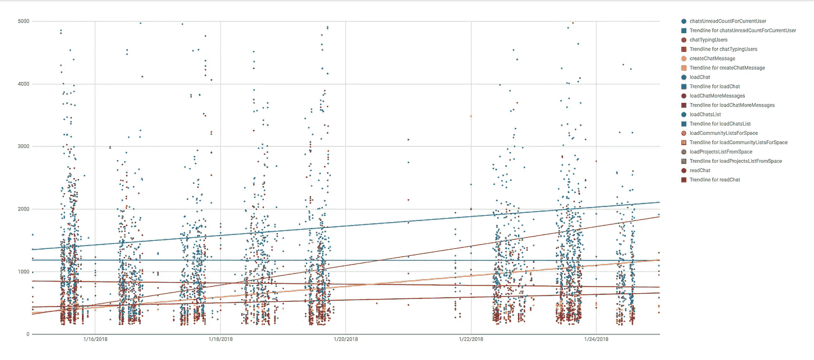

# 动机

几个月前，我们开始了一个大项目:**将我们的应用程序迁移到 GraphQL** 。

由于 **300+ React 组件**和 **20 个 API 端点**有许多嵌套资源，应用程序的可维护性和性能每个月都在恶化。

一旦这个项目完成，我们想确保 GraphQL 实现他的承诺，所以我们决定跟踪迁移组件的“感知性能”。

> **我们希望观察 GraphQL Ruby API 的性能，避免 UX/性能退化。**

考虑到我们已经使用了很多外部 SASS (NewRelic、Cloudinary、AWS、Segment、OAuth0、…)，我们没有构建完整的 AWS 数据 ELK 堆栈，而是决定构建一个简单且低成本的性能“仪表板”。

由于我们细分市场帐户将所有原始数据保存在 S3 存储桶中，我们决定通过发送自定义事件`Perfomance.QueryLoadTime`来使用这些数据。

> 注意: [Segment](https://segment.com) 是一个 SASS Analytics API，它提供了与 Hubspot、custom webhooks 或 AWS 等 200 多种服务的集成。

# 建筑

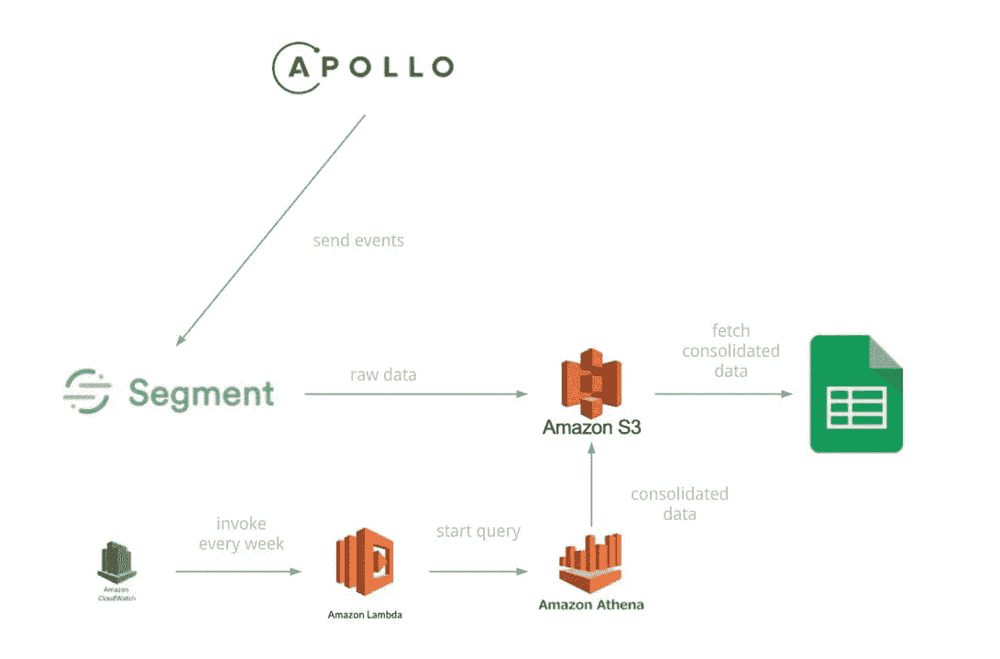

Of course, Segment can easily be replaced by AWS [Kinesis Firehose](https://aws.amazon.com/fr/kinesis/firehose/) and AWS [API Gateway](https://aws.amazon.com/fr/api-gateway/)

每次特定 GraphQL 请求结束时，前端 React 应用程序都会向 Segment 发送一个自定义的`Perfomance.QueryLoadTime`事件。
该事件随后以 JSON 原始数据文件的形式存储在 S3。

然后，每周从 S3 获取数据并进行整合，准备用于 Google Sheets。

让我们看看如何解决它！

# 发送性能数据—使用分段设置阿波罗

> [Apollo Data](http://apollodata.com) 是一个兼容 React 的 GraphQL 客户端

为此，我们需要编写一个[自定义链接](https://www.apollographql.com/docs/react/basics/network-layer.html)来拦截一些过滤后的查询，并将性能数据发送给 Segment。

> 你会在下面看到一个`JasonBourne`服务。
> 别担心，这是我们的细分客户包装器。

都是。你所要做的就是将这个`link`添加到你的`ApolloClient`实例中。

```
export const client = new ApolloClient({
  link: ApolloLink.from([perfMonitorLink, networkLink]),
  cache: apolloCache
});
```

前面的部分都准备好了。

# 构建整合数据—设置 AWS Athena

Athena 是 Amazon 的一项服务，允许对 S3 文件运行 SQL 查询。

配置 Athena 非常简单，您需要:

1.  创建数据库
2.  通过指定源和数据结构来创建表
3.  创建一个命名查询并保存它

## 数据

以下是 Segment 存储到 S3
(针对`Perfomance.QueryLoadTime`事件)的原始数据结构

您会注意到许多字段与数据分析无关，所以我们只保留一个子集。

## 创建数据库和表

**注意:**AWS Athena 上可用的“创建表”UI 不允许创建具有复杂数据结构(嵌套字段、联合类型字段等)的表，因此我们需要编写一个创建表查询，手工✍️

Athena 使用一种 [Apache HIVE](https://hive.apache.org/) 语言来描述数据，下面是 wanted `CREATE TABLE`查询:

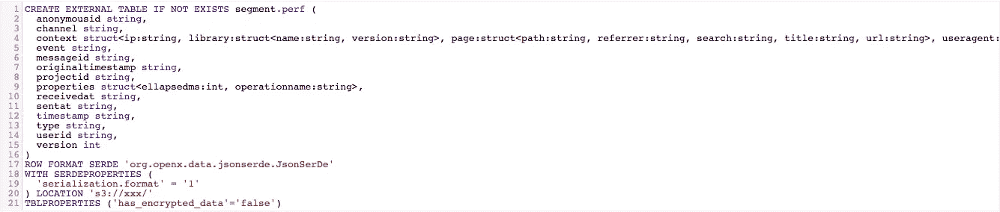

The query expose the data format (JSON), data structure, the source and the destination

为此，我们可以使用一个叫做`[hive-json-schema](https://github.com/quux00/hive-json-schema)`的奇妙工具。
这是一个开源项目——由 AWS 官方文档推荐——从 JSON 原始数据生成 HIVE 查询。

简而言之，给定一个 JSON 示例文件，它会生成一个相应的`CREATE TABLE`查询。

[看 doc](https://github.com/quux00/hive-json-schema#overview) ，真的很简单(最多花 5 分钟)。

## 编写并保存选择查询

现在表已经准备好了，我们可以编写一个`SELECT`查询。
这是我们的:

```
SELECT
  properties.ellapsedMs, properties.operationName, sentAt
FROM "segment"."perf" WHERE
  event = 'Performance.QueryLoadTime'
ORDER BY sentAt DESC;
```

因为它是普通的 SQL，所以您可以选择这个表上所有可用的字段。

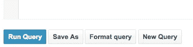

**运行查询并保存。**

*注意:每次执行查询时，Athena 都会将 CSV 结果存储在您的 S3 上。
要了解位置(哪个桶)，请前往设置。*

## 问题

Athena 不建议定期运行保存的查询。
然而，我们可以使用 AWS Athena API 远程运行查询。
下一步，λ。

# 保持数据新鲜—设置定期 AWS Lambda

AWS Lambda 是允许创建[无服务器功能](https://martinfowler.com/articles/serverless.html)的服务。

> *无服务器架构指的是在很大程度上依赖于运行在临时容器中的定制代码的应用程序(作为服务或“FaaS”)[……]。通过使用这些理念，[…]，这种架构消除了对位于应用程序后面的传统“始终在线”服务器系统的需求。根据具体情况，这种系统可以显著降低运营成本和复杂性，但代价是依赖供应商和(目前)不成熟的支持服务。*

[Martin Fowler —无服务器架构](https://martinfowler.com/articles/serverless.html)

我们不想每周都在 AWS Athena UI 上手动运行保存的查询，所以我们需要一个每周都运行查询的 Lambda。

下面是如何做到这一点:

1.  创建周期性 lambda
2.  确保 lambda 有足够的权限调用 Athena 并将结果存储到 S3

## 创建“周期性λ”

转到“创建功能”，选择“节点 6.10”和“创建自定义角色”。
你将被重定向到 [AWS IAM](https://aws.amazon.com/fr/iam/) ，点击“允许”。
**请记下 IAM 角色的名称，稍后会用到。**

然后点击“创建功能”。

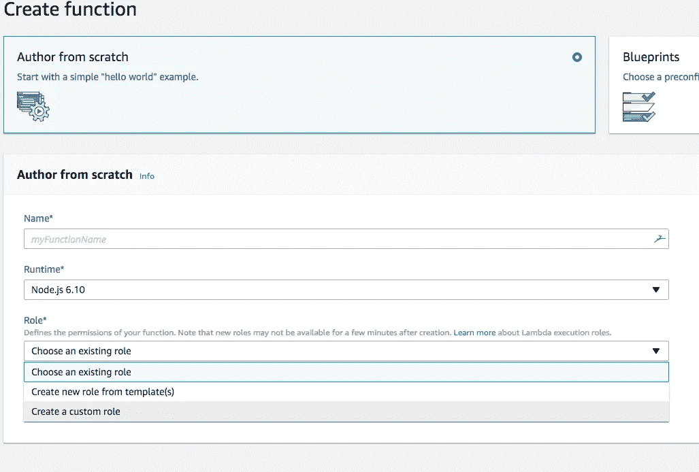

## 选择一个触发器

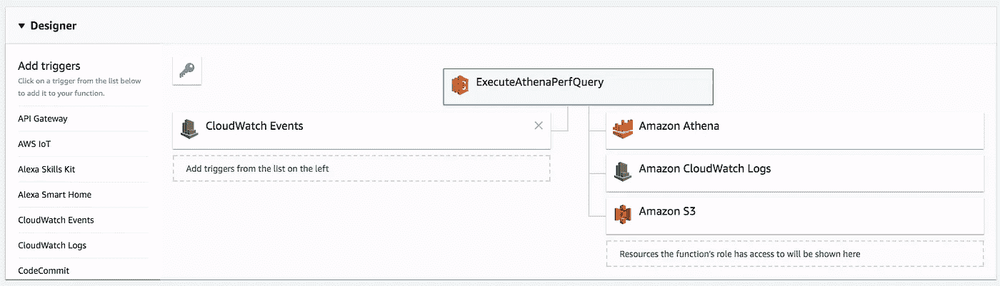

You’ll arrive a page like this.

为了运行，需要调用一个 lambda。我们希望每周调用一次 lambda，就像 CRON 任务一样。

[AWS Cloudwatch](https://aws.amazon.com/fr/cloudwatch/) 提供这个功能。

在左侧，选择“CloudWatch Events”，然后使用以下配置:

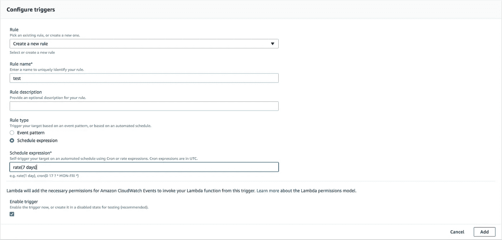

The lambda will be invoked by a Cloudwatch event every 7 days.

## lambda IAM 角色

这是最棒的部分，您需要进入 IAM 并找到您刚刚创建的角色。

然后，确保该角色拥有以下权限:

*   **雅典娜** : *GetNamedQuery* ， *StartQueryExecution*
*   **S3** : *列表桶*，*创建桶*，*放置对象*，*列表桶*

这将允许 lambda 查找并运行查询，并将结果存储在 S3 上。

*注意:我强烈建议您* [*钻研 AWS IAM 文档*](https://docs.aws.amazon.com/IAM/latest/UserGuide/introduction.html) *以便理解所有的含义。*

## 拉姆达代码

λ必须:

1.  通过 id 获取命名查询
2.  开始查询
3.  终止 lambda 执行

*注意:要获得您的 Athena 查询 ID，请从 Athena“保存的查询”中打开查询，并从 URL 中复制 ID*


# 显示数据—配置 Google 电子表格

现在整合的数据是新的和可用的，我们需要:

1.  获取整合数据
2.  格式化日期字段—如果有
3.  构建数据透视表
4.  构建图表

## 复制 AWS Athena 创建的最后一个 CSV 文件的内容

您将在 Lambda 源代码中指定的桶中找到该文件。
*记住，我们指定了一个自定义输出位置给 AWS Athena 开始查询调用。*

复制文件的内容，并将其粘贴到新的工作表中。

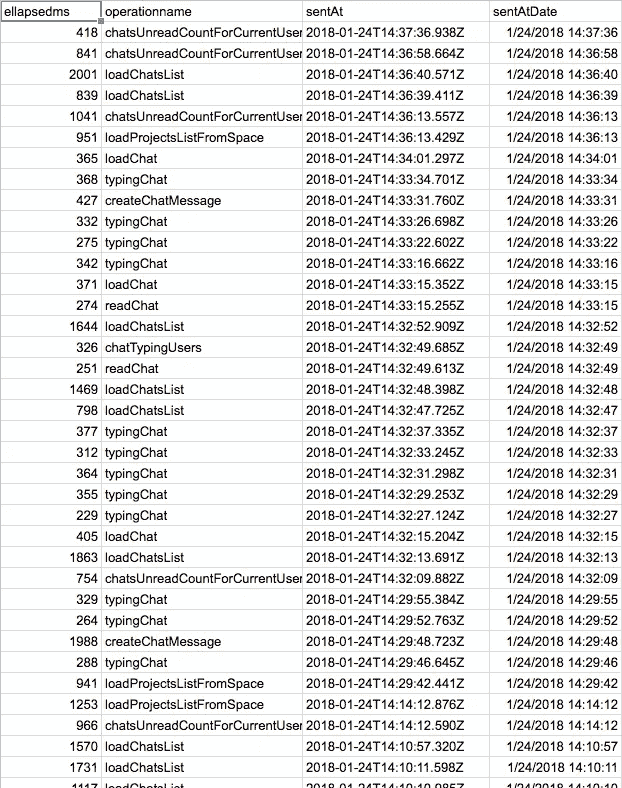

## 格式化数据

如果您正在处理日期字段，这里有一个技巧。

谷歌电子表格不理解 ISO 日期格式，我们需要“格式化”它。这是公式，将它应用到每个所需字段的全新列中。

```
= DATEVALUE(MID(C2,1,10)) + TIMEVALUE(MID(C2,12,8))
```

*在这里你会得到一个“MM/DD/YYYY HH:MM:SS”格式的* ⤴️

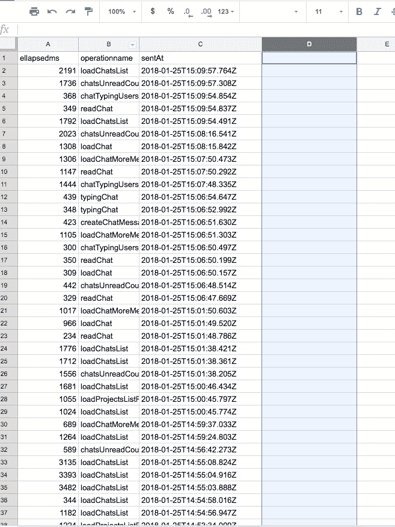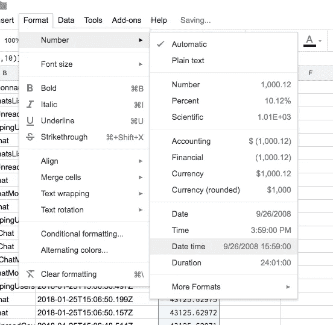

Remember to change the column format to “Date time”

## 构建“数据透视表”

整合的 CSV 数据尚不可用。
由于数据对单个值(elapsedMs)使用多个维度(sentAt，operationName)，我们需要构建一个“矩阵/数据透视表”。

为此，创建一个新的工作表并转到*“数据>数据透视表…”*

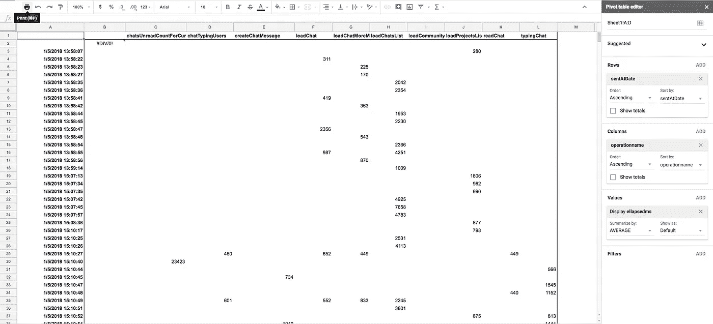

Here is an example of pivot table configuration, it’s very “data-specific”.

## 配置图表

图表的配置非常个性化，取决于您拥有的数据类型，这里有一个基于时间的性能数据示例。

我最喜欢的基于时间的性能数据图表类型是*散点图* ⤵️


或者经典的平滑线图用平均值
代替详细值⤵️

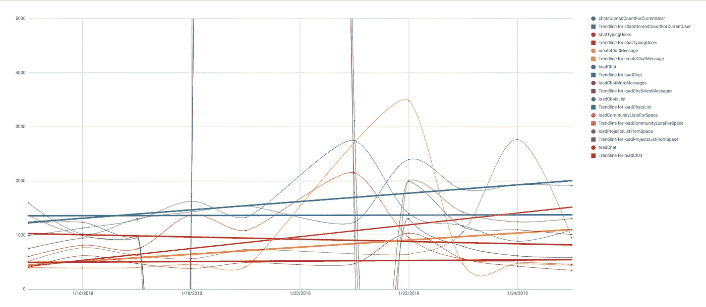

这有助于我们一目了然地看到趋势和最大值✨

# 结论

## 赞成的意见

*   每周只为 Lambda 执行和 Athena 查询支付一次费用
*   非常灵活的配置
*   令人讨厌的🤓

**Cons**

*   解决方案已经存在:ELK、AWS Quicksight、Tableau
*   每周复制-粘贴数据
*   非技术人员不可配置

# 未来和改进📈

## CVS 文件数据粘贴步骤

这一步很难轻易实现自动化，因为 AWS Athena 创建了一个独特的。每次查询结束时在 S3 的 csv 文件。
一种解决方法是做两件事:

1.  更新 lambda，将查询结果保存在一个名为`latest.csv`和**的文件中，并在 S3 公开保存****。**
2.  **然后在谷歌电子表格中使用令人敬畏的`IMPORTDATA()`功能**

**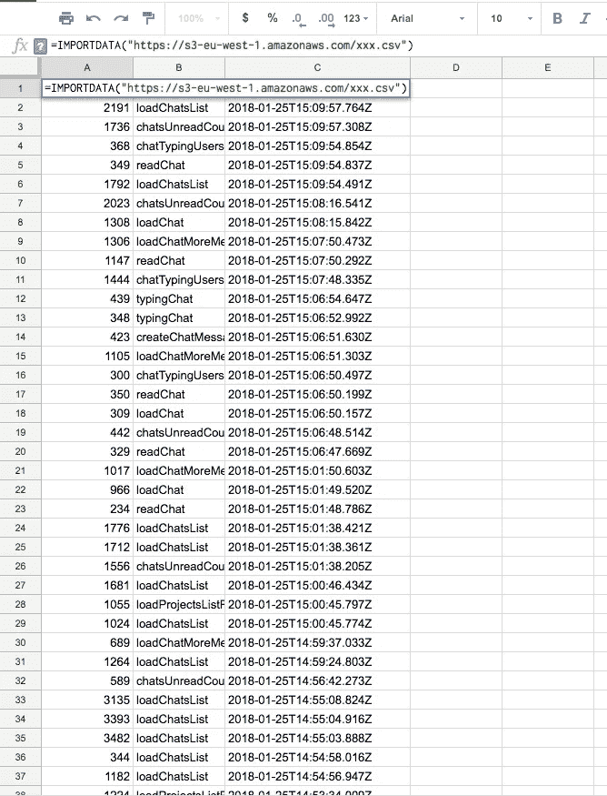**

**This way, the data will always be the freshest one!**

## **支持多种查询**

**我们可能想创建许多 Athena 查询(示例:BI 或高级交叉分析工具报告)**

**为此，我们可以更新 Lambda 函数来更新所有或许多查询。**

## **Tableau、AWS Quicksight 或 Datadog 怎么样？**

**当然，有许多经过考验的专业解决方案。
该博客将解决方案暴露于具有特定财务和技术约束的特定环境中。
我们完全可以配置 Datadog 或支付 Tableau 许可证费用，但这没那么有趣！**

**这当然是一个实验和临时解决方案。**

# **谢谢你的阅读！🌞**

**我希望你能学到一些关于 AWS 或 GraphQL 的东西。
如果我错过了什么，请随时留言！**