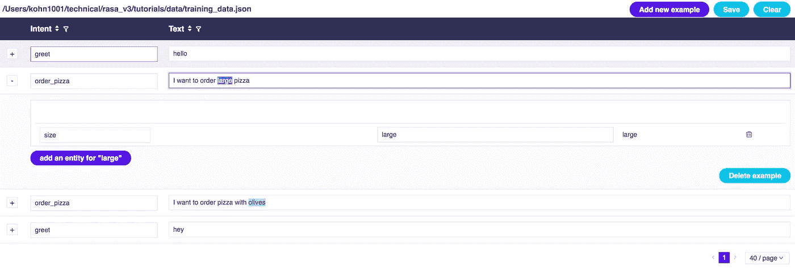

# 用 RASA 用 Python 构建一个人工智能/机器学习聊天机器人——第 1 部分

> 原文：<https://medium.com/hackernoon/build-simple-chatbot-with-rasa-part-1-f4c6d5bb1aea>


在这篇文章中，我们将使用**真实** **机器学习**和(幕后)深度学习进行自然语言处理/理解！

在这篇文章中，我们将为 NLP/U 引擎和[对话部分](/@nattykohn/build-simple-chatbot-with-rasa-part-2-16726357b72c)使用 [RASA](https://rasa.com/) 对话人工智能解决方案

> RASA——是 NLP 引擎/意图提取/对话的开源 Python 实现——其中所有上述内容都运行在**您的机器** /内部→ **无云！**
> 
> 顺便提一下，我们在[博士**这里**到](https://medium.com/u/bd8c6fbc1fb7#2aa3)
> 
> > 首先这里是一个简短的介绍(如果你非常熟悉聊天机器人/对话架构或者想进入正题，这里 跳到 [**)**](#2aa3)
> > 
> > 当聊天机器人输入是文本时，例如:“我想点比萨饼”
> > 
> > 首先，机器人需要运行一个 NLP ( [自然语言处理](https://en.wikipedia.org/wiki/Natural-language_processing))引擎来解析句子(创建一个结构，或者“试着理解它”，如果你可以的话)
> > 
> > …但是下一步呢？让我们假设机器人成功地将其分类到正确的“意图”，在我们的情况下，假设“意图”是:订单 _ 比萨饼，
> > 
> > 常识上说我们必须有(来自用户)，全名，地址，披萨大小，浇头，还有什么？为此，我们需要一个“对话管理”组件，在这个组件中，我们将配置我们的机器人支持的各种“意图”，对于每个“意图”(下一部分—第 2 部分)，我们将指定哪些“插槽”/“实体”是强制性的，哪些只是可选的—这种配置通常被称为:“域定义”。
> > 
> > 如果你已经注意到在我们的例子中，全名，地址，比萨饼大小和浇头(槽)是强制性的，通过强制性，我们的意思是我们的机器人将继续与我们的用户交互，直到这些信息得到满足，只有这样它才能完成任务-比萨饼订购！
> 
> # 最受欢迎的 3 篇人工智能文章:
> 
> > [1。用深度学习寻找歌曲的流派](https://chatbotslife.com/finding-the-genre-of-a-song-with-deep-learning-da8f59a61194)
> > 
> > [2。张量流揭秘](https://chatbotslife.com/tensorflow-demystified-80987184faf7)
> > 
> > [3。机器人，MODs &多人合作:为什么 Slack 是游戏化的——而不是游戏化的](https://chatbotslife.com/bots-mods-multiplayer-co-op-why-slack-is-game-like-not-gamified-bb1b7ac93c04)
> 
> (我将制作一个更详细的视频，敬请关注:)
> 
> 现在让我们言归正传。
> 
> ## 建立 NLU 方面
> 
> 为了获得使用 [Python 3.6.4](https://stackoverflow.com/a/52783694/1340604) (以及更高版本)运行的最佳结果，最好使用 [virtualenv](https://stackoverflow.com/a/54183964/1340604) (如果出现错误)尝试使用以下代码创建 env:
> 
> ```
> pip3 install virtualenv
> python3 -m virtualenv <env_name>
> source <env_name>/bin/activate
> ```
> 
> > 如果您不想在您的版本上安装 Python 版本，只需使用 [Pyenv](https://stackoverflow.com/a/57876585/1340604) (推荐)
> > 
> > [如果你安装了 Python 3.6.4，确保你运行上面的命令，Python 3 指向上面提到的 Python 3 . 6 . 4](https://stackoverflow.com/a/51367161/1340604)
> 
> 您可以选择安装它:
> 
> ```
> pip3 install rasa_nlu==0.12.3
> ```
> 
> 如果您希望能够调试您的代码并开始实现，您应该克隆它:
> 
> ```
> git clone [git@github.com](mailto:git@github.com):RasaHQ/rasa_nlu.gitcd rasa_nlu#go to the relevant release (0.12.3):
> git reset --hard d08b5765e92ea27741926b1246e5e22713158987 pip install -r requirements.txt
> pip install -e .
> ```
> 
> 无论哪种方式，都可以创建一个工作目录，我们将在其中放置本教程的所有文件:
> 
> ```
> mkdir rasa_demo
> cd rasa_demo
> vim requirements.txt
> ```
> 
> > 如果不想使用 vim，只需创建 requirements.txt 文件。并在文本编辑器(sublime 或记事本)中编辑它
> 
> 如果您克隆了代码，请跳到[配置](#429a)。
> 
> 在文件“requirements.txt”中添加以下内容:
> 
> 现在运行(查找文件的位置):
> 
> ```
> pip install -r requirements.txt
> ```
> 
> ## 配置
> 
> 首先让我们创建配置文件和培训文件。
> 
> 让我们从配置文件开始。创建名为 config 的目录:
> 
> ```
> mkdir config
> cd config
> vim config.json
> ```
> 
> > 如果不想使用 vim，只需创建 requirements.txt 文件。并在文本编辑器(sublime 或记事本)中编辑它
> 
> 在这个文件“config.json”中添加以下内容:
> 
> 如果您使用的是较新版本的 Rasa，即通过 yml 完成配置，请创建 config/config.yml:
> 
> 回到父工作区目录—在我们的例子中是“rasa_demo”
> 
> ## 培训用数据
> 
> 现在让我们创建训练数据，就此而言，我们认为我们的用户将要说的句子的例子，以及我们的聊天机器人应该打破它的意图和实体。
> 
> 首先，让我们创建一个目录“data ”,并在其中创建一个文件“training_data.json”
> 
> 运行:
> 
> ```
> cd ../
> mkdir data
> cd !$
> vim training_data.json
> ```
> 
> > 如果不想使用 vim，只需创建 requirements.txt 文件。并在文本编辑器(sublime 或记事本)中编辑它
> 
> 有了这个内容:
> 
> 有一个很棒的工具(rasa_nlu_trainer)可以用来添加新的例子/意图/实体。
> 
> 要安装它，请在终端中运行:
> 
> ```
> npm i -g rasa-nlu-trainer (you'll need [nodejs and npm](https://nodejs.org/) for this)
> ```
> 
> 如果您没有 npm 和 nodejs，请转到此处的，并按照安装部分中的链接找到 npm 和 nodejs。
> 
> 现在启动训练器:
> 
> ```
> rasa-nlu-trainer -v <path to the training data file>
> ```
> 
> 在我们的示例中，我们将文件放在数据目录下:
> 
> ```
> rasa-nlu-trainer -v data/training_data.json
> ```
> 
> 以下是培训师的截图:
> 
> 
> 
> 在截图中我们可以看到意图部分:“order_pizza”和用户输入的文本:“我想点大披萨”。此外，我标记了单词“large ”,现在我可以选择将其作为一个实体添加:“size ”,在本例中其值为:“large”
> 
> 在这个例子中，我们每个意图只有 2 个例子(顺便说一句，这是每个意图你必须拥有的最少例子，否则你会在训练时间中出错。
> 
> ## 机器学习培训
> 
> 现在我们已经准备好实际训练我们的[机器学习](https://hackernoon.com/tagged/machine-learning) NLU 模型。
> 
> 使用以下代码在父工作区目录中创建一个文件:“nlu_model.py ”:
> 
> 如果您使用的是较新版本的 Rasa(没有通过 yml 的 NLU 转换器/配置),请使用 nlu_model.py:
> 
> 现在运行(确保您在父工作区目录中):
> 
> ```
> python nlu_modle.py
> ```
> 
> 注意，在上面的代码中，对 run()函数的调用被注释掉了。
> 
> 现在尝试取消对它的注释，并注释掉对函数 train()的调用。
> 
> 再次运行:
> 
> ```
> python nlu_modle.py
> ```
> 
> 您应该会看到输出:
> 
> ```
> {u’entities’: [], u’intent’: {u’confidence’: 0.78863250761506243, u’name’: u’order_pizza’}, ‘text’: u’I want to order pizza’, u’intent_ranking’: [{u’confidence’: 0.78863250761506243, u’name’: u’order_pizza’}, {u’confidence’: 0.21136749238493763, u’name’: u’greet’}]}
> ```
> 
> 正如您所看到的，我们的模型已经成功地将文本分类到意图:“order_pizza”，并充满信心:“0.788……”—为了获得更好的概率，只需在训练数据中添加更多的示例。
> 
> **恭喜**！我们刚刚为我们的聊天机器人构建了一个解释器—中途:)
> 
> 你可以休息一下，稍后再看第二部分——别忘了**鼓掌**:)
> 
> 现在，您已经准备好构建对话端了。
> 
> [转到指南的第 2 部分](/p/16726357b72c)(链接将很快添加)
> 
> (顺便说一句，我们正在[柠檬水](https://www.lemonade.com/?utm_source=medium&utm_medium=social&utm_content=nathanielkohn)建造惊人的人工智能和聊天机器人)
> 
> # 解决纷争
> 
> 如果您遇到问题！
> 
> git 克隆最新版本，安装所有需求像[这个](https://stackoverflow.com/a/54183964/1340604):
> 
> 运行:
> 
> ```
> virtualenv -p python3 <env name>python3 -m virtualenv <env_name> 
>  
> pip3 install alt_requirements/requirements_tensorflow_sklearn.txt
> ```
> 
> ## 现在你准备好了吗
> 
> 1.  只需确保您有一个培训文件(类似于上面的)配置文件，如下所示— config.yml:
> 
> ```
> pipeline:
> - name: "tokenizer_whitespace"
> - name: "ner_crf"
> - name: "intent_featurizer_count_vectors"
> - name: "intent_classifier_tensorflow_embedding"
>   batch_size: [64, 256]
>   epochs: 1500
>   embed_dim: 20
> ```
> 
> 2.现在训练:
> 
> ```
> python3 rasa_nlu/train.py \
>     --config `pwd`/config/config.yml \
>     --data `pwd`/data/training_data.json  \
>     --path `pwd`/projects/
> ```
> 
> 3.现在运行:
> 
> ```
> python3 rasa_nlu/server.py --path `pwd`/projects --config config/config.yml
> ```
> 
> 确保 config.yml 文件在同一个位置。
> 
> 如果你有 Python pkgs 的问题，请跟随[这个](https://stackoverflow.com/a/54183964/1340604):
> 
> ```
> virtualenv -p python3 <env name>python3 -m virtualenv <env_name> 
>  
> pip3 install alt_requirements/requirements_tensorflow_sklearn.txt
> ```
> 
> ## 更多问题？
> 
> 如果在尝试运行 NLU (> python nlu_model.py)时出现以下错误:
> 
> " OSError:找不到模型' en ' "
> 
> 这意味着您还没有下载 spacy“en”语言模型。
> 
> 运行:
> 
> ```
> python3 -m spacy download en
> ```
> 
> 或者:
> 
> ```
> python -m spacy download en
> ```
> 
> [](https://chatbotslife.com/bot-communities-mastermind-group-d2dae9876709#.53x0py6ou)[](https://m.me/ChatbotsLife)[](https://chatbotslife.com/how-to-get-a-free-chatbot-b1fb9dfe109#.z9dtp2sy0)