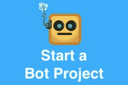

# 用 RASA 用 Python 构建一个简单的聊天机器人——第 2 部分

> 原文：<https://medium.com/hackernoon/build-simple-chatbot-with-rasa-part-2-16726357b72c>

我们正在建造一个惊人的聊天机器人 T2 柠檬水 T3

在这一部分，我们将致力于“使用 [RASA](https://rasa.com/) 对话式人工智能解决方案构建一个简单的[聊天机器人](https://chatbotslife.com/)”的对话部分。

如果你还没有读完[第一部分](/p/f4c6d5bb1aea)，我建议你先读完[第一部分](/p/f4c6d5bb1aea)，然后再读这一部分。

现在事情变得有趣了，聊天机器人方面——到目前为止，我们已经建立了 NLP 部分，现在我们将致力于对话部分。

正如我在第 1 部分中提到的，对于每一个实际上不仅仅是回答问题的聊天机器人，最基本的是一个支持“槽填充”的聊天机器人，这意味着(在我们的例子中)与用户进行交互，以获得它需要的强制槽(根据“域定义”，不要担心我们稍后会谈到这一点)。

一种插槽填充场景可能是:

*   用户:“我要披萨”；#缺少的槽:[大小、配料等。]
*   bot:“什么尺寸？”
*   用户:“大”
*   机器人:“你想要哪种配料？”
*   用户:“橄榄”

在本例中，我们与用户有 2 次交互— 2 个空位需要填充。

[](https://www.eventbrite.com/e/chatbot-conference-tickets-45884424549?utm-medium=discovery&utm-campaign=social&utm-content=attendeeshare&aff=escb&utm-source=cp&utm-term=listing)

## 建立对话

类似于我们在 NLU 中构建的(上面提到的第 1 部分),我们应该创建域和训练数据。

## 构建域

这里我们将创建文件 chat_domail.yml。

您可以使用该文件:

注意最后一个——更多信息在下面的解释部分。

但是，如果您创建了自己的格式或更改了这个格式，验证格式总是一个好的做法(这是一个脆弱的格式，如果您破坏了它，它将无法工作):

[将](http://www.yamllint.com/)链接到在线 yml 验证。

让我们试着解释一下上面的文件。

*   意图——是父结构，通常是 bot 支持的动作(但也有例外)
*   实体—是您希望机器人从自由文本中提取的单词
*   slots——在这里定义它们，就像通过对话告诉机器人要跟踪哪些实体，例如，如果用户说:“我想要比萨饼”，我们希望机器人与用户交互，以获得“大小”或“浇头”槽。
*   动作——或者是话语，这意味着我们要发送给用户的输出，或者你可以实际创建你自己的固有形式动作的类。在我们的例子中，它是:“动作。ActionOrderPizza”，这里再次说明 Rasa 有一个非常酷的界面，你应该从 Action 类中固有并根据你的需要在派生类中添加你的逻辑，这里有一个例子——创建文件 **action.py** :

# 前 3 名机器人教程

> [1。打造聊天机器人的最佳聊天机器人平台](https://chatbotslife.com/best-chatbot-platforms-to-build-a-chatbot-13b846a59ddd)
> 
> [2。使用 RASA 在 Python 中构建简单的聊天机器人—第 1 部分](https://chatbotslife.com/build-simple-chatbot-with-rasa-part-1-f4c6d5bb1aea)
> 
> [3。我如何用 Python 开发我自己的“学习”聊天机器人](https://chatbotslife.com/how-i-developed-my-own-learning-chatbot-in-python-from-scratch-and-deployed-it-on-facebook-88bc828be0a8)

在上面的例子中，我将它创建为“stubs ”,这里没有真正的逻辑，只是为了举例。

## 为对话建立训练数据

在这里，我们将构建一个标记文件，我们将其命名为:stories.md，顾名思义，我们将可能的对话流描述为用户故事。

在这里，你可能会担心这是一个非常手工的过程，但不要担心 RASA 有一个很好的工具来在线训练你的对话！或者甚至更多的加载预先训练好的对话。

但首先让我们创建一个非常短的基本流程，并训练对话模型，稍后我们将回到在线训练。

对于基本流程，您可以使用这个文件 stories.md:

请注意，在上述流程中，我们涵盖了以下场景:

1.  Bot:“你好，有什么可以帮你的吗？”
2.  用户:“我想要比萨饼”#缺少槽:“大小”和“配料”
3.  Bot:“什么尺寸？”
4.  用户:“大”
5.  机器人:“你的比萨饼想要什么配料？”
6.  用户:“奶酪”

现在我们准备用上面的训练数据训练一段对话。

让我们写一些代码，你可以使用这个文件:

现在运行:

```
python dialogue_model.py
```

注意:上面的代码在 Python3 上运行没有错误，但是由于某种原因，我在 Python2 上遇到了一些问题。

如果一切顺利，您应该已经训练好了模型，输出在 models/dialogue/下，应该是这样的:


现在，我们已经为在线培训做好了准备！耶！！！

正如我所承诺的，RASA 有一个惊人的能力来在线训练你的机器人，并创建一个更详细的 stories.md 文件供你在线训练课程结束后使用。

现在创建 online_train.py:

不，我们已经准备好了:

```
python online_train.py
```

您应该获得一个交互式会话，在该会话中，您应该遵循预期的流程，例如:


1.  在第一条绿线中，它表示 bot 已经加载，正在等待用户输入。
2.  接下来我们输入:“嗨”
3.  现在您可以看到系统打印了“聊天记录”:

*   我们可以看到流程是正确的:
*   机器人做了:动作 _ 听
*   用户说:嗨
*   其意图是:问候

4.现在，系统正在等待您的反馈，在这种情况下，流程是正确的，所以我们应该键入:2。

5.当您完成输入“0”以导出新的 stories.md 文件(给它一个新的名称，例如:“stories_v1.md”)时，您可以继续这样做。

现在替换以前的故事文件(首先备份它！)或者将它们连接在同一个 stories 文件中，这样您将拥有越来越多的训练数据！

就这样—现在最后一部分是测试它—更多内容将在后面……

请随时在此提问或前往相关的 gitter 部分:

[](https://gitter.im/RasaHQ/rasa_core) [## RasaHQ/rasa_core

### 用于对话软件的基于机器学习的对话引擎

gitter.im](https://gitter.im/RasaHQ/rasa_core) [](https://chatbotslife.com/bot-communities-mastermind-group-d2dae9876709#.53x0py6ou)[](https://m.me/ChatbotsLife)[](https://chatbotslife.com/how-to-get-a-free-chatbot-b1fb9dfe109#.z9dtp2sy0)