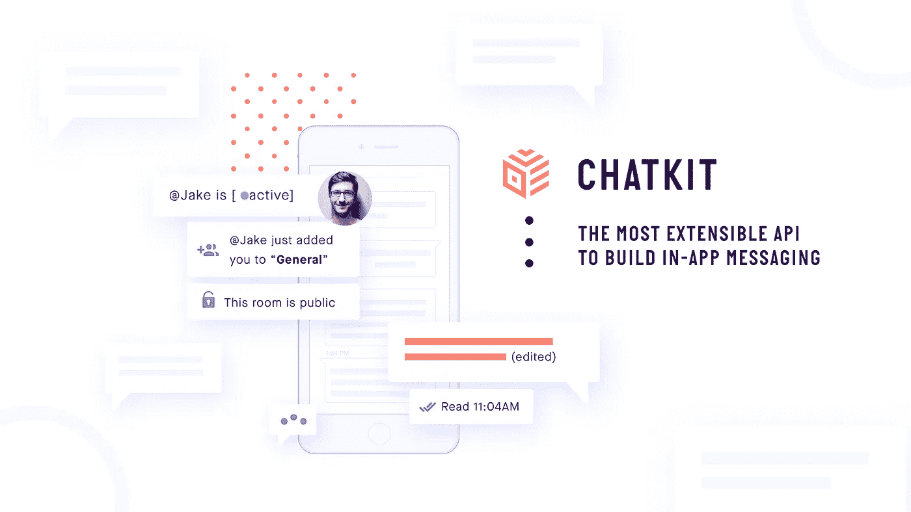
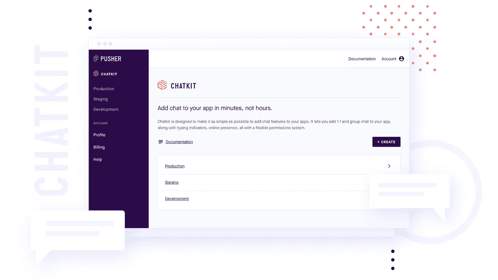

# 为您的用户打造值得拥有的应用内信息体验

> 原文：<https://medium.com/hackernoon/build-the-in-app-messaging-experience-your-users-deserve-695d566dabfd>

在过去的一年里，我们一直在努力扩展我们的基础设施，并根据我们从 8，000 多名测试人员那里收到的反馈开发新功能。今天，我们很高兴地宣布 [Chatkit 正式上市](http://pusher.com/chatkit)。

# 什么是聊天工具？

The Chatkit Dashboard

[Chatkit](https://hackernoon.com/tagged/chatkit) 是一套 API，让你可以在手机和网络应用中定制应用内消息。它具有终端用户希望在任何应用内聊天中看到的现成功能，例如:

*   打字指示器
*   文件和图像共享
*   在线状态
*   角色和权限
*   读取光标

…等等，这样您就不必重新发明轮子了。

我们已经开始根据渠道用户的反馈构建 Chatkit，这些用户厌倦了 Zendesk Chat 和 Intercom 等现成解决方案或 WhatsApp 和脸书信使等消息平台缺乏可扩展性和可定制性。他们希望构建一种符合其业务需求的聊天体验，并拥有自己的数据。

日本最先进的企业云协作平台提供商 [Kenja Corporation](https://www.kenja.com/) 首席技术官 Philip Butkiewicz 分享了他的经验:

> *“Chatkit 的简单性给我们留下了深刻的印象，因为我们能够在短短几天内从零到定制聊天解决方案。Pusher 的 JS 库非常适合我们快速启动和运行——它使我们能够满足客户的特定 UX 需求。”*

# 聊天工具中的新功能

就在测试版发布后，我们听到了开发人员对更多 SDK 的请求——所以我们发布了新的客户端和服务器 SDK。我们还增加了一些新功能，带来了更多开箱即用的功能，例如:

*   角色和权限—在您的 Chatkit 实例中创建自定义角色，以区分用户与您聊天的交互方式
*   阅读光标—跟踪用户在房间中阅读邮件的程度
*   实例检查器—检查实例中的用户、房间、消息和角色的情况
*   富媒体支持—向邮件添加附件。(*注意:该功能目前仍处于测试阶段，但即将推出全面更新！*)

我们还添加了一些新的 SDK，并更新了现有的 SDK:

**客户端 SDK**

*   [iOS](https://docs.pusher.com/chatkit/reference/swift)
*   [JavaScript](https://docs.pusher.com/chatkit/reference/javascript)
*   [安卓](https://docs.pusher.com/chatkit/reference/android)

**服务器 SDK**

*   [iOS](https://docs.pusher.com/chatkit/reference/swift)
*   [JavaScript](https://docs.pusher.com/chatkit/reference/javascript)
*   [安卓](https://docs.pusher.com/chatkit/reference/android)
*   [Node.js](https://docs.pusher.com/chatkit/reference/server-node)
*   [红宝石](https://docs.pusher.com/chatkit/reference/server-ruby)
*   [PHP](https://docs.pusher.com/chatkit/reference/server-php)
*   [开始](https://docs.pusher.com/chatkit/reference/server-go)

# 下一步是什么？

我们有一个包含各种功能的路线图，可以帮助您构建用户想要的应用内体验。

以下是未来几个月即将推出的产品的小预告:

*   房间的自定义数据
*   多部分消息
*   新的和改进的文件 [API](https://hackernoon.com/tagged/api) (富媒体支持已出测试版！)
*   波束推送通知支持和回退
*   Webhooks
*   端到端加密

像往常一样，我们希望得到您的反馈，所以请告诉我们您的想法！你可以在 chatkit@pusher.com 联系我们