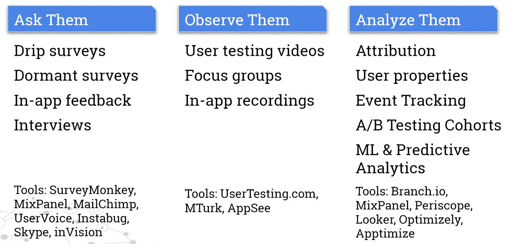

# 构建正确的事物——从 5 步计划到坚如磐石的产品路线图

> 原文：<https://medium.com/hackernoon/build-the-right-things-a-5-step-plan-to-a-rock-solid-product-roadmap-23a7c3fbd8d7>

构建一个产品是复杂的。有许多因素决定着何时建造什么。你可能会收到一个重要客户的功能请求。您的客户服务部门可能会收到大量关于某个功能不直观的罚单。你的竞争对手可能已经发布了一些闪亮的新功能，现在你必须加大赌注。你可能想进入一个新的垂直领域，为自己的市场增长或未来的收购做好准备。您可能需要彻底检查您的架构，以适应需求。你的 CEO 可能刚从一个会议回来，对一个新的机会有一个绝妙的想法。这些因素和其他因素不断要求你的关注和资源。**你如何客观地决定何时建造什么？**

在我的上一篇文章[大回顾](https://hackernoon.com/the-grand-retrospective-applying-agile-principles-to-your-product-roadmap-d80b8f30d7cd)中，我展示了一种将敏捷原则应用于产品规划过程的方法。现在我想列出一个具体的、一步一步的过程，你可以实施它来创建一个产品策略，确保你在正确的时间做正确的事情。

在我的咨询实践中，我看到太多的公司都是信口开河。他们要么过于关注短期增长和营收，要么一次只能想清楚一个问题。这导致了产品开发过程中的许多问题。由于工程师们不知道他们将来要做什么，他们无法提前计划并为将来打下技术基础。这导致了大量的返工和改装工作。产品团队本身只关注下一个版本，不能有效地权衡优先级。这导致了消防演习和反应模式，当他们应该计划的事情突然发生时。

在指导我的客户完成这 5 个步骤后，他们能够清楚地看到全局，对他们正在做正确的事情充满信心，更有效地将产品愿景传达给工程部门，并花更多时间思考“可能会怎样”而不是“刚刚发生了什么”。

# 第一步:发现真相

大多数公司都有，或者认为他们有产品开发的流程。经常发生的情况是，我们的业务混乱不堪，实际流程与理想相差甚远。这就是我喜欢称之为“理论过程”与“实践过程”的比较。

正如我在我的[上一篇文章](https://hackernoon.com/the-grand-retrospective-applying-agile-principles-to-your-product-roadmap-d80b8f30d7cd)中所讨论的，前进道路上的第一步是反思。忘记你的流程文件。你们公司的产品决策是如何制定的？机会是最响亮的声音，一个高层管理人员或一个关键客户，在推动决策过程中有一个外部的重量。你需要对自己诚实，无论你是基于可靠的信息和深思熟虑的程序，还是你最大的个性的个人意见，做出关键的决定。

首先要做的是回顾最近发布的所有特性，并确定这个想法的来源。做一个清单，并尝试确定各种特性请求来源之间的相对权重。您应该有来自以下方面的输入:

> 客户支持
> 
> 竞争分析
> 
> 小组讨论
> 
> 调查和用户反馈
> 
> 内部头脑风暴会议
> 
> 会议和行业趋势
> 
> 生长黑客实验
> 
> 分析学

最后但并非最不重要的，高薪人士的意见，或河马。这些渠道的代表应该相当平衡，通过市场研究、调查、A/B 测试和分析，给予用户声音外部权重。当河马大声吼叫时，你的工作就是确保用户的声音更大。如果*你*是河马，你需要学会倾听这些其他的声音。

一旦我们对自己举起镜子，我们应该清楚地看到我们的差距和偏见。我们现在可以看到我们需要改进的地方，并开始开发和执行战略产品路线图的任务。

# 第二步:定义战略目标

我们必须从目的出发。你应该首先参与未来战略规划会议，以了解你在未来几年的定位。在本课程中，您不需要定义具体的功能，只需要讨论目标。

你要考虑的事情包括:你想进入哪个新市场，你想增长到什么规模，你想利用什么样的新平台或新技术，你想与潜在的收购者建立什么样的协同效应。

我推荐使用谷歌系统的[目标&关键结果](/startup-tools/okrs-5afdc298bc28) (OKR)来定义战略目标。这个模型不仅给出了明确的方向，它还允许你在回顾大会期间从战略的高度来评估你的表现。

A cheeky example of OKRs

这个 1/3/5 年的计划将为您的每个产品发布设定里程碑。每个新特性都应该通过实现这些目标的镜头来看待。当我们评估潜在功能列表并对其进行优先级排序时，我们希望选择能够推动我们实现最高目标的功能，而不仅仅是哪些功能会略微增加增长或收入。这就是战略的定义。

# 第三步:捕捉想法

我在第一步中列出的所有资源都有助于告诉您可以实现哪些功能来实现您的目标。我们希望确保我们没有过滤或淹没这些关键渠道中的任何一个:**直接用户反馈、组织内部专家和行业趋势**。假设你是从零开始，你应该从这些渠道中独立地获取至少 10 个新功能或改进的想法。要做到这一点，你可能必须参与一些新的程序或实施一些新的工具。

收集用户反馈有三种主要方式:

**询问他们—** 直接询问他们可以抓住他们的意图和情绪状态。让您的用户参与焦点小组、访谈和调查。在使用你的产品时，试着理解他们的观点和痛点。与他们合作构思改进方法。

**观察他们—** 观察他们使用你的产品，向你展示他们的实际行为。让他们参与可用性测试，通过像[Usertesting.com](http://usertesting.com)这样的服务让用户测试视频，用像 [AppSee](https://www.appsee.com/) 这样的工具监控会话。

**分析它们—** 分析允许您查看总体模式。将事件捕获和派生属性直接构建到您的产品中，并使用诸如 [MixPanel](https://mixpanel.com/) 、 [Looker](https://looker.com/) 或任何一种商业智能和分析平台等工具进行分析。

Effectively Scaling User Feedback

我坚信用户的声音应该是最响亮的。我不知道有多少次听到首席执行官或产品负责人提起亨利·福特的错误言论“如果我们问客户他们想要什么，他们会要求更快的马”([顺便说一下，他实际上从未说过](https://hbr.org/2011/08/henry-ford-never-said-the-fast)！).这是我大部分写作和公开演讲的中心话题，所以我不会在这里赘述。我已经在我的文章[银弹](https://hackernoon.com/the-silver-bullet-how-a-user-centered-culture-can-solve-all-your-product-development-problems-ecd3e1e2cd7a)以及最近的一次会议演讲[产品开发之道](https://www.youtube.com/watch?v=OCHLCR4O6B8&list=PLDVoX4YugfDxCP33kQjTA4n2DRPw7koa1&index=2)中谈到了这个话题。

# 第四步:创建模型

**计分—** 有了一组战略目标和一系列可能的特性，我们现在来玩一个计分游戏。我们可以一行一行地检查每个特性，并根据每个关键战略目标的重要性来衡量它。在这个过程中，我们讨论一个功能将如何有力地推动我们到达我们想要去的地方，而不管是谁提出这个想法。每一个想法都是根据其自身的价值和与公司使命的相关性来衡量的。我们必须建立一种精英管理的理念。

*说句题外话:雷伊·达里奥，历史上最成功的对冲基金经理之一，在他的书* [*原则*](https://www.principles.com/) *中写到了这一点，我强烈推荐这本书。在他的公司 Bridgewater Associates 中，他创造了一种精英管理的理念，在这种理念下，组织中的任何成员都被期望提出坏主意，即使这些主意来自他自己。这是我见过的杜绝河马问题的最好例子。*

**盗版指标—** 在我的[上一篇文章](https://hackernoon.com/the-grand-retrospective-applying-agile-principles-to-your-product-roadmap-d80b8f30d7cd)，以及我最近的[会议演讲](https://youtu.be/2ukjy2rU4GM?list=PLDVoX4YugfDxCP33kQjTA4n2DRPw7koa1)中，我谈到了使用盗版指标作为评估特性的方法论。盗版指标漏斗在评估对潜在增长和收入的影响方面表现出色。虽然这也很关键，但对于战略来说是通用的。为了增加另一个层次的复杂性，您可能希望将这两个模型结合起来，以确保您不仅朝着您的战略愿景前进，而且您还会相对优先考虑能够最大化增长和收入的功能。盗版指标的替代方案是 [ICE 模型](https://hackernoon.com/finding-winning-ideas-using-the-confidence-tool-d8f2d8cc2c15)。ICE 更通用，但可能适用于更多不同的行业。

Example of the Pirate Metrics Model

**定义成功—** 这个过程的一个重要方面是准确定义成功是什么样子的。此功能的预期结果应与战略目标的 OKR 相关联。这不是关于特性将做什么，而是关于它将对业务产生的影响。在我们的盗版衡量指标漏斗中，如果我们在给定的业务驱动因素上给某个功能评分很高，我们应该能够衡量它实现后的结果。这允许我们创建一个反思和持续改进的反馈回路，我在我的[上一篇文章](https://hackernoon.com/the-grand-retrospective-applying-agile-principles-to-your-product-roadmap-d80b8f30d7cd)中讨论过。

**参与工程—** 此时，您应该有一份来自所有相关来源和利益相关方的可能特性的清晰列表，每个特性都根据业务的战略目标、实际增长和收入驱动能力进行了评估和权衡。关键的剩余部分是**可行性**和**努力程度**。这就是你需要引入你的技术专家的地方。

我的许多客户面临的一个问题是，当产品团队在没有咨询工程的情况下在真空中开发他们的路线图时，当他们最终呈现结果时，工程团队把它搞砸了。你希望你的[技术](https://hackernoon.com/tagged/technology)领导者在会议桌上有一个席位，并对你的每个高优先级特性的可行性和复杂性进行权衡。您越早、越密切地与您的技术领导者接触，效果越好。

可能是技术还不具备，或者还不够成熟，无法完成你想做的事情。可能您的架构不支持它，并且需要大量的维护或技术债务发布来奠定基础。这些技术方面应该包括在每个特性的范围内，并在可行性和努力分数中考虑。在这个阶段，使用 t 恤尺寸(S/M/L/XL)来衡量努力程度就足够了，但是每个尺寸应该大致相当于某个时间单位，可以是冲刺、一个月、一个季度等等。在我们的模型中，从加权和中减去了技术可行性和努力程度的项。

# 第五步:绘制道路图

我们现在已经建立了一个复杂的模型，用于捕获、评估、优先排序和时间缩放您路线图中的每个潜在功能。我们现在可以计算一个加权和来确定 backlog 的整体优先级，以及您实现每个特性的顺序。

The Complete Model

现在，您可以创建一个发布时间表，精确地显示您如何从当前状态到达战略计划中定义的未来愿景。你将能够清楚地看到你在必要的时间框架内完成这些目标的可能性有多大。

The Product Timeline

在这一点上，我的客户通常会评论有多少工作要做，以及没有多少时间做无意义的事情。这是我为之奋斗的实现时刻，也是每当有东西威胁到我们的战略愿景时，我向他们回忆的时刻。

# 结论

从反思开始，我们让自己意识到自己的优势和劣势，并确保我们从最关键的来源捕捉想法。通过参与战略规划，我们给自己设定了目标和里程碑。通过客观地评估每个潜在功能对战略目标以及增长和收入的影响，我们创造了一个精英思想体系。通过在流程的早期让技术领导和专家参与进来，我们确保我们正在努力实现可实现的目标，并了解实现这些目标需要多长时间。通过遵循这个过程，你可以确保你总是在正确的时间做正确的事情。

# 刚推出！获取免费的产品开发工具包！

我已经整理了一个完整的包来帮助企业家、初创公司创始人和首席执行官学习如何建立技术产品和业务。我免费赠送的第一部分是一个可定制的产品开发工具包。它包括我和我的真实客户一起使用的所有模板，帮助他们从想法到执行。[拿过来！](http://www.buildtherightthings.com/toolkit)

# 如果你想阅读更多我写的关于产品开发、领导力和软件开发过程的文章，[在 Medium 上关注我](/@mostlyemptyspace)。你也可以在我的[媒体页面](https://www.voyagent.io/media/)上找到我的会议演讲和播客。

# 我想这个鼓掌的事情很重要，所以如果你做到了这一步，请疯狂地点击！