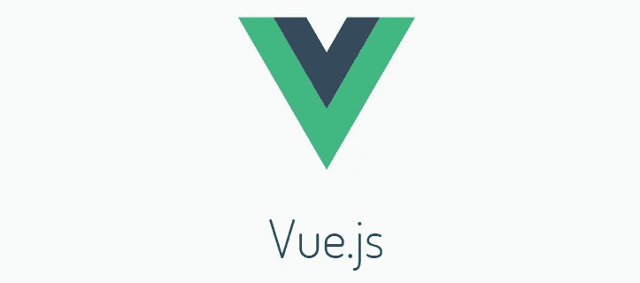
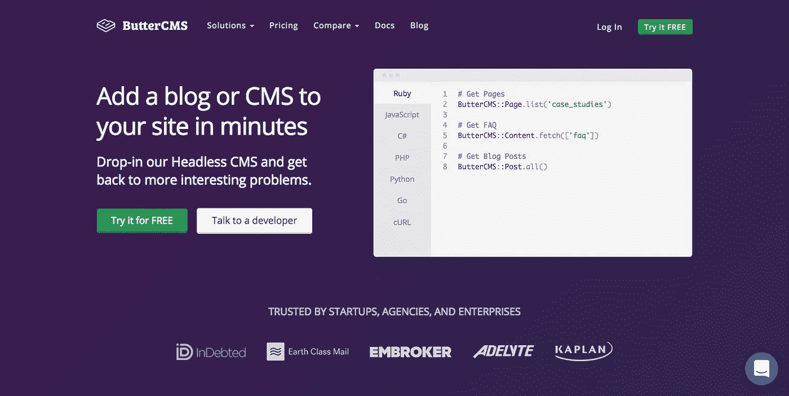
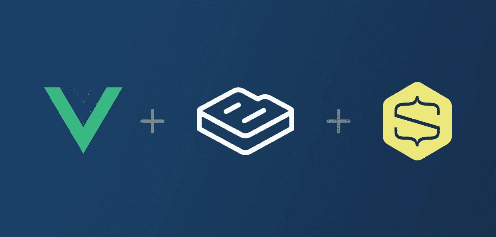
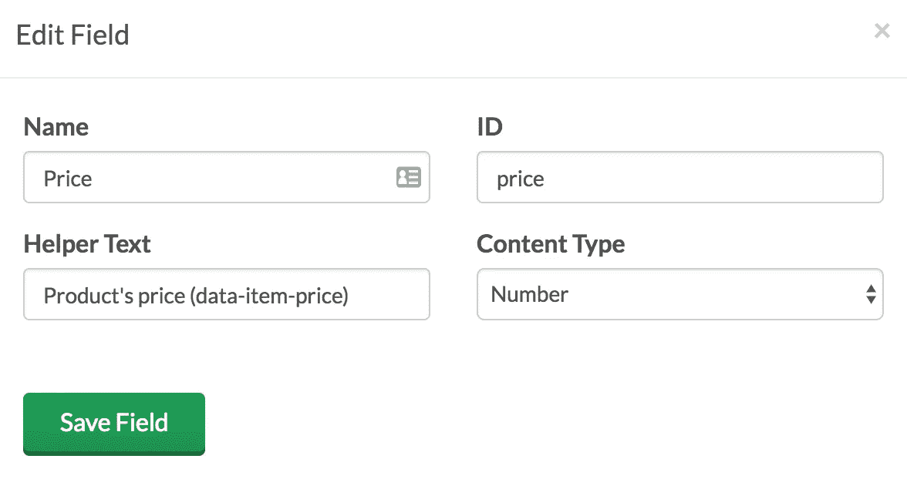
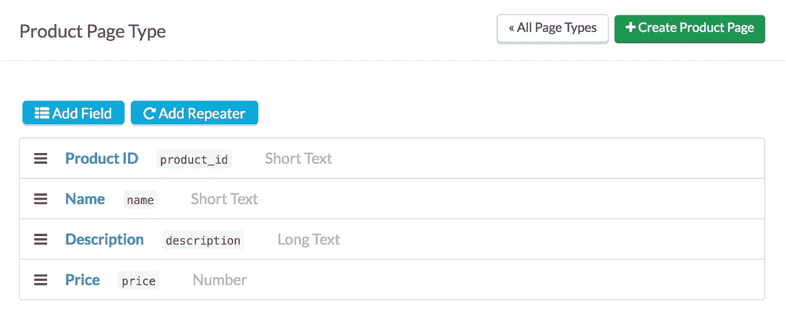
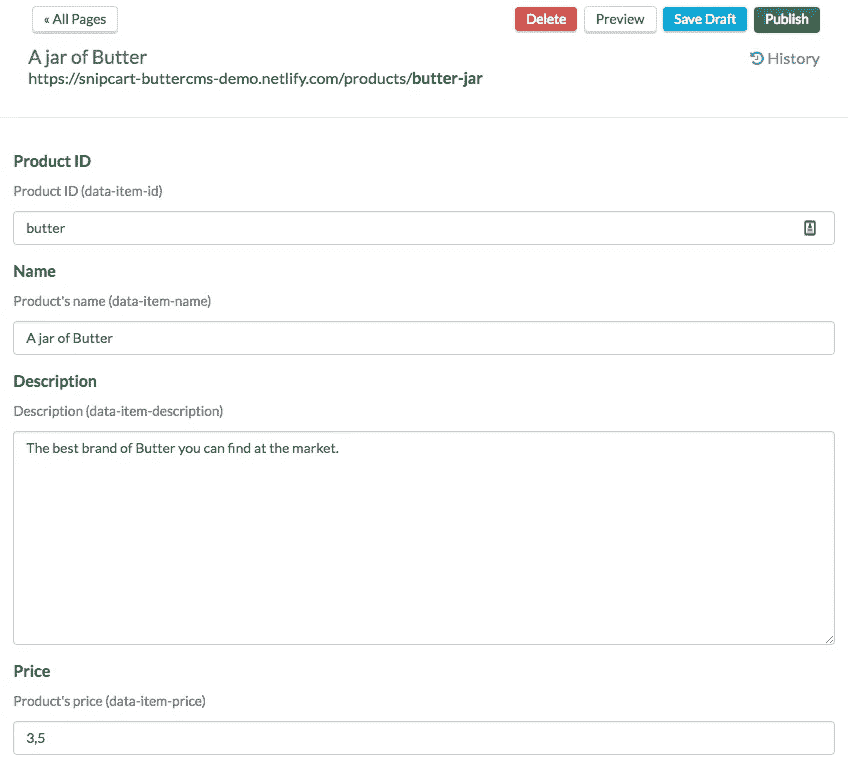
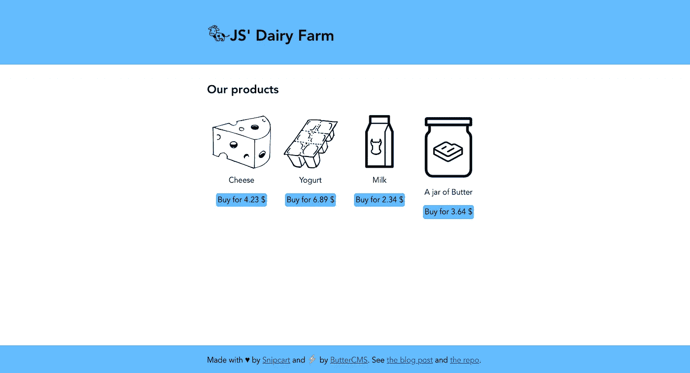

# 在 Headless ButterCMS 上构建 Vue.js 电子商务[演示]

> 原文：<https://medium.com/hackernoon/build-vue-js-e-commerce-on-top-of-headless-buttercms-demo-131cc9895350>

Photo by [Álvaro Serrano](https://unsplash.com/photos/-kr8XPYuSI8?utm_source=unsplash&utm_medium=referral&utm_content=creditCopyText) on [Unsplash](https://unsplash.com/search/photos/storefront?utm_source=unsplash&utm_medium=referral&utm_content=creditCopyText)

“我是开发者，不是神 d*mn 点击机。”

那是我的开发朋友尼克。我们说的是电子商务。

几品脱酒下肚，他就开始咆哮:

“你知道我不喜欢什么吗？这里:

1.  在封闭的生态系统中编码
2.  每个人和他们的狗的刚性一体化平台
3.  不选择我的技术堆栈

如果你这么想要 Shopify 网站，你可以自己做，你不需要我(dev)。"

我爱尼克。

他是对的:现在有太多很酷的[框架](https://snipcart.com/blog/reactjs-wordpress-rest-api-example) / [工具](https://snipcart.com/blog/static-forms-serverless-gatsby-netlify)。为什么不用这些来创造一个定制的、刺激的购物体验呢？

今天我想用 Vue.js 向你展示这是可能的。因为耶，Vue.js 电商*是*一个东西！

如果在后端设置得当，也就是说，无头内容管理会非常酷。

废话少说，下面是这个 Vue 电子商务示例将包括的内容:

*   如何创建一个整洁的前端 Vue 店面
*   如何在 Vue 应用中集成可定制的 HTML/JS 购物车
*   如何将 Vue e-comm. app 与 headless ButterCMS 挂钩

现在让我们让我的朋友尼克感到骄傲，好吗？

# 一、为什么要做电商的 Vue？

所以，如果你还没听说过: **Vue 是一个用于构建 web UIs 的渐进式轻量级 JS 框架**。

它是开源的、社区支持的、反应式的、基于组件的。它还是相当“增量的”——可以在任何现有的项目中删除——并且在逻辑关注分离方面创造了奇迹。

那么为什么要用 Vue 做电商呢，嗯？

1.  它构成了一个模块化的、易于携带的商店前端——可以与任何后端兼容。
2.  它速度快，性能高—速度是电子商务的关键。
3.  只是……*开发入门很容易*！

在这篇快速教程中，我将通过使用 Snipcart 来抽象一些 cart & e-comm .逻辑。但是你完全可以构建自己的 Vue.js 购物车&例如，把它挂在 Stripe 上。

哦，Vue 电子商务的另一个引人注目的用例:[渐进式网络应用](https://developers.google.com/web/progressive-web-apps/) (PWAs)。如果您的购物环境需要优雅的降级和/或离线功能，那么用 Vue 构建一个 e-comm. PWA 将变得非常方便。关于这一点，你可能想看看 [Vue 店面](https://www.vuestorefront.io/)。

*旁注:我们很可能会在下一篇博文中探讨 pwa。:)*

# 而为什么要用黄油这样的无头 CMS 来发力电商？

[**ButterCMS**](https://buttercms.com/) **是无头 CMS。**

或者 API 优先 CMS，或者内容 API，或者下一个营销人员决定称之为什么。:)

你会问，为什么要用无头 CMS 作为电子商务后端？

嗯，首先，也许你只是厌倦了使用 Magento 或 Prestashop 这样的庞然大物。

或者，您可能希望您的在线商店受益于无头 CMS 的优点:

*   可移植、易于迁移的内容模型和存储数据
*   托管—没有繁重、重复的升级和修补作业(带黄油)
*   多平台内容交付(移动、桌面应用、物联网、网络)

我不想太深入无头电子商务的来龙去脉，因为我们有一个关于这个主题的完整帖子。

然而，我想强调一下 ButterCMS 带来的一些好东西:

1.它有直观的、完整记录的内容建模。
2。它的入职过程顺利而有效。
3。它有深入的、[特定于堆栈的集成方案](https://buttercms.com/docs/)。

后者给了我这个 Vue tuts 一个巨大的开端！

# 教程:Vue.js 用 Butter CMS & Snipcart 做电商

**先决条件**

*   Vue.js 的基础知识
*   [Snipcart 账户](https://app.snipcart.com/register)(测试模式下永远免费)
*   [ButterCMS 账户](https://buttercms.com/#signup)

# 1.为无头产品管理配置 ButterCMS

ButterCMS 允许轻松创建带有任何必填字段的页面类型。这一切都可以在没有来自 CMS 的任何代码或模式定义的情况下完成。

首先创建一个*产品*页面类型，其中包含 [Snipcart 的产品定义](https://docs.snipcart.com/configuration/product-definition)的每个必需属性的字段(数据项 id、数据项名称、数据项价格)。我没有定义用于价格验证的产品 URL:它稍后将由代码生成。

您可以看到，我还添加了一个描述字段。它会映射到 Snipcart 的`data-item-description`。如果你愿意，你可以添加更多的字段！

现在，您应该能够创建产品类型的内容页面了:

# 2.构建 Vue.js 店面

按照 ButterCMS 的 Vue 指南，我使用了`vue-cli`来生成我的电子商务演示。但是你可以很容易地在现有的项目中加入黄油。

现在，创建一个简单的`src/buttercms.js`文件。然后用您的 [Butter 公共 API 键](https://buttercms.com/docs/api/)初始化 Butter 的库，将该文件导入到您的 Vue.js 组件中:

将以下路径用于您的 Vue 应用程序:产品列表、产品详细信息页面和`NotFound`组件(稍后将被重用)。

有趣的部分来了。

要显示 Butter 的 API 中的产品，只需从`ProductList`组件的`created`钩子中调用`butter.page.list('product')`。然后，Vue 的反应将发挥它的魔力！

好吧，那很简单。显示单个产品的页面怎么样？只需使用您路线中的`slug`参数！

你可以在上面看到，我已经使用了`Promise`的错误处理程序来设置一个`notFound`标志。在组件的模板中，这允许您显示产品的详细信息或[未找到的页面](https://snipcart-buttercms-demo.netlify.com/products/steak)而无需更改 URL:

现在为了集成 Snipcart，创建一个简单的`BuyButton`组件:

因为这个电子商务演示是一个单页面应用程序，所以我添加了一个 [Netlify 函数](https://www.netlify.com/docs/functions/)来使 [Snipcart 产品验证](https://docs.snipcart.com/getting-started/security)工作。

你可以使用 [Webtask](https://snipcart.com/blog/webtask-baas-serverless-tutorial) 或任何无服务器技术。该函数使用 Node.js 中的 Butter API 来检索产品，并输出产品以供 [Snipcart 的 JSON 爬虫](https://docs.snipcart.com/configuration/json-crawler)解析。

现在你有了:**一个由 ButterCMS 支持的 Vue.js 电子商务网站。**

不过，你可以更进一步。Butter 提供了可用于自动化任务的 webhooks。

您可以使用它们来通知 Snipcart 产品上的 CMS 更新，这样您的 e-comm. dashboard 就会自动反映这些变化。很简单，真的:

1.  确认您正在接听与产品相关的电话
2.  调用 [Snipcart 的 API](https://docs.snipcart.com/api-reference/introduction) 来强制获取产品的定义

这里:

瞧。

一旦您在 CMS 中添加或编辑了一个产品，它的详细信息就会出现在 Snipcart 的仪表板中。

例如，您可以使用它在仪表板中设置库存管理的可用库存。

现在来看看那个 ButterCMS + Vue.js 电商演示吧！

# 现场演示和 GitHub 回购

> *看现场演示* [*看这里*](https://snipcart-buttercms-demo.netlify.com/)
> 
> *参见 GitHub 回购* [*此处*](https://github.com/snipcart/snipcart-buttercms-demo)

# 结束语

我最多花了两天时间把这一切打包好，让它看起来像样点。

当然，我喜欢和 Vue 一起做这个电子商务演示。

而使用 ButterCMS 就像它的名字所暗示的那样顺利。

建设性反馈:我希望得到一个 edition API——例如，它可以允许我在 CMS 中同步脱销产品的标志。

好了，就是这样，伙计们！

希望这篇文章能把你推向杀手级的定制电子商务。:)

*如果你喜欢这个帖子，请花一秒钟鼓掌&* [*在 Twitter 上分享一下*](https://twitter.com/home?status=Build%20Vue.js%20%23Ecommerce%20on%20Top%20of%20Headless%20%40ButterCMS%20%5BLive%20Demo%5D%20https%3A//buff.ly/2jrw546%20%23vuejs%20%23JAMstack) *。有意见或问题吗？点击下面的部分！*

我最初在 [*Snipcart 博客*](https://snipcart.com/blog/vuejs-ecommerce-headless-buttercms) *上发表了这篇文章，并在* [*我们的时事通讯*](http://snipcart.us5.list-manage2.com/subscribe?u=c019ca88eb8179b7ffc41b12c&id=3e16e05ea2) *上分享了它。*