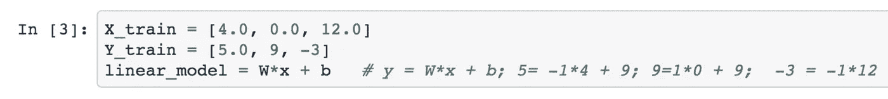

# 在 5 分钟内构建您的第一个机器学习& Tensorflow 模型！

> 原文：<https://medium.com/hackernoon/build-your-first-tensorflow-model-in-5-minutes-77237e3cf76d>

所以你听说了 [Tensorflow](https://www.tensorflow.org/) ，机器学习&深度学习这么多，你想入党:)

在这篇文章中，我们将建立一个模型来计算:

Y = W*x + b

因此，当向模型提供 **x** 时，它应该预测最佳可能的 **Y** 。

我们将训练模型，根据我们训练它的内容，尽可能给出最好的 **W** 和 **b** 。

例如，如果我们想让我们的模型知道 **W** 应该是-1 而 **b** 9，意思是 Y =-1 * x+9；我们应该像这样在许多训练对上训练它:

(x = input，Y = desired_output) = (x，Y) = (5，4)；

Y = -1*5 + 9 => Y = 4(当输入为 5 时，预测 Y 为 4)

(x，Y) = (3，6)；Y = -1*3 +9 => Y = 6(当输入 x 为 3 时，预测 Y 为 6)

这里的想法是，我们希望模型知道 W 应该是-1 和 9，并且它将通过经验来学习它-我们给它提供的训练对(x，Y)越多，它将越好地学习正确预测。

**那么我们言归正传吧！**

首先，我们应该从设置环境开始。

让我们首先创建一个目录，运行:

`mkdir tf_linear_regression`

现在(推荐)让我们在虚拟环境中运行所有程序，遵循以下步骤(它适用于 Mac，如果您有 Linux 或 Windows，请尝试使用 [Anaconda](https://www.anaconda.com/) )

安装 Python3

```
brew install python3
```

(如果你没有 Brew——只需从[这里](https://brew.sh/)安装即可)

现在安装虚拟环境

[链接至完整解释](https://stackoverflow.com/a/54183964/1340604)

```
pip3 install virtualenv
```

创造环境

`cd tf_linear_regression`

```
virtualenv -p python3 <path-to-our-dir>
```

现在激活它:

```
source <path-to-our-dir>/bin/activateget out of the virtual env run:
```

要退出虚拟环境，请运行:

复员

## 现在是有趣的事情

安装 Tensorflow

```
pip3 install tensorflow
```

现在(只是为了好玩)安装 Jyputer notebook(不用，可以复制下面的代码粘贴到一个 [python](https://hackernoon.com/tagged/python) 文件中，作为 python 脚本运行

```
pip3 install jupyter
```

[(链接此处)](https://jupyter.readthedocs.io/en/latest/install.html)

现在让我们试着做一些简单的事情&看看这个等式:

```
y = W*x + B
```

假设我们有成对的输入，它们的标签=> (X，Y) = [(x1，y1)，(x2，y2)，(x3，y3)，..，(xn，yn)]；

也就是说，对于每个输入 x，我们都有输出 y。这是一个受监督的[机器学习](https://hackernoon.com/tagged/machine-learning) (ML)，其中对于每个输入，我们都知道期望的输出。

现在我们要训练上式中的 W 和 B。假设我们有(X，Y) = [ (5，4)，(3，6)，(-1，10)…]

如果我们要猜 W 和 B 会是什么…(记住):

y = W*x + B

4 = []*5 +[];6 = []*3 + [];10 = []*(-1) + [].你可以看到 W = -1 和

B = 9 非常适合我们…

现在，让我们在 Tensorflow (TF)中构建一个模型，我们将对其进行训练，以找到 W 和 b 的值。每个步骤中的训练过程如下:

步骤 1:对于输入 5，结果是 4，对于输入 3，结果是 6，依此类推。

你可以看到这和我们在教机器识别图片中的猫是一样的道理:1。“这张输入图片是一只猫”；2.“这张输入图片是一只猫”；3.“这个输入图片不是猫”等。

让我们从**开始吧！**

导入 TF 和 Numpy:


声明 x，y，w，b；变量用作可训练变量，占位符用于给定的训练集输入:


声明 X 和 Y 模型输入的训练集，并声明线性方程:



现在我们设置误差函数(model_delta)，损失函数&优化器+初始化我们上面声明的变量:


这有点违背直觉，但在 TF 中，与 Python 中的程序相反，到目前为止没有任何东西在运行，现在我们应该声明一个会话，然后开始训练过程:


你可以试试迭代的次数，你可以看到 100 次我们甚至都不接近，但是 1000 次就好多了，10000 次我们就快到了:

*   0.9999 ~ -1
*   8.9998 ~ 9

关于 Jupyter 笔记本中的代码，请访问此处:
[https://github . com/Kohn 1001/tesorflow-playground/blob/master/linear _ regression/linear _ regression _ tensor flow _ basic . ipynb](https://github.com/kohn1001/tesorflow-playground/blob/master/linear_regression/linear_regression_tensorflow_basic.ipynb)