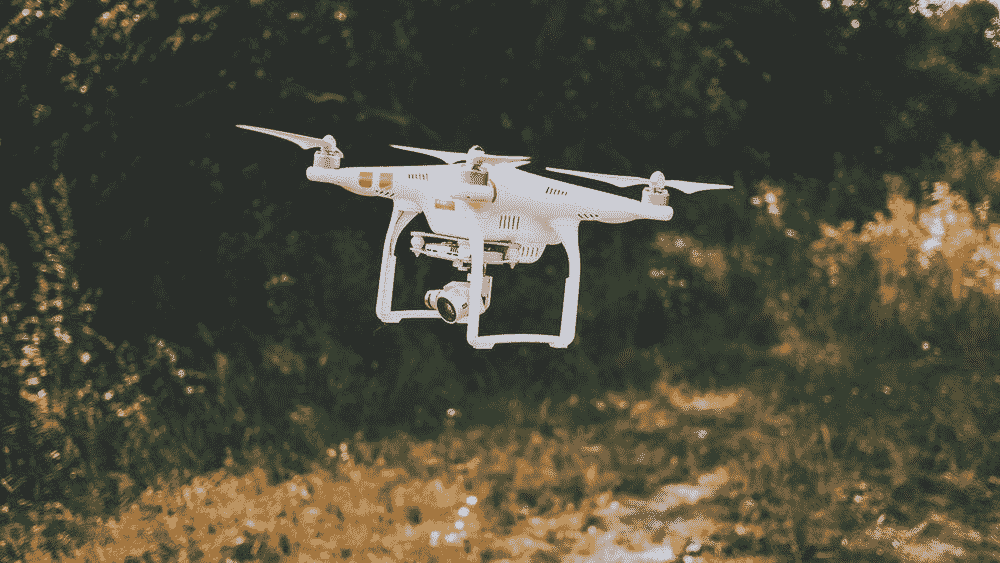
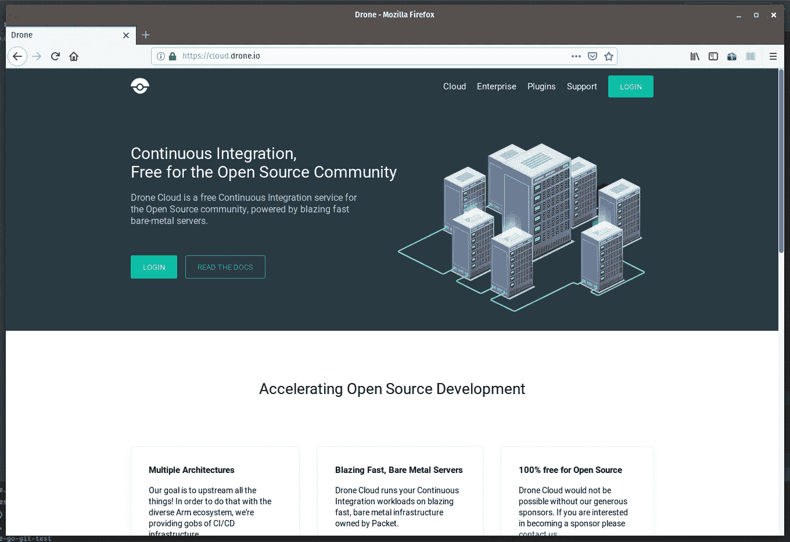
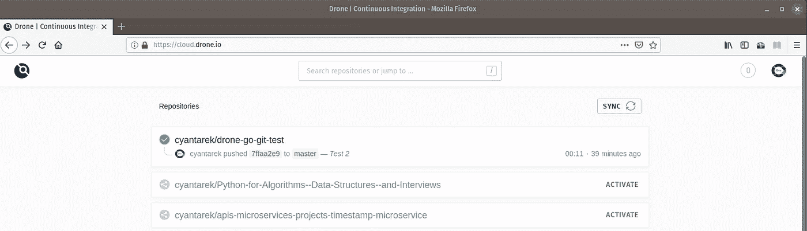
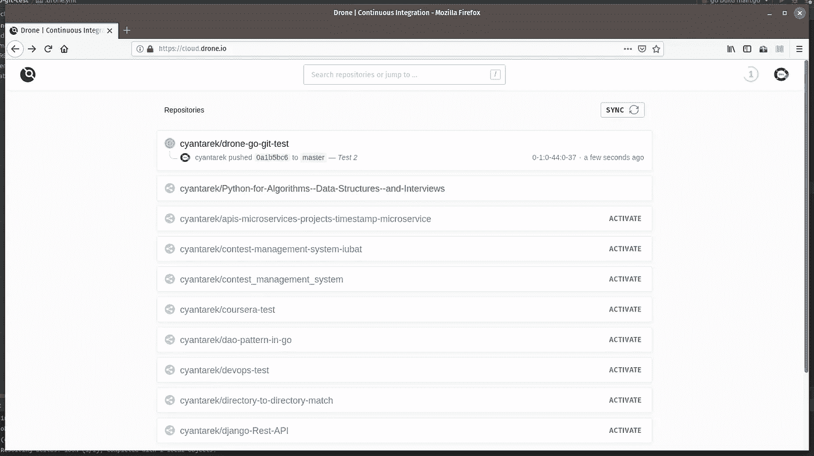
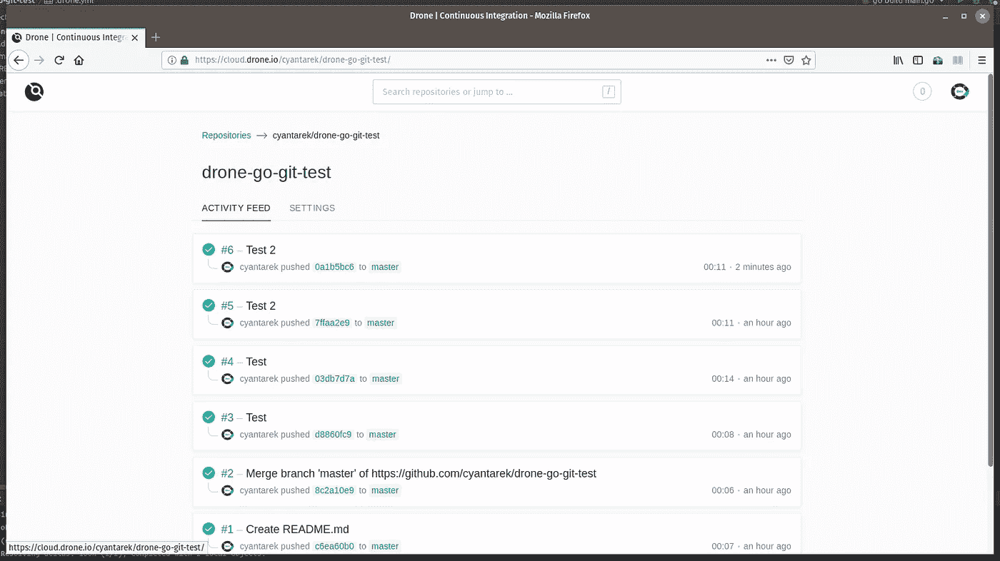
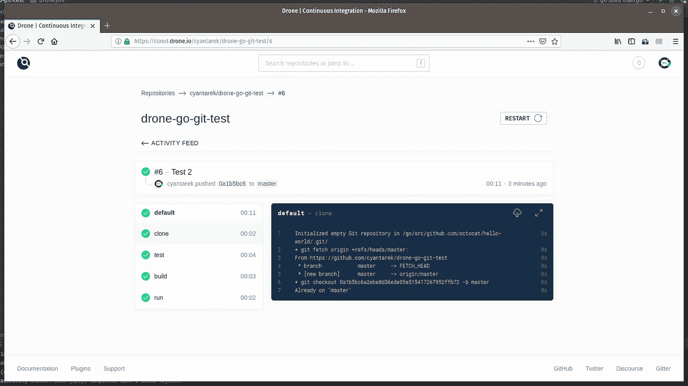

# 使用无人机构建您自己的 CI/CD 管道

> 原文：<https://medium.com/hackernoon/build-your-own-ci-cd-pipeline-with-drone-e43d7190989b>



Photo credit unsplash.com

> **TL；博士**
> 
> 这主要是一篇烹饪书风格的文章。如果你期望更多的理论指导，我建议你看看[官方无人机文档](https://docs.drone.io)和[持续集成](https://www.amazon.com/Continuous-Integration-Improving-Software-Reducing/dp/0321336380)和[持续交付](https://www.amazon.com/Continuous-Delivery-Deployment-Automation-Addison-Wesley/dp/0321601912)的书

# 背景故事

在我目前的公司，我负责后端工程以及 DevOps 方面。您可能知道，建立自动化 CI/CD 管道是 DevOps 工程师的主要职责。我没什么不同。

从历史上看，我们主要是一家 Jenkins CI 驱动的公司，就像大多数其他创业公司一样。但是，我们是高度的云爱好者和考虑到可扩展性的分布式开发公司。你知道，使用 jenkins 的分布式 CI/CD 管道不是不可能的，但是当你达到某个级别时就很难了，因为 Jenkins 几乎是一个古老的(和先驱的)CI/CD 工具。遗憾的是，我们已经提前达到了这个水平。所以我们决定尝试其他方法。符合我们的范式并坚持我们的工程哲学的东西。

在开发方面，我们主要是一家基于 Golang 的公司，这证明了我们非常热爱 Go。我们尽可能多地使用基于 Go 的开源工具来满足我们的大部分开发需求(它们工作得很好)。所以我们尝试了几个用 Go 构建的 CI/CD 工具。我们尝试了 [**汇合**](https://concourse-ci.org/) ，但似乎太陡了，无法乘坐。经过一番含糊不清的混乱之后，我们终于找到了用 Go 编写的开源 CI/CD 工具 Drone's footprint。在撰写本文时，无人机相当流行。

# 为什么是无人机？

或者我可以问，为什么不是无人机？这是一款纯分布式、云原生、DevOps 友好、面向团队且高度可扩展的开源 CI/CD 工具。Phewww，满嘴描述吧？如果你想了解更多关于无人机的知识，不要害羞，直接去[官方网站](https://drone.io)吧。

我相当兴奋，所以让我们深入兔子洞。

# 设置无人机服务器

无人机多为量产级 CI/CD 服务器。不像 Jenkins，如果你没有一个公共的 IP，它不会在你的本地机器上工作。无人机在云虚拟机中工作得最好，如 AWS、DigitalOcean、GCP 等提供商的虚拟机实例。

另一个选择是使用 Drone 的免费云 SaaS，这是一个非常棒的免费工具(我们将在本文中使用)。这样，当您急于测试服务器时，就不必浪费时间来设置它。一切都在那里等着你。

在我未来的文章中，我将向您展示如何在您自己的私有(但面向公众)云机器中为您的项目设置无人机服务器，而不是依赖无人机云。

印象深刻？说够了。

现在进入 [https://cloud.drone.io](https://cloud.drone.io) ，用你的 github 账号登录。



它将要求 Github 访问，因为 Drone 使用 Github 的 webhook 功能。登录后，它将同步您的存储库。

现在是开发设置的时候了。对于这个项目，我准备了一个例子 [**git 回购**](https://github.com/cyantarek/drone-go-git-test) 。将其分支并克隆到您的本地机器中。应该没问题。这是一个基于 Go 的项目，但是你不需要安装 Go，因为我们不会在我们的机器上运行这个项目。

在我们完成开发之后，是时候将无人机集成到我们的开发工作流程中了。

# 无人机集成

Drone 使用 YML 描述文件来定义它的整个管道。基本上，您编写要在您的管道中执行的步骤(比如从 git 获取、构建、测试、部署、运行等)。Drone 会读取这个文件，了解你希望它执行什么。

这是我们的 **.drone.yml** 文件

```
**kind**: pipeline
**name**: default**workspace**:
  **base**: /go
  **path**: src/github.com/yourname/go-drone-hello-world**steps**:
  - **name**: test
    **image**: golang
    **commands**:
      - go get
      - go test - **name**: build
    **image**: golang
    **commands**:
      - go get
      - go build -o output
      - chmod +x output - **name**: run
    **image**: golang
    **commands**:
      - go get
      - go build -o output
      - chmod +x output
      - ./output
```

很简单，对吧？让我描述一下其中的一些片段

我们用几个步骤定义了一个管道。为了本教程，我将测试、构建、运行分成了不同的步骤。如果你读了 YML 文件，你可以很容易地理解它所说的。它将在 Docker 容器中获取、构建和测试我们的 Github repo(无人机完全基于容器，这太棒了)。在这种情况下，我们使用“golang”官方 docker 图像来建造集装箱。您可能会猜测，您可以为不同的语言项目使用您想要的语言运行时映像。

这是整合部分。因为我们将 Guithub 与 Drone 一起使用，所以在您提交对源代码(当然在 git repo 中)的任何更改并将其推送到远程后，它将自动开始执行它的工作(如 YML 文件中所述)。Github 将发射 webhook 信号，然后无人机将捕捉它并完成它的工作。

说够了，让我们试试。哦，顺便说一下，你应该在无人机云 UI 中为你想要的 git repo 点击“激活”按钮。这将激活无人机的回购工作。



选择“激活”后，它会给你一大堆定制选项，如 YML 文件名，公共/私人项目，crone 作业，CI/CD 构建标记 README.md 文件等。酷！

激活 repo 后，提交代码并将其推送到远程源。留意 [https://cloud.drone.io](https://cloud.drone.io) 主界面/仪表盘。你会看到无人机在你按下后的几分之一秒内捡起你的回购，然后它开始工作。



你会看到一个黄色时钟动画徽章，显示无人机正在做它的工作。点击回购看看里面发生了什么。



正如你所看到的，这里列出了一堆我之前试验过的版本。您将看到您的提交消息作为每个构建阶段的标题，所以明智地选择您的提交消息。

单击最新版本。



它显示了您在 YAML 文件中定义的所有步骤。它还会显示成功或失败步骤的彩色徽章。我们所有的步骤都已经通过了。厉害！

如果你点击每个任务，你会看到无人机当时做了什么。很酷的 UI，不是吗？

本文到此为止。你刚刚触及了无人机和整个 CI/CD 概念的表面。从这里可以学到很多东西。请随意探索 Drone 的文档、CI/CD 书籍，并设置您自己的复杂项目管道，并感到高兴。

谢了。