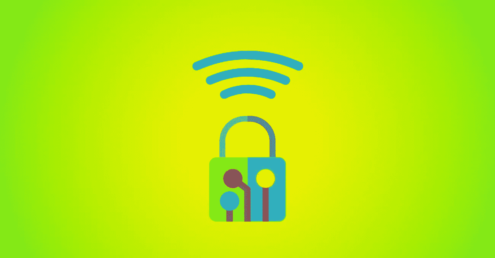
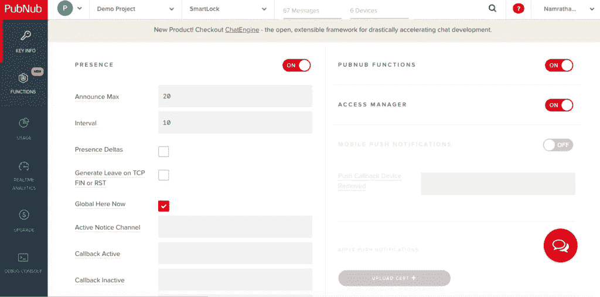
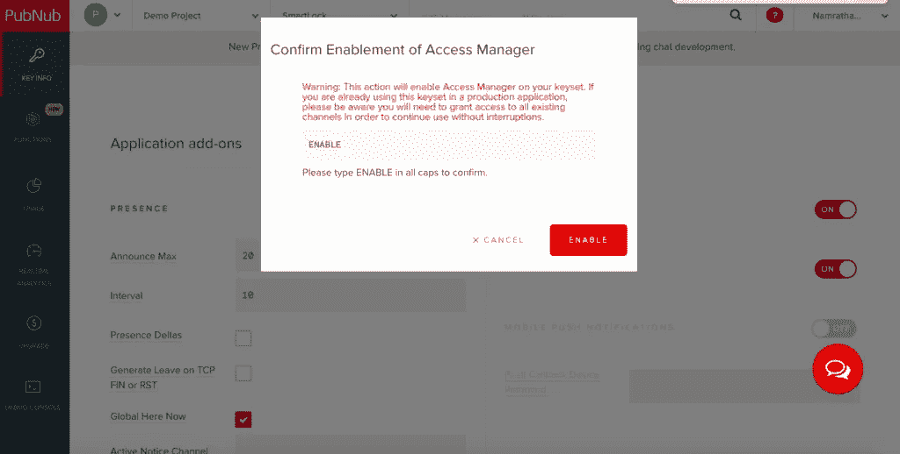
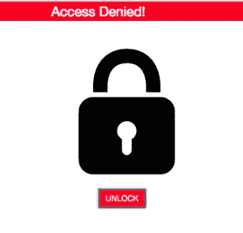

# 构建您自己的物联网智能锁，提供安全的访问管理

> 原文：<https://medium.com/hackernoon/build-your-own-iot-smart-lock-with-secure-access-management-955b31dbf97e>



自从人类试图锁好东西并保护他们的财产安全以来，窃贼(这里指的是黑客)就一直试图撬开这些锁。如果我们说你可以建立自己的智能锁，只允许**你**能够打开它，听起来如何？

今天的用户期望实时交互。PubNub 让您可以轻松地将实时功能添加到您的应用程序中，而无需担心基础架构。您可以构建应用程序，让您的用户能够在移动设备、浏览器、桌面和服务器上进行实时互动。PubNub 为[物联网和智能设备](https://www.pubnub.com/solutions/iot/?utm_source=Syndication&utm_medium=Medium&utm_campaign=SYN-CY18-Q2-Medium-June-21)提供实时通信，并为任何规模的物联网部署提供通信基础设施和 API。而 [PubNub 访问管理](https://www.pubnub.com/products/security-overview/?utm_source=Syndication&utm_medium=Medium&utm_campaign=SYN-CY18-Q2-Medium-June-21)让这一切变得安全。

此处提供了该项目的完整 GitHub 回购。 下面是它的演示:

# 什么是 PubNub 访问管理器(PAM)？

PubNub 访问管理器通过提供基于令牌的授权扩展了 PubNub 的安全框架，允许在用户、设备和通道级别进行读写访问控制。PubNub Access Manager 在物联网/家庭自动化设备管理系统中发挥着重要作用，在该系统中，安全数据在注册设备和物联网设备(如灯泡、传感器或锁)之间双向流动。

# 设置 PAM

要访问 PubNub Access Manager，您需要在 PubNub [管理仪表板](https://admin.pubnub.com/?utm_source=Syndication&utm_medium=Medium&utm_campaign=SYN-CY18-Q2-Medium-June-21)中启用 Access Manager(如果您还没有，请先注册)。



*将访问管理器设置为开*



*键入 ENABLE 并点击“保存更改”*

现在，您已经做好了向用户、组和通道授予访问权限的准备，这些用户、组和通道可以访问可以发送或接收的数据。

PAM 完全按照授权许可方案运行，有 3 个访问级别:

*   所有用户可以通过所有渠道访问
*   所有用户通过特定频道进行访问
*   特定用户通过特定频道的访问

# 树莓派

这里的想法是使用 Raspberry Pi 为一个简单的锁机制提供动力。你可以看看我们的 PubNub 博客，关于[如何与 Raspberry Pi](https://www.pubnub.com/blog/2015-05-27-internet-of-things-101-getting-started-w-raspberry-pi/?utm_source=Syndication&utm_medium=Medium&utm_campaign=SYN-CY18-Q2-Medium-June-21) 和[如何开始使用 Raspberry Pi 2 和 Python。](https://www.pubnub.com/blog/2015-07-22-getting-started-with-raspberry-pi-2-and-pubnub-in-python-programming-language/?utm_source=Syndication&utm_medium=Medium&utm_campaign=SYN-CY18-Q2-Medium-June-21)

设置 Raspberry Pi 后，安装 Python 并使用以下命令将 PubNub 导入到您的设置中:

```
pip install Pubnub
```

# 授予访问权限

为了正确执行 PAM 操作，您必须提供管理权限。为了执行管理功能，您需要将`secret_key`与`publish_key`和`subscribe_key`包括在内。

您的密钥将包含您的认证密钥`authKey`。这个`authKey`应该是你的设备独有的。在运行期间的任何时候，您都可以使用`setAuthKey()`功能设置`authKey`。

如前所述，在 PAM 中有 3 个访问级别。像许多其他“物联网”设备一样，智能锁容易受到互联网黑客的攻击。因此，使用 PubNub 访问管理器可以为您的智能锁提供的最高安全级别是通道+ authKey 级别访问。

此示例授予 auth_key 在 Raspberry 频道中为“Valid_key”的用户 5 分钟的访问权限。如果用户没有访问权限并试图发布，他们会收到 403 错误。

然而，如果您有权发布，您可以看到您的 [JavaScript](https://hackernoon.com/tagged/javascript) 授权代码的以下响应:

```
{ error: false, operation: 'PNAccessManagerGrant', statusCode: 200 }
```

# 解锁操作

向特定频道的用户授予权限后，您可以尝试将消息发布到设备上。如果用户被授权发布锁，您应该能够解锁设备。

如果您不是有效用户，或者如果您没有被授予访问权限并试图解除锁定，则在使用 JavaScript 时会出现以下错误:

```
{error: true, operation: "PNPublishOperation", statusCode: 403, errorData: Error: Forbidden at Request.<anonymous> (https://cdn.pubnub.com/sdk/javascript/pubnub.4.20.1.js:…, category: "PNAccessDeniedCategory"}
```



# 包扎

使用 Python 在您的 Raspberry Pi 上设置 [PubNub](https://hackernoon.com/tagged/pubnub) 既简单又直接。您可以使用 PubNub Access Manager 提供用户级的读或写访问权限，使您的锁高度安全。PubNub authKey 确保只有您有权解锁物联网，使其更加安全可靠。

在我们的下一部分，[我们添加了 OAuth 2.0，使我们的应用更加安全](https://www.pubnub.com/blog/implementing-google-oauth-2-and-pubnub-access-manager-with-smart-lock/?utm_source=Syndication&utm_medium=Medium&utm_campaign=SYN-CY18-Q2-Medium-June-21)！

*最初发表于*[T5【www.pubnub.com】](https://www.pubnub.com/blog/iot-smart-lock-with-secure-access-management-raspberry-pi/?utm_source=Syndication&utm_medium=Medium&utm_campaign=SYN-CY18-Q2-Medium-June-21)*。*

[https://upscri.be/hackernoon/](https://upscri.be/hackernoon/)