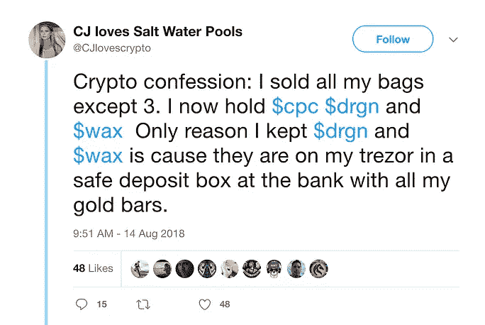

# 建筑商将要建造。

> 原文：<https://medium.com/hackernoon/builders-gonna-build-508dec106422>

The real builders are not gonna stop building. Photo by [Jacek Dylag](https://unsplash.com/photos/nhCPOp4A2Xo?utm_source=unsplash&utm_medium=referral&utm_content=creditCopyText) on [Unsplash](https://unsplash.com/search/photos/scaffolding?utm_source=unsplash&utm_medium=referral&utm_content=creditCopyText).

今年夏天的每一天，我醒来时都收到朋友发来的消息，说加密市场正在消亡。人们很恐慌。甚至那些我认为是 crypto 的忠实信徒也在怀疑自己。

他们现在正在抛售一些项目的代币(低于 ICO 的价格，而且亏损严重)，就在几个月前，他们还鼓励我关注这些项目。朋友们保证它会增长 10-30 倍，因为它会改变世界，团队都是明星，顶级基金投资，项目有很大的宣传。

*嗯，发生了什么事？团队停止编码了吗？我们是否在* [*【区块链】*](https://hackernoon.com/tagged/blockchain) [*技术*](https://hackernoon.com/tagged/technology) *上停止了进步？不。价格暴跌。就是这样。*

I only speak in ETH, but the hype in 2018 was real. Major confidence has been lost.

# 投降是真实的

今年夏天，我认识的许多人都很快退出了市场。从一月到三月，他们的牌都很强。事实证明，这是一个正确的选择，在 4 月/5 月份，整个市场开始下跌。看来他们不是唯一投降的人。

软弱的手正在被抖出来。没关系。我猜他们没喝够可乐。这些都不是加密的真正信徒。否则，他们不会停止支持他们原本认为会对这个世界产生影响的项目。

# 建造一些有持久价值的东西

毫无疑问，你会听到许多你信任的人谈论加密泡沫是如何破裂的。你甚至可以看到成百上千的人涌向一个项目的电报，询问为什么他们的代币价格在下降。我希望你能在内心找到忽略它的方法。

这个夏天是我在 crypto 度过的最开心的一个夏天。下楼去。你会发现谁是你真正的支持者。联系并帮助其他努力发展这个生态系统的好人。

现在是成为建筑商的绝佳时机。市场已经过滤掉了所有的噪音。那些为真正的用户创造真正的技术，并创造具有持久价值的东西的公司将会留在这里。他们将看到区块链生态系统的发展——不管市场状况如何。

我们在某个特别的地方的底层。作为这项运动的一部分，磨砺和旅程使它变得如此有趣。这种时刻一生只有一次。

***建筑商打算建造。***

——谢尔曼·❤️

“First they ignore you, then they laugh at you, then they fight you, then you win.” —Mahatma Gandhi

**网站**:【www.ravenprotocol.com
推特:[twitter.com/raven_protocol](http://twitter.com/raven_protocol)
**电报**:[t.me/ravenprotocol](http://t.me/ravenprotocol)
**媒体**:[medium.com/ravenprotocol](http://medium.com/ravenprotocol)

## 如果你是一个真正的建筑者，你应该加入我们的[渡鸦](/ravenprotocol/hello-world-raven-protocol-f749bf5fc8cf)。

我们的任务是创建一个计算节点网络，利用闲置的计算能力进行人工智能训练。速度是加快培训时间的关键，它将比传统的云基础架构更具成本效益。

没有一个集中的组织应该垄断这种人工智能的力量，因为它可能对人类有潜在的危害。我们希望将这种权力交给社区。我们相信通过教育发展中国家掌握加密技术以及如何使用移动设备来赚取代币，财富会重新分配给发展中国家。

我们正在招聘，我们对真正相信 crypto 并希望看到这个生态系统成长的战略合作伙伴持开放态度。我们只与精英中的精英合作。门槛非常高，但如果你还在附近，并且不担心价格下跌，你已经通过了第一个障碍:)

来和我们在电报上交谈吧

 [## 加入 Telegram 上的 Raven 协议社区！

### 一个分散的分布式深度学习训练协议。提供具有成本效益和更快的深度培训…

t.me](http://t.me/ravenprotocol) 

或者你只是想通过电子邮件了解最新消息: