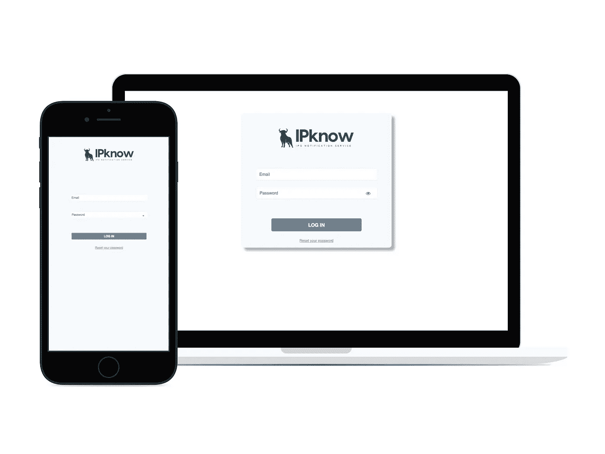

# 在 3 个月内构建 12 个功能

> 原文：<https://medium.com/hackernoon/building-12-features-in-3-months-d3e107f33a4c>

部分受 Pieter Levels 的 [**12 个月内 12 家创业公司**](https://levels.io/12-startups-12-months/) 的启发，我将在短短 3 个月内为[云活动](https://cloudcampaign.io)构建 12 个相当大的功能。

我知道你在说什么，“Pieter 渴望每月建立一个创业公司，为什么一个月 4 个功能很重要？”

我是 Cloud Campaign 的独立创始人，因此我负责营销、销售、支持、产品开发、客户成功等，所以平均每周我只有两天时间用于产品开发。

两天时间来设计、实现和测试一个全新的功能。

我每周的任务清单包括写至少 2 篇博文、发送 20 封冷冰冰的电子邮件、设计和构建 1 个新功能、重新设计 1 个 web 应用程序部分以改善用户体验，以及起草和发送每周简讯。

My Weekly Task Tracker

[点击此处](https://docs.google.com/spreadsheets/d/1Z-buKWlHPex5Q6sP8AY6dFUuN8OF1GKOTHkaEdL_IbA/edit?usp=sharing)查看我实际的每周任务清单，或复制它制作你自己的清单。

那么，为什么每周都有一个新功能呢？

核心产品已经构建好了，并且运行良好，但是我坚信**没有产品已经完成**。通过继续对产品进行迭代并添加额外的功能，我希望设计出一款既直观易用又极其强大的产品。

订阅并每周回来查看正在构建的内容。

**第 1 周:导出功能**

Cloud Campaign — Analytics Reports

能够将分析和即将发布的社交媒体帖子导出为 CSV 文件，以便在其他软件中操作或与客户共享。

[新闻稿](https://cloudcampaignhelp.zendesk.com/hc/en-us/articles/360001199132-Analytics-Reports)

**第 2 周:汽车进口商**

Cloud Campaign — Article Auto-Importer

记住在社交媒体上分享新的博客文章是一件非常痛苦的事情。这是重复且相对欠考虑的工作。

新的自动导入器将自动从任何 RSS 订阅源获取新文章，并填充您的内容库，因此您可以通过单击一次将文章共享到社交媒体，或者安排在未来某个日期发布。

[新闻稿](https://cloudcampaignhelp.zendesk.com/hc/en-us/articles/360001199152-Automatically-Share-Your-Blog-Posts-on-Social-Media)

**第 3 周:发布故障警报**

Cloud Campaign — Native Alerts

在极少数情况下，发布到社交媒体可能会失败(凭据更改、API 接收方关闭、服务器过载)。有了新的提醒和重试逻辑，您将在任何发布失败的时候收到提醒。只需点击提醒，重新尝试将内容发布到社交媒体。

[新闻稿](https://cloudcampaignhelp.zendesk.com/hc/en-us/articles/360001199272-Alerts-if-Posting-Fails)

**第四周(1/2):一次性排班**

Cloud Campaign — Ad Hoc Scheduling

利用我们新的一次性时间表，将社交媒体帖子与新闻稿或假期协调起来。只需选择发布内容的日期和时间。

与竞争对手不同，使用 Cloud Campaign，您可以根据自己的需要安排时间。20 年后想发表点什么？开始吧！

[新闻稿](https://cloudcampaignhelp.zendesk.com/hc/en-us/articles/360001217751-One-Time-Scheduling)

**第 4 周(2/2):自动生成字幕**

Cloud Campaign — Auto-generate Captions Using NLP

我们离完全自动化的社交媒体活动又近了一步。当使用自动导入器或推荐引擎时，Cloud Campaign 将阅读导入的文章，以全面了解主题，然后选择总结文章的相关句子，同时捕捉涵盖面过广的主题。这些句子会作为标题添加到内容中，这样你就可以简单地分享，甚至不用写副本。

该摘要由 Aylien 的自然语言处理技术提供支持。

[新闻稿](https://cloudcampaignhelp.zendesk.com/hc/en-us/articles/360001217771-Auto-Generated-Captions)

**第 5 周:Instagram 整合(1/2)**

Cloud Campaign — Instagram Support

最后，无提醒的 Instagram 日程安排。直接将图片从 Cloud Campaign 本地发布到 Instagram。在第 5 周，我构建了授权流和活动提要。我仍然需要完成出版和分析。

一旦最后两步完成，我们获准加入 Instagram 的合作伙伴计划，我将开始向私人测试开放。[给我发电子邮件](mailto:rborn@cloudcampaign.io?subject=Add%20me%20to%20the%20Instagram%20Beta,%20please)，成为第一批在 Instagram 上发布内容的人。

**第 6 周:Instagram 整合(2/2)**

我完成了 Instagram 集成，能够发布帖子和跟踪分析。我们正在等待脸书/Instagram 批准我们的应用程序，然后才能向公众开放。

通过注册 Beta access，成为第一批使用 Cloud Campaign 向 Instagram 发布帖子的人之一。

**第 7 周:所见即所得分析报告**

“所见即所得”分析报告。本质上是从历史分析仪表板中导出当前配置的分析数据的能力。

本周，我们还彻底修改了注册电子邮件活动。向构建更加面向企业的产品又迈进了一步。

**第 8 周:注释和报告共享**

Cloud Campaign Client Analytics Reports

作为一名营销人员，当你能迅速向客户传达你所提供的价值时，你的工作会变得容易得多。

通过[云活动](https://cloudcampaign.io)的报告共享，您现在可以向您的客户发送一个公开的分析链接。选择您想要共享的帐户和适用的日期范围，以强调某些关键指标。

此外，您现在可以添加注释来清楚地显示您做了什么导致了更改。例如，“开始秋季时尚活动”或者“增加 10%的广告支出”。

[新闻稿](https://cloudcampaignhelp.zendesk.com/hc/en-us/articles/360001219431)

**第 9 周:自动发布**

讨厌每次发布一个新的 YouTube 视频、写一篇新的博客文章、在你的 Shopify 商店添加一个新的项目等都要登录每个社交网络吗？现在你不必了！

云活动的自动发布器将检测新内容，并自动将其分享给你的所有社交媒体帐户。

写了一篇新的博文？已经发布到脸书、LinkedIn 和 Twitter。向您的 Shopify 商店添加了一件新衬衫？嘭！已经收到了脸书的点击量

[新闻稿](https://cloudcampaignhelp.zendesk.com/hc/en-us/articles/360001406771)

**第 10 周:白色标签**

Cloud Campaign White-Label Login

有兴趣让您的客户访问您的云活动帐户或共享标有您的徽标和公司 URL 的分析吗？

现在您可以使用我们定制的白色标签。您可以上传定制品牌工作区、客户门户、品牌客户报告和定制 URL 的徽标。

[新闻稿](https://cloudcampaignhelp.zendesk.com/hc/en-us/articles/360002346951)

**第 11 周:类别**

Content Categories

Cloud Campaign 将您的内容永久存储在库中，以便于回收和协作。但是，这也意味着很难对你的内容进行分类和组织。

内容类别允许您标记内容项目，以便您可以按标记进行排序和安排。

[新闻稿](https://cloudcampaignhelp.zendesk.com/hc/en-us/articles/360002347091)

**第 12 周:内容创作者**

Cloud Campaign — Content Creators

虽然添加内容创建者的选项已经存在了一段时间，但内容创建者仪表板已经更新了。

您可以将客户、自由职业者、平面设计师等作为内容创建者添加到您的云活动帐户。这使他们能够上传和管理创意，而无需访问任何日程安排或分析。

第 13 周:网站分析

Cloud Campaign — Website Analytics

在大多数情况下，你在社交媒体上营销你的业务，以增加你网站的流量，所以只有完全整合你的分析才有意义。

您现在可以将您的 Google Analytics 帐户链接到 Cloud Campaign，以并排查看您的社交媒体和网站分析。我们还建立了一个专有的评分系统，对来自社交网站的流量和来自其他来源的流量进行评分。

[新闻稿](https://cloudcampaignhelp.zendesk.com/hc/en-us/articles/360002347871)