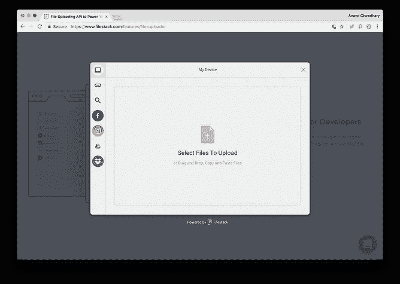
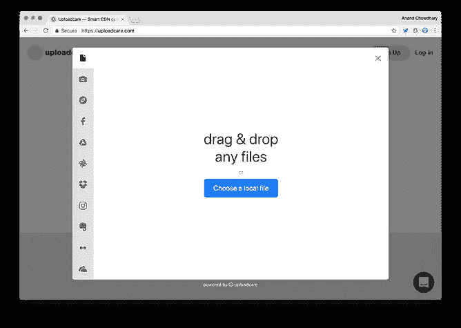
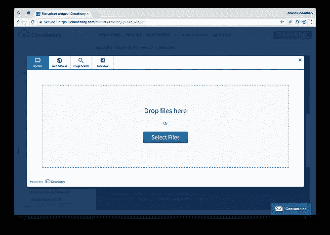

# 为 web 构建更好的文件上传程序

> 原文：<https://medium.com/hackernoon/building-a-better-file-uploader-for-the-web-2fe97bfbb2d5>


## 介绍 Uppload，一个 JavaScript 上传小部件

input 元素是在 1993 年 7 月的第一个 HTML+讨论文档中引入的，用于在 web 上的表单中输入数据。Dave Raggett 在 1997 年 1 月发布的标志性的 [HTML 3.2 参考规范](https://www.w3.org/TR/2018/SPSD-html32-20180315/#input)包含了来自施乐科学家 Larry Masinter 和 Ernesto Nebel 撰写的 1995 年备忘录 [RFC1867](https://www.ietf.org/rfc/rfc1867.txt) 的`<input type=file>`，其中描述了带有文件提交的 HTML 表单:

> 目前，HTML 表单允许表单的生产者向阅读表单的用户请求信息。这些表单已被证明在需要用户输入的各种应用程序中非常有用。然而，这种能力是有限的，因为 HTML 表单不提供要求用户提交数据文件的方法。需要从用户那里获取文件的服务提供商不得不实现定制的用户应用程序。

MIME 类型`multipart/form-data`和`accept`属性——我们今天仍在使用它们来上传文件——都在 20 多年前的同一篇论文中有所描述。原生文件上传非常优雅，非常容易使用。我们都习惯了下面的语法:

```
<form method="post" enctype="multipart/form-data">
    <input type="file" accept="image/png" name="myFile">
    <button type="submit">Upload</button>
</form>
<?php
    if (isset($_POST["myFile"]) {
        move_uploaded_file($_FILES["myFile"]["tmp_name"], "./file");
    }
?>
```

然而今天，我们有了带有`FileReader`、`FileList`、`Blob`等的[文件 API](https://developer.mozilla.org/en-US/docs/Web/API/File) ，这使得在客户端操作文件并将其上传到服务器变得非常容易。

并非每个浏览器都支持它们，但当你将它与新功能结合起来时，如让你在浏览器中拖放文件的`[DataTransfer](https://developer.mozilla.org/en-US/docs/Web/API/DataTransfer)`和让你访问用户的摄像头和麦克风的`[MediaStream](https://developer.mozilla.org/en-US/docs/Web/API/MediaStream)`，我们可以创造出非凡的用户体验。

问题是构建定制的文件上传组件既困难又耗时，尤其是当您考虑维护不支持这些新 API 的浏览器的兼容性时。

# 当前的景观



Left to right: The file uploading widget of Filestack, Uploadcare, and Cloudinary

有许多服务提供文件上传小工具，但他们都进入了文件存储和内容交付的业务。

例如，Uploadcare 可以让你免费上传高达 500 MB 的文件，他们的下一个计划是每月 25 美元的 7.5 GB 存储空间。相比之下，谷歌的 Firebase 免费提供 5GB 的存储空间，然后每 GB 0.026 美元，结果是便宜了 128 倍以上。亚马逊网络服务的 S3 存储稍微贵一点，为 0.0390 美元/GB，但仍然便宜 85 倍以上。

Cloudinary 给你 10GB 的免费存储空间，这相对来说更好，直到你意识到他们的下一个计划每月收费 99 美元。Filestack 还免费提供半 g 的流量，25 GB 的流量开始收取 49 美元/月的费用。

# 解决方案

## 一个开源文件上传小工具…

Cloudinary、Filestack 和其他公司提供了他们自己专有的 JavaScript 小部件——这可能对商业有益，但没有促进社区贡献，因此缺乏并感觉过时。Cloudinary 看起来特别像是为 Web 2.0 时代而生的。我们想要的是一个麻省理工学院许可的，完全免费和开源的解决方案，鼓励扩展。

## …适用于任何后端…

Uploadcare 确实在 BSD 2 条款许可下开源了他们的小部件，但它只适用于他们的后端服务。它调用他们的 API，将`<iframe>`用于 Instagram 和 Import from URL 等服务，并且只允许你上传到你的 Uploadcare 帐户(你可以在 premium 计划中连接外部存储。)我们想要的是一个完全后端不可知的小部件；它应该可以与任何可以处理 HTML 表单上传的服务器一起工作，应该可以让你上传到任何第三方托管服务，如 S3 或 Firebase。

## …并允许模块化服务…

这三个小部件都支持拖放上传和从 URL 导入。Uploadcare 是唯一一个支持点击用户网络摄像头中的图片的软件(这对于快速获取个人资料图片非常方便，尤其是在移动设备上)，其他软件集成了谷歌图片搜索，让你可以找到图片。我不能评论上传未经许可的照片的合法性，但知道它的存在是很有趣的。

这些服务非常方便，但是当必须添加新功能时，需要不断更新和更大的包大小:

> 你不能跑来跑去给这些东西加个按钮。它们已经装船了。那你是做什么的？—史蒂夫·乔布斯，2007 年 iPhone 发布会

我们想要的是一种完全模块化的方法，允许开发人员基于他们感兴趣添加的服务创建自己的捆绑包，并在从 CDN 提供资产时动态加载这些服务。这将为 webapps 创建较小的包大小—选中拖放、相机和裁剪，您的包就创建好了。同样，当使用 CDN 时，只有使用网络摄像头或裁剪图像或从 Instagram 导入的用户才需要加载这些服务的代码。

这也有助于开发人员非常容易地构建自己的服务和模块，以扩展小部件的功能范围。想要集成 Google 相册或 YouTube 视频的开发人员可以非常容易地编写一个模块，并通过上传程序动态加载它。它只是工作。

## …优雅地降级

新的文件 API 带来了出色的 UX——文件预览、拖放以及简单的 Blob 和数据 URI 操作。不幸的是，旧浏览器(5 年前发布的)甚至不支持 polyfills。这并不意味着小部件应该停止工作，而是应该退回到一个简单的 HTML 文件输入。

> 在旧的浏览器中没有解决拖放问题的方法——它根本不被支持。图像预览也是如此。使用旧浏览器的用户仍然可以上传文件。只是看起来和感觉都不会很棒。但是，嘿，那是他们的错。——马蒂亚斯·梅诺代表 Dropzone

对于大多数用户来说，我们的小部件开箱后应该工作得很好，但是对于其他人来说也应该足够好。它绝对不应该对任何人都不起作用。

# 向上传者问好

Uppload 是免费的、开源的、模块化的，可以与任何后端一起工作，并且是跨平台的。它适用于手机、台式机，甚至是 11。它与常规的 HTML 文件上传后端一起工作，不需要额外的配置，并且具有内置的可扩展性支持，使得使用 Firebase、S3 和其他服务变得轻而易举。它是不依赖的，还带有 Vue.js 和 React 的包装器。

我们有一个[任务列表](https://github.com/elninotech/uppload)，我们目前正在工作，包括一个真正的模块化构建系统，增加浏览器支持和测试覆盖，更小的包，更多的模块，甚至更多的包装器。


# [📷尝试上传➡](https://elninotech.github.io/uppload/) [GitHub](https://github.com/elninotech/uppload) [NPM](https://www.npmjs.com/package/uppload)


By Michael. Uppload is an open-source file uploader with a hamster as a logo 🐹