# 构建区块链:白皮书

> 原文：<https://medium.com/hackernoon/building-a-blockchain-the-grey-paper-5be456018040>

# 背景

区块链的炒作列车空前高涨！有无数的文章和新闻故事称之为自互联网以来最伟大的发明。另一方面，有一个同样大的阵营说，虽然技术很棒，但没有真正的*用例。*

直到最近，我一直在中间的某个地方。区块链引起了我的兴趣，我开始研究它。在阅读了几篇文章和白皮书之后，我对其中的一些术语和概念感到很舒服。但是，我还是没有那个*【啊哈】*的时刻*。*我阅读的内容层次太高，没有清楚地传达构建分布式、分散式应用程序的能力和潜力。

两周前，TLV 区块链学院(Blockchain Academy)召开了首届会议。区块链学院的前提是促进活跃和富有成效的技术区块链讨论。

我的目的是解释我到目前为止在区块链之旅中学到的东西，并带你经历一个以太坊启发的区块链实现，这是我过去 4 周一直在做的。

# 我无法创造的东西，我不明白

在区块链 TLV 的第一次会议期间， [Leonid Beder](https://www.linkedin.com/in/leonidb/) 讨论了区块链基础知识，并在 Typescript 中现场编写了一个[基本区块链实现](https://github.com/blockchain-academy/how-build-your-own-blockchain)。实施包括以下功能:

**区块链:**一个持续增长的[记录列表](https://en.wikipedia.org/wiki/Record_(computer_science))，称为*区块*，这些区块使用[密码术](https://en.wikipedia.org/wiki/Cryptography)进行链接和保护。每个块通常包含一个[散列](https://en.wikipedia.org/wiki/Cryptographic_hash_function)指针作为到前一个块的链接，一个[时间戳](https://en.wikipedia.org/wiki/Trusted_timestamping)和事务数据。我们用以下接口定义了一个初始类:

*   我们会储存区块链所有的街区。
*   我们将存储所有等待处理的事务池。
*   创建新块的方法
*   向池中提交新事务的方法。

**块:**我们链中的每个块都包含

*   块号(即“链中的第三块”)
*   处理
*   时间戳—块创建时间
*   Nonce —只能使用一次的任意数字
*   前一个块的散列——通过使用前一个散列，我们使区块链成为不可变的

**事务:我们定义了一个包含**的事务类

*   发件人的公共地址
*   收件人的公共地址
*   交易的价值。

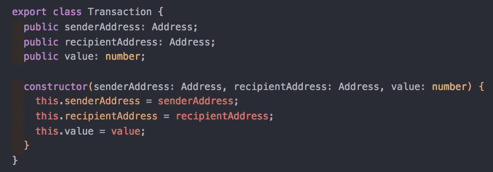

**提交一个节点** *:* 一个区块链是一个分布式的、分散的数据库，其中网络上的每个**节点都保存一份完整的交易历史** *。由于我们正在开发一个无权限的区块链，每个人都可以自由加入。这种方法允许我们向网络中添加节点。*

**提交交易**:区块链作为交易历史的记录。虽然事务可以被广泛地定义，但它最流行的用例是从用户 A 到用户 b 的资金转移。这种方法让我们可以创建等待挖掘的事务。

**挖掘一个块**:交易不会立即反映在网络上。我们需要投入计算能力来验证交易。这叫工作证明。挖掘块是对最近发出但尚未验证的所有事务执行“工作证明”的操作。加密货币没有免费的午餐；)

**一致**:一致是所有节点对网络的当前状态达成一致的过程。我们选择“最长链”(贪婪最重观察子树)的方法。该方法规定所有节点将接受具有最多块的节点的区块链。这背后的基本原理是，*最长的区块链拥有最多的计算能力*(记住，我们需要通过 PoW 来验证块)，因此是最可靠/可信的。

点击这里查看车间源代码[。](https://github.com/blockchain-academy/how-build-your-own-blockchain/blob/master/src/final.ts)

尽管在一个小时内要处理很多新材料，我还是被吸引住了:)在研讨会快结束时，Leonid 宣布了一个惊喜！

I like surprises

将会有一场比赛，看看谁能对我们刚刚构建的基本区块链提出最有创意和“棒极了”的拉请求。

# 我过去两周的工作

我一直渴望更多地了解区块链，并且相信建造一座这样的建筑是最好的方式。我开始构建一个受以太坊实现启发的区块链，它具有以下特征:

*   **会计系统** -用户将能够注册有余额的账户(外部账户)，并启动资金转账。此外，用户可以注册合同帐户，并在网络上部署智能合同
*   **基于事务的状态机**
*   **安全且有效的**交易和状态转换
*   使用户能够编写**智能合同**和**分散式应用**，在其中他们可以为所有权、交易格式和状态转换功能创建自己的任意规则。

## **账户**

网络上节点的全局共享状态由账户组成。帐户包含重要信息，例如

*   **地址:**这将作为账户的名称，类似于我们在研讨会中所做的。
*   **余额:**账户拥有的资金金额
*   **nonce** :如果账户是外部拥有的账户，这个数字代表从账户地址发送的交易次数。

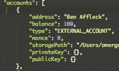

我的区块链实现有两种不同类型的帐户:

*   外部账户，由*私钥* ***(通过 RSA 加密)*** 控制
*   合同账户，由其合同代码控制。

## 跨网络的单一共享状态

帐户是公开的，只要给定地址和注册节点，您就可以查看任何帐户。我通过向网络上的所有节点通知帐户的创建，使帐户成为“全局”的。因此，当帐户事务被分派到一个节点时，我将该事务传播到网络上的所有节点。这样，区块链是真正去中心化的，我们不需要依赖单个节点来获取有价值的信息，如账户存在或账户余额。本质上，我们在节点之间创建了一个单一的“共享状态”。

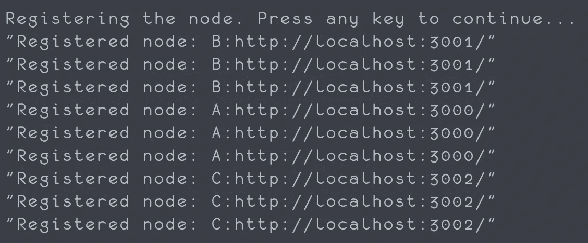

We register each account on every node, so that it is “global”

## 外部账户和合同账户之间的差异

这两种帐户的主要区别在于它们如何通过网络与其他帐户通信。外部帐户可以通过两种方式进行通信

1.  向其他外部账户发送消息(即从账户 A 向账户 B 转移资金的交易)。
2.  对合同帐户调用方法执行。这些方法各不相同，因为它们完全取决于合同作者和他/她创建的合同。

重要的是要澄清，与外部账户不同，**合同账户不能明确地将交易**发送到网络。相反，合约账户只能**发出交易**以响应他们收到的其他交易。

# **外部账户**

帐户认证是通过 RSA 加密完成的。在帐户初始化时，会创建一个私钥和公钥对，并将其写入磁盘。

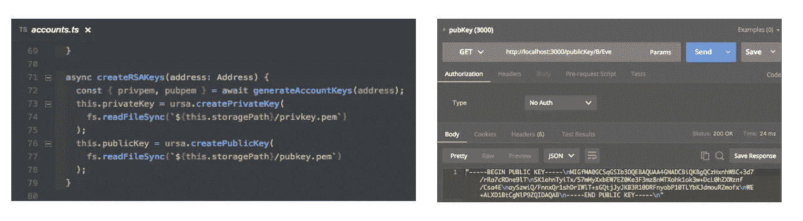

Keys being created in the ExternalAccounts constructor. On the right, we view the public key

这些密钥用于使用帐户凭证对传出的交易请求进行数字签名。一个更健壮的实现将总是询问一个帐户，在发送请求之前他是否想要签名。您可以在*requestauthfortransaction . sh .*中查看它的基本实现

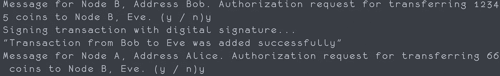

*requestAuthForTransaction.sh*

我为这个实现所做的一个假设是，所有的帐户都同意用他们的凭证签署所有的交易请求。

# **合同账户**

合约账户由其代码控制。它们只是在被调用时执行一段特定的代码，并直接控制它们的平衡。

这里的一个挑战是弄清楚如何以一种动态的、分布式的、分散的、无信任的方式来支持它。以太坊使用一个全局可访问的虚拟机(给定一个指向契约的字节码的指针)来执行契约的代码。但是 JS 没有现成的全局可访问的 VM 供所有节点引用。我最初尝试将一个契约作为一个字符串化的 JSON 对象部署到网络上的所有节点，这样就可以通过解析接收到的对象在每个节点上独立调用契约执行。不幸的是， *JSON.stringify* 忽略了方法和函数，因此剥夺了智能契约的写功能。我在网络上动态发送契约(不是在每个节点实例上硬编码)的解决方法如下:

**部署合同**

1.  将智能协定编写为普通 JS 对象。

2.用括号将它括起来，使它成为一个字符串，并删除所有换行符，这样当其他节点接收到它时，它就可以通过内置的 JS *eval* 方法进行处理。

3.将字符串作为数据发送到网络上的所有节点。

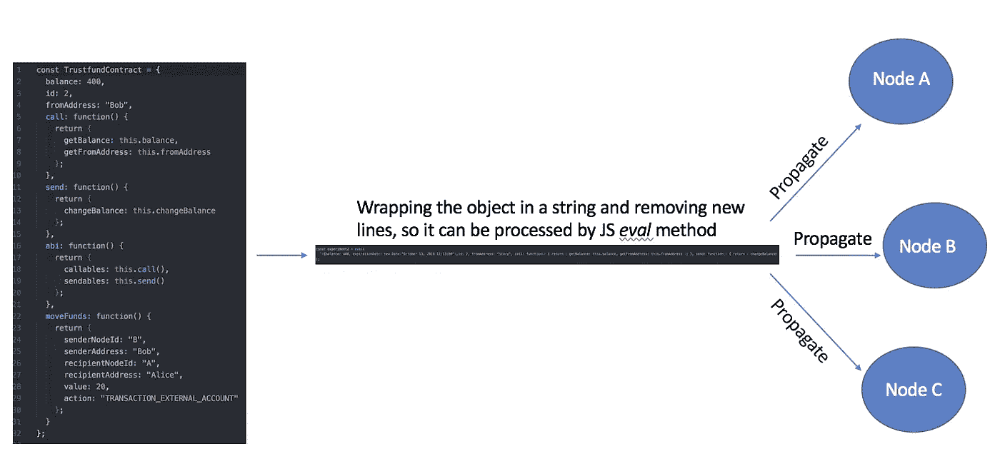

Deploying a contract across the network

这允许节点动态地创建契约，并在网络中部署它们。现在，一个节点可以接收它以前不知道的契约，并执行它的代码！😀😀😀

**撰写合同更新**

最初，我们可以通过使用内置的 JS eval 方法来解析 stringified 契约，该方法接受一个字符串并将其作为 JS 语句进行计算。

在执行了一个改变契约状态的方法(即改变契约的平衡)之后，我们希望完整地存储契约，而不丢失对我们的方法的访问。

因此，我们将使用 JSON stringify 方法，并传递一个自定义的[“replacer”函数](https://developer.mozilla.org/en-US/docs/Web/JavaScript/Reference/Global_Objects/JSON/stringify)，指示它如何 stringify 函数。

将来，为了读取契约的特殊字符串版本，我们将向 JSON.parse 方法传递一个定制的“reviver”[。](https://developer.mozilla.org/en-US/docs/Web/JavaScript/Reference/Global_Objects/JSON/stringify)

**通过合同执行发起交易**

一些契约变化可能只更新契约的内部状态。其他契约执行可以“发出”影响网络状态的事务。例如，持有资金的合同(合同管理自己的资金)可以在满足特定条件时将资金发送给特定用户。类似于网络中的其他事务，这些发出的事务被侦听并放入挖掘队列中。在写入区块链之前，必须对它们进行验证。流程如下所示:

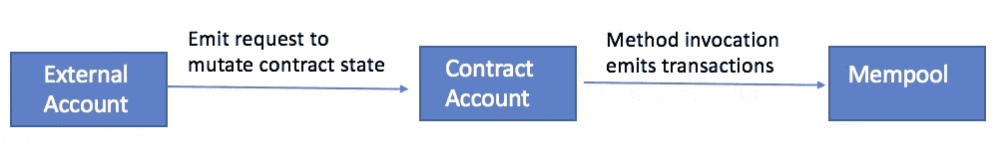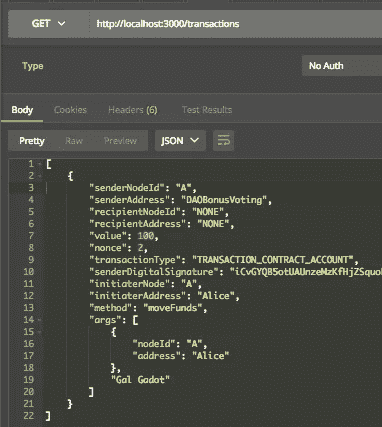

An emitted transaction via a contract mutation request, appended to the mempool

## 带权限的智能合同

调用智能协定只是调用一个导致事务发出的方法。契约是在全球范围内部署的，我们希望有一种简单的方法来控制谁可以调用契约方法。我们希望用户能够建立支持用户权限的合同。例如，在选举中，我们只希望有资格的用户能够投票(我们可以决定资格，但我们认为合适)。).因为所有请求的交易都由请求者通过 RSA 加密进行数字签名，所以我们可以安全地检查请求执行合同的用户，并决定他是否被授权这样做。

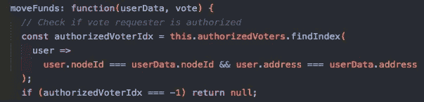

DAOVotingContract.ts example with permissions

## 交易验证

在第一次研讨会期间，我们实现了事务的原始版本。因为我们没有账户，没有身份证明，也没有要更新的余额，所以它们没有任何意义。实现上述内容后，我们现在可以验证所请求事务的合法性或“正确性”

**状态转换功能**

以太坊的白皮书将加密货币分类账描述为状态转换系统，其中状态由系统内货币的所有权状态组成。在我的实现中，每个节点都有持有特定余额的帐户。但是状态(平衡)是如何随时间变化的呢？以太坊规定了如下状态转换函数:

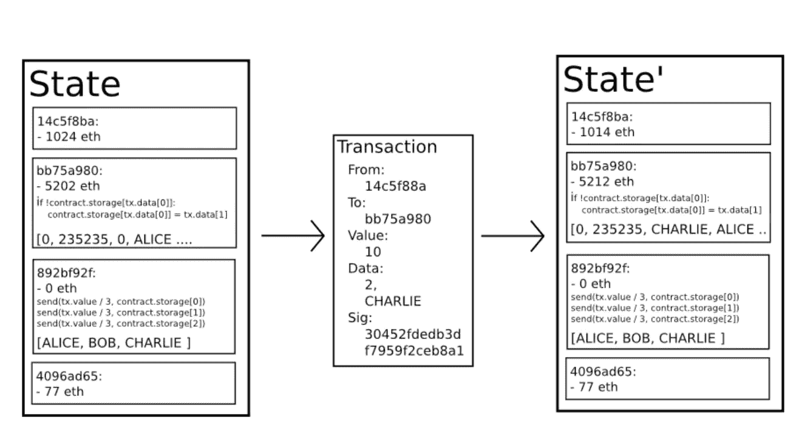

Illustration from the Ethereum White Paper

在我们的实现中，我们将采用类似的方法来验证状态转换。我们将:

1.  检查事务是否符合所请求的结构并具有所有必需的值。
2.  所有事务都有一个 *senderNodeId* 和一个 *senderAddress。*虽然这是一个不安全的假设，但对于当前的实施和缺乏适当的用户客户端，我们将假设所有账户同意并使用其凭证对所有传出的交易请求进行数字签名。在提交到挖掘队列之前，我们将**验证这个数字签名**。
3.  检查**随机数是否与发送者账户**中的随机数匹配。

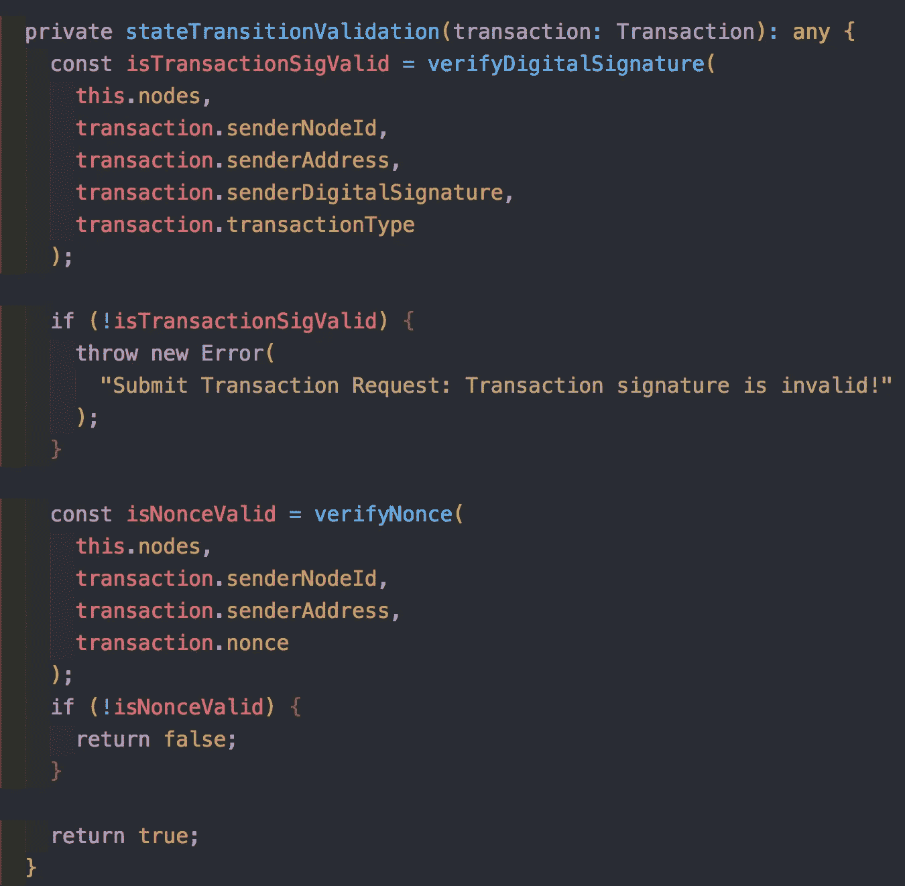

blockchain.ts

在通过*state transition validation*方法验证事务后，我们可以将事务添加到挖掘队列并进行挖掘。值得注意的是，这些交易还没有**改变网络状态**。根据共识，如果这些交易属于最长的链，并且是移动资金的交易，我们将验证发送者具有足够的账户余额。过滤非法交易的示例(汇款人 A 发送的资金比他拥有的多)可参见 *adequateFunds.sh.*

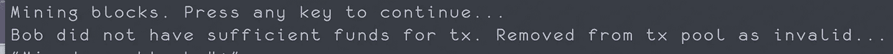

adequateFunds.sh

要形象化这一过程:

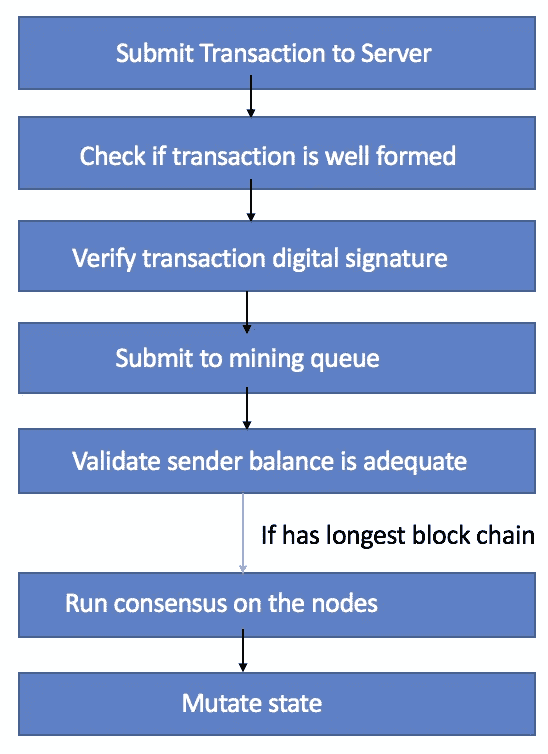

# 合同示例

现在，我们的区块链已经有了帐户、经过验证的交易以及在网络上创建和传播合同的方法，我们可以查看一些真实的合同。这些合同非常简单，展示了在区块链创作智能合同的灵活性和潜力。

## 反向合同

首先，让我们看一个充当计数器的简单契约。每次调用契约的 *incrementValue* 方法时，我们都会递增计数器。注意，任何人都可以调用这个合同代码。

我们通过分派一个*mutate contract/:counter contract PUT*请求来调用契约代码。这个契约有它自己的内部状态。当调用 *incrementValue* 时，契约状态发出一个事务，请求改变契约状态。在被挖掘之后，变异被写入区块链，这样我们就有了谁使用了契约(发起了变异请求)以及契约是如何被使用的记录。

这个契约可以通过 Postman 客户端或者通过运行 shell-scripts 目录中的 *counter_contract.sh* 脚本来执行。

## 在合同任意日期后转移资金

智能合约的一个更现实的场景是将资金从帐户 A 转移到帐户 b。下面的合约基于这样的场景:Bob 希望在任意日期过后向 Alice 转移 400 个硬币。他可以创建一个智能合同，检查日期何时过去，并启动资金转移，而不是使用第三方服务或托管系统。

当合同的 *moveFunds* 方法被调用时，它将检查日期，查看日期是否已过，并将资金转移给 Alice。

这个契约可以通过 Postman 客户端或者通过运行 shell-scripts 目录中的*move _ funds _ after _ data _ contract . sh*脚本来执行。

## 道投奖金合同

这个场景涉及一个 DAO(分散自治组织),它想要给它的一个员工发奖金。因为这个道是一个完全公正的组织😀😀😀我们应该投票决定谁应该得到奖金。

但是请记住，区块链是一本公共账本！因此，当我们将合同上传到网络时，任何人都可以看到它，并调用合同代码。我们希望有一种方法将投票限制在只有 DAO 的员工。正如我前面提到的，每个带有帐户凭证的请求都是由该帐户用其私钥进行数字签名的。这样，就很容易核实选民的真实出身。因此，该合同有一个“授权投票人”字段，每当一个帐户试图投票时，我们都会检查该字段。

这个契约可以通过 Postman 客户端或者通过运行 shell-scripts 目录中的*voting _ permissions _ contract . sh*脚本来执行。

这些只是智能合约的几个例子。当前的结构允许任何人上传任何合同(只要它符合我正在使用的可解析格式)，在会话中将它部署到网络，并开始执行它。我们可以为选举、分布式文件存储等创建合同。

# 结论

对这个概念验证区块链进行编程是一个相当大的挑战！就如何改进和保护它而言，这只是冰山一角。我花了很长时间研究这些概念，并了解了区块链的实现和机制。

非常感谢 [Leonid Beder](https://www.linkedin.com/in/leonidb/) 为[优雅的区块链介绍](https://www.youtube.com/watch?time_continue=4188&v=gOpAbx2UWKk)，以及 [Kin 贡献者](https://medium.com/u/b99d4cf10a42?source=post_page-----5be456018040--------------------------------)、 [Orbs](https://orbs.network/) 和 [Samsung Next](http://samsungnext.com/tel-aviv/) 组织[区块链学院](/kin-contributors/how-to-build-your-own-blockchain-64949fae13a9)。

你可以在这里查看我的完整实现[。](https://github.com/Arieg419/how-build-your-own-blockchain)

如果你想继续区块链的讨论，请随时通过、 [Instagram](https://www.instagram.com/omeragoldberg/) 或 [Linkedin](https://www.linkedin.com/in/omer-goldberg-680b40100/) 联系。

最后，如果你已经做到了这一步，感谢你的坚持🤗🤗🙌🙌🖖🏼✌️🏼

 [## 区块链——黑客正午

### 区块链是所有加密货币交易的数字化、去中心化的公共分类账。区块链已经…

hackernoon.com](https://hackernoon.com/blockchain/home)