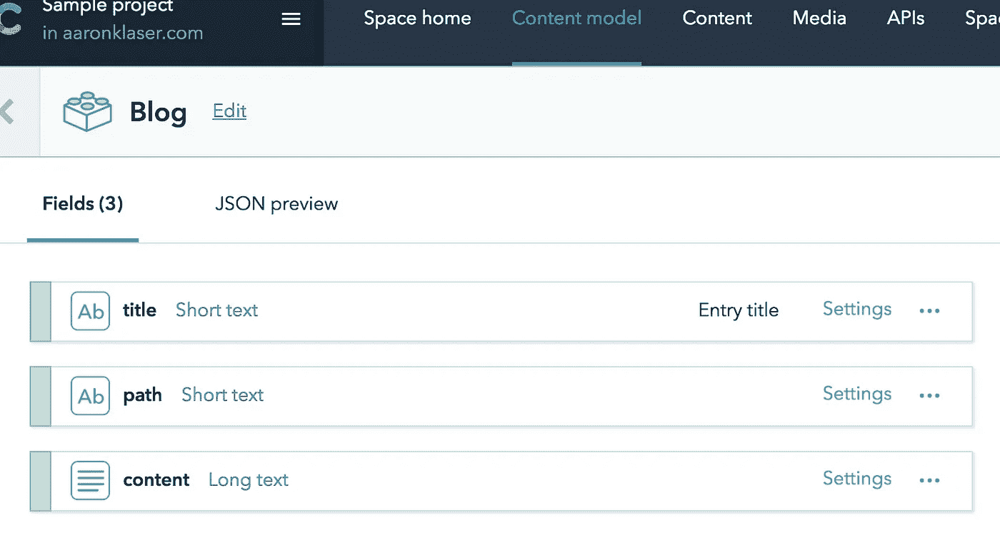
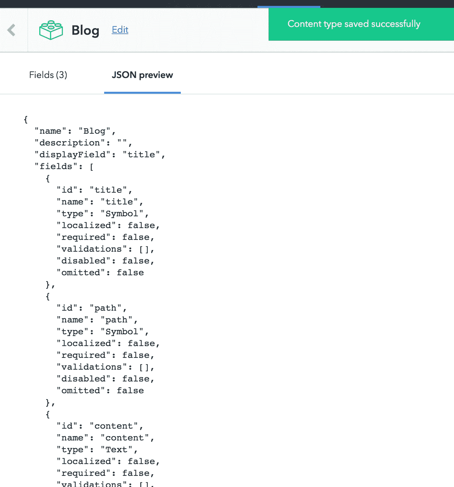
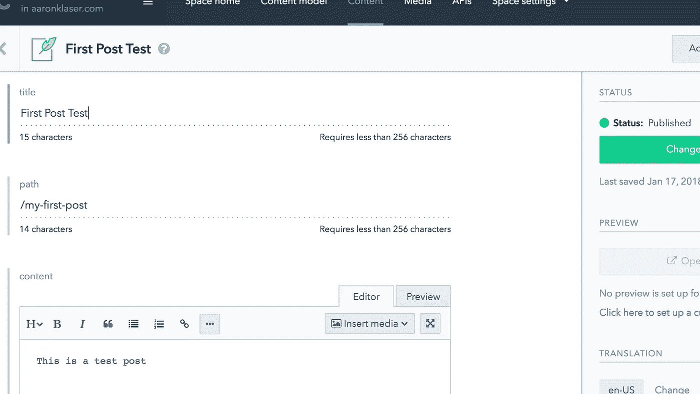
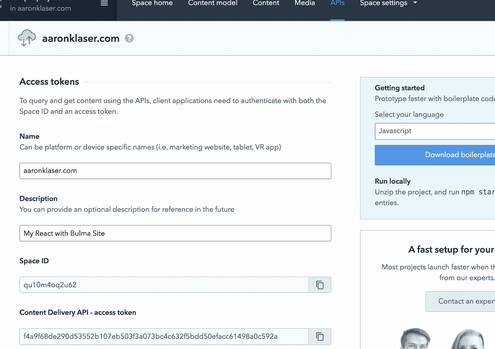
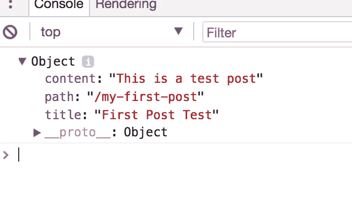
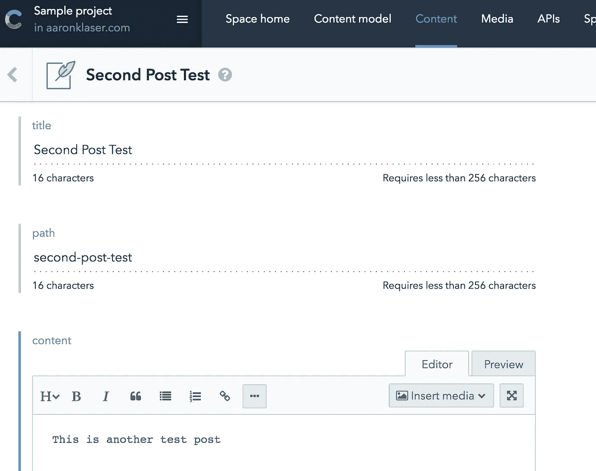
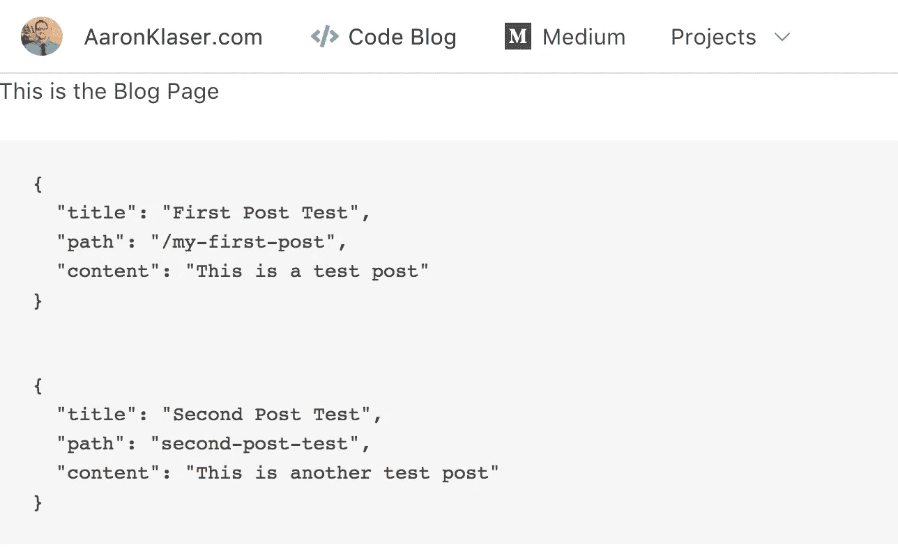
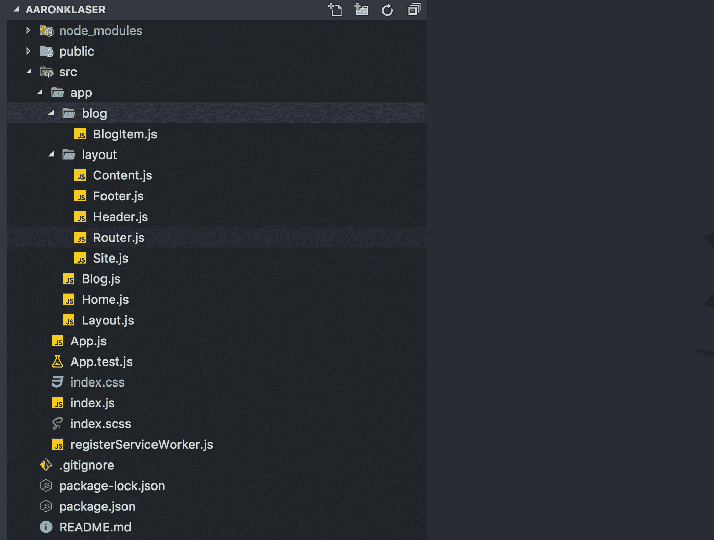
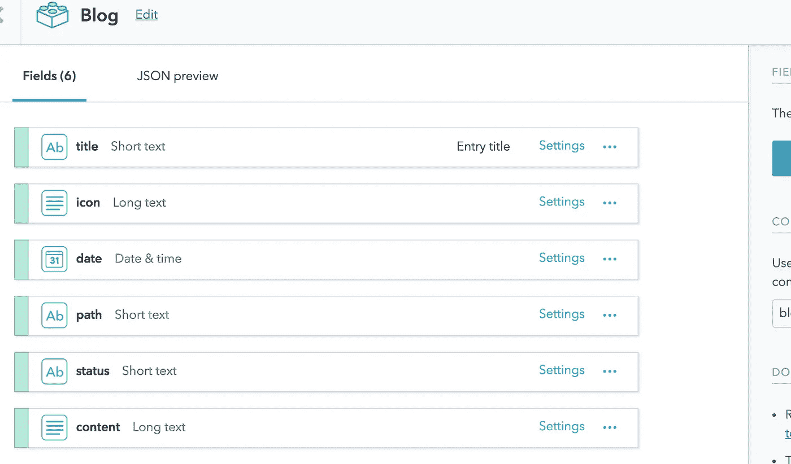
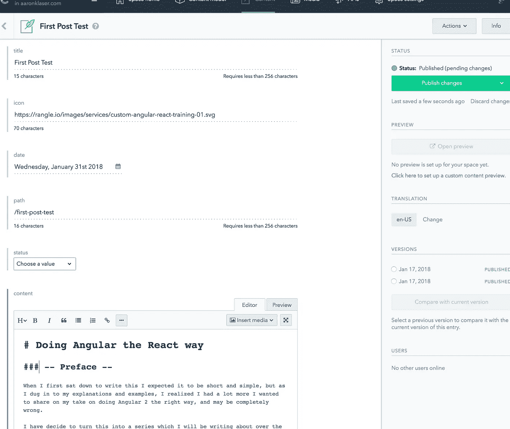

# 用反应和满足来建立一个博客

> 原文：<https://medium.com/hackernoon/building-a-blog-with-react-and-contentful-fd538f68f6fb>

## React 博客系列:第二部分


本文是关于用 React 创建博客的每周系列文章的第二部分，是第一部分中创建的代码的扩展。

## **React 博客系列**

[**第一部分:**用 React 和布尔玛](/front-end-hacking/building-a-website-with-react-and-bulma-d655214bff2a)
**建立一个网站第二部分:**用 React 和 Contentful
[**建立一个博客第三部分:**将你的媒体提要导入 React](/@aaron.klaser/import-your-medium-feed-into-react-ceadbaf785c7)
[**第四部分:**向 React 博客添加一个 Redux](/@aaron.klaser/adding-redux-to-a-react-blog-97f5fea606c2)
[**第五部分:**用 Redux Sagas 替换 Redux Thunks](https://hackernoon.com/replacing-redux-thunks-with-redux-sagas-4aa306854925)

这将介绍在 React 应用程序中设置 Contentful 并将其数据显示为博客提要的基础知识。

> 这个**不**包括 Redux…还没有；)

# 满足的

## 注册 Contentful

点击这里[报名这里](https://www.contentful.com/sign-up/)

当你开始心满意足地四处闲逛时，你可能会有一种奇怪的失败感，也许是 daja vue，或者只是因为它看起来和 Wordpress Admin 一模一样？

**Contentful** 非常干净，易于导航，看起来和感觉*很像 Wordpress*。尽管不愿意承认，但我喜欢它，这是一件令人惊奇的事情，因为我不喜欢 Wordpress。公平地说，我不讨厌 Wordpress 的 UX，我讨厌它是因为它太慢了，而且是建立在看起来像是拼凑起来的 PHP 之上的，让我们面对现实吧，没有人真正喜欢 PHP。甚至不是 PHP 的创造者。

## 这个概念

Contentful 是内容管理即服务(CaaS ),它取代了将你的网站连接到某个蹩脚的 Apachy 服务器上的可怕的 MySQL 数据库的需要，在那里你必须安装 phpMyAdmin 并花费数小时试图找出 cPanel。

## 数据

你的数据有两部分，结构和数据。它基本上是一个非常好的 web 表单，可以转换成简单的 json。你必须首先在 ***内容模型*** 中设置你的表单，然后你可以跳转到 ***内容*** 并填写你的表单，每个表单都成为通过 rest 端点发送的数据模型数组中的一项。

## 让我们从制作一个博客模型开始

添加三个字段:标题、路径和内容



JSON 预览将如下所示



现在，让我们为应用程序创建一篇博客文章，并将其显示在我们的博客页面上。

转到 Content，点击右上角的 Add Blog 并填写表单。



现在你有了你的第一篇博文！

# 获取 Api 令牌

您将需要一个**空间 Id** 和访问令牌来检索您的数据。转到**Api**选项卡，点击**添加 Api 密钥。**

你想取什么名字就取什么名字，然后保存起来。



# 在反应中建立满足

```
npm install contentful
```

让我们看看能否连接并获取数据。

在`src/index.js`上，让我们导入 Contentful，设置一个简单的客户端，然后获取条目。现在让我们记录我们得到的东西，如果幸运的话，我们应该会看到我们的测试博客帖子。这是暂时的。

```
import React from 'react';
import ReactDOM from 'react-dom'
import registerServiceWorker from './registerServiceWorker'
import { BrowserRouter as Router } from 'react-router-dom'
**import * as contentful from 'contentful'**
import App from './App'
import './index.css'**var client = contentful.createClient({
  space: 'qu10m4oq2u62',
  accessToken: 'f4a9f68de290d53552b107eb503f3a073bc4c632f5bdd50efacc61498a0c592a' })****client.getEntries().then(entries => {
  entries.items.forEach(entry => {
    if(entry.fields) {
      console.log(entry.fields)
    }
  })
})**ReactDOM.render((
  <Router>
    <App />
  </Router>
), document.getElementById('root'))
registerServiceWorker()
```

运行您的应用程序并打开您的控制台。你应该看到一个干净的小物体充满了我们的数据。



是不是很神奇？这就像是有史以来最简单的设置！

但是现在让我们把它做好…好吧，在没有 Redux :P 的情况下尽可能多的做

# 设置您的博客页面

复制所有你感兴趣的东西，并从你的索引中删除。

走向你的`Blog.js`，把它从一个愚蠢的组件变成一个聪明的反应。组件类。

然后，我们将需要包含一个空 post 数组的状态。

粘贴内容丰富的 createClient 对象。

接下来，使用 **React** 生命周期钩子 **componentDidMount** ，我们需要调用一个 **fetchPosts** 函数，该函数将调用一个 **setPosts** 函数

```
import React from 'react'
import * as contentful from 'contentful'class Blog extends React.Component { state = {
    posts: []
  } client = contentful.createClient({
    space: 'qu10m4oq2u62',
    accessToken: 'f4a9f68de290d53552b107eb503f3a073bc4c632f5bdd50efacc61498a0c592a'
  }) componentDidMount() {
    this.fetchPosts().then(this.setPosts);
  } fetchPosts = () => this.client.getEntries() setPosts = response => {
    this.setState({
      posts: response.items
    })
  } render() {
    return (
      <p>This is the Blog Page</p>
    )
  }
}export default Blog
```

如果您在**fetch post**函数中插入控制台日志，您会看到我们正在从 **Contentful** 中获取数据。

现在我们正在获取数据，并且我们是以 React 方式(w/o Redux)获取的，让我们更新 render 函数来显示数据。稍后我们将把它们移到它们自己的漂亮组件中，但是现在让我们把它放在一些 pre 标签中。

```
render() {
  return (
    <div>
      <p>This is the Blog Page</p>
      <br/>
      { this.state.posts.map(({fields}, i) =>
        <pre key={i}>{JSON.stringify(fields, null, 2)}</pre>
      )}
    </div>
  )
}
```

耶！！！

# 添加新的博客文章

回到**内容丰富的**，点击**内容>添加博客**，然后填写信息。你知道该怎么做。



点击**发布**回到你的应用程序，刷新浏览器和 *BLAMMO* ！！这是你的第二封信。



# 设计博客订阅源的样式

我们需要设置一个博客项目组件。我们的博客页面将包含一个博客条目列表，这些条目组成了“ ***提要*** ”。

[记住我们使用的是分形文件结构](/front-end-hacking/building-a-website-with-react-and-bulma-d655214bff2a)并且`BlogItem.js`将是`Blog.js`的子文件。由于`Blog.js`在 **app** 文件夹中，我们将在 **app** 文件夹中创建一个名为 ***blog*** 的文件夹，然后在我们新创建的 **blog** 文件夹中创建我们的`BlogItem.js`。

如果你正在记分，并且正确地遵循 [**分形文件结构**](/front-end-hacking/building-a-website-with-react-and-bulma-d655214bff2a) ，我们当前的文件结构应该看起来像这样。



## 创建博客组件

在`BlogItem.js`中，用**布尔玛**框创建简单组件。我们将通过道具，现在将是一个领域的传播从心满意足。

```
import React from 'react'const BlogItem = (props) => (
  <div className="box content">
    <h1>{props.title}</h1>
    <p>{props.content}</p>
  </div>
)export default BlogItem
```

现在，回到 **Blog.js** 中，我们需要在 render 中更新我们的 posts 地图，以返回我们的 **BlogItem** 组件，并将字段作为属性传播。

```
render() {
  return (
    <div>
      <p>This is the Blog Page</p>
      <br/>
      { this.state.posts.map(({fields}, i) =>
        **<BlogItem key={i} {...fields} />**
      )}
    </div>
  )
}
```

刷新一下，就可以了。但是……那种看起来*可怕的*。

## 样式博客页面

让我们将`<p>This is the Blog Page</p>`替换为**布尔玛英雄**作为我们的页眉。因为我们可能会在大多数页面的顶部这样做，所以让我们将其创建为一个全局可重用组件。

在我们的应用程序文件夹中，创建一个名为 components 的新文件夹。根据我们的分形逻辑，这意味着这些组件都将作为应用程序的子组件存在。

> ***剧透预警*** :如果你还没想通，`App.js`和它的子文件夹(`app`)，会包含我们所有的展现逻辑。目前，我们所做的每一件事都将成为**应用**的产物。[稍后当我们重构使用 **Redux**](/@aaron.klaser/adding-redux-to-a-react-blog-97f5fea606c2) ， **App** 会得到一个名为`Store.js`的兄弟，以及它的子文件夹(`store`)，它会包含我们所有的**数据服务**和**状态**。

在**组件**文件夹中创建两个文件，`PageHeader.js`和`PageContent.js`

PageHeader 将成为我们的布尔玛英雄的一个组件。我们将不包括字幕内容。这样，我们可以做 css 样式或包含链接，并将其作为儿童道具传递。

```
import React from 'react'const PageHeader = (props) => (
  <section className={`hero ${props.color}`}>
    <div className="hero-body">
      <div className="container">
        <h1 className="title">
          {props.title}
        </h1>
        <h2 className="subtitle">
          {props.children}
        </h2>
      </div>
    </div>
  </section>
)export default PageHeader
```

在我们的`Blog.js`中，将`<p>This is the Blog Page</p>`替换为

```
<PageHeader color="is-info" title="Code Blog">
  Your standard <strong>JavaScript</strong> programming blog, albeit, probably not very good, but I will at least try to keep it entertaining. This blog is a chronological mix of random posts on Angular, React, Functional Programming, and my <strong>project walkthroughs</strong>.
</PageHeader>
```

PageContent 将是一个样式化的组件，用来限制我们的页面的最大宽度，并添加填充等等。

```
import styled from 'styled-components'const PageContent = styled.div`
  margin: 0 auto;
  max-width: 960px;
  padding: 1.5rem;
`
export default PageContent
```

啊…现在好多了。

# 更好更真实的博客帖子

回到 Contentful，让我们在博客内容模型中添加一些字段

我们将添加三个新字段:

*   **图标:**设置外观为**单线**
*   **状态**:仅值“进行中”有效，非必需。将外观设置为**下拉菜单**
*   **日期**:仅将外观设置为**日期**



现在跳到你的第一篇和第二篇博文，填入一些数据。

图标可以是一个链接到图标的 url，也可以是 base64，只要它能正常进入 **src** 属性。

> *内容应该设置为****Markdown****这样当你填充页面内容的时候就可以用****Markdown****样式了！*



对两个帖子都这样做，**保存**，然后刷新你的。这可能会看起来很糟糕…

是的！

# 渲染降价

所以让我们从解决房间里的大象开始。我们需要作出反应渲染为 html 的降价，它需要看起来…漂亮。

```
npm install react-markdown
```

在`BlogItem.js`中，用 react-markdown 替换内容< p >。

```
import React from 'react'
**import * as Markdown from 'react-markdown'**const BlogItem = (props) => (
  <div className="box content">
    <h1>{props.title}</h1>
    **<Markdown source={props.content} />**
  </div>
)export default BlogItem
```

嘣！

好多了，但是我会从**内容丰富的**中的的**降价中删除 H1 的标题，并将你的**内容丰富的**博客文章重新命名为 H1 的标题。当我们在接下来添加图标和其他东西时，你就会明白为什么了。**

## 添加图标

这只是简单的**布尔玛**。打开你的`BlogItem.js`，我们将从**布尔玛的**网站上窃取**盒子媒体**示例。

```
import React from 'react'
import { Link } from 'react-router-dom'
import * as Markdown from 'react-markdown'
import moment from 'moment'const BlogItem = (props) => (
  <div className="box">
    <article className="media">
      <div className="media-left">
        <figure className="image is-64x64">
          
        </figure>
      </div>
      <div className="media-content">
        <div className="content">

          <h1>{props.title}</h1>
          <Markdown source={props.content.split(" ").splice(0,150).join(" ").concat('...')} />
        </div>
        <div className="level">
          <div className="level-left">
            <Link className="level-item button is-small is-link is-outlined" to={props.path}>Read More</Link>
          </div>
        <div className="level-right">
          <p className="level-item has-text-link is-size-7"> {moment(props.date).calendar(null, {
              sameDay: '[Today]',
              lastDay: '[Yesterday]',
              lastWeek: '[Last] dddd',
              sameElse: 'MMM Do YYYY'
            })}
          </p>
        </div>
      </div>
    </div>
  </article>
</div>
)export default BlogItem
```

是的，就是这样，但它有点忙，公平地说，我认为这与整页博客文章有一些重叠

# 创建 BlogPost 页面并清理 BlogItem

嗯……如果你没记错的话，在我们的上一篇文章中，路由使用了一个静态的`<Switch>`组件。但是我们不想对我们的每一篇博客文章都进行硬编码，那样会破坏使用 Contentful 作为 CMS 的目的。

对我们来说幸运的是， **react-router-dom** 已经提前计划好了，并允许我们有路径参数。在`Router.js`中添加新路线

```
<Switch>
  <Route exact path='/' component={Home}/>
  <Route **exact** path='/blog' component={Blog}/>
  **<Route path='/blog/:blogPost' component={BlogPost}/>**
</Switch>
```

> ***重要:*** *这一条花了我一分钟才图出我们的但是你* ***能*** ***不能*** *在参数名里包含一个* ***破折号*** *(-)。我最初有* `*:blog-post*` *并且不明白为什么它看起来工作正常，但是它* ***不是*** *。*
> 
> *另外需要注意的是，需要在* ***博客路径*** *中添加* ***确切的*** *，否则会先匹配* `*/blog*` *路线。*

更新我们的`BlogItem.js`中的`<Link …>`，将/blog/放在我们的路径前面

```
<Link className="level-item button is-small is-link is-outlined"
  **to={{
    pathname: `/blog/${props.path}`,
    state: { props }
  }}**
>
  Read More
</Link>
```

但是在测试之前，我们需要创建一个 BlogPost 页面。现在，让我们只做一些简单的

```
显示，这样我们可以确保我们将数据发送到博客文章中
```

```
import React from 'react'const BlogPost = (props) => (
  <h1>Blog Post</h1>  
  <pre>{JSON.stringify(props, null, 2)}</pre>
)export default BlogPost
```

现在，当我们从博客页面导航到我们的博客文章时，我们应该在我们的`<pre>`中看到一个巨大的对象，并且历史对象包含我们的状态，也就是我们的博客文章。

## 设置博客页面

好吧，在你读到这里并愤怒地说我完全不知道自己在做什么之前，这不是最好的方式，这样的对象分解方式也不是最佳实践。这将在我的下一个教程中全部转移到 Redux，这将是一个更干净的解决方案。

```
import React from 'react'
import { Link } from 'react-router-dom'
import moment from 'moment'
import * as Markdown from 'react-markdown'
import PageContent from './../components/PageContent'const BlogPost = ({ location: { state: { props } }}) => { return (
    <PageContent>
      <nav className="level">
        <div className="level-left">
          <Link className="level-item button is-small is-link is-outlined" to="/blog">Back to Blog</Link>
        </div>
        <div className="level-right">
          <p className="level-item has-text-link is-size-7">    {moment(props.date).calendar(null, {
  sameDay: '[Today]',
  lastDay: '[Yesterday]',
  lastWeek: '[Last] dddd',
  sameElse: 'MMM Do YYYY'
})}
          </p>
        </div>
      </nav>
      <article className="media">
        <div className="media-left">
          <figure className="image is-64x64">
            
          </figure>
        </div>
        <div className="media-content">
          <div className="content">
            <h1>{props.title}</h1>
            <Markdown source={props.content} />
          </div>
        </div>
      </article>
    </PageContent>
  )
}export default BlogPost
```

## 清理重叠部分

现在我们可以查看我们的`BlogItem.js`和`BlogPost.js`并找出重叠的代码，使它们成为漂亮的小组件。

我们的两个页面都包含带有图标和底部的内容部分以及日期部分，但是，按钮和日期部分在两个页面上的不同位置。

让我们首先为我们的新组件创建一个文件夹。这些是**博客**的共享组件，所以在博客文件夹中创建一个`shared`文件夹，然后创建两个文件`BlogContent.js`和`BlogNav.js`

```
import React from 'react'
import { Link } from 'react-router-dom'
import moment from 'moment'const BlogNav = ({ to, date }) => (
  <nav className="level">
    <div className="level-left">
      <Link className="level-item button is-small is-link is-outlined" to={to}>Back to Blog</Link>
    </div>
    <div className="level-right">
      <p className="level-item has-text-link is-size-7">
        {moment(date).calendar(null, {
          sameDay: '[Today]',
          lastDay: '[Yesterday]',
          lastWeek: '[Last] dddd',
          sameElse: 'MMM Do YYYY'
        })}
      </p>
    </div>
  </nav>
)export default BlogNav
```

和

```
import React from 'react'
import * as Markdown from 'react-markdown'const BlogContent = (props) => (
  <article className="media">
    <div className="media-left">
      <figure className="image is-64x64">
        
      </figure>
    </div>
    <div className="media-content">
      <div className="content">
        <h1>{props.title}</h1>
        <Markdown
          source={
            props.limit
            ? props.content.split(" ").splice(0,props.limit).join(" ").concat('...')
            : props.content
          }
        />
      </div>
      { props.children }
    </div>
  </article>
)export default BlogContent
```

在`BlogContent.js`中，我们不会总是使用`**props.children**`，但是我们想把它放在那里，这样我们就可以把导航放在`BlogItems.js`的那个位置。你会看到…

现在，让我们更新我们的`BlogItem.js`和`BlogPost.js`。这会让你大吃一惊的。

```
import React from 'react'
import BlogNav from './shared/BlogNav'
import BlogContent from './shared/BlogContent'const BlogItem = (props) => (
  <div className="box">
    <BlogContent limit={150} {...props }>
      <BlogNav date={props.date} to={{
        pathname: `/blog/${props.path}`,
        state: { props }
      }} />
    </BlogContent>
  </div>
)export default BlogItem
```

> *注意我们是如何在这个代码片段中包装****BlogNav****的，但在下一个代码片段中却没有。这就是* ***道具*** *的用处。*

和

```
import React from 'react'
import PageContent from './../components/PageContent'
import BlogNav from './shared/BlogNav'
import BlogContent from './shared/BlogContent'const BlogPost = ({ location: { state: { props } }}) => (
  <PageContent>
    <BlogNav date={props.date} to="/blog" />
    <BlogContent {...props } />
  </PageContent>
)export default BlogPost
```

那就 ***这样*** 好多了！

# 状态标签

在我的例子中，我包含了一个状态标签，这样我可以将我的帖子标记为进行中或已存档或其他

你还不知道，但我确实计划在其他地方使用它，所以我们将把它添加到`src/components`文件夹中。创建一个名为`StatusTag.js`的文件。

```
import React from 'react'const StatusTag = ({status}) => {
  switch(status) {
    case 'IN_PROGRESS':
      return (<span className="tag is-small is-warning" style={{ marginRight: 20 }}>In Progress</span>)
    case 'ARCHIVED':
      return (<span className="tag is-small is-danger" style={{ marginRight: 20 }}>Archived</span>)
    default:
      return (<span></span>)
  }
}export default StatusTag
```

回到我们的`BlogNav.js`，让我们在日期旁边添加 StatusTag。还有别忘了导入。

```
**import StatusTag from './../../components/StatusTag'**const BlogNav = ({ to, date, **status** }) => (
  <nav className="level">
    <div className="level-left">
      <Link className="level-item button is-small is-link is-outlined" to={to}>Back to Blog</Link>
    </div>
    <div className="level-right">
      **<StatusTag status={status} />**
      <p className="level-item has-text-link is-size-7">
        {moment(date).calendar(null, {
          sameDay: '[Today]',
          lastDay: '[Yesterday]',
          lastWeek: '[Last] dddd',
          sameElse: 'MMM Do YYYY'
        })}
      </p>
    </div>
  </nav>
)
```

我们需要更新使用`<BlogNav … >`组件的地方。

```
<BlogNav date={props.date} **status={props.status}** to="/blog" />
```

现在我们有了一个漂亮的小标签，这样我们可以让我们的读者知道我们仍在研究这篇文章。

# 让我们回顾一下

*   我们学习了 Contentful 并注册了一个账户
*   创建内容丰富的内容
*   将 Contentful 连接到我们的应用程序
*   创建了博客订阅源页面
*   创建了博客订阅源项目
*   创建了一个博客文章页面
*   将我们的内容更新为现实内容
*   设置 React 将 Markdown 呈现为 Html
*   重构我们的代码，使其更加简洁
*   添加了博客状态标签

现在，我们有了基本的博客，如果你想的话，你可以从今天开始使用

> **下一步** — [将您的培养基进料导入 React](https://medium.com/p/ceadbaf785c7/edit)