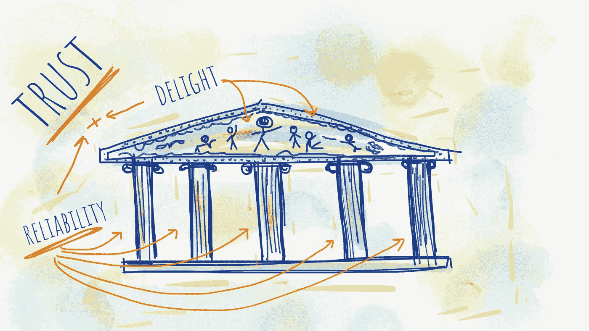
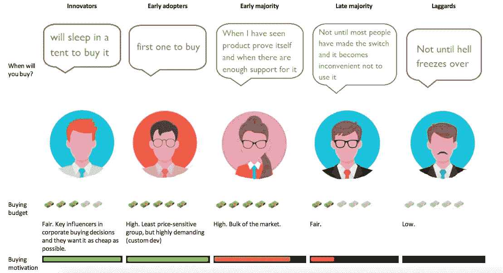
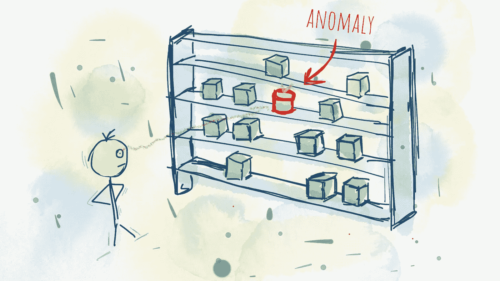

# 建立品牌应该是你产品路线图的一部分

> 原文：<https://medium.com/hackernoon/building-a-brand-should-be-part-of-your-product-roadmap-ae537fc1a6d>

“我只需要打造一个伟大的产品，顾客就会自然而然地到来”是我最大的误解。

对于一个工程背景的人来说，解决问题的优质方案是唯一重要的事情。但后来现实来了，拍了拍我的额头说:“你这个白痴，他们甚至不知道你的产品存在，更不用说他们可以从中受益了”。一些优秀的老广告可以很快显示出一些结果，但我想谈谈长期的游戏——关于建立一个品牌。

作为[营销战略](https://venngage.com/blog/marketing-trends)的一部分，建立品牌通常始于产品完成之时。这里的想法是，一旦你开始打造产品，就开始打造品牌。但首先，什么是品牌？

## 什么是品牌？

我将通过说什么是**而不是**品牌来回答这个问题。尽管人们普遍认为,**标志**不是品牌**。此外，颜色、字体、图案和整体视觉**识别**不是品牌**。你的**使命宣言**是**不是品牌**(不过越来越热了)。****

> 品牌是一种直觉。

当人们与你的产品互动时，他们会产生一系列的感受，这些感受来自于他们对产品的体验。如果你的产品有帮助，他们会很感激。如果你的产品很有趣，他们会觉得很有趣。如果你的产品是优质的，他们会感到有信心。此外，如果你的产品是蹩脚的，他们会生气。

A brand is a gut feeling

因此，品牌不是你所说的那样，而是你的顾客对你产品的评价。这是他们的感受。从客户的角度来看，这是你的使命宣言。

## 为什么拥有一个品牌很重要？

现在，人们有太多的选择和丰富的同类产品。所有这些产品都有相似的质量。一组相似的特征。落在相似的价格范围内。当你考虑这些事实时，击败竞争对手就像赢得一张彩票。那么，如何说服客户你的产品是最好的呢？嗯，首先你要知道购买决策是从哪里来的。它来自我们的潜意识。如果你建立了一个让人们感觉良好和自信的品牌，你就很成功。

我们倾向于将我们的决定建立在信任的基础上。这就是为什么建立品牌很重要。以顾客为导向的品牌(或顾客着迷的品牌)有着丰富的顾客关系历史，这使他们能够根据以前的经验来影响他们的想法。拥有一个品牌足够长的时间会建立信任，而信任会让购买变得容易得多。我所指的**信任**由**可靠**和**愉悦**组成。为了建立信任，你的产品必须强大可靠，但也要足够精致，让你的客户高兴，让他们说“哇，我要那个！”。

Trust is based on reliability and delight

拥有一个强大的品牌会让你在市场上有一个更好的起点。更有可能的是，顾客会选择你而不是一个没有名字的产品，因为他们已经形成了一套与你的品牌相关的感觉(*希望是一套积极的感觉)*。最终，建立一个品牌是一个长期的投资回报最高的游戏。

> 拥有一个强大的品牌会让更多的人在未来更多年里以更高的价格从你这里购买更多的东西。

再读一遍，前面的句子里有很多内容。下面是这种说法的细分…

如果你有一个能引起顾客共鸣的品牌，他们会向他们的朋友和同事谈论这个品牌。口碑就像野火一样，是你能得到的最好的营销。这吸引了更多的人。

如果你有一系列不同的产品，并且客户对他们试用过的产品感到满意，他们很有可能会尝试更多你的产品。这意味着他们会从你这里购买更多的东西。

如我所说，有太多的产品让您的客户陷入分析瘫痪。在做出购买决定之前，他们会过度思考和分析。为了避免这种可怕的感觉，他们可能会坚持使用他们信任的品牌，并在未来几年继续购买。

如果所有这些因素都到位，支付溢价对你的客户来说就不是问题。基于他们以前的经验和直觉，他们会确信从你这里购买是他们的最佳选择。更高的价格给他们带来的不仅是产品，还有轻松的心情。这种感觉会下意识地证明以更高的价格购买是合理的。

## 品牌化还是品牌主导？

已经建立了强大品牌的公司享受着被信任的奢侈。有时，他们甚至可以带着一个蹩脚的产品离开，代价是之前赢得的信任(可靠性+愉悦)。他们的产品是**品牌**。

另一方面，新手和[创业公司](https://hackernoon.com/tagged/startups)是不知名的，不为大众所知。他们可能有一个小的利基市场，但他们远远不是一个品牌。他们的产品没有品牌。但是为了成功并打入他们的目标市场，他们的产品必须以**品牌为主导**。我不确定品牌导向是否是一个词，但我确信它是一个很好的指南针。以品牌为导向意味着产品设计、产品功能、客户服务和整个产品的所有其他方面都专注于你希望你的客户感受到的那种直觉。从产品开发的一开始就以品牌为导向的思维会对你有好处。首先，你要永远设身处地为顾客着想。因此，你的产品在他们眼里会更好看。其次，即使你还没有一个强大的品牌，当你真正关心客户时，他们也能感觉到。而那种感觉是最接近你想要得到的那种。

好的，那么你如何将这个品牌导向的战略整合到你的路线图中呢？

# 品牌作为您路线图的一部分

大多数产品团队都在使用一些[工具](https://hackernoon.com/tagged/tools)来跟踪他们想要实现的任务和特性(可能是 [Asana](https://asana.com/) 、 [Trello](https://trello.com/) 、[微软团队](https://products.office.com/en-us/microsoft-teams/free)、 [Salestrekker](https://salestrekker.com/) 等)。).这些工具给团队带来的价值是专注和透明。就像你计划你的产品开发一样，你应该计划一路建立品牌的步骤。

与建立品牌相关的任务是什么？以下是我问自己同样的问题后发现有用的。

## 1.考虑技术采用生命周期

当开发一个新产品时，你应该首先知道谁是你的客户。这同样适用于品牌。品牌是你说话的语气，当你和你的顾客说话时，你必须知道他们是谁，他们期望/需要什么。

> 如果你一直生活在岩石下，还没有读过《跨越鸿沟》，你绝对应该现在就去读。它很好地描述了技术采用的各个阶段。

**技术采用生命周期**是一个社会学模型，根据定义的采用者群体的人口统计和心理特征，描述了新产品或创新的采用或接受情况。该模型包括五个类别:

*   创新者，
*   早期采用者，
*   早期多数派，
*   迟到的多数，
*   落后者。

为了最大限度地利用这种模式，你应该首先定位你的产品，使其符合其中一个采纳者群体的需求。这是一次自省练习，你必须对自己非常诚实，找到愿意购买你产品的群体。对于大多数创业公司来说，创新者是市场的切入点。

> 作为一个品牌，你在卖一个承诺。你卖的是一种希望，这种希望会激励你的顾客。

为了做到这一点，你必须了解他们。你得熟悉他们的心理特征。当你形成一个人物角色时，就更容易抓住他们的需求。这里是这五个类别的简要概述…

## **创新者**

最有可能的是，这个群体将是第一个尝试你的产品的人。他们一直在追求新技术，他们会睡在商店前的帐篷里，先拿到新产品。他们必须站在技术的前沿，这是他们的基因。我们都知道有人痴迷于。他们的购买动机很高，他们想试用产品，看看它是否能改善他们的生活或他们的企业环境。

*他们想要什么样的品牌？*

创新者想要一种独特的功能，这种功能将使他们在竞争对手或同行中获得某种优势。它必须有一个独特的设计，让他们感到特别，让他们从人群中脱颖而出。毕竟，他们想吹嘘自己拥有一项尖端技术，所以要确保产品给人的感觉是复杂和高质量的。此外，你应该强调你的产品是同类产品中的佼佼者。流行语是必须的，他们喜欢乘坐宣传列车。

## 早期采用者

这个群体也是先买。但与创新者不同，这个群体对质量要求很高。然而，早期采用者是对金钱最不敏感的群体，因此对质量的需求在某种程度上是合理的。作为有远见的人，他们肯定会期待通过使用你的产品，他们的生活或业务会有一个巨大的飞跃。

他们想要什么样的品牌？

早期采用者不一定是技术人员，但他们对技术如何工作有很强的理解。更重要的是，他们对使用新产品的好处有着深刻的理解。确保你把产品的好处和他们关心的问题联系起来。他们想要一款创新产品，能够比竞争产品更好地解决他们的痛点。此外，确保你的产品可以个性化和定制，以满足他们最大的期望和特殊要求。

## 早期多数

这个群体的购买动机适中。只有在他们看到证明你的产品物有所值的证据后，他们才会花钱。然而，他们并不像早期用户那样苛刻。只要是高质量、高可靠性的产品，他们就会满足于增量改进。他们抵制炒作，你必须努力说服他们购买。

他们想要什么样的品牌？

早期大多数人想要一个成熟的、经过验证的产品。你应该强调你以前的买家/客户群的推荐，让他们知道你承诺的好处实际上已经到位。此外，你应该讲述客户体验的故事，以及你的客户支持有多好。你的产品必须给人一种强健和高质量的感觉，因为这个细分市场会持续很长时间。他们会花自己的钱，但他们希望长期使用该产品。所以一定要强调产品的实用性和寿命。

## 晚期多数

这个小组对他们目前解决问题的方法感到满意。不管他们在解决方案上多么努力，他们已经习惯了这个过程。在大多数人做出改变之前，他们不会过渡到新产品。事实上，当不使用新产品变得非常不方便时，他们会进行过渡。

*他们想要什么样的品牌？*

后期多数人希望拥有一个拥有最大安装基础的产品。他们希望为产品提供高质量的支持，并拥有大量第三方支持者。他们想要知名公司的产品。该产品必须是该领域事实上的标准。由于这一群体的购买力相对较低，这很少是一个有趣的科技产品市场。

## 落后者

直到地狱结冰，他们才会购买。我的意思是，真的，他们有一个翻盖手机…

*他们想要什么样的品牌？*

不用麻烦了…

了解你的细分市场将有助于你决定向你的客户传达什么信息。作为一个品牌，你卖的是一个承诺和一个希望。这些感觉会激励你的顾客，而这种激励会让他们为自己设想一个更好的未来。如果你能激发他们的想象力，他们就会认为你的产品会带来更美好的未来。

## 2.用闪亮的纸把它包起来

您销售的产品是一种普通产品。它拥有客户需要的所有部件和功能。但是你要卖的是整个产品。**整个产品**是一个普通产品，增加了第二、辅助服务，如漂亮的包装、礼貌的销售人员、愉快的店内体验、易用性、有趣的上车过程，以及让用户感觉把钱放进你的口袋很舒服所需的一切。记住，这都是感觉的问题。从品牌的角度来看，这是整个产品的几个层次，也是我喜欢关注的:

## 体形

Physique 是产品的一般外观。虽然我说过标志、颜色和视觉识别不是一个品牌，但它非常重要。为什么？因为你产品的外观是触发你客户情绪的东西。为了弄清楚你想要触及什么样的情感，我们回到了技术采用生命周期中之前的消费者模型。套餐本身并不关键，但会给你带来几分加分。请确保为您的设计器添加此任务。

## 个性

你应该把重点放在你传达给客户的信息上。你正在开发的产品应该有和你的客户可以联系到的人一样的语调。这样，他们会觉得自己是部落的一部分。这种感觉，这种归属感，建立了信任，使购买更容易。所以，确保你创造了一个角色，一个能反映你的产品并能让你的顾客与想象中的朋友产生联系的人物。

## 文化

个性提供了一个单一人物的形象。通常，一个单独的数字无法定义更大群体的文化。为了定义你的客户想要成为其中一员的群体，你必须分享这个群体的核心价值观。通过分享这些价值观，你让消费者安心，或者确信你们有相同的信念。客户接受团队的规范、价值观和观点，这使他成为团队的一员。如果这个群体的标准之一是拥有你的产品，每个人都会想要拥有它。

## 自我形象

归属感感觉很好，但是群体的每个成员都意识到自己的个人主义。这种道德立场强调个人的价值，重视独立和自力更生。所以确保你的客户在使用产品时知道他们是谁。有了手中的产品，他们能获得什么超能力。告诉他们可以实现什么，并说服他们可以做得更多。他们会感到有力量，有灵感，渴望尝试产品。

## 3.从人群中脱颖而出

正如我所说，人们有太多的选择和丰富的同类产品。我们知道，人类擅长开发过滤器，保护他们免受不必要的噪音。在这种情况下，这个过滤器使我们对丰富的选择免疫，我们购买我们已经知道的东西。此外，人类擅长识别模式，甚至更擅长注意这些模式中的异常。在竞争激烈的市场中，你想成为一个异类，因为你想被人注意。如果你的竞争对手转向，你也应该转向。不要误解我，这些异常不一定是激进的，它们可能是一个微小的差异，会让你从人群中脱颖而出。

例如，你可以出售由回收海洋塑料制成的沐浴套装。产品看起来和别人一样，包装和别人一样，但是让你鹤立鸡群的是你在卖一个事业。你在出售一个美好未来的承诺。这会打破模式，你会被注意到。

In the highly competitive market, you want to be an anomaly because you want to be noticed

作为练习，你应该对以下问题有令人信服的答案:*你是谁*、*你是做什么的*和*这有什么关系*。如果答案是鼓舞人心的和独特的，你就在正确的道路上。

## 4.从购物者的角度思考

想象你自己在一家商店里，伸手去拿一件全新的产品。你以前从没见过。当介绍一个新产品时，几乎每个人都会经历这个步骤:

1.  注意到包裹
2.  问“这是什么？”
3.  疑惑“我为什么要在乎？”
4.  想要被说服
5.  需要证明[ [*](https://www.amazon.com/Brand-Gap-Distance-Business-Strategy/dp/0321348109) ]

确保你解决了这些问题。尤其是第三点，因为它被认为会激发一些好的感觉，导致一个令人信服的购买理由。传达他们的好处应该是你的首要任务。

建立一个品牌来代表你的产品是好的。但这篇文章应该建议的是，以这样一种方式来打造产品，它将凭借其纯粹的质量成为一个品牌。如果你的路线图专注于客户利益，你一定会成为人们的首选。

# 想了解更多？

学习如何将你的想法转化为成功的业务。

这本书为你提供了创建一个成功企业的整个过程的全面指导。它旨在为你展示整个[商业计划](https://treasureroadmap.com/)，让你的起步更加容易。整个过程归结为它的要点，使步骤简单易懂。

如果你遵循我在这本书里揭示的公式，很有可能你可以通过把一个[想法变成一个成功的商业](https://treasureroadmap.com/)来谋生。

 [## 宝藏路线图-如何把你的想法变成一个成功的企业-企业家的最佳书籍…

### 如果你选择遵循我在这本书里揭示的公式，很有可能你可以通过转行谋生…

treasureroadmap.com](https://treasureroadmap.com/) 

点击下面的图片获取您的免费图书摘要:

