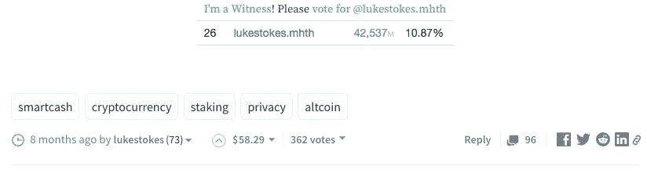

# 为“Steem Power permanent”SPP 令牌构建案例

> 原文：<https://medium.com/hackernoon/building-a-case-for-steem-power-perpetual-spp-token-e0976386a44d>

对于那些没有听说过 Steem 的人来说，它是“一种为互联网上的出版商和内容企业提供智能社交货币的协议”。

# 什么是 Steem

Steem 是为数不多的区块链项目之一，其工作产品已经使用了两年多，并且拥有超过一百万的用户(截至 2018 年 6 月 07 日 06:32:40.430Z，共有 10，27，790 名用户)。

大多数人都有一个误解，认为“www.steemit.com”与事实相差甚远。具有讽刺意味的是，甚至许多在 www.steemit.com[上创建账户的用户也没有意识到其中的区别。](http://www.steemit.com)

www.steemit.com 只是斯蒂姆·区块链的一个网站或界面。

STEEEM 是 steemit.com 等许多网站和 Dapps 的底层区块链。像[www.busy.org、](http://www.busy.org,) [推崇](https://play.google.com/store/apps/details?id=com.netsolutions.esteem&hl=en)、[https://d.tube/](https://d.tube/)、[https://www.dlive.io/](https://www.dlive.io/)、[https://join.utopian.io/](https://join.utopian.io/)和[https://alpha.steepshot.io/browse/hot](https://alpha.steepshot.io/browse/hot)这样的界面很流行

# 挑战

在使用 Steem 几个月之后，我至少能想到这个平台面临的一些挑战。但是从将 Steem/SMT 用于第三方应用的角度来看，一个重要的障碍是对你的帖子的收入潜力的时间限制。所有支出都发生在你的帖子或评论发表后的 7 天内。因此，只有你在头 7 天获得的支持票才能转化为金钱。

Steem 有 7 天的期限来决定物品的价值。我们可以从两个方面来看待它

1.  文章的生命周期是七天，这是一种共识。
2.  Steem 激励平台上的新内容。

Steem 平台上的 Upvotes 是一种反馈机制，用于决定资源池应如何在贡献者之间分配。在这种情况下，我不明白为什么我们需要为赞成票设置 7 天的限制。虽然在增值用户之间分配资源池时不考虑七天后的 upvotes，但该功能仍然存在。因此，这也引起了人们的怀疑，即该团队可能一直保持开放，以了解这种情况是如何发生的，并可能在稍后阶段开始考虑超过 7 天的投票，以分配奖励池。

# 卢克斯特克斯饲料的一个例子

比如你拿 Lukestokes 关于智能现金的帖子[https://steemit . com/smart cash/@ Luke stokes/my-smart cash-story](https://steemit.com/smartcash/@lukestokes/my-smartcash-story)

你可以看到有 58.29 美元的支出，到目前为止有 362 张选票。通过查询@steemsql，我能够发现 228 张选票导致了 58.29 美元的支出。但是有将近 134 张选票是在支付时间之后投出的。最初没有多少人知道 7 天的限制。一般来说，当他们遇到一些好的东西时，他们会在假设作者会得到一些奖励的情况下投赞成票，但事实并非如此。

# 内容的半衰期

“Fresh orange slice in half on a rustic cutting board” by [Jonathan Pielmayer](https://unsplash.com/@jonathanpielmayer?utm_source=medium&utm_medium=referral) on [Unsplash](https://unsplash.com?utm_source=medium&utm_medium=referral)

如果你考虑 facebook 帖子或推文的半衰期，7 天的限制可能是合理的。但是在斯蒂姆·区块链上的帖子可以类似于 facebook 帖子或推文，但大多数时候它们类似于 medium 上的帖子，后者长度更长，通常像评论或教程。对于这种性质的职位，7 天的期限似乎是一个限制因素。

# 这是对 Dtube 令人窒息的采用吗

即使在比较 d.tube 和 youtube.com 的时候，我认为这也是阻碍 d.tube 成为主流的一个主要缺点。作为一个视频内容创作者，你期望从视频中获得长期收入是公平的，而不仅仅是在创建视频后的第一周。如果你在 youtube 上看一些视频，你会意识到许多好的视频在很长一段时间内没有被发现，但一旦它获得动力，就会像病毒一样传播开来，打破记录。

# Steem 不应该剥夺长期创收机会的好内容

通过坚持 7 天的期限，我们限制了平台上好内容的创收机会。如果我们需要来自不同领域的严肃的内容作者和专业人士，那么我们需要解决这个问题。我们计划建立一个应用程序，因为我们的产品是以学习领域和内容为中心的，所以斯蒂姆·区块链是一个完美的人选。但由于这 7 天的限制，我们已经把它搁置，并正在寻找更好的替代方案。

# 可能的原因

对于这个限制，我只能想到几个原因。

1.  在平台的初始阶段保持这一限制是有意义的，因为新内容必须受到激励。虽然这在最初阶段可能有意义，但我认为我们现在应该摆脱这个限制。我也遇到过这样的情况，人们一次又一次地重复他们的内容，因为他们花了时间来创建帖子，但他们第一次没有找到足够的观众，尽管帖子在支付时间后得到了投票，但他们并没有因此得到任何奖励。如果我们放开这个限制，我们就可以避免内容的重复。此外，当作者知道他们的内容有更好的创收潜力时，即使他们的内容是后来才被发现的，他们也会花更多的时间在研究上，让他们的文章值得读者花时间。
2.  如果没有遵守限制，那么计算策展奖励可能会变得过于昂贵。我不确定这是否完全正确。如果开发团队的人能证实这一点，那就太好了。

# 解决方法

我不确定完全取消限制是否是一个可行的解决方案。因此，我的建议是创建一个名为“Steem Power Perpetual”的新令牌，这是对当前 Steem、SB 和 Steem Power 令牌集的补充。这可以是一种通货膨胀的货币，因此现有的奖金池不会受到影响。可以有一个单独的 SPP 代币奖励池，它将按照与 Steem Power 相似的规则进行分配，但它将计入上次 SPP 支付后的所有投票。由于这是一个额外的长期令牌，其授权期可以更长，并且为了减少计算量，可以每个月左右进行一次计算。用户将在每个月底获得这种代币，这也将给他们一种固定回报的感觉。随着文章越来越受欢迎和搜索引擎优化友好，这些文章也将有更多的范围获取更高的月支出。优质的文章是永恒的，将有更好的潜力赚取 SPP。

# 这些 SPP 代币将如何增值，价值多少。

“A one dollar bill leaning against the wall on a glossy surface” by [NeONBRAND](https://unsplash.com/@neonbrand?utm_source=medium&utm_medium=referral) on [Unsplash](https://unsplash.com?utm_source=medium&utm_medium=referral)

像其他代币一样，这个代币的价值取决于需求、供给和效用。由于这是一个额外的长期代币，人们觉得在平台上拥有高质量的永恒内容将增加平台的价值，可以开始下注这些代币。因为我有这种观点，所以我不介意从不同的作者那里购买这些代币。为了确保作者不会被锁定，我们可以在第一次转移后锁定。也就是说，第一个收到代币的人不会被锁定，但他向其出售代币的人会被锁定。我不确定这是否可行，但是大声说出想法有什么坏处

你能想到这种硬币有什么用途可以增加它的价值吗？