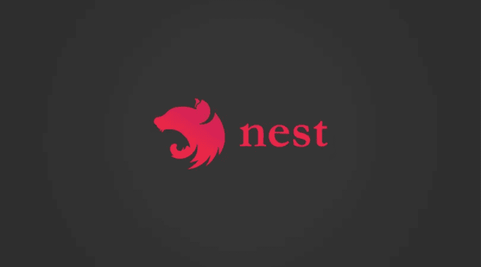

# 使用 Nest.js 和 Telegram 构建聊天机器人

> 原文：<https://medium.com/hackernoon/building-a-chat-bot-using-nest-js-and-telegram-7d043f68b5d3>


# 介绍

在本教程中，我将向你展示如何使用 [Nest.js](https://hackernoon.com/tagged/nestjs) 为 [Telegram](https://hackernoon.com/tagged/telegram) 构建一个基本的聊天机器人。这将会给你一个电报机器人如何工作以及你能用它们做什么的概述。

电报机器人是简单的帐户，不需要额外的电话号码来设置。用户可以通过命令与他们交互:直接打开聊天或通过键入 bot 的@username 直接从聊天输入字段发送请求。

# 我们将会建造什么

我们将建立一个用户名为`new-nest-bot`的电报机器人，你可以在注册一个新的电报机器人时选择你自己喜欢的名字。

[https://www.youtube.com/watch?v=qBQaX3eVsdk&](https://www.youtube.com/watch?v=qBQaX3eVsdk&)

这个 bot 被构建为使用来自应用程序后端实现的逻辑的预定义响应来响应直接发送给它的文本消息。

# 先决条件

对 TypeScript 和 Node.js 的基本理解将有助于您充分利用本教程。我假设您已经安装了 Node 和 npm，否则请快速查看 [Node.js](https://nodejs.org/en/) 和 [npm](https://www.npmjs.com/) 以获得进一步的说明和安装步骤。

此外，还需要一个电报帐户来访问电报服务，以便开始聊天或创建机器人。如果你没有账户，我推荐你使用[电报网络客户端](https://web.telegram.org/#/login)

最后，这里有一个我们将在这篇文章中使用的技术的快速概述。

*   [Nest.js](https://nestjs.com/) : 构建高效可扩展的服务器端应用的渐进式框架；旨在利用现代 JavaScript 的优势，但仍然保持与纯 JavaScript 的兼容性。



*   [Node-telegram-bot-api](https://github.com/yagop/node-telegram-bot-api) :与官方 [Telegram Bot API](https://core.telegram.org/bots/api) 交互的 Node.js 模块。

# 设置项目

首先，你需要使用 Git 在 Github 上安装 [Nest.js](https://nestjs.com/) starter 项目。为此，让我们运行一个命令，将 starter 存储库克隆到机器上一个名为`nest-telegram-chat-bot`的新项目文件夹中。打开终端或命令提示符，运行以下命令:

```
$ git clone https://github.com/nestjs/typescript-starter.git nest-telegram-chat-bot
```

继续将目录更改到新创建的文件夹中，并安装项目的所有依赖项。

```
// change directory
cd nest-telegram-chat-bot // install dependencies
npm install 
```

# 安装服务器依赖项

这个应用程序唯一需要的服务器依赖是 [node-telegram-bot-api](https://github.com/yagop/node-telegram-bot-api) 。运行以下命令进行安装:

```
$ npm install --save node-telegram-bot-api
```

# 创建一个电报机器人

我们基本上会与 Telegram bot API 进行交互。为此，您需要获得一个访问令牌。打开一个[电报 app](https://web.telegram.org/) ，搜索`@BotFather`，开始聊天。使用/newbot 命令创建一个新的 bot。在生成访问令牌之前，僵尸父亲会问你几个问题，比如名字和用户名。


按照所有说明操作，一旦完成，将为您生成一个向 Telegram Bot API 发送请求所需的令牌。如下图所示:


现在，我们已经成功地创建了一个机器人，但它目前是被动的，因为它尚未配置为响应聊天。

# 提出请求

在浏览器中打开一个新标签，通过使用以下 URL 向 Telegram bot API 发出 HTTPS 请求来测试新 Bot:

```
https://api.telegram.org/bot<YOUR_ACCESS_TOKEN>/getMe
```

这将返回一个 JSON 格式的响应，其中包含 bot 的 id、名称和用户名。

```
{"ok":true,"result":{"id":591836832,"is_bot":true,"first_name":"new-nest-bot","username":"nest_demo_bot"}}
```

# 初始化应用程序控制器

当用户在 Telegram 上与我们的机器人交互时， [Telegram 机器人 API](https://core.telegram.org/bots/api) 通过 HTTP 请求向我们的 Nest.js 应用程序发送关于交互的详细信息，并且将会发回一个响应，其中包含机器人应该如何响应的指令。让我们配置我们的应用程序逻辑。

Nest.js starter 项目安装了一个名为 app.controller.ts 的默认控制器，打开该文件并用下面的代码更新它:

```
// ./src/app.controller.ts**import** { BotService } from './bot/bot.service';
**import** { Get, Controller, Res, HttpStatus } from '@nestjs/common';

@Controller()
**export class** AppController {
  constructor(**private** botService:BotService) {}

  @Get()
  getBotDialog(@Res() res) {
    **this**.botService.botMessage();
    res.status(HttpStatus.OK).send("Bot service started");
  }
}
```

一旦我们启动了应用程序，这个控制器就会处理传入的请求并返回适当的响应。如上图，我们导入了`BotService`，并通过构造函数将其注入控制器。这是为了确保`app.controller.ts`只处理 HTTP 请求，并将复杂的逻辑抽象为服务。我们将在下一节中对此进行设置

# 配置 bot 服务

我们的`AppController`依赖于一个名为`BotService`的服务，根据特定的逻辑来响应与我们的电报机器人的交互。让我们创建这个服务。在`src`中创建一个`bot`文件夹，并在其中创建一个名为`bot.service.ts`的新文件。接下来，打开新创建的文件，将下面的代码粘贴到其中:

```
// ./src/bot/bot.service.ts**import** { Component} **from** '@nestjs/common';

@Component()
**export class** BotService {

    botMessage() {        
        process.env.NTBA_FIX_319 = "1";
        **const** TelegramBot = require('node-telegram-bot-api');

        **const** token = 'YOUR_ACCESS_TOKEN';

        **const** bot = **new** TelegramBot(token, { polling: **true** });

        bot.on('message', (msg) => {
            **let** Hi = "hi";
            **if** (msg.text.toString().toLowerCase().indexOf(Hi) === 0) {
                bot.sendMessage(msg.from.id, "Hello " + msg.from.first_name + " what would you like to know about me ?");
            }
    }
}
```

这里，我们创建了一个名为`botMessage()`的方法，在这个方法中，我们需要`node-telegram-bot-api` 模块，然后将从 BotFather 收到的`access_token`分配给一个令牌变量。这个令牌后来被用作创建新的`TelegramBot()`的参数。注意传递给新的`TelegramBot()`的第二个参数？我们在这里所做的是通过将[长轮询](https://en.wikipedia.org/wiki/Push_technology#Long_polling)配置设置为 true 来创建我们的 bot。

值得一提的是，您实际上可以通过两种方式与服务器进行交互:

1.  [Webhook](https://sendgrid.com/blog/whats-webhook/) :专用 URL 或者也可以称为 web 回调。
2.  [长轮询](https://en.wikipedia.org/wiki/Push_technology#Long_polling):这允许我们在本地运行我们的应用程序，而不需要专用服务器或外部地址。

# 注册组件

目前，我们的应用程序不能识别新创建的服务。让我们通过编辑我们的模块文件`app.module.ts`来改变这一点。为此，将服务放入`@Module()`装饰器的“组件”数组中。

```
// ./src/app.module.ts**import** { Module } **from** '@nestjs/common';
**import** { AppController } **from** './app.controller';
**import** { BotService } **from** 'bot/bot.service';

@Module({
  imports: [],
  controllers: [AppController],
  components: [BotService],
})
**export class** AppModule {}
```

# 运行应用程序

使用以下内容启动应用程序:

```
$ npm start
```

这将在 Nest.js 使用的默认端口上启动应用程序。打开浏览器并导航到 [http://localhost:3000](http://localhost:3000) 。


接下来，打开一个[电报应用](https://web.telegram.org/#/im)，搜索`new-nest-bot`或者你的电报机器人的名字，如果你碰巧选择了一个不同的名字。


现在，您可以点击开始按钮开始聊天。


如果您目前没有得到响应，不要担心，如果您在不同的选项卡中打开应用程序，只需刷新它。


# 更新服务

为了避免一直刷新页面，我们将在组件中使用 Nest.js 中名为`OnModuleInit`的生命周期事件来初始化僵尸消息方法。

```
// ./src/bot/bot.service.ts**import** { Component, OnModuleInit } **from** '@nestjs/common';

@Component()
**export class** BotService **implements** OnModuleInit {

    onModuleInit() {
        **this**.botMessage();
    }

    botMessage() {        
       ...
    }
}
```

如果开发服务器当前正在运行，重启它，然后继续尝试新的 nest-bot


你可以在 GitHub 的完整对话框中找到完整的`bot.service.ts`文件[这里](https://github.com/yemiwebby/nest-telegram-chat-bot/blob/master/src/bot/bot.service.ts)。

# 结论

在这里，我们已经能够构建一个电报聊天机器人，它对来自其他用户的聊天进行预定义的响应。目的是给你一个可以改进的通用构建模块，并构建可以做更多事情的神奇聊天机器人。

我希望本教程对您有所帮助，并为您提供了足够的信息，以便在您的组织中开始构建适合其他用例的 bot。

本教程的源代码可以在 Github 的[这里](https://github.com/yemiwebby/nest-telegram-chat-bot)找到。随意探索。