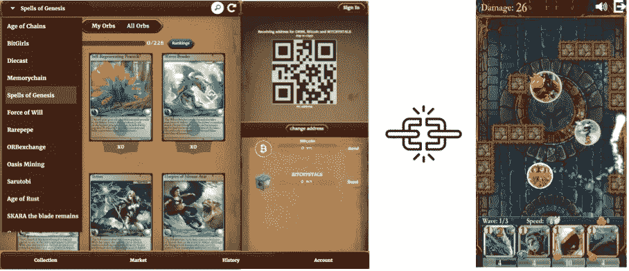

# 建立一个跨游戏项目的未来

> 原文：<https://medium.com/hackernoon/building-a-cross-game-item-future-3ce16f3aea7c>

在免费游戏经济中，游戏内物品是收入的主要驱动力**，然而我们离释放它们的真正潜力还有很长的路要走。过时的游戏设计技术让我们的物品被困在片面的游戏经济中，隐藏在应用内购买锁定的战利品盒后面。**

*如果我们把它们从这些枷锁中释放出来，让游戏中的物品在我们所有的游戏中都可以使用，会怎么样？*

**这是跨游戏道具启用的新边疆。它将创造大量的机会——不仅仅是为玩家和开发者——也为大量尚未被发现的价值创造者。**

**

*Gale Force Gif from [https://www.youtube.com/watch?v=vDf6pFx4DNw](https://www.youtube.com/watch?v=vDf6pFx4DNw)*

## *跨游戏物品的承诺*

*当你最终在堡垒之夜获得了一个*(在支付了 950 V-Bucks 并完成了几个小时的任务之后)，你实际上并没有拥有那个全新的收割工具。你只解锁了使用该物品的权限:一个与你的 Epic 登录帐户绑定的权限。**

**你对那场大风的所有权是一种幻觉，完全依赖于你对 Epic 服务器的访问。**

**更何况物品是 ***困*** 在那个生态系统里。它被设计成只在堡垒之夜内部有用，在游戏之外没有其他可能的价值。(更多详情，请参见[所有权、效用、代表权](/alto-io/what-makes-an-in-game-item-a-cryptoitem-part-1-b3802525bf20))。**

**我们已经习惯了这一点——游戏经济在历史上只对一种游戏关闭——以至于我们认为这是理所当然的。**

**想象一下另一种情况。我们在堡垒之夜获得了一件游戏内武器，比如一把 ***史诗战术猎枪*** 。它不仅仅是一个皮肤，而是一个跨游戏的物品。在获得猎枪后，它不存储在 Epic 服务器上，而是在我们的加密钱包中跟踪，从 Epic 用户帐户中移除它的依赖性。**

**一旦我们完成了又一次皇家胜利的失败，我们就可以启动团队要塞 2 了。然后，我们可以使用我们的加密钱包登录到我们的 Steam 帐户，并继续使用同一支枪作为 TF2 工程师来保卫占领点。**

****

**A glimpse of our cross-game item future — The Fortnite Tactical Shotgun used in Team Fortress 2 (source: [https://www.youtube.com/watch?v=zfbmVzFqnSQ](https://www.youtube.com/watch?v=zfbmVzFqnSQ))**

## **技术已经存在了！**

**这个场景似乎来自一个想象的电影世界，在那里我们不明白技术是如何工作的(我在看着你，[黑仔 App](https://www.rottentomatoes.com/m/killer_app/) ！)，但事实是所有的积木都已经在这里了，让我们开始建造这个跨游戏项目的未来。**

**事实上，EverdreamSoft 的[创世纪法术](https://spellsofgenesis.com/)已经实现了使用加密钱包购买游戏内物品的早期例子。在游戏中，可收藏的卡片存储在比特币区块链上，允许它们进行交易，不受游戏经济的影响。**

****

**In-game cards for Everdreamsoft’s Spells of Genesis were created using the same technology as Bitcoin, allowing them to be tradable via their other app Book of Orbs**

**另一个跨游戏项目的先驱是 Axiom Zen 的 [Cryptokitties](https://www.cryptokitties.co/) ，它在以太坊网络之上创造了游戏的猫。这些猫是使用不可替换的令牌(NFT)标准制造的，允许他们使用加密钱包进行跟踪，并可在任何游戏中使用。**

**Cryptokitties 早期的流行使它们成为跨游戏项目的第一个例子，其他开发者围绕猫有机地构建游戏，如 [Crypto Cuddles](https://cryptocuddles.com/) 和 [Kitty Hats](https://kittyhats.co/) 。**

****

**Cryptokitties are the pioneers of NFTs (Non-fungible tokens), a standard for creating items on the Ethereum blockchain. This standard makes Cryptokitties cross-game ready, and we’ve seen games such as [Crypto Cuddles](https://cryptocuddles.com/) (combat) and [Kitty Hats](https://kittyhats.co/) (cat customization) built organically around them.**

**这只是两个更受欢迎的例子，接下来几个月还会有更多的例子。区块链和 NFTs 等标准给了我们构建跨游戏物品的起点，我们想象的替代场景可能离实现不远了。**

## **平台和灰色市场**

**跨游戏物品对玩家来说是一个明确的价值主张，但是为什么开发者要让他们的物品跨游戏呢？答案在于[网络效应](https://en.wikipedia.org/wiki/Network_effect) ( [类似于 HTTP 如何使任何浏览器呈现网页，我们需要就跨游戏项目的协议达成一致。](https://medium.com/u/c97362fd5497# 1:标准</h2>

<p id=)[这里是](https://github.com/alto-io/cross-game-items)，并将构建考虑这些标准的工具。**

## **挑战 2:用户体验**

**现在最好的方法是通过钱包或者物品交换来查看你的物品。如果我们要让玩家使用跨游戏物品，我们需要一个欢迎他们的界面，而不是“太隐秘”。**

**我以前写过 crypto 的 UX 挑战赛，我相信更多的游戏开发者会关注这个领域，最终满足这个需求。**

## **挑战# 3:游戏平衡**

**当讨论跨游戏物品时，我得到的一个主要问题是“如果物品是跨游戏的，如果有人让一个物品过于强大怎么办？”**

**这是一个关于我们定义物品效用的设计讨论——我们是将它们作为元数据存储在物品中，还是为每个游戏创建单独的元数据？**

**我们对此的初步意见是后者，因为这避免了一个项目被直接压制的问题。虽然可能会有一些有趣的游戏共享物品元数据的用例，但随着标准变得更加明确，这种情况可能会改变。**

## **挑战# 4:采用**

**最后但同样重要的是，我们回到网络效应。随着越来越多的人看到跨游戏物品的价值并使用它们，我们就越能确保它的未来。**

**我们需要开始开发使用跨游戏道具的游戏，让越来越多的玩家投入到共享道具经济中。**

**作为一个深入区块链和游戏内市场生态系统的人，我看到了跨游戏物品的价值。一想到释放我们的物品，以及它们将创造的新游戏和经济机会，我就兴奋不已。**

**然而，没有足够多的玩家和开发者认识到这一点，封闭的平台也没有打破现状的动机。他们甚至[会积极地在我们的游戏和物品](https://www.polygon.com/2018/6/12/17453978/this-fortnite-account-is-associated-with-a-platform-which-does-not-allow-it-to-operate-on-switch)周围建墙 [。](https://variety.com/2018/gaming/news/valve-steam-link-ios-blocked-1202821705/)**

**我们需要推倒这些墙。**

**所以把话传出去。**

*****#freeouritems*****

***感谢您的阅读！要和我们谈论跨游戏的物品，请点击*[*Gitter*](https://gitter.im/cross-game-items/)*加入我们。更多一般密码游戏讨论，请加入* [*电报*](https://t.me/cryptogamegroup) *的密码游戏群组。***

**小插件——在 Alto，我们希望实现共享物品经济和跨游戏物品互操作性。我们与 [BlockchainGamer.biz](http://blockchaingamer.biz/) 合作发起了 [Alto 开发者挑战赛](https://contest.alto.io/)，这是一项旨在促进跨游戏物品使用的开发者挑战赛。**

****

**请点击查看比赛[，并在](https://contest.alto.io/) [Alto.io](https://www.alto.io/) 订阅我们的频道，保持联系。**

***你也可以看看我以前的帖子:***

** [## 虚拟剑、核心环和分散的加密物品经济

### 或者:一个人去很危险！拿着这个——永远保存它

medium.com](/alto-io/on-virtual-swords-core-loops-and-the-decentralized-cryptoitem-economy-7a5f3b711208)  [## 插入令牌:区块链将如何变革游戏行业

### 作为比特币和其他加密货币背后的技术，区块链不仅将改变我们的支付方式，还将改变……

medium.com](/@polats/insert-token-how-the-blockchain-will-revolutionize-the-game-industry-6af0a5afca78)  [## 让我们用区块链来构建一个去中心化的游戏经济(第一部分)

### 去中心化和创造你自己的加密货币

medium.com](/@polats/lets-build-a-decentralized-game-economy-using-blockchains-cf0a80e43da1)  [## Crypto 的 UX 挑战:或者为什么区块链需要游戏设计师

### 我第一次尝试下载以太坊钱包时，无意中在我的台式电脑上设置了一个以太坊节点…

medium.com](/cryptogamegroup/cryptos-ux-challenge-or-why-the-blockchain-needs-game-designers-ed7e47eed318)  [## 加密游戏“你好世界”:让它下雨 ERC20 代币！

### (ノ ˘_˘)ノ 。゜。ﾟ

medium.com](/cryptogamegroup/the-cryptogame-hello-world-make-it-rain-erc20-tokens-74454993ed49) 

归属:

所有提及的财产属于其各自的版权所有者。

图中的图标来自名词项目，它们有代表一切的图标！**