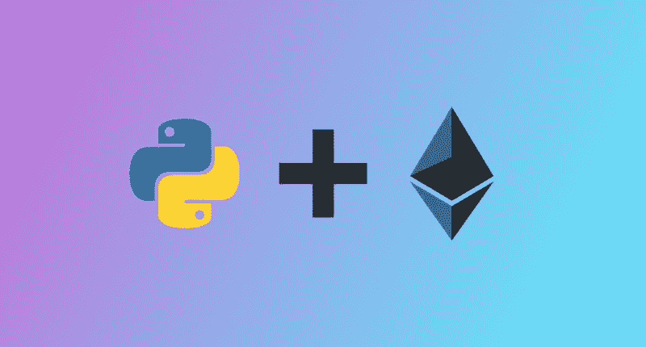

# 在没有 ICO 的情况下，将 dApp 构建成一项业务变得可行

> 原文：<https://medium.com/hackernoon/building-a-dapp-into-a-business-is-becoming-viable-without-an-ico-4876e87539e0>

## 从创业者的角度看 dApp 工具的现状。

七个月前，我决定建立一个不涉及 T2 ICO T3 的 dApp 创业公司 T1。我发现构建一个去中心化的应用程序的想法很吸引人，但是我也发现整个 ICO 环境非常糟糕/有害。我的目标是创造一个产品——而不是炒作和代币的巨大横财。所以我和我的一个朋友开始创建一个完全自举的创业公司，使用[以太坊](https://hackernoon.com/tagged/ethereum)托管智能合同进行支付(你可以在[dimpull.com](https://www.dimpull.com)查看该应用的当前状态)。在构建了应用程序的基础之后，我辞去了在美国银行的令人窒息的软件开发员的工作，全职从事这项工作。那只是几个月前的事了。现在这个应用已经上线了，我想从我作为一个全栈 web 开发人员和初创公司创始人的角度，分享一下我对 dApp 工具当前状态的完全偏颇的看法，以及一般开发人员的体验。

为了构建 Dimpull，我花了大部分时间来构建一个对现代 web 开发人员来说并不奇怪的 web 应用程序——一个 React 前端、一个 Python/Flask 后端和一个 Postgres 数据库。这些都不是区块链的技术，在很大程度上，Dimpull 也不是 dApp。但是，我没有外包支付系统(挂钩 Stripe 的 API，作为中间人保管客户的钱)，而是着手建立一个[托管](https://en.wikipedia.org/wiki/Escrow)系统，用于在以太坊区块链上转移价值。这是迄今为止开发经历中最令人兴奋和有趣的部分。

这不是一个教程。这是我在这个 dApp 开发新世界的经历记录，2018 年上半年…

## **撰写智能合同:**

这是相当无痛的，而且相当有趣。有一些关于 Solidity 的不错的教程，基本上感觉就像编写静态类型的 Javascript(嗯，比那有点沉闷，但也不坏)。Coursetro 有一个不错的短期入门课程。
一旦我有了似乎可以工作的东西，我就把我的合同发布到/r/ethdev/上，很快就从其他开发者那里得到了有用的提示。这个社区非常活跃并且乐于助人。扎实=没那么差！ **4 星。**

## 测试智能合同(这个领域的肮脏开始显现):

我开始尝试在神奇的在线 [Remix IDE](https://remix.ethereum.org/) 上测试我的合同中的功能，同时在我的机器上运行 TestRPC。我做不到。出于某种原因，每次调用传递函数时，我都会耗尽所有的能量。[松露框架](http://truffleframework.com/)的个人以太坊区块链， [Ganache](http://truffleframework.com/ganache/) ，无法支持*。transfer()* 在我的应用程序中，而没有抛出一个 *out of gas* 错误，这对于运行测试的区块链来说似乎是一个明显的错误！一旦我意识到这一点，我就使用 Remix 的 Javascript VM，并感谢区块链诸神让我的合同按照我预期的方式运行。

> **这么说检测坏了？**

没有。新版本的 Ganache 解决了我的头痛。我应该提到，当它工作的时候，它是一个很棒的工具:看着区块链在您的本地机器上运行是非常令人满意的。用 Javascript 编写[智能合约测试感觉就像为 web 应用程序编写测试——再直观不过了… **3.5 星。**](http://truffleframework.com/docs/getting_started/javascript-tests)

## **与 web3 集成(MetaMask):**

[MetaMask](https://metamask.io/) 很高明，不需要太多时间就能搞清楚基本。感谢 MetaMask 团队让与“未来分布式网络”的互动变得非常容易。看到从我的客户请求中弹出的扩展让我满心欢喜(我不是开玩笑)。诸如此类的东西让我对未来的分布式网络充满了希望。 **5 颗星。**

## **使用 web3.py 和 py-solc:**

Dimpull 不能只从客户端与区块链交互。它还需要能够从服务器调用智能合同，从托管中释放资金。似乎大多数与 web3 交互的人都是从客户端进行的，所以 web3.py 社区看起来比 web3.js 要小很多。为什么安装 PY-SOLC 不像安装 PIP 那么容易？我遇到了一个非常棘手的问题，我无法使用 web3.py，因为我无法用 python 编译我的智能合约。

好在 gitter 社区很活跃(这绝对是 dApp 界的一个主题！)由于这个社区很小，我与 py-solc repo 的维护者进行了一次长时间的故障排除会议(感谢@pipermerriam)！我的问题的解决方案是将我的 py-solc 版本从 0.4.19 降级到 0.4.17…这不是一个好兆头。\_(ツ)_/:但这很有效，所以我去了。 **2.5 星。**

## **部署到测试网络:**

我对这部分很紧张。似乎让我的智能合同进入一个实际的分布式区块链将是一个缓慢而艰苦的过程…但事实并非如此。当与 in fura 整合时，松露再次成为了一个救世主。从 Ropstem TestNet 运行 dApp 是另一个时刻，我意识到这真的很酷。我的测试交易实际上正在被挖掘，它就在区块链上，任何人都可以玩？太酷了！MetaMask 仍然是一个直观和灵活的界面；在区块链之间切换非常容易。然而，测试网并非一帆风顺。一旦你的应用程序在测试网上，调试工具几乎不存在。Etherscan 让你检查一个交易是失败了还是通过了……这很好，但是如果失败了，你也没什么办法找出原因。我将我的合同部署到 Ropsten 和 Rinkeby，当它在 Rinkeby 上不起作用时，基本上不可能找出原因。 **4.5 颗星。**

## **部署到以太坊主区块链:**

这应该很容易。毕竟，我已经将契约部署到 Ropsten 和 Rinkeby，所以我只需要做同样的过程:[使用 Truffle 通过 Infura 节点](http://truffleframework.com/tutorials/using-infura-custom-provider)部署契约(我不想自己运行一个完整的节点)。然而，我做不到。我一直在浪费汽油(大约 2.50 美元)试图使用 Infura，并收到各种 Infura 错误，如` [nonce 太低](https://github.com/trufflesuite/truffle-migrate/issues/29)`。我最终尝试通过在线 IDE Remix 进行部署，并且能够顺利完成。Infura 是一个出色的工具——但是像这样的问题令人沮丧。

但是 [Dimpull](https://www.dimpull.com/) 的托管合同已经成功部署，所以我们准备接受付款。我非常希望这是 5 颗星，但是 Infura 的不稳定性把它降低了一个等级: **4 颗星。**

# **总体:24.5/30 明星:\_(ツ)_/(足够好)**

## **我期待使用的工具:**

我还不是一个 purescript 开发人员，但是不难看出为什么以太坊栈中更强的类型会使开发过程更安全。我有幸见到了马丁·艾伦，他正在研究 purescript-web3 和鸡油菌，作为松露的替代品。我计划在不久的将来尝试一下。我非常喜欢 chanterelle 提供的配置部署的控制。

我还开始使用 [cliquebait](https://github.com/f-o-a-m/cliquebait) ，这是一个 docker 映像，它旋转了一个 geth 节点，是 TestRPC 的一个极好的替代方案。这应该是每个以太坊开发者工具包里都有的！

## **web 3 准备好创业了吗？**

我讨论了我需要使用的主要工具和系统，大致按照我在构建 [Dimpull](https://www.dimpull.com/) 时遇到它们的顺序。一路上有挫折，但也有快乐的时刻。老实说。这些工具都是全新的，处于测试的不同阶段。它们都是为了让快乐的时刻变得更容易。

整个系统真的是不可思议的，每次你得到一些工作，你会觉得你在与一些奇怪的，强大的，令人兴奋的东西互动。我不能将它与从 web 开发人员的堆栈中学习任何其他技术相比较，你真的应该构建和部署一些东西来自己感受它。*你应该现在就开始*。工具足够好，*有些很棒*，而且每天都有很多改进，这篇文章可能会在 6 个月后成为历史文物。

## **这一切有什么意义？**

Dimpull 的大部分是用“传统”网络技术构建的。但是不再需要连接到支付处理器给了我作为一名开发人员更多的权力。**我不需要连接到第三方 API 来增加转移值的能力**。在未来，你可以将每一个部分去中介化[，而不仅仅是价值转移，来制作不可阻挡的、真正去中心化的应用程序，这样*将会颠覆你对当前 web 开发栈的所有了解*。希望这能让你体验一下你现在所能期待的。](/@merunasgrincalaitis/the-ultimate-end-to-end-tutorial-to-create-and-deploy-a-fully-descentralized-dapp-in-ethereum-18f0cf6d7e0e)

如果你对这个项目感兴趣，可以去 dimpull.com[看看。 **Dimpull 是一个平台，人们可以通过它与区块链领域的专家进行 30 分钟的通话。支付由以太坊区块链上的托管智能合同支持，这很酷。**](https://www.dimpull.com/)