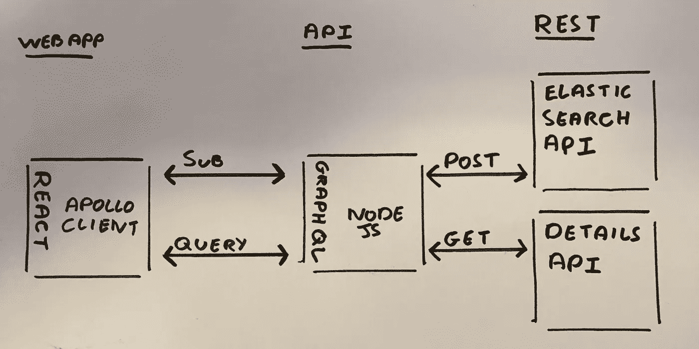

# 使用 React & GraphQL 构建仪表板

> 原文：<https://medium.com/hackernoon/building-a-dashboard-with-react-graphql-de4203eee6c9>

作为一名前端开发人员，你不可能在超过一年的时间里不承担构建某种仪表板的任务。今年，它是一个实时仪表板，全天提供实时性能洞察。

从技术角度来看，我们只有一个限制；数据必须来自弹性搜索，其余的都是待价而沽。所以，抓住公平贸易，有机的，用爱和茶制造的，让我们开始一次书呆子的冒险…

## 概观

等等，什么是弹性搜索？简单地说，它是一个 RESTful API，位于搜索和分析引擎之上。它的核心是存储您的数据，并提供一种通过查询访问数据的方式。对于这个项目的目的，我们所关心的是要求 ES 提供一些数据，并返回正确的数据。

范围:仪表板将由两个计数器、两个十篇文章的列表和一个条形图组成。复制的小部件的变化要么是数据类型，要么是时间范围。

为了使我们的 ES 查询简单快速地处理，它将只返回一个 ID 和相关的 stat。然后，我们将能够使用这个 ID 来查询一个更快、更全面的 API。

## 又一个 API

第一个决定是前端应该直接调用 ES 还是应该在中间有一个 API。API 将允许我们管理 ES 集群上的负载，并创建一个更具可伸缩性的解决方案。想象一下，10 多个客户端要求 ES 运行查询。事情要慢下来，代价很大！

考虑到这一点，我们现在需要一个 API 来获取所有必要的数据并缓存响应。一个简单的 Node.js 应用程序可以为我们实现这一点，但是我们需要通过 API 将数据暴露给前端。这就是 REST vs [GraphQL](https://hackernoon.com/tagged/graphql) 的另一场争论。我不打算在这里谈论细节，因为网上有大量的[文章](https://philsturgeon.uk/api/2017/01/24/graphql-vs-rest-overview/)。对我们来说，这提供了一个学习 GraphQL 的好机会，同时也简化了前端。

web 应用程序完全由来自该 API 的数据驱动；除了获取数据，还有最小的应用程序状态。通过选择 GraphQL 并将其与 [Apollo 客户端](https://www.apollographql.com/client/)配对，我们能够消除对 Redux 这样的状态管理系统的需求。有了这种结构，我们可以简单地将组件包装在更高阶的组件中，这些组件将注入获取状态(加载、错误、数据)和一些其他有用的功能。

## 结构

概括来说，我们有一个包含三个核心组件的 [React](https://hackernoon.com/tagged/react) web 应用程序，每个组件都可以通过 Apollo 客户端注入数据。Apollo 将通过查询一个 GraphQL 服务器来获取这些数据，该服务器只是从以前对 es 和另一个 API 的调用中解析内存中的一些数据。类似下面的内容:

## API 详细信息

这篇[教程](https://dev-blog.apollodata.com/tutorial-building-a-graphql-server-cddaa023c035)包含了构建基本 GraphQL 服务器所需的一切。以此为基础，我们可以直接从 es 中查询解析数据。

接下来，我们需要缓存这些数据，然后根据请求对其进行解析。为此，我们有一个名为 responses 的对象，它每 30 秒填充一次来自 es 查询的数据，这在服务器上作为一个连续的进程运行。graphQL 解析器只是简单地返回响应

作为额外的，我还添加了订阅，这允许 web 应用程序最初通过查询获得所需的数据，然后只订阅任何数据更改。这节省了每个组件每 30 秒重新获取数据的时间，减少了每次发送全新响应的次数，并确保了一切同步。这也意味着直到上图中的 REST 部分都是实时的，这给了我们调整其他 API 调用的选项，使数据尽可能接近实时。

## Web 应用程序详细信息

我们正在使用 React 构建我们的视图，并用我之前制作的样板文件引导它，更多细节[在这里](/@mitchclay0/creating-a-react-boilerplate-53f4a540f380)。然而，我们如上所述移除了 Redux，并添加了类型检查流程，以确保代码质量。

仪表板索引页面由多个组件组成，每个组件都可以通过将数据包装在所需的 GraphQL 高阶组件中来获取自定义数据。

## **部署**

我们正在利用由 Jenkins、Docker 和 AWS 支持的持续集成和部署设置。Jenkins 允许我们远程构建我们的项目，而 Docker 确保我们的环境是一致的，并且可以轻松地部署到本地机器上进行测试，以及部署到 AWS 上进行生产。

通过一个已部署的应用程序和 API，我们在一个易于扩展的前端和后端架构上创建了一个实时仪表板。