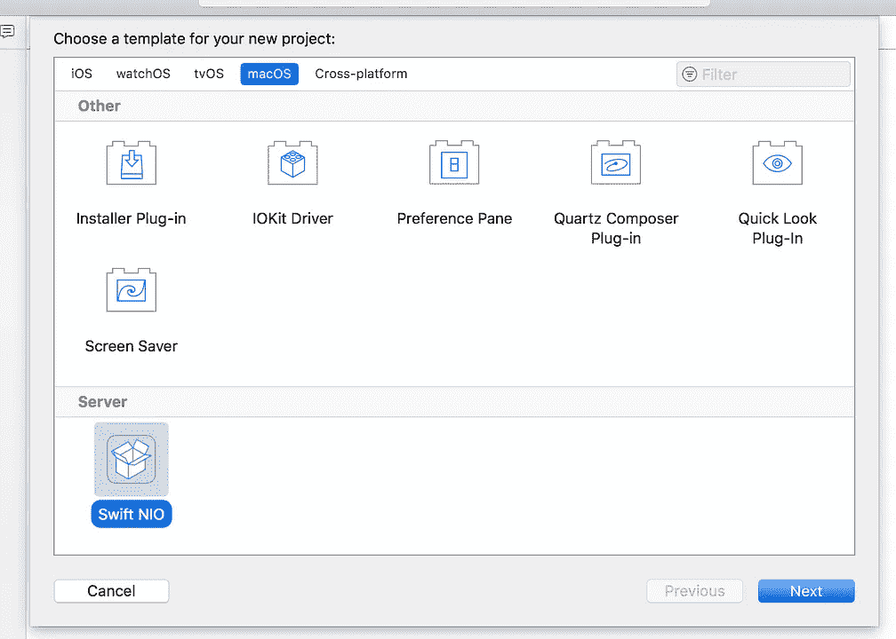
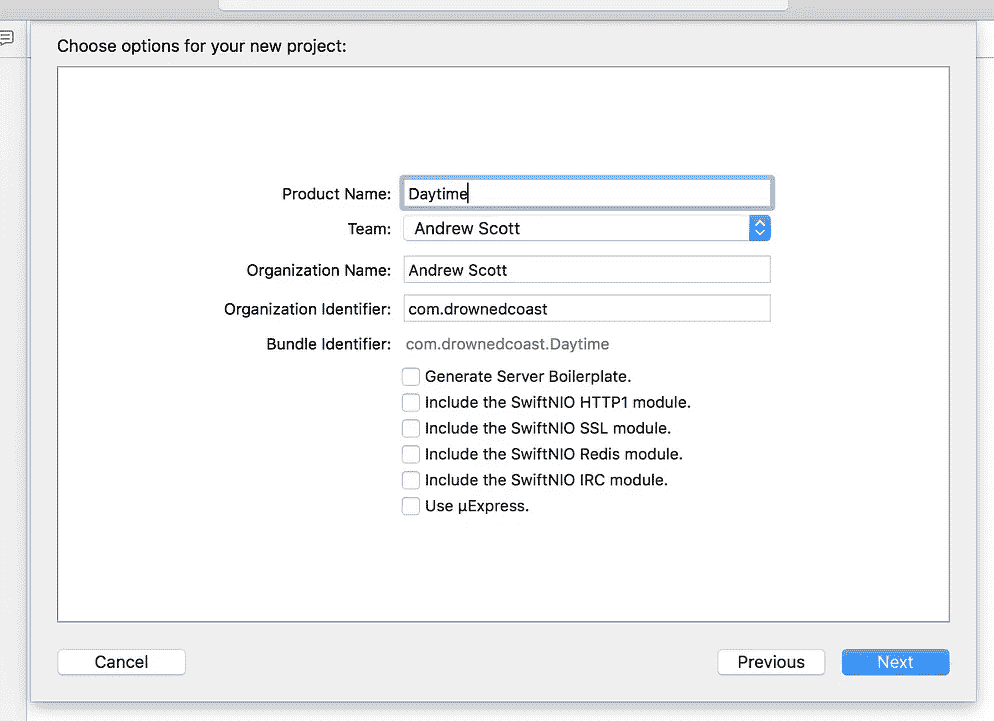
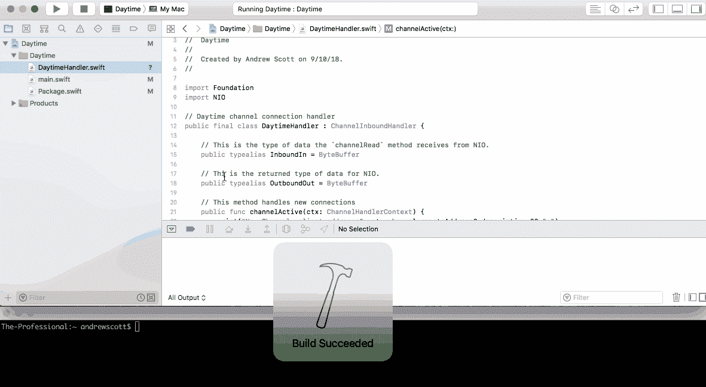
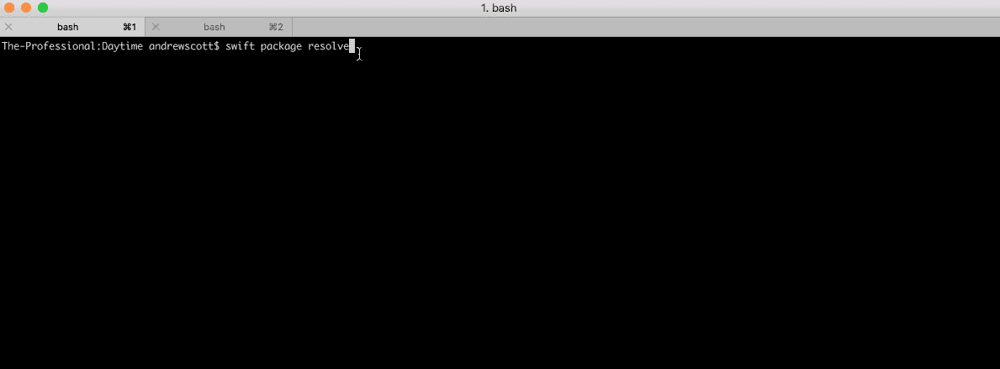

# 使用 SwiftNIO 从头构建日间服务器

> 原文：<https://medium.com/hackernoon/building-a-daytime-server-from-scratch-with-swiftnio-965fc4f013ea>


自从 Swift 1.2 发布以来，我已经在业余时间玩了几年 Swift 和 iOS/macOS 开发。虽然我仍然认为自己是一个非常敏捷的新手(不要感谢苹果对这种语言的全面改革)，但我发现这是一种非常令人愉快和强大的语言。这些年来，我甚至发布了一些 iOS 和 macOS 应用程序，并取得了不同程度的成功。

由于我的大部分专业精力都花在了后端开发上，我在很大程度上把学习 Swift 的兴趣和时间限制在了我越来越有限的“业余爱好时间”上。既然如此，当通常闭门造车的苹果公司在 2015 年宣布他们通过 A [pache License 2.0 将 Swift 释放到开源世界时，我可以理解地感到兴奋。在这个声明之后，我](https://www.theverge.com/2015/12/3/9842854/apple-swift-open-source-released) [BM](https://www.ibm.com/cloud/swift/swift) 成为了第一批通过开发一个开源 HTTP 服务器和一个名为 K [itura 的 web 服务器来投资这门语言的主要参与者之一。](https://github.com/IBM-Swift/Kitura)

自那以后，各种其他服务器[框架](https://hackernoon.com/tagged/frameworks)如雨后春笋般涌现，如 [Vapor](https://vapor.codes) 和 [Perfect](https://perfect.org) ，这两个框架似乎都在构建完善、功能丰富、文档完善的工具，用于构建围绕 Swift 构建的堆栈。我已经阅读了许多关于这些框架的评论和教程，但是我还没有机会深入研究每一个。我打算将来去。

今年三月，[苹果在东京的一次开发会议上宣布了一个异步事件驱动的网络框架](https://m.imore.com/apple-announces-swiftnio-open-source-framework-network-applications)。被称为 [SwiftNIO](https://hackernoon.com/tagged/swiftnio) 的苹果希望该框架将允许创建基于高性能 TCP/IP 的服务器和用 Swift 编写的客户端。现在，服务器端 Swift 生态系统似乎有点成熟，在将堆栈提升到一些高级 web 框架之前，深入探索 Swift 中的低级协议似乎是一个好主意。

## 什么是白天？🗓🕐

当我决定从一个较低的层次开始使用 Swift 时，我真的不知道我可以构建什么来做一个好的介绍。我遇到过一些类似的教程，但我不想明目张胆地敲竹杠，所以我决定采用可靠的决策方法，我问了谷歌。

我就是这样发现了 [Daytime](https://tools.ietf.org/html/rfc867) ，一个比我还早的超级简单的 tcp 协议(Daytime 已经超过 35 岁了)，从此被渲染成完全无用。

基本上，早在 NTP 出现之前，就有了 Daytime，这是一种 tcp 协议，它只是返回一个字符串，表示客户端在终止所述连接之前建立连接的时间。Daytime 甚至没有严格定义返回给客户机的日期格式🤐。

## 入门指南

我将假设你在 macOS 上开发，但是如果你在 Linux 上，你可以按照[这些](https://swift.org/download/)指令来设置 Swift。至于 macOS…

1.  确保 [Xcode](https://developer.apple.com/xcode/) 是最新的。你可以在 App Store 里这样做。

2.安装 brew(如果您还没有安装)

```
$ /usr/bin/ruby -e “$(curl -fsSL https://raw.githubusercontent.com/Homebrew/install/master/install)"
```

3.检查您安装的 Swift 版本。你至少需要 4.1.1

```
$ swift --version
```

4.安装 SwiftNIO

```
$ brew install swiftxcode/swiftxcode/swift-xcode-nio
```

5.更新您的 Xcode 模板以包含新的服务器模板

```
$ swift xcode link-templates
```

## 设置项目

打开 Xcode 并创建一个新项目。在模板选择对话框中，打开 macOS 选项卡，在最底部应该有一个名为服务器的部分，其中有一个名为 Swift NIO 的选项。接下来给你的项目命名，取消选择所有选项，然后点击“下一步”。



## 代码🆗

通过使用 Apple 的模板来创建项目，您应该获得一些内置代码，包括 Package.swift 和 main.swift 文件，以及让 Xcode 配置产品和部署目标。虽然这不是您从实际部署中启动脚本的方式，但对于我们的测试目的来说，这使事情变得简单了。我们可能需要稍微调整一下，以便让我们的代码既可以从 Xcode 运行，也可以从终端运行。

**Package.swift**

通过使用 Xcode 模板，这个文件将已经包含在您的项目中，看起来可能类似于我下面的例子。因为我们的日间服务器没有太多的依赖，所以我们真正需要的是 TIO。

**main.swift**

顾名思义，main.swift 是我们服务器真正的核心所在。这里我们定义了我们的 ***Server*** 类，它包含了运行我们的 TCP/IP 服务器所需的所有样板代码。

您可以在第 14 行的***Configuration***struct 中看到，我们正在赋值，比如监听主机(localhost)和端口(在我们的例子中是 1313)。

再往下一点，在第 25 行，我们在 ***init*** 函数中初始化我们的服务器。我们将传入在 ***配置*** 结构中设置的配置值，并设置 eventLoopGroup，它充当服务器上处理请求的线程池。在本例中，我将该值设置为系统上的核心数，这将使服务器获得最大数量的系统线程。

以下函数如 ***listen*** 和***listenAndWait***主要是样板代码，只是定义服务器应该如何监听连接。

这段代码中需要注意的最后一点是在***make bootstrap***函数中，在这里我们完成了服务器设置，特别是在第 84 行，我们将 DaytimeHandler 设置为接受的通道的处理程序。

最后，在第 98–99 行，我们创建了我们的服务器并开始监听服务器。

DaytimeHandler.swift

DaytimeHandler 定义了负责处理传入通道的处理程序，它通过实现***ChannelInboundHandler***协议来实现这一点。

因为我们正在实现一个已经存在的协议，所以我们将在这里覆盖该协议的默认方法。

> 注意:日间协议会丢弃任何客户端输入，并在用当前时间/日期做出响应后终止连接。

在第 16 行和第 19 行，我们将定义入站和出站数据类型。因此，如果提供了任何输入，我们期待一个 ByteBuffer，并且我们也返回一个 ByteBuffer。

接下来我们来看看第 22 行的 ***通道活动*** 函数。该函数处理新的活动连接和任何提供的输入。首先，我们将连接细节记录到 stdout，然后创建一个新的缓冲区，然后在将缓冲区写入通道之前将时间/日期字符串添加到缓冲区，并刷新通道，最后关闭通道。

***信道化*** 和 ***错误捕获*** 基本上只是在连接关闭或发生错误时处理额外的日志记录。

最后，我们在第 43 行有我们的 ***getTimestamp*** 。该方法使用 Swift 的内置日期和日期格式化程序来获取 GMT 中的当前服务器时间，并返回时间/日期的字符串表示。我还发现 [NSDateFormatter](http://nsdateformatter.com/) 是解决 Swift 中日期格式的极好资源。

## 运行服务器

**从 Xcode 运行**

这里的最后一步是运行代码。最简单的方法就是在 Xcode 中点击 run 按钮。



**从终端运行**

它也可以直接从命令行运行。您可以通过在包含 Package.swift 文件的目录中运行以下命令来实现这一点

```
$ swift package resolve
$ swift run
```



**测试**

默认情况下，macOS 上的较新版本包含 netcat (nc)。您可以通过在端口 1313(或您在 main.swift 中指定的任何端口)上连接到您的本地主机来测试日间服务器。

```
$ nc 0.0.0.0 <port>
```

## 摘要

现在你已经用一种时髦的、前沿的语言实现了一个 30 年前的 tcp 协议。在未来，我希望更深入地了解服务器端 Swift，以及它如何与其他部署技术(如集装箱化和 CI/CD 管道)一起使用。

你可以在这里找到我的完整代码。