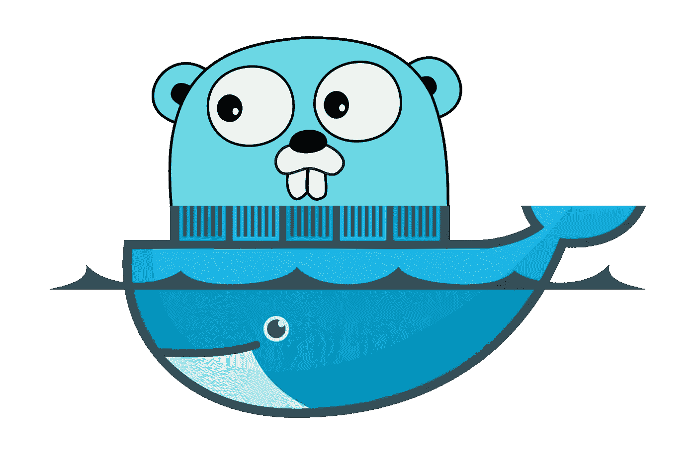

# 用 Docker 构建 Golang 开发环境

> 原文：<https://medium.com/hackernoon/building-a-development-environment-for-golang-with-docker-3ccc620c4920>

## 关注开发人员的幸福

A whale and a Gopher go to the bar

几个月前，当我发现 JavaScript 对我来说变得有点笨拙时，我开始了在 [Golang](https://hackernoon.com/tagged/golang) 的旅程。TypeScript 解决了一些问题，但是它使得 JavaScript 和 Java 一样冗长。无论如何，我已经写了将近五年的 JavaScript，我认为用不同的思维模式和[开发](https://hackernoon.com/tagged/development)范式学习一门不同的语言会很好。

刚开始，我在 Golang 遇到的最大问题是缺乏工具和现在臭名昭著的`GOPATH`需求。后者是谷歌工程师的个人喜好问题，但前者是可以解决的。

我一直在寻找能够让我在开发中轻松运行 Golang 服务的工具，就像我可以运行基于 Node.js 的应用程序一样，但我没有找到一个符合我需求的工具，所以我决定创建一个。

它使用 Docker 运行，Docker 解决了环境和版本管理问题，并使用 Makefiles 作为工具，它以映像的形式出现，基本上包含简单的 shell 脚本，有助于:

1.  启动项目
2.  测试和应用的实时重载
3.  依赖关系的自动更新
4.  静态链接二进制编译
5.  打包成暂存 Docker 映像

我称之为 Go Develop，你可以在我的 GitHub 库找到它:

 [## 泽芬策/戈朗-德夫

### 通过在 GitHub 上创建一个帐户来为 zephinzer/golang-dev 开发做贡献。

github.com](https://github.com/zephinzer/golang-dev) 

下面是一篇关于我经历的简短帖子，以及这个项目如何解决我在进入 Golang 世界时所面临的问题。

作为我试图复制的环境的参考，我使用以下 JavaScript 工具来提高我的工作效率:

1.  [NVM](https://github.com/creationix/nvm) 用于管理节点版本
2.  [纱](https://yarnpkg.com/en/)用于管理依赖关系
3.  [Nodemon](https://github.com/remy/nodemon) 用于实时重新加载我的应用程序和测试
4.  [ESLint+beauty](https://github.com/prettier/prettier-eslint)用于自动代码格式化和实时林挺
5.  [Docker 多阶段构建](https://docs.docker.com/develop/develop-images/multistage-build/)用于打包和部署应用程序

# 助推围棋项目

当启动任何项目时，通常归结为几件事:

1.  任务运行者(task runner)——在浏览了 Go 中一些项目的源代码后，Makefiles 似乎是普遍接受的方式。
2.  **一个依赖管理器** —在 Go 1.11 之前，有 Glide、Dep 和 Godep。Go 1.11 推出了`go mod`似乎是要走的路。
3.  **管理版本的一种方式** —似乎普遍接受的方式是通过 Git 标签。由于`go mod`有点新，我坚持使用 Git 标签。
4.  **投入生产的一种方式** —我处理过的 Go 应用程序一般都是云原生的，打包通常通过 Docker 容器完成。

因此，使用 Go Develop 的推荐方式是通过 Makefile，其中的`init`脚本为开发和发布提供了一个目录。它还包含了一些脚本，以一种 semver 兼容的方式撞击您的 Git 标签。

# Go 版本的管理

几乎在每一种现代语言中，总有惯用的`xVM`(其中`x`是你正在使用的语言/运行时的第一个字母)。Ruby 有 RVM，Node 有 NVM，Go 有 GVM。然而，GVM 修改了你的`GOPATH`。虽然一开始我并不介意，但在使用 GVM 的`linkthis`子命令处理不同的项目时，我很快就遇到了问题。那是我开始研究这个问题的时候，而且…这显然是许多人持续的抱怨:

 [## 不要管$GOPATH，请发出#189 moovweb/gvm

### 当我切换到不同版本的 Go 时，我不希望我的$GOPATH 被更改。$ go 版本> go 版本 go1.4.3…

github.com](https://github.com/moovweb/gvm/issues/189) 

使用 Docker，我们甚至不需要在你的机器上安装 Golang。只需参考我们想要的 Golang 版本就可以开始了！(Go Develop 从 1.11.2 开始，如果需要更早的 1.11.x 版本，我会添加对它们的支持——[在 GitHub 上给我投个问题](https://github.com/zephinzer/golang-dev/issues/new))。

作为一个好的副作用，这也意味着您不再需要在本地机器上配置`GOPATH`，只要它在映像中被正确定义。

# 代码的自动格式化

像许多从事网络相关软件工作的人一样，我称 [Visual Studio Code](https://code.visualstudio.com/) 为我选择的 IDE，它已经有了一个[令人惊讶的体面插件](https://code.visualstudio.com/docs/languages/go)，只需在你的市场中搜索“go”即可！

当 Go 语言服务器打开时，智能感知会产生奇迹，由`gofmt`执行的自动格式化会很好地完成工作。实际上，我发现它比 ESLint+prettle 组合更好——但这可能是因为 Go 本身在编译之前会强制格式化。

# 应用程序的实时重载

用了`nodemon`之后，就很难再回到手动重装了。Golang 社区有它自己的产品，比如 [Realize](https://github.com/oxequa/realize) ，我在我的专业工作中使用了一段时间。然而，它不能与主服务一起运行测试，如果您希望在编写代码和破坏东西的同时运行测试，这是很麻烦的。我仍然不得不手动运行`go test`。

然后`go mod`在 1.11 来了，打破了 Realize。一旦有了一个`go.mod`文件，实时重装甚至不会启动。这个问题仍然存在(而且不仅仅发生在 Windows 上):

 [## 无法在 windows 下使用 go mod 对 go1.11 执行“运行”操作。问题#217 oxequa/realize

### 目录:- main.go - go.mod main.go:包 main 导入" fmt" func main() { fmt。Println("hello") }开始实现…

github.com](https://github.com/oxequa/realize/issues/217) 

在 Go Develop 中，我使用了`[inotifywait](https://linux.die.net/man/1/inotifywait)`来观察所有的`*.go`文件，并对文件变化进行构建/更新 deps/kill/run 循环。然而，这意味着它不能在 OS X 或 Windows 上运行，但由于 Docker 抽象了操作系统层，这不是问题，这就是为什么从容器中运行 Go 应用程序对我来说有意义。

# 测试的实时重载

现有的工具对测试的实时重载也不公平。GoConvey 听起来很棒——除了我不想切换到浏览器来查看我的测试结果。我更喜欢 CLI。GoConvey [有自动重新加载测试](https://github.com/smartystreets/goconvey/wiki/Auto-test)的 CLI 模式，但是，失败不会将错误日志转储到终端，这让我很恼火。

Go Develop 使用与应用程序相同的`inotifywait`机制来运行测试。更多信息可在文档中找到[。](https://github.com/zephinzer/golang-dev#live-reload-live-dependency-update-live-testing-development)

# 依赖关系的自动更新

我在其他实时重载工具上遇到的另一个问题是，在我对新的东西做了一个`import`之后，我不得不切换我的终端并单独安装新的包。

虽然这在过去是不可能的，因为不同的项目使用不同的依赖管理器，但 Go 1.11 的发布看到了官方包含了`go mod`，这似乎是未来的方向(哈哈)。

在 Go Develop 中，`go mod`的使用被强制执行，这简化了其他依赖项管理器面临的问题，比如版本选择。`go mod`还有[包括与其他依赖管理器](https://github.com/golang/go/wiki/Modules#automatic-migration-from-prior-dependency-managers)的向后兼容性，这让我确信它是我们的选择。

# 二进制编译和生产打包

大多数用 Go 编写的应用程序似乎注定要打包成 Docker 映像。在我的工作中，我也必须这样做。那么，为什么不建立一个包含电池的构建机制呢？

Go Develop 就是在这种情况下编写的。在映像中运行`build`脚本会产生一个静态链接的二进制文件，可以用在临时 Docker 映像(没有指定操作系统的 Docker 映像)中，这大大减小了映像的大小。

如果静态链接和容器化不适合你，Go Develop 还允许你通过提供`GOOS`和`GOARCH`环境变量来运行你自己的操作系统。[查看文档，了解如何执行此操作](https://github.com/zephinzer/golang-dev#building-a-binary)。

# 遗言

我希望这个项目像对我自己一样对其他人有益——它被许可了麻省理工学院的许可，所以你可以用它做任何你想做的事情。

如果它确实在某种程度上帮助了你，帮我一个忙，看看这个库，表明你已经发现它在你的开发之旅中是有益的。反馈也是非常受欢迎的(我仍然是一个围棋新手，我对工具的任何改进都会有所帮助！)

您可以在 DockerHub 上找到 Docker 图片，网址为:

 [## 码头枢纽

### 编辑描述

hub.docker.com](https://hub.docker.com/r/zephinzer/golang-dev/) 

感谢阅读！

最后，我的工作团队正在扩大，如果你在新加坡，想和我一起工作，请随时打电话到[joseph_goh@tech.gov.sg](mailto:joseph_goh@tech.gov.sg)找我(:

# 欢呼**😎**