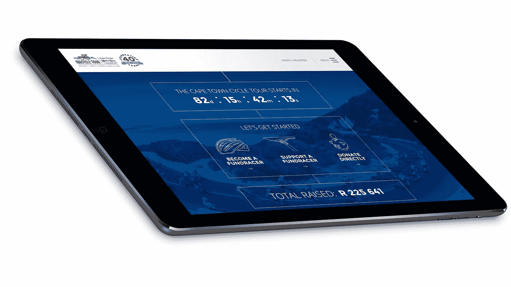
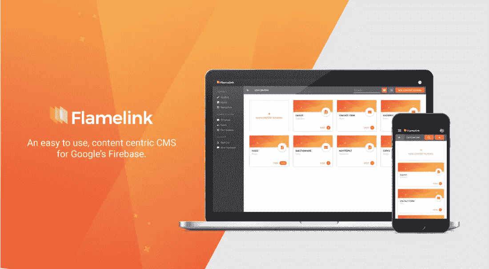

# 用 Firebase CMS 建立一个筹款平台。

> 原文：<https://medium.com/hackernoon/building-a-fundraising-platform-with-firebase-flamelink-io-a-firebase-cms-26faf0a42105>

[Flamelink.io](http://Flamelink.io) 是一款 [Firebase](https://hackernoon.com/tagged/firebase) CMS，具有易于使用的直观界面，可以轻松管理 Firebase 项目中的内容。在本文中，我们将讨论如何利用 Firebase & [Flamelink](https://hackernoon.com/tagged/flamelink) 为开普敦自行车之旅构建一个外观精美、易于使用的筹款平台。

# 机会。

开普敦自行车赛是自行车赛日历上的主要比赛之一，吸引了来自世界各地多达 35 000 名自行车手参加世界上最大的个人计时自行车赛。

这场艰苦的 110 公里比赛提供了一个机会，让骑自行车的人为了一项事业而骑自行车，并为他们最喜爱的当地慈善机构筹集资金。

# 挑战。

大多数筹款平台的用户体验和视觉呈现都很差，并且往往伴随着繁琐的注册过程。这一点，再加上比赛后追逐赞助商以确保捐款到达目标的额外麻烦，使得为慈善事业筹集资金的经历令人不快。

# 解决方法。

[CTCT Fundracers 平台](https://ctctfundracers.co.za/)让您可以轻松注册，与您所爱的人分享您的个人资料，并轻松、安全地直接接受捐赠，用于他们选择的事业。

利用 Firebase 身份验证模块创建用户配置文件和云功能来集成支付网关，从而更容易通过平台筹集资金，Firebase 使我们的团队能够比平时更快地启动后端。因为 Firebase 和 Flamelink 是前端不可知论者，所以我们在最新的角度框架中构建了开普敦自行车巡回赛 Fundracer 平台，使该网站具有现代的外观和感觉，而不是受制于预定的模板和设计。

# 结果。

Firebase 和 Flamelink 的结合使我们能够构建一个强大、安全和可扩展的筹款平台，并通过易于使用的界面轻松管理内容。随着 Fundracers 平台的核心功能和特性的到位，这可以很容易地为未来需要筹款平台的比赛和其他体育赛事进行重置和更新。

有关 Flamelink 如何帮助管理 Firebase 项目中的内容的更多信息，请访问 [Flamelink.io](http://Flamelink.io) 。

