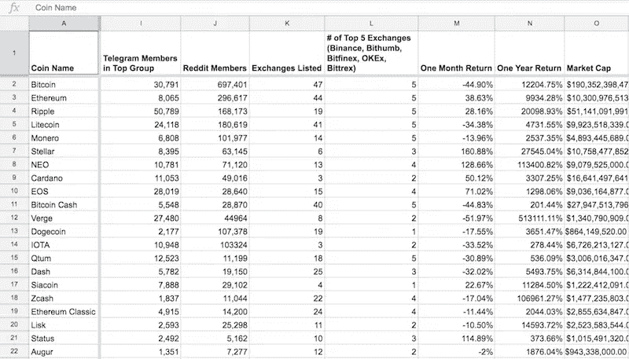
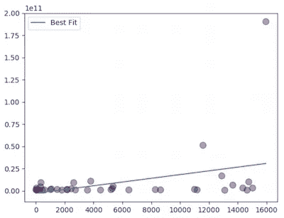
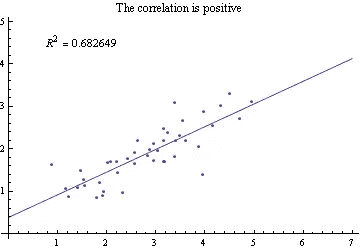
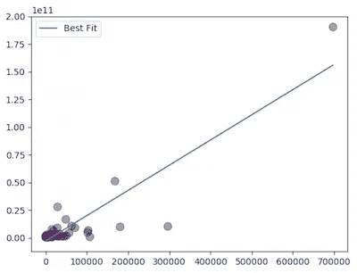
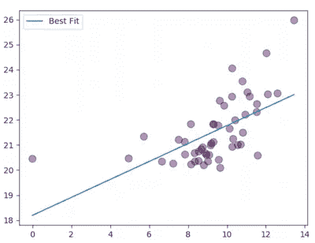
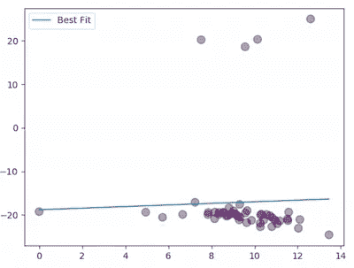
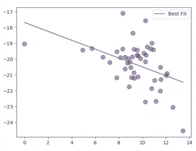

# 建立一个好的加密货币模型比你想象的要难

> 原文：<https://medium.com/hackernoon/building-a-good-cryptocurrency-model-is-harder-than-you-think-b4f590edc8e9>

随着加密货币的价值爆炸式增长，试图了解它们的也是如此。更令人兴奋的是最近[定量](https://hackernoon.com/a-framework-for-evaluating-cryptocurrencies-e1b504179848)分析的上升。电子表格模型作为评估和预测趋势的工具越来越受欢迎。

这些模型背后的努力和分析的严密性是惊人的。然而，有充分的理由说明为什么大多数顶级基金不把这作为他们评估方法的一部分。通常，没有客观的衡量标准——我要预测什么，一周内的价格？1 年？10 年？而且特征集往往不是很有预测性(我们真的那么确定 Telegram 用户的数量是未来价格的强有力指标吗？).在这个领域，很容易陷入[货物崇拜](https://en.wikipedia.org/wiki/Cargo_cult_science)分析的陷阱:一旦假设和目标被陈述并且[模型](https://hackernoon.com/tagged/model)被测试，构建复杂的模型并不那么具有预测性。

为了说明我的观点，我将遍历一个现有数据集的示例，并以我自己对令牌销售的评估结束。所有需要遵循的是一些基本的统计数据。我会把代码贴在文章的最后。

## 计算数字

为了举例，让我们使用下面的[电子表格](https://docs.google.com/spreadsheets/d/1gArufBuDdoV561w7byxvW-UieQxZhjv9jDq6aOAUwQM/edit#gid=353840556)，它的好处是非常详细和完整(对于任何摆弄数据的人来说都是天赐之物)。它跟踪了相当多直观上看起来非常有预测性的有趣指标:代码库活动(Github 贡献者/提交)、社区活动(Reddit/Telegram 成员)、交换列表和公共存在(推文、新闻提及)。和我交谈过的大多数人都把这两者的结合作为他们决策过程的主要部分。



The data we’re working with

我们可以编写一些快速代码来读取 CSV 并将其转储为一种有用的格式:跨特征空间的数字网格(我们的输入矩阵)和我们想要“预测”的数字列表(更具体地说，检查相关性)。在我们做任何数字运算之前，有一个重要的观察。有 51 行和 21 列:一吨的数据供一个低级的人处理。但是，要得出有用的结论，通常需要比这多得多的数据。我过去运行的模型已经在至少成千上万个样本上训练过了。用于训练计算机视觉算法的数据库 ImageNet 拥有超过 1400 万张图像！

我们数据集的主要问题是所谓的维度。在电子表格中，这可以看作是电子表格中的行数与列数之比。我们要找的是看起来又长又细的东西——一大堆行，但只有几列。众所周知，[网飞挑战赛](https://en.wikipedia.org/wiki/Netflix_Prize)数据集有超过 140 万行，但只有三列(用户、电影和评级)。

模型越复杂(我们拥有的列越多)，我们需要越多的样本来对数据进行归纳(我们需要添加越多的行，这样我们仍然可以相信我们的结果)。在不深入[更多细节](https://academic.oup.com/bioinformatics/article/21/8/1509/249540)的情况下，我已经内化的经验法则是[你需要的行数至少是列数的十倍](https://www.youtube.com/watch?v=Dc0sr0kdBVI&hd=1#t=57m20s)。所以，下次你看到有人用正方形的电子表格(维度与样本大小大致相同)制作模型时，你可以对他们得出的结论多一点怀疑。

回到我们的例子。51 行数据很好，但是为了保持简单(并且具有统计显著性)，让我们从检查数据对之间的相关性开始(双变量回归)。

## 看着这些数据

*以下部分有一些数字和图表。如果这真的不是你的事情，请随意跳到下一部分，“好的，那么我应该使用什么模型？”*

所以我们运行回归，它看起来像这样:

```
Total # Commits vs Market Cap R^2: 0.138249
Total # Contributors vs Market Cap R^2: 0.130249
One Month # Commits vs Market Cap R^2: 0.002144
One Month # Contributors vs Market Cap R^2: 0.091301
Telegram Members in Top Group vs Market Cap R^2: 0.159053
Reddit Members vs Market Cap R^2: 0.806415
Exchanges Listed vs Market Cap R^2: 0.298320
# of Top 5 Exchanges vs Market Cap R^2: 0.150254
# of Hashtag Tweets (30 days) vs Market Cap R^2: 0.368655
# of News Mentions (30 days) vs Market Cap R^2: 0.771270
Twitter Followers vs Market Cap R^2: 0.443522
```

对于那些不确定如何解释的人，右边的数字是最佳拟合线的决定系数[。只要我们的数据满足某些特性，我们就可以确定这条线是我们对相关性的最可能的猜测。](https://en.wikipedia.org/wiki/Coefficient_of_determination)

我们举几个例子。“提交总数”和“市值”的 R 为 0.138249。最终看起来像这样:



Total # Commits vs Market Cap

大概没太大用处。我们在寻找看起来更像这样的东西:



R 越接近 1，相关性越强。幸运的是，我们的结果有一些强有力的竞争者:“Reddit 会员与市值”为 0.81，“新闻提及次数(30 天)与市值”为 0.77。让我们来看看其中的一张图表，“Reddit 会员与市值之比”:



Reddit Members vs Market Cap

哦，不——尽管 R 相当高，但图表看起来并不像我们预期的那样。这是因为数据存在所谓的[异方差](https://en.wikipedia.org/wiki/Heteroscedasticity)——随着数字变大，数据点呈扇形散开。这是我们在风险投资数据中经常看到的，因为公司的规模以数量级增长，公司越大，差异越大。幸运的是，有一个非常简单的解决方法:在对数尺度上标准化数据。现在，情节看起来更加相关:



Reddit Members vs Market Cap on a log-log plot

```
Total # Commits vs Market Cap R^2: 0.083247
Total # Contributors vs Market Cap R^2: 0.094291
One Month # Commits vs Market Cap R^2: 0.091181
One Month # Contributors vs Market Cap R^2: 0.151921
Telegram Members in Top Group vs Market Cap R^2: 0.130186
Reddit Members vs Market Cap R^2: 0.357688
Exchanges Listed vs Market Cap R^2: 0.303370
# of Top 5 Exchanges vs Market Cap R^2: 0.395840
# of Hashtag Tweets (30 days) vs Market Cap R^2: 0.426500
# of News Mentions (30 days) vs Market Cap R^2: 0.484609
Twitter Followers vs Market Cap R^2: 0.353295
```

相关性受到了打击:“Reddit 会员与市值”的 R 值从 0.81 降至 0.36。但是这些价值观并不坏。冒着冒犯[贝叶斯](https://xkcd.com/1132/)读者的风险，对这些值“不坏”程度的更精确评估是对回归变量的系数进行[假设检验](https://en.wikipedia.org/wiki/Statistical_hypothesis_testing)。在不涉及太多细节的情况下，我们的想法是将您的模型与假设没有关系(只有一条水平线)的模型进行比较。如果有足够的证据表明添加“Reddit 成员”显著改善了模型，我们可以满怀信心地说，存在某种关系。

这一点的正式衡量标准是从 [F 统计量](https://en.wikipedia.org/wiki/F-test)中得出的 [p 值](https://en.wikipedia.org/wiki/P-value)，它代表了我们的数据完全随机生成的可能性——也就是说，如果“Reddit 会员”和“市值”之间没有实际关系。换句话说，如果 p 值非常小，我们看到的数据几乎不可能是随机生成的。这里面*肯定*有什么关系。

大多数学术研究寻找小于 0.05 或 0.01 的 p 值。事实上，我们得到的 p 值徘徊在非常接近零的数字附近。看起来一种[加密货币](https://hackernoon.com/tagged/cryptocurrency)的流行可能与它的市值有着非同寻常的关系(想象一下)！尽管开发人员的活动似乎没那么有用。

```
Total # Commits vs Market Cap p-value: 0.074861
Total # Contributors vs Market Cap p-value: 0.057240
One Month # Commits vs Market Cap p-value: 0.061724
One Month # Contributors vs Market Cap p-value: 0.014175
Telegram Members in Top Group vs Market Cap p-value: 0.009292
Reddit Members vs Market Cap p-value: 0.000004
Exchanges Listed vs Market Cap p-value: 0.000028
# of Top 5 Exchanges vs Market Cap p-value: 0.000001
# of Hashtag Tweets (30 days) vs Market Cap p-value: 0.000000
# of News Mentions (30 days) vs Market Cap p-value: 0.000000
Twitter Followers vs Market Cap p-value: 0.000007
```

但是请想一想。所有这些 p 值的意思是，你也许可以看到点在图中向右上方移动的总体趋势。这如何告知您应该购买哪些加密货币？你会买右上方的货币吗——拥有最多 Reddit 会员和最高市值的货币？你是否会买入趋势线以上的所有货币，因为每增加一名 Reddit 会员，它们的市值就相应增加？

我们已经令人厌烦地谈论了相关性——变量之间的关系。但是，事实证明预测是一个完全不同的问题。这就是[相关性与因果关系](https://en.wikipedia.org/wiki/Correlation_does_not_imply_causation)的问题所在:出现在新闻中会导致更高的市值，还是更高的市值会导致更多的新闻报道(或者两者都有)？

我们可以做一个快速的理智检查。我们不需要将这些因素与市值进行比较，而是可以将它们与电子表格制作以来市值的**变化**进行比较。当在新数据(截至 2018 年 2 月 13 日的当前数据)上运行代码时，这些图看起来不再那么有意义。



Reddit Members vs Change in Market Cap on a log-log plot

剔除异常值会使随机性更加明显。



Reddit Members vs Change in Market Cap on a log-log plot, sans outliers

现在，隐含的相关性是*负*！更多的 Reddit 用户显然会导致市值下降。我们可以将这更多地归咎于拟合噪声数据，而不是任何负面关系，正如最终的一组 p 值所证明的那样。

```
Total # Commits vs Market Cap Change p-value: 0.839070
Total # Contributors vs Market Cap Change p-value: 0.709478
One Month # Commits vs Market Cap Change p-value: 0.227949
One Month # Contributors vs Market Cap Change p-value: 0.615143
Telegram Members in Top Group vs Market Cap Change p-value: 0.019781
Reddit Members vs Market Cap Change p-value: 0.810512
Exchanges Listed vs Market Cap Change p-value: 0.311267
# of Top 5 Exchanges vs Market Cap Change p-value: 0.512172
# of Hashtag Tweets (30 days) vs Market Cap Change p-value: 0.930046
# of News Mentions (30 days) vs Market Cap Change p-value: 0.698512
Twitter Followers vs Market Cap Change p-value: 0.821432
```

这些值中的大多数都远远超出了我们的统计显著性容限，或多或少完全是随机的。有趣的是，对于可能相关的一个特征“电报会员”，相关性是负的，这意味着更多的电报会员与价格下降相关。但是，我不会想太多。我得出的唯一结论是，我们现有的数据并不能预测我们所期望的。

## 好的，那我应该用什么型号呢？

那么这意味着什么呢？我们能肯定地说 Reddit 或 Telegram 成员的数量没有预测能力吗？可惜没有。没有什么可以排除更大更全面的数据集产生的更好的模型或相关性。例如，尝试使用“电报成员的变化”作为回归变量，使用更具表现力的模型，或者将问题框定为[分类问题](https://en.wikipedia.org/wiki/Statistical_classification)。我想说的是，就目前的数据集而言，很难想象一个真正的预测模型不做一些改变。

更重要的一点是:如果你构建一个模型，从你的目标和假设的形式化开始。确保它是可测试的，更重要的是，可验证/可证伪的。如果成功了——太棒了，你现在有优势了！如果没有，回到绘图板。

通常，当预测一项资产的未来价格时，你可能会寻找[自相关](https://en.wikipedia.org/wiki/Autocorrelation)。有一整套经济工作[致力于证明这些可能存在](https://en.wikipedia.org/wiki/Technical_analysis)[以及另一套工作](https://en.wikipedia.org/wiki/Efficient-market_hypothesis)致力于反驳它。在公开股票市场，人们普遍认为价格遵循随机游走，或者更具体地说，遵循[鞅](https://en.wikipedia.org/wiki/Martingale_%28probability_theory%29) ( [与否？](http://www.turingfinance.com/stock-market-prices-do-not-follow-random-walks/))。也就是说，股票价格的预期变化不受先前价格的影响。这就是人们普遍认为股票市场无法预测的原因。根据我的一些量子基金朋友的说法，有理由相信这在加密货币市场可能还不成立。或许存在未来价格变动的预测信号(过去的价格、社交媒体活动等)。)，但结果尚未公布。充其量，这需要更多的分析。⁴

那么我们学到了什么？一些事情:

1.  我们可能认为有意义的数据可能比我们想象的要少。
2.  我们很容易欺骗自己，以为我们有一个好的策略或模型。很多时候，我们寻找并不存在的模式。这可以通过良好的数据分析来避免。
3.  定量分析很难做对。相关性是重要的第一步。但是，围绕我们真正想要做的事情，还有大量的工作:预测未来价格。

正如所承诺的，这里有一个代码的链接。你可以自己随意使用它，如果发现任何错误，请告诉我:[https://github.com/opentoken-inc/crypto-dd](https://github.com/opentoken-inc/crypto-dd)

*3 月 24 日更新:这里有几个脚注来澄清一些技术问题。*

## 脚注

1.  当考虑模型的泛化能力时，相对于样本数量的模型复杂度是应该考虑的。输入维度可能不是，但是我们在这个例子中使用它，因为可视化电子表格的形状比模型中的参数更容易。尽管输入维度和模型复杂性并不总是相同的，但在这种情况下，它们是相同的:我们正在考虑输入参数数量相同的线性模型。
2.  在实践中，你可以使用降维方法，如 [PCA](https://en.wikipedia.org/wiki/Principal_component_analysis) 来挑选一个更有意义的特征子集。这通常是对大得多的数据集进行价格预测的定量模型的早期步骤。
3.  更具体地说，您有一个在历史数据集上表现良好的回溯测试模型。然而，众所周知，经过回溯测试的模型并不能保证良好的现场性能。但是，至少，你有信心你的模型*可能*有一些预测能力。
4.  自相关可能不能直接用于价格预测，但是缺乏自相关可能意味着很难找到预测信号。