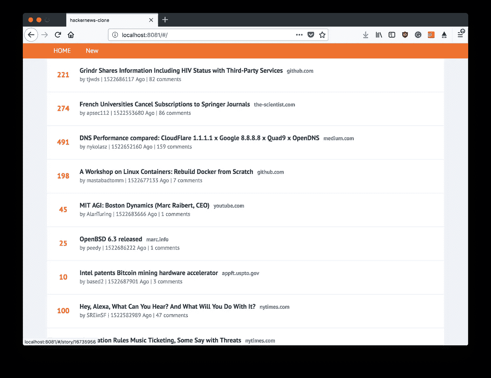

# 在 VueJS 中构建 HackerNews 克隆

> 原文：<https://medium.com/hackernoon/building-a-hackernews-clone-in-vuejs-f746b1eb2aa4>

在这个项目系列中，我们将从头开始在 [VueJS](https://hackernoon.com/tagged/vuejs) 中构建一个简单版本的 [HackerNews](https://hackernoon.com/tagged/hackernews) 。如果您希望使用该框架开发自己的应用程序，这将有望涵盖您需要熟悉的一些关键主题。

在过去的几个月里，我用 VueJS 玩了很多次，我是这个框架的超级粉丝。因此，我认为这将是 TutorialEdge 的第一个项目系列的完美基础。我希望你喜欢这个，并发现它是值得的！

在整个项目中，我们将与 [HackerNews API](https://github.com/HackerNews/API) 集成，这样我们就可以专注于前端 JavaScript 代码，而不必担心实现后端。

# 视频教程

这个项目的目标是向您展示使用 VueJS 框架构建一个完整的、全功能的前端应用程序所需的一切。我们将从设置您的项目，到点击一些 API 以检索任何文章并在我们的网站上很好地呈现这些文章，逐一介绍。

我们将讨论以下主题:

*   使用 vue-cli 设置 VueJS 项目
*   创建您的第一个组件
*   单页应用程序中路由的介绍
*   触及组件中的 API 端点
*   单页应用程序中的动态路由

如果你希望我扩展这个或者觉得我应该扩展任何东西，那么请发微博告诉我: [@Elliot_F](https://twitter.com/elliot_f)

# Github 源代码！

> 这个项目的完整源代码可以在这里找到:[Elliot Forbes/hacker news-vuejs](https://github.com/elliotforbes/hackernews-vuejs)

你可以随意偷这个，并把它用于你自己的个人利益，但是如果你最终从中赚了一百万，我希望至少有一瓶啤酒，如果你在野外偶然发现我的话！

# 成品！

在完成这个系列之后，您应该有一个看起来有点像这样的成品:

没有什么太花哨的东西，我相信你会同意，但这是一个非常好的起点，新接触该框架的开发人员可以扩展并创建他们自己的东西！

> *点击这里查看本系列的下一篇教程:* [*第 1 部分——设置您的开发环境*](https://tutorialedge.net/projects/hacker-news-clone-vuejs/part-1-setting-up-vuejs-project/)

# 教程

[第 1 部分—建立我们的 VueJS 项目 3 分钟](https://tutorialedge.net/projects/hacker-news-clone-vuejs/part-1-setting-up-vuejs-project/)

[在本教程中，我们将建立我们的基本项目，这将形成我们的 HackerNews 克隆的基础](https://tutorialedge.net/projects/hacker-news-clone-vuejs/part-1-setting-up-vuejs-project/)

[发布时间:2018 年 3 月 19 日星期一](https://tutorialedge.net/projects/hacker-news-clone-vuejs/part-1-setting-up-vuejs-project/)

[第 2 部分—创建几个组件 5 分钟](https://tutorialedge.net/projects/hacker-news-clone-vuejs/part-2-creating-few-components/)

[在本教程中，我们将为我们的 HackerNews 克隆创建一些组件，并充实我们的项目。](https://tutorialedge.net/projects/hacker-news-clone-vuejs/part-2-creating-few-components/)

[发布时间:2018 年 3 月 19 日星期一](https://tutorialedge.net/projects/hacker-news-clone-vuejs/part-2-creating-few-components/)

[第 3 部分——在我们的 App 中添加几条路线 4 分钟](https://tutorialedge.net/projects/hacker-news-clone-vuejs/part-3-adding-a-few-routes/)

[在本教程中，我们将设置我们的应用程序以使用 vue 路由器，并向我们的应用程序添加一些简单的路由。](https://tutorialedge.net/projects/hacker-news-clone-vuejs/part-3-adding-a-few-routes/)

[发布时间:2018 年 3 月 19 日星期一](https://tutorialedge.net/projects/hacker-news-clone-vuejs/part-3-adding-a-few-routes/)

[第 4 部分—访问 HackerNews API 5 分钟](https://tutorialedge.net/projects/hacker-news-clone-vuejs/part-4-hitting-an-api/)

在本教程中，我们将开始点击一些 API，并展示一些关于我们的 HackerNews 克隆版的热门故事。

[发布日期:2018 年 3 月 19 日星期一](https://tutorialedge.net/projects/hacker-news-clone-vuejs/part-4-hitting-an-api/)

[第 5 部分—观看 6 分钟的独立新闻文章](https://tutorialedge.net/projects/hacker-news-clone-vuejs/part-5-single-news-article-view/)

[在本教程中，我们将在我们的应用程序中添加更多的路线和组件，以查看单独的新闻条目和评论](https://tutorialedge.net/projects/hacker-news-clone-vuejs/part-5-single-news-article-view/)

[发布时间:2018 年 3 月 19 日星期一](https://tutorialedge.net/projects/hacker-news-clone-vuejs/part-5-single-news-article-view/)

[第 6 部分—高级组件 5 分钟](https://tutorialedge.net/projects/hacker-news-clone-vuejs/part-6-advanced-components/)

在本教程中，我们将把我们的应用程序分成更多的组件，并使用一些更高级的功能，如道具和过渡。

[发布时间:2018 年 3 月 19 日星期一](https://tutorialedge.net/projects/hacker-news-clone-vuejs/part-6-advanced-components/)

[第 7 部分—在 VueJS 应用中使用 Vuex 管理状态 7 分钟](https://tutorialedge.net/projects/hacker-news-clone-vuejs/part-7-managing-state-with-vuex-vuejs/)

[在本教程中，我们将了解如何使用 vuex 管理 VueJS 应用程序中的状态](https://tutorialedge.net/projects/hacker-news-clone-vuejs/part-7-managing-state-with-vuex-vuejs/)

[发布时间:2018 年 3 月 19 日星期一](https://tutorialedge.net/projects/hacker-news-clone-vuejs/part-7-managing-state-with-vuex-vuejs/)

[2 分钟](https://tutorialedge.net/projects/hacker-news-clone-vuejs/)

[在这个系列中，我们看看如何使用 Vue 构建自己的 HackerNews 克隆。JS](https://tutorialedge.net/projects/hacker-news-clone-vuejs/)

[发布日期:2018 年 3 月 19 日星期一](https://tutorialedge.net/projects/hacker-news-clone-vuejs/)

*原载于*[*tutorialedge.net*](https://tutorialedge.net/projects/hacker-news-clone-vuejs/)*。*