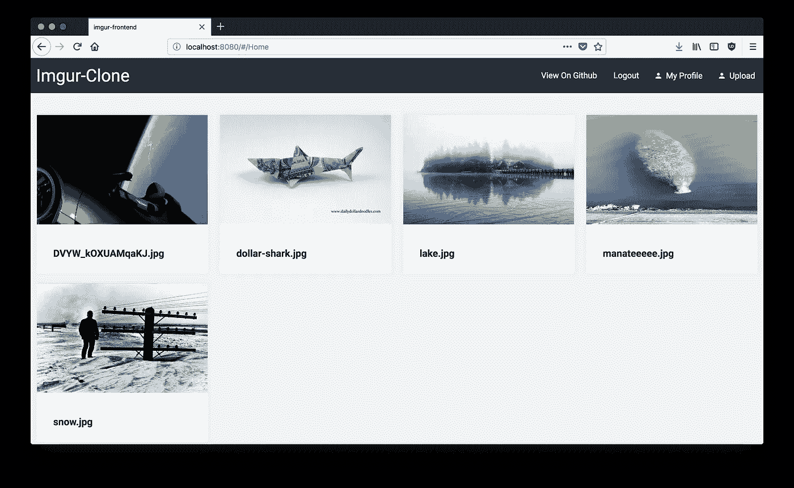

# 用 Lambda 和 S3 构建高度可伸缩的 Imgur 克隆

> 原文：<https://medium.com/hackernoon/building-a-highly-scalable-imgur-clone-with-lambda-and-s3-aaf9da422c3e>

所以我前两次试图一夜之间成为百万富翁的尝试都彻底失败了。当然，我已经设法激起了一点兴奋，但是我还没有一辆法拉利停在我家的车道上…

第三次尝试一定会成功，对吗？

我将建立一个网站，能够与流行的图像托管网站 Imgur 相媲美。这将是一个高度可扩展、弹性和低成本的解决方案，它将利用[无服务器](https://hackernoon.com/tagged/serverless) [技术](https://hackernoon.com/tagged/technology)来取得巨大成功。更具体地说，我将使用 AWS 的 Lambda 产品来托管单页面应用程序和组成站点的一系列端点。

货币化方面？我想我会等到明天看到成群结队的天使投资者来找便宜货的时候。我很快就会发射我自己的车进入轨道…


Traffic Projections.

# 要求

好的，和往常一样，我们需要定义一系列的需求，我们的项目必须遵守这些需求才能被认为是成功的。

*   该网站必须从一开始就高度可伸缩。这将确保当它成为病毒时，它不会崩溃。由于我们的端点基于 Lambda，我们不必太担心可伸缩性。
*   该网站必须有某种形式的认证/授权，这样人们就不能开始点击未经认证的端点，上传一百万张图片，破坏我们的乐趣。
*   该网站不能花费我一只胳膊和一条腿来主持！

对于一个小项目来说，这些都是可以实现的，不应该花太多时间来实现，同时也展示了 Cognito、Lambda 和 S3 的组合是多么强大。

## 延伸任务

在以后的文章中，我将对此进行扩展，这样我就可以使用 Rekognition 和 dynamodb 等服务作为认证考试的练习。

*   在以后的文章中，我们将会看到如何使用 Rekognition 从任何上传的图片中提取一系列标签。这些标签将被存储在 dynamodb 中，并允许人们查看某些类别的图像。
*   我还想实现一个评论和一个 upvote/downvote 系统，以便用户可以对网站上他们最喜欢的内容进行评论和投票。

# Vue 的前端。射流研究…

我最新的百万美元想法的前端将使用 Vue 构建。JS 2。这将允许用户登录/注册+上传新的图像到网站。它还会以真实的 imgur 风格显示网站上所有可用的图像。

0.01 版将如下所示:



Our simple frontend

## 履行

我们的前端将利用`amazon-cognito-identity-js`和`aws-sdk`节点模块与我们的 AWS Cognito 服务进行通信。为了连接到 Amazon 的 Cognito 服务，我们需要将以下信息传递到我们前端的配置文件中:

```
export default { region: 'eu-west-1', IdentityPoolId: 'eu-west-1_9IBAarCx9', UserPoolId: 'eu-west-1:853957954650', ClientId: '43duengi4ldb6jel18p84sgq22', s3SignedUrl: 'https://rvv1a9to8j.execute-api.eu-west-1.amazonaws.com/dev/upload-node'}
```

起初，将这些包含在我的前端代码中的想法有点可怕。如果你像我一样，那么你可能会想——“如果我揭露这些，那么人们将能够假装他们是我，并积累数百万美元的费用”。

但是，这些值仅用于攻击未经验证的端点，黑客不会利用它们造成任何伤害。

## 我们的认知服务

有了`amazon-congito-identity-js`库，我们可以轻松地创建注册功能、认证和验证功能。我不会贴出完整的 cognito 服务文件，但可以看看配置和注册功能:

Look at how simple creating a new user is…

完整的源文件可以在这里找到:[https://github . com/Elliot Forbes/imgur-clone/blob/master/src/imgur-frontend/src/cogn ITO/cogn ITO . js](https://github.com/elliotforbes/imgur-clone/blob/master/src/imgur-frontend/src/cognito/cognito.js)

通过在 AWS 控制台中进行一点设置，以及 140 多行代码，我们就有了一个完全正常工作的用户资料系统。当你考虑到这是多么的有弹性，并且用很少的工作就完全充实了它，这真是太棒了。我不需要定义一个模式，建立一个数据库，确保数据库的弹性或者类似的事情。我简单地配置了一个用户池，一切都很顺利。

> 在接下来的几天里，我将在我的 youtube 频道上做一个深入的教程:[https://www.youtube.com/tutorialedge](https://www.youtube.com/tutorialedge)关于如何实现你自己的 Cognito 用户管理系统。

# 我们的λ函数

现在我们已经有了一个简单的前端排序，我们需要我们的 lambda 函数，这将允许我们做一些很酷的事情，如上传文件，并检索到我们的桶中所有图像的链接。

为了实现这一点，我们需要 2 个 lambda 函数来开始。

*   一个函数，将返回一个签名的 url，这将允许我们上传到我们的 s3 桶
*   该函数将返回一个简单的 JSON 列表，列出我们的 bucket 中的所有项目。

为了部署我们的功能，我们将再次使用 serverless.com 的 cli。

# 文件上传λ函数

所以我们的“upload”函数实际上不会执行将图像上传到 s3 存储桶的操作。它本质上只是获取一个签名的 url，然后通过一个`PUT` HTTP 请求来上传到 S3。

这里需要注意一些关键的事情。我们正在创建一个`s3Params`对象，其中包括我们要上传到的存储桶名称、密钥(将是文件名)、内容类型、签名的 url 保持有效的时间以及 ACL。这个 ACL 是访问控制列表，我们需要将它设置为`public-read`,以便人们能够查看 bucket 中的图像。

然后调用`s3.getSignedUrl()`，它返回我们随后上传到的 URL。简单明了。

# 列出所有 Lambda 函数

我们的 list all lambda 函数将完成查询 s3 桶中所有对象的工作，并将它们作为 json 响应返回。

我们可以通过将所有上传的图像与 dynamo 中的一个键和一个位置相关联来进一步扩展这一点，然后让该函数返回一个分页的结果列表，但就最小可行产品而言，这就够了。

## 无服务器部署

每当需要部署我的 lambda 函数时，我都可以使用无服务器 cli 轻松完成。

在这个 serverless.yml 文件中，我可以定义 IAM 权限以及用于保护我的 lambda 函数的授权者。这些授权者将确保人们不能只是编写一些东西，然后每秒钟点击这些端点 5000 次。他们还需要注册一个帐户，并使用有效的令牌设置适当的授权头。

每当我修改一个函数时，我调用`serverless deploy`，它就部署我的无服务器帝国，并为我提供 API 端点，我现在可以用任何 HTTP 请求访问这些端点。对于我的两个函数来说，这个部署总共需要大约 10 秒钟，所以它相当快。

# 无服务器的乐趣

整个项目的主要工具之一是无服务器 cli。这极大地改进了我编写 lambdas 并随后部署它们的方式。如果你有兴趣了解更多关于如何管理你所有的 Lambda，那么我推荐你看看我的另一篇文章，题为《用无服务器管理你的 Lambda 帝国:

[](https://hackernoon.com/managing-your-lambda-empire-with-serverless-abb6a29c081e) [## 使用无服务器管理您的 Lambda 帝国

### 如果你已经关注我一段时间了，你会知道我是新的无服务器概念的超级粉丝…

hackernoon.com](https://hackernoon.com/managing-your-lambda-empire-with-serverless-abb6a29c081e) 

# 完整源代码

如果您想亲自尝试一下，可以在这里找到该项目的完整源代码:

[](https://github.com/elliotforbes/imgur-clone) [## elliotforbes/imgur-clone

### 在 GitHub 上创建一个帐户，为 imgur-clone 开发做贡献。

github.com](https://github.com/elliotforbes/imgur-clone) 

# 演示链接

你可以在这个网址找到最终产品:【**可能？NSFW**][http://imgur-server less-clone . S3-website-eu-west-1 . Amazon AWS . com/#/](http://imgur-serverless-clone.s3-website-eu-west-1.amazonaws.com/#/)

测试一下，注册一个帐户，上传一些合适的东西**！**请记住，我还没有时间去实现像密码重置这样的小事。

# 结论

这个相当简单的项目有一个功能齐全的电子邮件验证用户帐户系统。它还具有弹性和高度可扩展性，如果您试图在专用服务器上设计类似的东西，您将需要多个数据中心中的多台服务器，您将必须设置负载平衡器，并将弹性融入您的底层系统。

通过利用无服务器和 Cognito 服务，我们能够构建一个需要数月甚至数年开发工作才能在传统基础设施上达到相同标准的系统。

希望你觉得这篇文章既有趣又有教育意义！如果你喜欢这个，请在下面的评论区告诉我，或者发推特给我[埃利奥特·福布斯](https://medium.com/u/eb71d34fbe09?source=post_page-----aaf9da422c3e--------------------------------)。我也在 [LinkedIn](https://www.linkedin.com/in/elliotforbes/) 上，如果你想联系的话！