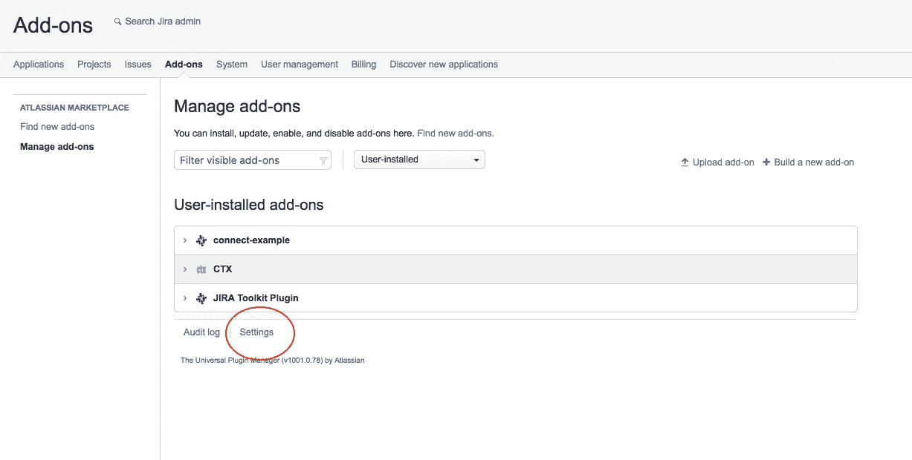

# 使用 Clojure & Atlassian Connect 构建 JIRA 集成

> 原文：<https://medium.com/hackernoon/building-a-jira-integration-with-clojure-atlassian-connect-506ebd112807>

[Atlassian JIRA](https://www.atlassian.com/software/jira) 是市场领先的问题跟踪和敏捷项目管理工具，在全球各地的公司中广泛使用。

对于 [CTX，我的团队搜索应用](https://getctx.io/)我想建立一个光滑的集成到 [JIRA](https://www.atlassian.com/software/jira) 来帮助我的客户搜索他们的 JIRA 问题以及他们的 Slack 消息，Trello 卡，文件，GitHub 问题和电子邮件。

当实际构建集成时，我对可用的[API](https://developer.atlassian.com/explore-the-apis/)感到惊喜，尤其是 [Atlassian Connect API](https://developer.atlassian.com/cloud/jira/platform/integrating-with-jira-cloud/) 及其推广的简单集成模式。

虽然有很多文档，甚至还有一个简短的关于将 Bitbucket 与 Clojure 应用程序集成的博客系列，但是我找不到一个简单的教程，在一个地方涵盖了 Connect、webhook 接口和主要的 JIRA API。

所以我写了一个。

[我们正在构建的应用程序的完整源代码可以从 GitHub 这里获得](https://github.com/getctx/connect-example)。

# 我们在建造什么？

我们将在 Clojure 中构建一个 JIRA 集成，它监听正在被创建和变异的问题，并创建一个变更的基本活动提要。

为此，我们需要一个 Clojure web 应用程序，监听 HTTPS 端点。我们将向 JIRA 注册该应用程序，每次用户创建或更新票证时，JIRA 都会在 Webhook 上向我们发送一个事件。

我们将这些记录在内存数据库中，并编写一个小的前端应用程序来轮询我们的应用程序，以显示问题的更改列表。


# 什么是亚特兰蒂斯连接？

Connect 为集成 Atlassian 应用程序(如 JIRA 和 Confluence)提供了一个简单的框架。它利用了 OAuth2 和 JWT，以及一些简单的集成模式，为开发人员提供了一种与 Atlassian API 套件对话的良好且一致的方式。


在其最基本的形式中，您所需要做的就是发布一个描述符，列出您提供的端点和您需要的服务，将您的 Atlassian 应用程序指向它，然后在列出的端点上部署一些能与 HTTP / JSON 对话的代码。

## 先决条件

首先，安装 [Leiningen](https://leiningen.org/) ，并确保它在您的路径中。如果你没有的话，给自己买一个爪哇 JDK 吧。

检查一切正常:

```
$ lein --version
Leiningen 2.8.1 on Java 9.0.4 Java HotSpot(TM) 64-Bit Server VM
```

# 基本项目设置

让我们使用 [Compojure 模板](https://github.com/weavejester/compojure/wiki/Getting-Started)创建一个基本的 Clojure 应用程序框架。

```
$ lein new compojure connect-example
$ cd connect-example
$ ls

-rw-r--r--  1 rory  Users  273 20 Mar 16:21 README.md
-rw-r--r--  1 rory  Users  483 20 Mar 16:21 project.clj
drwxr-xr-x  3 rory  Users  102 20 Mar 16:21 resources  
drwxr-xr-x  3 rory  Users  102 20 Mar 16:21 src  
drwxr-xr-x  3 rory  Users  102 20 Mar 16:21 test

$ lein ring server-headless

Retrieving lein-ring/lein-ring/0.9.7/lein-ring-0.9.7.pom from clojars  
...
2018-03-20 16:24:40.501:INFO:oejs.Server:jetty-7.6.13.v20130916  
2018-03-20 16:24:40.550:INFO:oejs.AbstractConnector:Started SelectChannelConnector@0.0.0.0:3000
```

在第二个选项卡中，使用`curl`测试它正在运行:

```
$ curl http://localhost:3000
Hello World
```

太好了！我们有一个运行的应用程序。

# 导入基本依赖项

现在我们需要在 Clojure 项目中添加一些库，让我们完成 HTTP 通信、连接流等基础工作。

在您选择的编辑器中打开文件`project.clj`，如下所示:

```
(defproject connect-example "0.1.0-SNAPSHOT"
  :min-lein-version "2.0.0"
  :dependencies [[org.clojure/clojure "1.9.0"]
                 [compojure "1.6.0"]
                 [ring/ring-defaults "0.3.1"]
                 [ring/ring-json "0.4.0"]
                 [clj-connect "0.2.4"]]
  :plugins [[lein-ring "0.9.7"]]
  :ring {:handler connect-example.handler/app}
  :resource-paths ["resources"]
  :profiles
  {:dev {:dependencies [[javax.servlet/servlet-api "2.5"]
                        [ring/ring-mock "0.3.0"]]}})
```

**:dependencies** 子句中的库为我们提供了 HTTP 服务(`ring`)、路由(`compojure`)和一个简单的包装器，包装了 JWT 技术(`clj-connect`)底层的 Atlassian Connect API &

# 连接到 JIRA

JIRA 只会通过 HTTPS 与我们的应用程序对话，所以第一个障碍是如何将它放到互联网上。

如果不设置服务器，或者使用 Heroku 之类的工具，这可能会非常耗时，所以这里有一个简单的解决方法: [ngrok](https://ngrok.com/) 。

ngrok 允许您创建一个外部可访问的 SSL 端点来测试您的集成软件。你只要像这样运行它；

```
$ ngrok tls 3000

ngrok by @inconshreveable    

Session Status                online  
Account                       Rory Gibson  
Version                       2.2.8  
Region                        United States (us)  
Web Interface                 http://127.0.0.1:4040  
Forwarding                    http://9a69173f.ngrok.io -> localhost:3000  
Forwarding                    https://9a69173f.ngrok.io -> localhost:3000

Connections                   ttl     opn     rt1     rt5     p50     p90  
                              0       0       0.00    0.00    0.00    0.00
```

它将创建一个隧道，并给你一个 URL —例如`https://9a69173f.ngrok.io`—你可以使用它来访问你的软件，该软件运行在你的开发机器上，但可以通过互联网上的 SSL 访问。

现在我们有了一个外部可发现的服务，我们可以在 JIRA 生成 OAuth 凭证。

# 为描述符服务

现在我们已经解决了所有的问题，我们可以提供连接描述符了。

这是一个简单的 JSON 文件，它声明了应用程序的功能和依赖关系，因此 JIRA(和其他 Atlassian 应用程序)知道如何与它对话。

在`<project>/resources/public/connect.json`创建一个文件，并将以下内容粘贴到其中(确保 baseUrl 属性与您的 ngrok URL 匹配):

```
{
    "key": "connect-example",
    "name": "connect-example",
    "description": "Demo JIRA / Clojure integration",
    "baseUrl": "https://9a69173f.ngrok.io",
    "authentication": {
        "type": "jwt"
    },
    "lifecycle": {
        "installed": "/installed"
    },
    "modules": {
        "oauthConsumer": {
            "clientId": "PLACEHOLDER"
        },
        "webhooks": [
            {
                "event": "*",
                "url": "/recv"
            }
        ]        
    },
    "scopes": ["READ"]
}
```

# 处理生命周期回调

Connect API 的工作方式是加载您的描述符，然后在您的应用程序上调用`/installed`作为“生命周期回调”(还有其他的，比如 Uninstalled，我们在这里忽略了)。

它想要的只是 200 的回应。

我们将使用 Compojure 和 Ring 创建一个简单的处理程序来服务这个功能(并提供基本的 API 管道)

```
(ns connect-example.handler
  (:require [compojure.core :refer :all]
            [compojure.route :as route]
            [ring.middleware.defaults :refer [wrap-defaults api-defaults]]
            [ring.middleware.json :refer [wrap-json-body wrap-json-response]]
            [ring.util.response :refer [response]]))

(defroutes app-routes
  (POST "/installed" [] {:status 200 :body "OK"}))

(def app
  (-> app-routes
    wrap-json-body
    wrap-json-response
    (wrap-defaults api-defaults)))
```

现在我们已经有了这么多，我们可以将其连接到云中的 JIRA。保存所有内容并重新启动应用程序(`lein ring server-headless`)

进入并登录您的 JIRA 实例，点击**设置**(cog 图标) **>插件**。

转到页面底部的小**设置**链接。



并确保**启用开发模式**和**启用私募**均勾选。

现在你应该看到一个到*上传插件*的链接——点击这个并在完全限定的 **HTTPS** URL 中粘贴到你的描述符(例如[https://abcd1234.ngrok.com/connect.json](https://abcd1234.ngrok.com/connect.json))


# 处理事件

一旦 Connect 连接到您的应用程序，您就会开始接收我们在描述符中指定的事件。
我们需要的只是一些处理程序和逻辑。

向路由块添加两条路由—一条供 JIRA 在事件发生时调用，一条供我们调用以列出事件。

```
(POST "/recv" req (recv req))
(GET "/events" req (response (events req)))
```

以及它们要调用的函数。

`recv`获取有效负载，提取我们想要的数据，并将其存储在服务器的`atom`中(而不是数据库，这只是一个演示:)

```
(def event-store (atom '()))

(defn persist!
  "Save event to local in-memory structure"
  [e]
  (swap! event-store conj e)
  (println e) ;; debug info for development
  e)

(defn transform
  "Get the fields we care about from the JIRA payload"
  [e1]
  (let [id        (-> e1 :issue :key)
        user      (-> e1 :user :displayName)
        timestamp (-> e1 :timestamp)
        type      (-> e1 :webhookEvent)
        summary   (-> e1 :issue :fields :summary)]

    {:user user :id id :timestamp timestamp :summary summary :type type}))

(defn handle-event
  [raw]
  (-> raw
    clojure.walk/keywordize-keys
    transform
    persist!))

(defn events
  [_]
  @event-store)

(defn recv
  "Handler function for all events"
  [req]
  (handle-event (:body req))
  {:status 200 :body "OK"})
```

重新启动应用程序

再次点击`Ctrl-C`然后点击`lein ring server-headless`。

如果您在 JIRA 更改了一个问题(比如在敏捷视图中将它从待办事项移动到完成),您应该会在您的终端中看到一些输出，因为 JIRA 调用了我们的应用程序，我们保存了数据，并使用上面的`println`将其转储到屏幕上。

点击`/events`端点检查我们正在保存数据，您应该会看到类似这样的内容:

```
$ curl http://localhost:3000/events
[{"summary":"My issue 1,"timestamp":1521891438142,"type":"jira:issue_updated","id":"TEST-1"}]
```

# 添加用户界面

太好了！我们有一个入站和出站 API。
但是大多数非开发人员不喜欢使用`curl`做任何事情，所以我们最好添加一个用户界面。

我们将在 ClojureScript 中构建一些东西，这样我们就可以在前端和后端代码库中使用相同的范例和方言。

```
$ mkdir -p src/clj
$ mv src/connect-example src/clj
$ mkdir -p src/cljs/connect-example
$ touch resources/public/index.html
```

现在将您的`project.clj`编辑为以下内容(引入新目录并添加 ClojureScript 库和构建配置)

```
(defproject connect-example "0.1.0-SNAPSHOT"
  :min-lein-version "2.0.0"
  :dependencies [[org.clojure/clojure "1.9.0"]
                 [org.clojure/clojurescript "1.10.217"]
                 [compojure "1.6.0"]
                 [ring/ring-defaults "0.3.1"]
                 [ring/ring-json "0.4.0"]
                 [rum "0.11.2"]
                 [clj-connect "0.2.4"]
                 [cljs-ajax "0.7.3"]]

  :plugins [[lein-ring "0.9.7"]
            [lein-figwheel "0.5.13"]]

  :source-paths ["src/clj"]
  :resource-pahts ["resources" "target/cljsbuild"]
  :ring {:handler connect-example.handler/app}
  :profiles
  {:dev {:dependencies [[javax.servlet/servlet-api "2.5"]
                        [ring/ring-mock "0.3.2"]]}}

  :clean-targets ^{:protect false} [:target-path "out" "resources/public/cljs"]

  :figwheel {:css-dirs ["resources/public/css"]
             :server-port 3000
             :ring-handler connect-example.handler/app}

  :cljsbuild {
              :builds [{:id "dev"
                        :source-paths ["src/cljs"]
                        :figwheel true
                        :compiler {:main "connect-example.core"
                                   :asset-path "cljs/out"
                                   :output-to  "resources/public/cljs/main.js"
                                   :output-dir "resources/public/cljs/out"}
                        }]
              })
```

创建并填写您的`resources/public/index.html`

```
<!DOCTYPE html>  
<html>  
  <head></head>
  <body>
    <div id="content"></div>
    <script src="app.js" type="text/javascript"></script>
  </body>
</html>
```

和`src/cljs/connect-example/core.cljs`...

```
(ns connect-example.core)

(let [el (.getElementById js/document "content")]
  (set! (.-innerText el) "Hello World"))
```

加载后，它会找到 ID 为`content`的`div`，并在其中输入信息。

现在让我们试着运行它，使用[令人敬畏的 Figwheel 插件](https://github.com/bhauman/lein-figwheel)；

```
$ lein figwheel

Retrieving figwheel/figwheel/0.5.13/figwheel-0.5.13.pom from clojars  
Retrieving org/clojure/core.async/0.3.443/core.async-0.3.443.pom from central  
...
Figwheel: Validating the configuration found in project.clj  
Spec Warning:  missing an :output-to option - you probably will want this ...  
Figwheel: Configuration Valid ;)  
Figwheel: Starting server at http://0.0.0.0:3449  
Figwheel: Watching build - dev  
Figwheel: Cleaning build - dev  
Figwheel: Starting server at http://0.0.0.0:3449  
Figwheel: Watching build - dev  
Compiling "main.js" from ["src/cljs"]...  
Successfully compiled "main.js" in 1.95 seconds.  
Launching ClojureScript REPL for build: dev  
Figwheel Controls:  
          (stop-autobuild)                ;; stops Figwheel autobuilder
          (start-autobuild [id ...])      ;; starts autobuilder focused on optional ids
          (switch-to-build id ...)        ;; switches autobuilder to different build
          (reset-autobuild)               ;; stops, cleans, and starts autobuilder
          (reload-config)                 ;; reloads build config and resets autobuild
          (build-once [id ...])           ;; builds source one time
          (clean-builds [id ..])          ;; deletes compiled cljs target files
          (print-config [id ...])         ;; prints out build configurations
          (fig-status)                    ;; displays current state of system
          (figwheel.client/set-autoload false)    ;; will turn autoloading off
          (figwheel.client/set-repl-pprint false) ;; will turn pretty printing off
  Switch REPL build focus:
          :cljs/quit                      ;; allows you to switch REPL to another build
    Docs: (doc function-name-here)
    Exit: Control+C or :cljs/quit
 Results: Stored in vars *1, *2, *3, *e holds last exception object
Prompt will show when Figwheel connects to your application
```

打开一个指向`http://localhost:3000`的浏览器标签，你应该会在浏览器中看到“Hello World”的消息。

> *你好世界*

# 有些人有魔法反应

ClojureScript web 开发非常关注 React 生态系统。

存在几个 React 绑定；其中最容易上手的是[朗姆酒](https://github.com/tonsky/rum)。

将以下内容添加到您的`project.clj`中的 **:dependencies** 键:

```
[cljs-ajax "0.7.3"]
[rum "0.11.2"]
```

修改`core.cljs`,使其包含 Rum 的`require`和一个组件定义(这将在底层创建一个 React 组件),然后将它安装到文档体上。

```
(ns connect-example.core
  (:require [rum.core :as rum :refer [defc mount]))

(defc label [text]
  [:div {:class "label"} text])

(mount (label "Hello again") js/document.body)
```

重启 Figwheel(在你的终端中按 Ctrl-C，然后再次按`lein figwheel`)并刷新你的浏览器，就这样——你看到的是一个 React 渲染的应用程序！

# 简单的基于列表的用户界面

现在我们有了在屏幕上放置 React UI 的基本结构，让我们用一些实际有用的东西填充它。

为了匹配上面的线框，我们将为标题设置一个 H1:

```
(defc heading []
  [:h1 "JIRA Activity Feed"])
```

和一个迭代 JIRA 问题列表的组件，所以我们将每个结果的显示称为一个“问题”。我们还将创建一些虚拟数据进行初始渲染。

```
(defc issue
  [{:keys [id summary type timestamp] :as issue}]
  [:div.issue
   [:div.id id]
   [:div.info
    [:div.title summary]
    [:div.detail type]
    [:div.date timestamp]]])

(defc issues
  [is]
  [:div.issues
   (map issue is)])

(def fake-issues '({:id "FOO-1" :summary "The Title" :type "jira:issue_updated" :timestamp 123456789}))

(defc content
  [data]
  [:div.container
   (heading)
   (if data
     (issues data)
     [:div "No activity found in feed."])])

(mount (content fake-issues) (.getElementById js/document "content"))
```

保存所有东西，重新加载你的浏览器，你应该会看到一个非常基本的列表和标题。

这可能需要一些样式，所以让我们对`index.html`做如下调整:

```
<!DOCTYPE html>  
<html>  
  <head>
    <link rel="stylesheet" href="/site.css" />
  </head>
  <body>
    <div id="content"></div>
    <script src="cljs/main.js" type="text/javascript"></script>
  </body>
</html>
```

用一些简单的样式创建一个文件`resources/public/css/site.css`:

```
body {  
  font-family: sans-serif;
}

.container {
  margin-left: auto;
  margin-right: auto;
  padding-top: 30px;
  width: 800px;
}

div.issue {  
  font-size: 16px;
  width: 600px;
  border: solid black 1px;
  padding: 1em;
  margin-bottom: 1em;
}

.issue .id {
  font-weight: bold;
  float: left;
  width: 75px;
  height: 50px;
  text-align: center;
  padding: 1em .5em 0 0;
}

.issue .info {
  height: 100%;
}

.issue .summary {
  font-weight: bold;
  padding-bottom: 0.5em
}
```

再次重启`lein figwheel`并重新加载，一切都应该是完美的。

> ***NB:*** *一旦到了这个阶段，Figwheel 最牛逼的好处就来了 ClojureScript 和 CSS 文件的热自动重载。只需保存在编辑器中，浏览器就会自动更新！*

# AJAX 通信

现在让我们通过用户界面向服务器端查询我们的 JIRA 信息…

添加一个新的`require`，使`core.cljs`的顶部看起来像这样:

```
(ns connect-example.core
  (:require [rum.core :as rum]
            [ajax.core :refer [GET]]))
```

然后让我们添加一个函数来获取和显示数据(并实际调用该函数来进行显示)

删除现有的`mount`表单，并将其添加到`core.cljs`的末尾:

```
(defn handler [data]
  (mount (content data) (.getElementById js/document "content")))

(fetch-issues handler)
```

最后，让浏览器应用程序每 5 秒钟轮询一次服务器以更新提要。

```
(js/setInterval
  #(fetch-issues handler)
  5000)
```

# 我们得到了什么？


我们已经构建了一个动态更新的 ClojureScript React 应用程序，显示来自 JIRA 的实时变化。

事实证明，通过 Atlassian Connect 将 Clojure 应用程序与 JIRA 集成起来非常容易。

显然，我们在这里建立的只是一个生产应用程序的最基本的开端；在现实生活中，您可能希望使用 Connect API 内置的 JWT 功能来检查入站事件的有效性，并且您至少希望有某种适当的数据库来保存您的数据。

记住——这个应用程序的完整源代码在 GitHub 上，供你参考:[https://github.com/getctx/connect-example](https://github.com/getctx/connect-example)

# 还有一件事…

如果你喜欢你在这里看到的，请检查我们的应用， [CTX，让你和你的团队搜索你的应用](https://getctx.io/)像 JIRA，特雷罗，Slack，GitHub，谷歌驱动，电子邮件和更多的一击。我们提供免费试用，不需要信用卡。
谢谢！

*原载于 2018 年 3 月 24 日*[*getctx . io*](https://getctx.io/blog/building-an-atlassian-connect-integration-with-clojure/)*。*