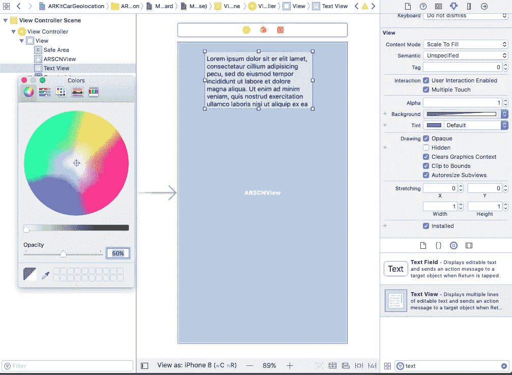

# 用 ARKit、CoreLocation 和 Pusher 构建定位应用

> 原文：<https://medium.com/hackernoon/building-a-location-app-with-arkit-corelocation-and-pusher-bee44fdec44f>


> 披露:[为开发者提供实时 API 的 Pusher](https://goo.gl/52hnDL) ，此前曾赞助过黑客 Noon。

增强现实(AR)有很多有趣且实用的用例。其中之一是位置。

在 iOS 11 中，使用 ARKit 创建 AR 应用程序并将其与多个库相结合的能力打开了很多可能性。

在本教程中，我们将结合 ARKit、CoreLocation 和 Pusher 的力量来创建一个地理定位 AR 应用程序。

让我们想想出租车服务。一些服务允许你在地图上跟踪将要接你的汽车，但如果有一个 ar 视图来查看汽车的路线以及它是如何靠近你的，这不是很好吗？

大概是这样的:

正如您所看到的，在 ar 世界中定位汽车的信息并不总是准确的，无论是在 CoreLocation 端还是在 ARKit 端，但是，对于这个用例，大多数时候这就足够了。

这是你需要的:

*   采用 A9 或更高版本处理器的设备(iPhone 6s 或更高版本、iPhone SE、任何 iPad Pro 或 2017 款 iPad)
*   iOS 11
*   [Xcode 9.1](https://developer.apple.com/download/) (或更新版本)
*   汽车的 3D 模型(DAE 格式)

你可以在像 [Free3D](https://free3d.com) 、 [Turbosquid](https://www.turbosquid.com/) 或[谷歌的 Poly](https://poly.google.com) 这样的网站上找到免费的 3D 模型。

最常见的格式是 OBJ(其纹理定义在 MTL 文件中)，可以使用 Blender 之类的程序将其转换为 DAE。

对于这个项目，我选择了[这个型号](https://free3d.com/3d-model/low-poly-car-40967.html)，它有 DAE 格式。

这个项目的数学有点难。我将花更多的时间来解释与地理定位相关的操作，而不是用 ARKit 旋转和平移模型。

如果你不知道转换矩阵或者如何将你的 3D 模型转换成 DAE 格式，看看我以前的关于 ARKit 的教程。

作为参考，这个项目的源代码在 [Git](https://github.com/eh3rrera/ARKitAnimation) [Hub](https://github.com/eh3rrera/ARKitCarGeolocation) 上。

先来设置一个推送 app。

# 设置推动器

如果你还没有，在[推送器](https://pusher.com/)创建一个免费账户。然后，转到您的仪表盘，创建一个应用程序，选择一个名称、离您最近的集群和作为您的前端技术的 *iOS* :


这将为您提供一些开始使用的示例代码:


保存你的应用 id、密钥、密码和聚类值。我们以后会需要它们。

最后，转到*应用设置*选项卡，选中选项*启用客户端事件*并点击*更新*:


通过这个应用程序，司机将发送他们的位置作为纬度/经度坐标，以及他们前进的方向(以度为单位)，作为客户端[事件](https://pusher.com/docs/client_api_guide/client_events)。

但是先不要操之过急，先把 Xcode 项目设置好。

# 设置项目

打开 Xcode 9，创建一个新的*单视图应用*:


我们选择此选项是因为我们将手动设置 AR 视图以及其他控件。

输入项目信息，选择 *Swift* 作为语言:


创建项目并关闭它。我们将使用 [CocoaPods](https://cocoapods.org/) 来安装项目的依赖项。打开一个终端窗口，转到项目的根目录，如果您没有安装 CocoaPods(或者如果您想更新它)，请执行:

```
sudo gem install cocoapods
```

安装后，使用以下命令创建文件 Podfile:

```
pod init
```

编辑该文件，将平台设置为 iOS 11，并将 [Pusher 的 Swift 库](https://github.com/pusher/pusher-websocket-swift)添加为项目的依赖项；

```
# Uncomment the next line to define a global platform for your projectplatform :ios, '11.0'target 'ARKitCarGeolocation' do# Comment the next line if you're not using Swift and don't want to use dynamic frameworksuse_frameworks!# Pods for ARKitCarGeolocationpod 'PusherSwift', '~> 5.1.1'end
```

编辑完 Podfile 后，执行以下命令来安装依赖项:

```
pod install
```

如果没有安装版本 5.1.1(或更高版本)(安装的输出将告诉您已安装的版本),您可以使用以下命令更新您的 CocoaPod 存储库并安装最新版本的库:

```
pod install --repo-update
```

现在打开 Xcode 工作空间，而不是项目文件。工作区已经配置了相关性:

```
open ARKitCarGeolocation.xcworkspace
```

如果此时构建项目，可能会出现一些警告，但是操作应该会成功。

接下来，选择 Info.plist 文件，添加一行类型为*Privacy-Camera Usage Description*(`NCameraUsageDescription`)的内容，并对其进行描述。这是 ARKit 访问摄像机所必需的。

我们还需要一行类型为*Privacy-Location When In Use 用法描述* ( `NSLocationWhenInUseUsageDescription`)的数据，这是从您设备的 GPS 获取位置所必需的(仅当应用程序正在使用时，而不是一直使用):


最后，配置一个团队，以便您可以在您的设备上运行应用程序:


现在让我们来构建用户界面。

# 构建用户界面

转到 Main.storyboard 并将一个 *ARKit SceneKit 视图*拖到视图中:


接下来，向该视图的所有边添加约束，使其充满整个屏幕。您可以通过按下`ctrl`键，同时从`ARSCNView`向父视图的每一侧拖动一条线，并选择超级视图的前导、顶部、尾部和底部，值为`0`:


接下来，添加一个文本视图，并在*属性检查器*中禁用其*可编辑*和*可选*行为


改变它的背景颜色(我选择了一个白色和`50%`不透明):



添加值为`90`的高度约束以及值为`0`的前导、顶部和尾部约束，使其保持固定在屏幕顶部:


在`ViewController.swift`中导入 ARKit:

```
import ARKit
```

然后，创建两个`IBOutlet`，一个到场景视图，另一个到文本视图:


你已经准备好开始编写应用程序了，但在此之前，让我解释一下需要做什么。但是，如果您已经熟悉地理定位概念或者不感兴趣，可以跳过下一部分。

# 了解应用程序的工作原理

想象你正站在世界的某个地方。你看的地方或方向并不重要。

你的位置由两个数字给出，纬度和经度。

纬度是北极或南极与赤道(地球两极中间的假想圆)之间的距离。赤道以北的地方从`0º`到`90º`，赤道以南的地方从`0º`到`-90º`。

经度是从本初子午线(一条从北到南穿过英格兰格林威治的假想线)到西方或东方一点的距离。本初子午线以东的地方从`0`到`180º`，本初子午线以西的地方从`0º`到`-180º`。

例如，如果你在巴西，你的纬度和经度将是负的，因为你在地球的西南方:


例如，如果你在日本，你的纬度和经度将是正的，因为你在地球的东北面:


该应用程序将考虑您和驾驶员在经纬度坐标系中的位置:


但是如果对你来说比较容易，你可以把你的位置想象成原点(`0`，`0`):


你需要计算两件事:

*   你和司机之间的距离
*   地球北(或南)线与你和驾驶员连线的夹角，称为[方位](https://en.wikipedia.org/wiki/Bearing_(navigation))。


距离会告诉你在 ar 世界中你必须定位 3D 模型多远。

方位角将帮助您创建旋转变换，以在上述距离的正确方向上定位您的模型。

如果我们谈论的是一个简单的 x 和 y 坐标系统，我们可以通过应用[勾股定理](https://en.wikipedia.org/wiki/Pythagorean_theorem)和一些简单的三角学，以及[正弦](https://en.wikipedia.org/wiki/Sine)和[余弦](https://en.wikipedia.org/wiki/Law_of_cosines)运算来获得这些计算。

但是我们谈论的是地球的纬度和经度。由于地球不是一个平面，数学变得更加复杂。

通过调用类 [CLLocation](https://developer.apple.com/documentation/corelocation/cllocation) 的[方法](https://developer.apple.com/documentation/corelocation/cllocation/1423689-distance)来计算距离。它使用[哈弗辛公式](http://www.igismap.com/haversine-formula-calculate-geographic-distance-earth/)，该公式从两个不同的纬度/经度值对中，通过沿着地球曲率在它们之间描绘一条线来计算距离。

另一方面，我们必须手动计算两个不同纬度/经度值对之间的方位角。[这是公式](http://www.igismap.com/formula-to-find-bearing-or-heading-angle-between-two-points-latitude-longitude/):

```
atan2 ( X, Y )
```

其中`X`等于:

```
sin(long2 - long1) * cos(long2)
```

并且`Y`等于:

```
cos(lat1) * sin(lat2) - sin(lat1) * cos(lat2) * cos(long2 - long1)π
```

另一件要考虑的事情是，对于矩阵变换，你必须使用[弧度](https://en.wikipedia.org/wiki/Radian)而不是度作为角度单位。由于一整周的长度等于 2π弧度(`360º`，一弧度等于 180/π度。

这就是计划。

使用 Pusher，司机将实时发布他们的位置和前进方向。

使用 CoreLocation，AR 应用程序将获得您的位置。它还会监听司机的位置更新。

当收到位置更新时，使用上面解释的公式，应用程序将在 ar 世界中相对于您的位置放置一个汽车的 3D 模型，并将模型定向到司机前进的相同方向。

该应用程序只会获取你的位置一次，所以它假设你的位置是固定的(大多数情况下都是如此)。

此外，一个箭头表情符号(⬇️)将一直显示在模型的顶部，这样你就可以很容易地发现它，你在最后一部分添加的文本视图将显示应用程序的状态以及你和汽车之间的距离。

既然你知道该做什么，让我们进入代码。

# 使用 ARKit 和 CoreLocation 构建应用程序

让我们从定义两个扩展开始。

一个提供所有浮点类型的弧度和度数的转换方法。创建一个新的 Swift 文件`FloatingPoint+Extension.swift`，内容如下:

和另一个从字符串创建图像的扩展。创建另一个 Swift 文件`String+Extension.swift`，内容如下(摘自此 [StackOverflow 回答](https://stackoverflow.com/a/47164529/3593852)):

您将使用这个扩展用箭头表情符号(一个字符串)创建一个图像。它创建了一个宽度为`100`高度为`100`的矩形，背景透明，在其中绘制字体大小为`90`的字符串。

接下来，打开*新建文件*对话框，向下滚动选择*资产目录*类型:


输入`art.scnassets`作为文件名(确认使用扩展名`scnassets`):


现在将您的模型复制到这个文件夹:


打开场景图视图，选择模型的主节点，在 properties 选项卡中，给它一个名称，您将使用该名称在代码中引用它:


回到`ViewController.swift`，让我们添加我们需要的`import`语句:

控制器将使用的代理:

接下来，让我们添加一些实例变量。

首先，一个`CLLocationManager`请求用户位置，另一个变量存储它:

然后，一个变量存储司机前进的方向、他们与用户之间的距离以及应用程序的状态:

每当设置距离或状态的新值时，文本视图将会更新。请注意，距离是以米计算的。

接下来，使用一个变量来存储汽车模型的根节点和该节点的名称，该名称应该与您在 SceneKit 编辑器中设置的名称相同:

您还需要该节点的原始(第一个)转换:

为什么？

以尽可能好的方式计算模型的方向(旋转)。

理想情况下，驾驶员的设备将始终为您提供正确的方向，以便您可以获取第一个接收到的读数，在该方向上旋转模型，然后计算相对于第一个旋转的下一次旋转。

然而，如果第一次读数是错误的(这种情况有时会发生)，即使其余的读数都是正确的，接下来的旋转也会是错误的。

因此，您总是需要计算方向，就好像这是您第一次旋转模型一样，因为一旦您将模型旋转到某个角度，随后的旋转将相对于该角度进行。由于变换的工作方式(矩阵乘法)，将旋转重置为`0º`也不起作用。

最后，您需要存储 Pusher 对象和通道来接收更新:

注意`authMethod`选项的值。

你将通过私人频道接收更新。它们需要被服务器认证。然而，在开发时，您可以使用`inline`选项来绕过设置一个认证端点作为服务器一部分的需要。

你可以在这里了解更多关于物体的选项[。如果需要，您可以在这个页面](https://github.com/pusher/pusher-websocket-swift#configuration)上学习如何创建一个[认证端点。](https://pusher.com/docs/authenticating_users#implementing_endpoints)

在`viewDidLoad`功能中，设置 SceneKit 场景和位置服务:

接下来，配置 AR 会话:

选项 [gravityAndHeading](https://developer.apple.com/documentation/arkit/arconfiguration.worldalignment/2873776-gravityandheading) 会将 y 轴设置为设备检测到的重力方向，将 x 轴和 z 轴设置为定位服务测量到的经度和纬度方向。

对于用户位置，当他们授权使用定位服务时，您必须请求位置(使用 [requestLocation](https://developer.apple.com/documentation/corelocation/cllocationmanager/1620548-requestlocation) 方法，因此位置只被请求一次):

一旦接收到用户的位置，获取数组的最后一个元素，更新状态，并连接到 Pusher(在获得用户位置之前连接到 Pusher 是没有意义的，因为所有的计算都是错误的):

在方法`connectToPusher`中，您订阅`private-channel`，当接收到客户端新位置事件时，提取驾驶员的纬度、经度和方向，并使用方法`updateLocation`更新 3D 模型的状态和位置:

在`updateLocation`中，创建一个 [CLLocation](https://developer.apple.com/documentation/corelocation/cllocation) 对象来计算用户和驾驶员之间的距离。记住[距离](https://developer.apple.com/documentation/corelocation/cllocation/1423689-distance)是以米计算的:

如果这是收到的第一个更新，`self.modelNode`将会是`nil`，所以你必须实例化这个模型:

接下来，您需要将模型的[枢轴](https://developer.apple.com/documentation/scenekit/scnnode/1408044-pivot)移动到 y 轴的中心，这样它就可以在不改变位置的情况下旋转:

保存模型的变换以计算未来的旋转，定位它，并将其添加到场景中:

注意，不需要创建一个 [ARAnchor](https://developer.apple.com/documentation/arkit/aranchor) 来添加节点作为它的子节点。ARAnchor 使您能够跟踪模型相对于相机的位置和方向。

但在这种情况下，最好直接和孩子一起工作。主要是因为您不能手动删除或更改整个`ARAnchor`的位置——只能删除其子节点。

最后，从表情符号创建箭头，将其放置在汽车的顶部(使用 y 轴，我通过反复试验获得了该值)，并将其添加为模型的子元素(因此它会一直伴随着它):

这是`makeBillboardNode`方法的定义(取自这个 [StackOverflow 答案](https://stackoverflow.com/a/44403042/3593852)，修改了平面的宽度和高度，以便可以正确地看到箭头):

现在，如果这不是第一次更新，你只需要定位模型，动画运动，使它看起来很好:

要定位模型，只需先旋转，然后将其平移到正确的位置并缩放:

顺序很重要，因为矩阵乘法是如何工作的(`a*b`与`b*a`不同)。

在 ARKit 中，y 轴上的旋转是逆时针的(并以弧度处理)，所以我们需要减去`180º`，使角度为负。这是方法`rotateNode`的定义:

我按距离的比例缩放节点。它们成反比——距离越大，比例越小。在我的例子中，我只是将`1000`除以距离，不允许该值小于`1.5`或大于`3`:

我从反复试验中得到了这些值。它们会根据您使用的型号而有所不同。

要转换节点，您必须计算转换矩阵并从该矩阵中获取位置值(从其第四列，由从零开始的索引引用):

要计算转换矩阵:

*   你用一个单位矩阵(不一定要用相机的矩阵之类的，司机的位置和方位是独立于你的位置和方位的。
*   您必须使用上一节中解释的公式来计算方位角:

```
atan2 ( sin(long2 - long1) * cos(long2), cos(lat1) * sin(lat2) - sin(lat1) * cos(lat2) * cos(long2 - long1))
```

*   使用一个单位矩阵，得到一个使用该方位的 y 轴旋转矩阵。
*   距离由 z 轴给出，因此用 z 位置的距离创建一个四元素向量来获得一个平移矩阵。
*   将两个矩阵相乘(记住，顺序很重要)来组合它们。
*   通过将上一步的结果乘以作为参数传递的矩阵，获得最终的转换。

所有这些都是通过以下方法完成的:

关于如何在 y 轴上旋转，该方法返回矩阵的逆矩阵，因为 ARKit 中的旋转是逆时针的。[这里有一个来自数学堆栈交换的答案，很好地解释了旋转矩阵](https://math.stackexchange.com/a/1616461)。

就这样，是时候测试这个应用了。

# 测试应用程序

第一次运行该应用程序时，您必须授予相机权限:


以及位置服务:


并等待几秒钟，以便应用程序可以获得位置并连接到 Pusher。

为了测试它，你需要有人在驾驶时发布位置事件。

在[这个 GitHub 资源库](https://github.com/eh3rrera/PublishLocationiOSPusher)上，你可以找到一个发布位置事件的 iOS 版 app。

它使用 CoreLocation，代码与上一节中显示的代码非常相似，但是它每一两秒钟请求一次位置信息。

需要注意的是，对于航向测量，重要的是将设备保持在驾驶员前进的方向。

为了快速测试，你可以使用[跟随 Node.js 脚本](https://gist.github.com/eh3rrera/6a643e77d5dfdc6564b84921372f51ad)每两秒手动发送一些位置坐标(你可以从这个站点获得[):](https://www.latlong.net/convert-address-to-lat-long.html)

一旦你安装了 Node.js，你只需要把这个脚本复制到一个文件，比如说`publish.js`，用命令创建一个`package.json`文件:

```
npm init
```

安装 [Pusher Node.js 库](https://github.com/pusher/pusher-http-node)，包括:

```
npm install --save pusher
```

输入您的推动器和位置信息，并使用以下命令执行脚本:

```
node publish.js
```

一旦应用程序开始接收位置事件，汽车的 3D 模型将出现在它在现实世界中的方向(如果离你很远，尺寸会很小):

# 结论

您已经学习了如何结合 ARKit、CoreLocation 和 Pusher 的力量来创建 AR 应用程序。

您可以添加更多功能使其更加有用:

*   向屏幕添加更多信息。例如，您可以[将驱动程序的坐标转换为地址](https://stackoverflow.com/a/38977983/3593852)。
*   添加地图，这样，除了看到 3D 模型在世界上移动，你还可以看到汽车在任何给定的时间在哪条街上。
*   增加更多的汽车型号。
*   改变机械装置以获得汽车方向。例如，通过使用位置的增量。

但是，请记住，应用程序取决于接收到的信息的质量。

在我的测试中，在启动司机应用程序后的几秒钟内，航向信息完全错误，总体而言，位置偏离了几米。

ARKit 偶尔也会感到困惑。有时这可能是一个问题，这是另一个需要改进的地方。然而，我们才刚刚开始。毫无疑问，随着时间的推移，这些框架将会得到改进。

记住你可以在这个 [GitHub 库](https://github.com/eh3rrera/ARKitCarGeolocation)上找到整个项目，如果你有问题可以联系我。

> 最初发表于[推手的博客](https://blog.pusher.com/realtime-location-app-arkit-corelocation-pusher/)。