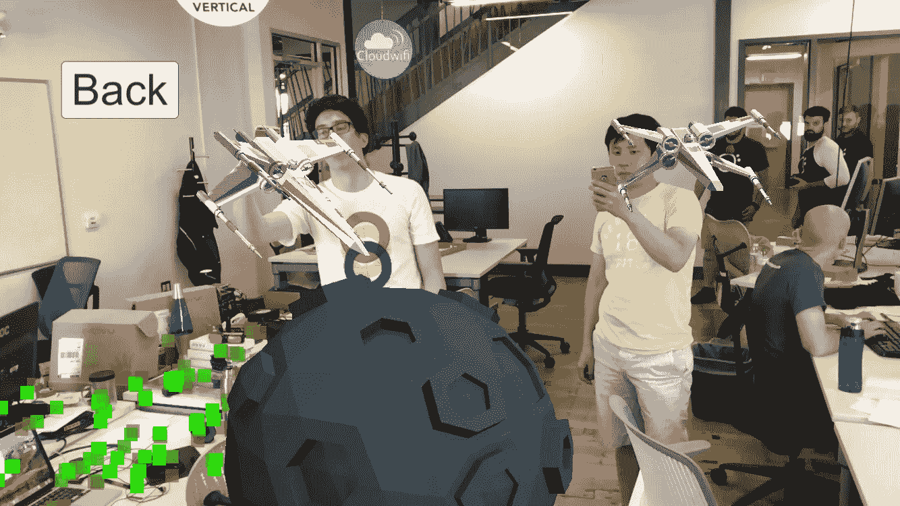
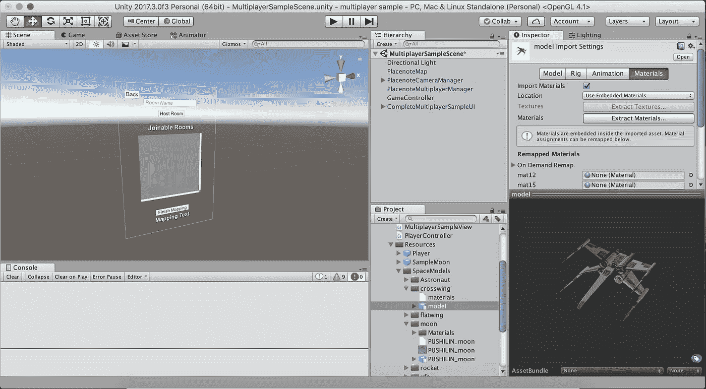

# 用 Placenote SDK 构建多人 ARKit 游戏

> 原文：<https://medium.com/hackernoon/building-a-multiplayer-arkit-game-with-placenote-sdk-6bc736ee6760>

## 这个新的 Unity 包将教你如何在 20 分钟内建立一个多人 AR 游戏

Basic placenote multiplayer sample with a Moon and some Cross Wings

*我们刚刚发布了一个新的 Unity 包，它将教你如何在 20 分钟内构建一个多人 AR 游戏。如果你正在构建(或想要构建)一个多人 AR 游戏或应用，这篇文章就是为你准备的。*

业内许多人认为，多人 AR 是使 AR 应用程序更加社交化的关键因素，并最终增加用户的“粘性”。

这听起来很神奇，但是你如何着手构建一个多人 AR 游戏呢？构建这样的应用程序有哪些设计挑战？虽然市场上有几个 SDK 在构建支持多人 ar 所需的技术，但作为一名开发人员，这远远不能满足您构建多人 AR 应用程序的所有需求。在你可以推出一个相当好看的多人游戏体验之前，你仍然需要做大量的工作来构建网络、UX、服务器后端和游戏机制。所以我们决定简化这个过程。

# 问题是

在 Placenote，我们制作了有史以来第一款在 App Store 上发布的多人 AR 游戏——[Place Invaders](https://vertical.us11.list-manage.com/track/click?u=b63923e54766af5486b0555d4&id=611549885f&e=e24536ca8e)——一款古怪的**太空入侵者**克隆版。它不是 Pokemon Go，但它帮助我们了解了许多关于构建多人 AR 体验的问题。我们了解到构建多人 AR 很难，不仅仅是因为需要将许多手机与一个单一的世界原点对齐的技术，还因为构建一个联网的在线游戏需要大量的设置来帮助用户相互交流。

在最新的 ARKit 2.0 版本中，苹果已经包括了与 Placenote 类似的 *ARWorldMap* 功能，但作为一名开发者，使用这种功能意味着你需要自己管理地图的存储和共享，以及从头开始将所有玩家通信构建到你的游戏中(或使用 iCloud)。

> 如果你计划构建一个可以扩展到很多用户的多人 AR 游戏，你可能会想要使用一个成熟的网络 SDK，如[光子引擎](https://www.photonengine.com/)。

# 我们的解决方案

在 Placenote，我们希望让构建令人惊叹的 AR 应用变得异常简单。Placenote SDK 为地图绘制和本地化提供了一个完全托管的云解决方案，但我们希望走得更远。我们希望简化构建多人游戏的所有部分，这样你就可以专注于你的游戏，而不是浪费时间构建基础设施。

介绍**place note-多人游戏。—** 对现有 PlacenoteSDK 的扩展，提供您启动和运行第一个多人游戏应用所需的一切。

Placenote Multiplayer Manager Screenshot

这是一个 Unity 包，包括快速设置玩家位置跟踪的预设，玩家网络(使用光子)和一个简单的游戏 UI 元素，你可以轻松地扩展以建立任何你可以梦想的多人 AR 体验。我们还创建了一个视频指导教程，帮助您在 20 分钟内建立一个简单的多人游戏体验。

# 入门指南

是时候用代码弄脏我们的手了。要开始，请查看我们创建的分步教程，帮助您在 20 分钟内建立一个简单而可扩展的多人 AR 会话。

Build a Multiplayer AR Game in 20 minutes

如果你想直接加入我们的 Github repo，PlacenoteSDK-多人游戏。

 [## placenote/PlacenoteSDK-多人游戏

### 一个 Unity 项目模板，让你开始创建一个多人增强现实游戏…

github.com](https://github.com/Placenote/PlacenoteSDK-Multiplayer) 

## **如果您是 Placenote SDK 的新手:**

如果您是 Placenote SDK 的新手，您可能想先了解一些关于 Placenote 的知识，您可以使用我们的入门示例应用来完成这项工作:

Getting started with Placenote SDK

# 潜得更深

一旦您浏览了这些视频并尝试了示例代码，是时候拓宽您对多人 AR 开发的理解，并开始尝试新的设计和游戏机制来构建终极移动 AR 体验了。这里有一些信息可以作为有用的起点。

## 剖析一款多人 AR 游戏

基本上，所有多人 AR 游戏都有以下组件:

1.  允许玩家在同一个服务器上找到彼此并连接
2.  建立一个世界地图会话来跟踪每个玩家的位置
3.  通过云在多个玩家之间共享世界地图
4.  将一个玩家的相对位置传达给其他玩家
5.  在多个玩家之间同步游戏资产和动作

多人游戏包括以简单的方式完成这些任务的预置，但是你现在可以扩展和定制这些模块来适应你的游戏。

## 正在使用的技术

在上面的例子中，我们使用了下面的[工具](https://hackernoon.com/tagged/tools)。您可以深入其中的每一项，了解更多信息。

[unity 3d](https://unity3d.com/):AR 游戏开发的最佳 IDE

[Placenote SDK](https://placenote.com/) :云地图和本地化服务，简化 AR 持久化和多用户同步。

[ARKit](https://developer.apple.com/documentation/arkit):AR 体验的 iOS 库。

[光子引擎:](https://www.photonengine.com/)多人游戏联网最流行的云 API 之一。多人游戏会处理所有的光子整合，所以你不用担心。

# 用 Placenote 构建的真实游戏示例-多人游戏

我们使用多人游戏 SDK 创建了一个名为“Place Invaders”的简单游戏，向您展示如何扩展 Placenote-Multiplayer。这个游戏是一个外星人防御生存游戏，你用你的手机来抵御接近的外星人。

你可以在这里的 App Store 上试用一下:

 [## 将入侵者放在 App Store 上

### 阅读评论，比较客户评分，查看截图，了解更多关于 Place Invaders 的信息。下载 Place Invaders…

itunes.apple.com](https://itunes.apple.com/us/app/place-invaders/id1389495635?mt=8) 

或者点击此处查看我们回购协议的源代码:

 [## Placenote/PlaceInvaders

### PlaceInvaders -多人 AR 游戏示例

github.com](https://github.com/Placenote/PlaceInvaders) 

# 后续步骤

当然，构建多人 AR 游戏还有许多挑战，如强大的位置跟踪和无缝游戏，但目前，我们希望为开发者提供一种简单的方法来开始[学习](https://hackernoon.com/tagged/learning)多人 AR 开发，并梦想新的、令人愉快的体验，从而开创社交 AR 的新时代。

所以，开始行动吧，打造下一代极具吸引力的社交移动增强现实体验！我们，在 Placenote 是来帮助你的每一步，所以如果你有一个问题或者只是想为游戏集思广益，[**加入我们 250 名成员的强大 slack 社区**](http://placenote.com/slack) 。

**懈怠见！**