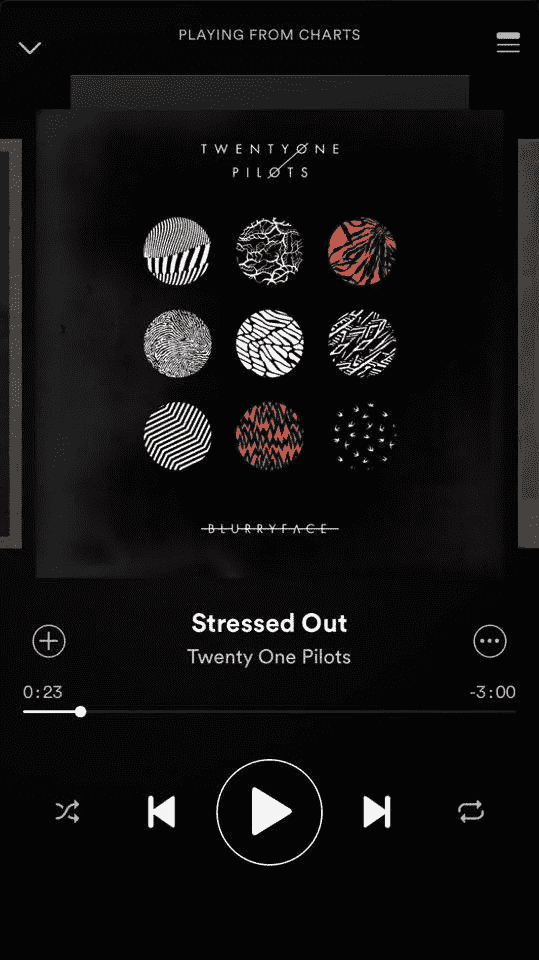
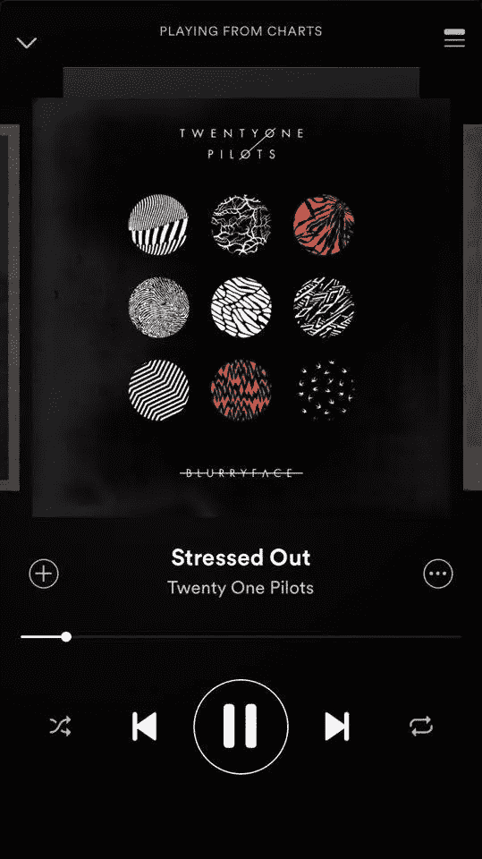
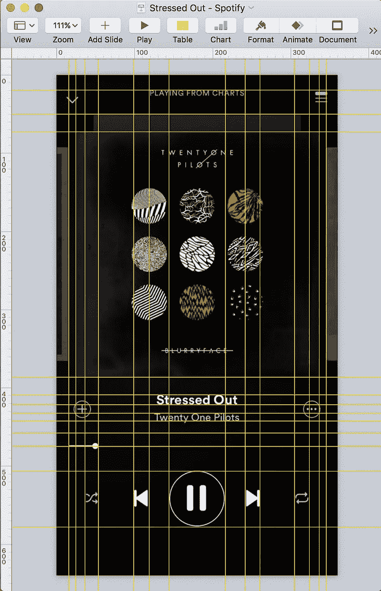
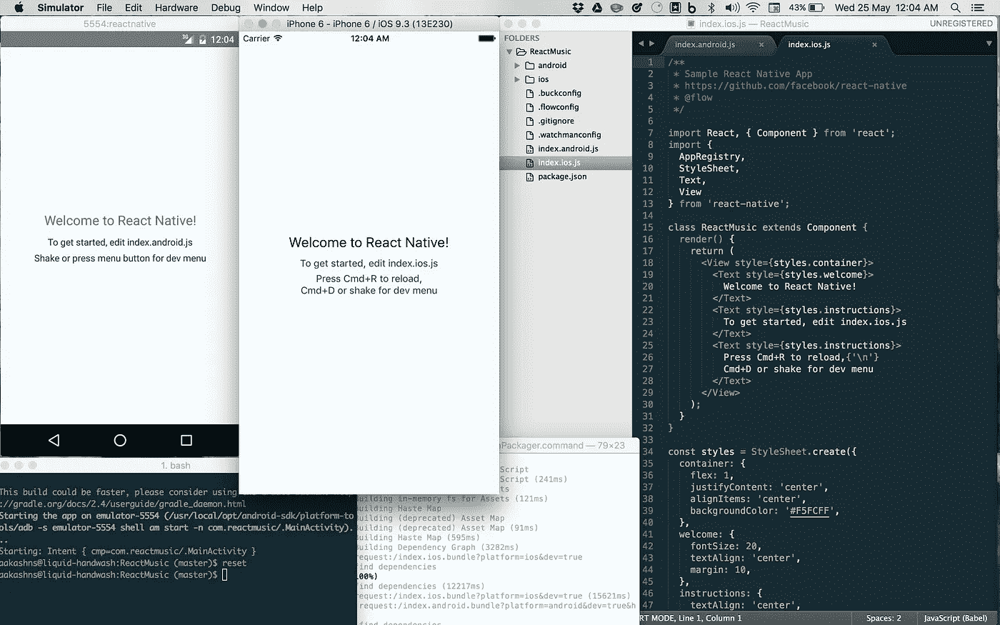
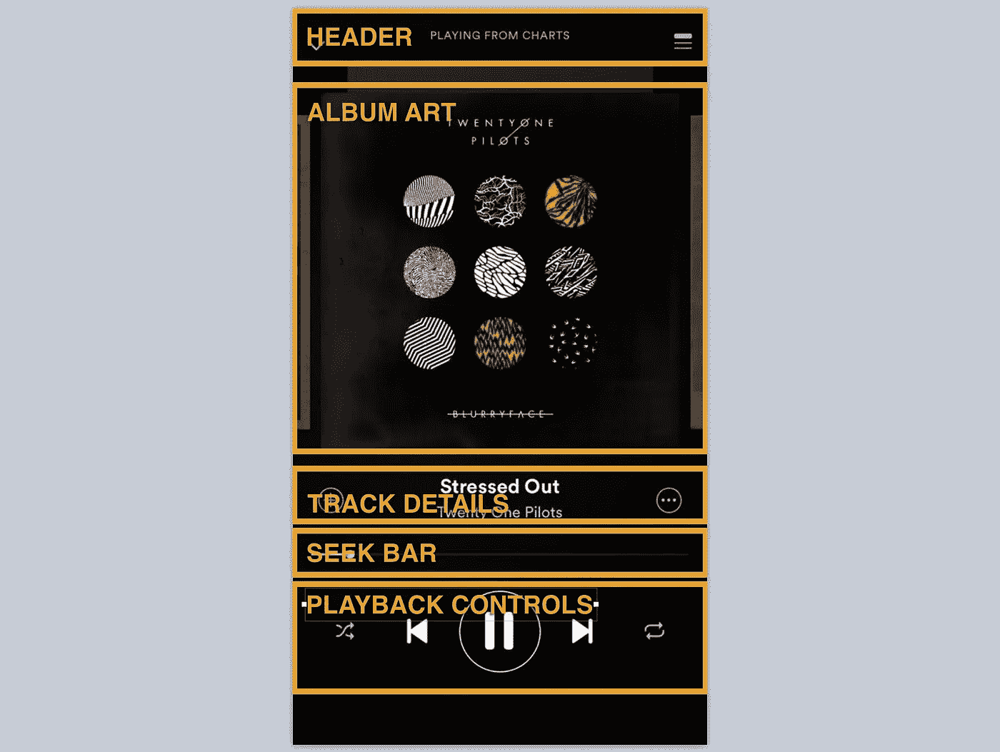
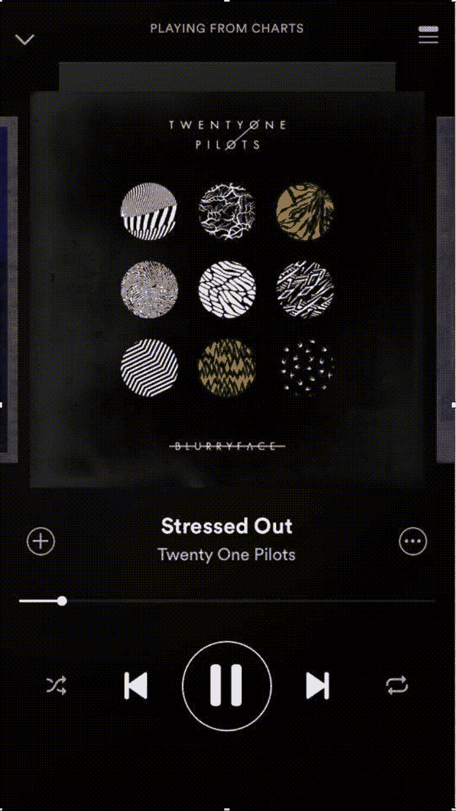
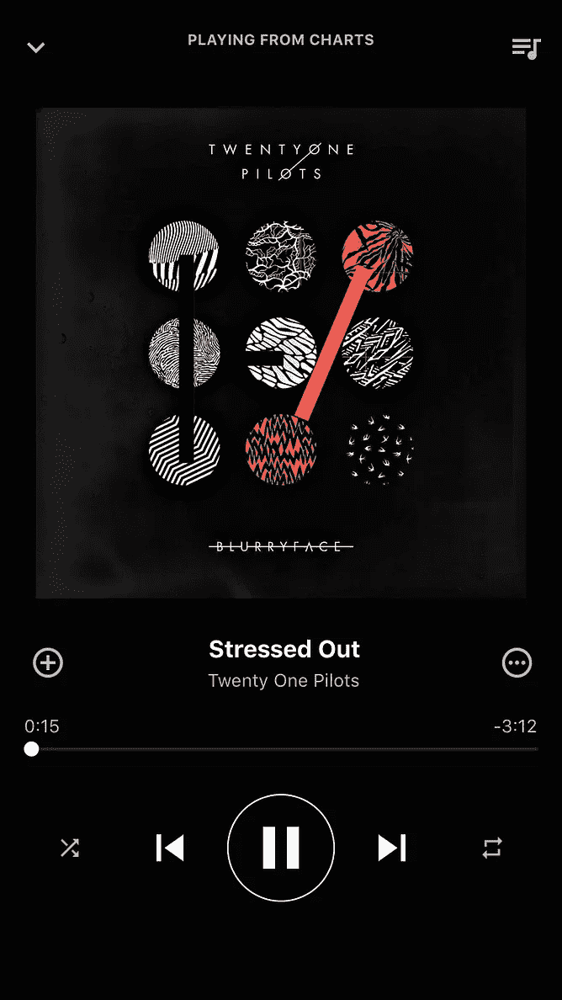

# 使用 React Native 构建音乐流应用程序

> 原文：<https://medium.com/hackernoon/building-a-music-streaming-app-using-react-native-6d0878a13ba4>

[React Native](https://facebook.github.io/react-native/) 是一个使用 [React](https://facebook.github.io/react/) 和 Javascript 构建原生应用的框架。在这篇文章中，我将介绍构建一个类似于 [Spotify](https://www.spotify.com/) 的音乐流的过程。真正酷的是，完全相同的代码将适用于 iOS 和 Android，应用程序将是 100 %原生的(没有网络浏览量或任何东西)。

我们将构建“正在播放”屏幕，在 Spotify 上看起来是这样的:



Somebody stole my car radio, so now I’m gonna steal Spotify’s UI.

由于我不是设计师，而且我真的很喜欢 Spotify 简洁的设计，我们将把它作为构建播放器的参考。在第三张图片中，我在 [Keynote](http://www.apple.com/in/mac/keynote/) 中打开了一个截图，并在整个图片上添加了标尺，以精确测量位置、边距、字体大小等。对于 UI 中所有不同的元素。我们将使用这些度量来设计我们自己的应用程序的 UI。

现在我们有了一个(偷来的)设计，我们准备开始编码。因此，让我们创建一个新的 React 原生项目。打开终端窗口，运行以下命令:

```
$ npm install react-native-cli@latest
$ react-native init ReactMusic
```

唷！那花了一段时间，不是吗？我们现在*几乎*准备好了，只需要再运行几个命令:

```
$ react-native run-ios      # Launch an iOS emulator and run the app
$ android avd &             # Launch an Android emulator
$ react-native run-android  # Run the app on the Android emulator
$ subl .                    # Open up the project in Sublime Text
```

如果最后一个命令对你不起作用，只需在你选择的任何编辑器中打开“ReactMusic”目录，或者执行[这个](https://www.sublimetext.com/docs/3/osx_command_line.html)。您的应用程序应该在两个模拟器上启动并运行，您的屏幕应该如下所示:



打开`index.ios.js`和`index.android.js`。你会注意到它们有相同的代码。我们要摆脱这一切，从头开始。让我们在项目的根目录下创建一个名为`app`的目录。然后用下面的代码创建一个文件`app/App.js`:

现在，我们可以删除`index.ios.js`和`index.android.js`中的所有代码，并简单地在它们中呈现组件`App`:

如果您重新加载模拟器(iOS 的 Cmd+R，Android 的 Fn+F2)，您现在应该会看到一个黑色的屏幕，上面有一些白色的文本。您还可以在模拟器中设置实时重载，以便在每次进行更改后保存文件时自动重载 Javascript。

如果我们回头再看一下 UI，我们可以看到它由 5 个主要部分组成:



我们将为每个部分创建一个组件，从标题开始，它实际上只是一个标题和两个按钮。我们将使用 [TouchableOpacity](https://facebook.github.io/react-native/docs/touchableopacity.html#content) 来渲染按钮。在项目的根目录下创建一个目录“img”来存储图标和图像。你可以从谷歌的[材质图标](https://design.google.com/icons/)集合中获得标题图标。下载“键盘向下箭头”和“音乐排队”图标，并将文件从图标集的“ios”目录复制到项目的“img”目录。你可以在这里了解更多关于渲染图像和图标的信息[。下面是 Header 的代码:](https://facebook.github.io/react-native/docs/images.html#content)

Link to [full code](https://gist.github.com/aakashns/6aadc5e8d2b01b660bedeb7187bdac29)

为了简洁起见，我省略了导入和样式。按照要点下面的描述中的链接查看完整代码。您可以将这段代码放在`app/Header.js`中，然后导入并使用`app/App.js`中的 Header 组件:

接下来，我们有一个非常简单的组件来显示专辑封面:

Here is the [full code](https://gist.github.com/aakashns/fcbaad68c605ff2fd6364cfcc89372ca).

接下来，我们有曲目标题和艺术家:

Here is the [full code](https://gist.github.com/aakashns/ac09a78c4f72619c81793509279c752d).

对于搜索栏，我们将使用 react-native-slider，它有更好的跨平台样式选项。

```
$ npm install --save react-native-slider
```

然后，我们可以实现搜索栏:

Here is the [full code](https://gist.github.com/aakashns/35cab39237cf958cc735bd423537f62b)

让我们也为控件添加一个组件:

Here is the [full code](https://gist.github.com/aakashns/3c7ffb64be5ab24d7e15fcf4a539ea36).

最后，我们可以将所有这些无状态组件放在 App.js 中，以检查 UI 并对其进行测试:

下面是一个对比，左边是 Spotify 的截图，右边是我们的应用:



不算太坏，嗯？现在为了实际播放音频，我们将使用 react-native-video。下面是它的使用方法:

```
$ npm install react-native-video — save
$ npm install -g rnpm
$ rnpm link react-native-video
$ react-native run-ios
$ react-native run-android
```

现在让我们在名为 Player 的组件中连接播放和暂停按钮:

Full code [is here](https://gist.github.com/aakashns/1e991c96e46ae4fa61970c670b5a4a2b)

我们可以通过定义几首曲目在应用程序中使用它:

只要再多做一点工作，我们就可以把所有的按钮连接起来。经过这一切，我们将到达

就是这样！你可以在这里找到这篇博文的完整代码:

[](https://github.com/aakashns/reactmusic) [## aakashns/ReactMusic

### ReactMusic -使用 React Native 制作的类似 Spotify 的音乐播放器界面

github.com](https://github.com/aakashns/reactmusic)