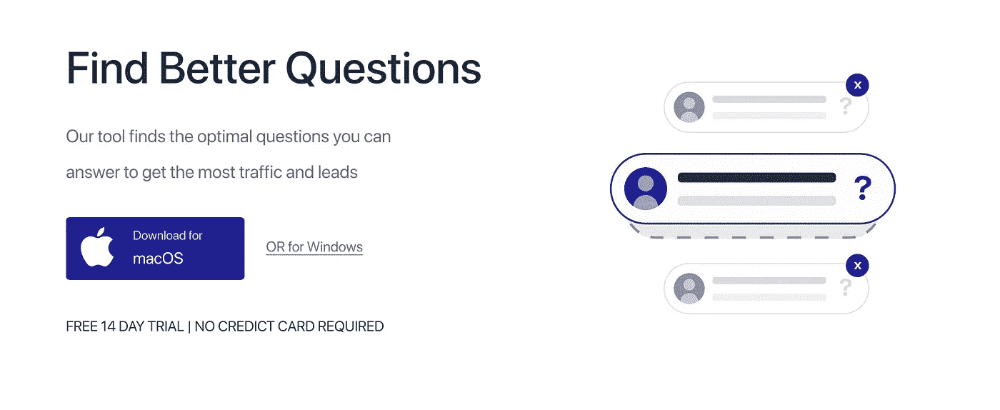

# 构建新的登录页面

> 原文：<https://medium.com/hackernoon/building-a-new-landing-page-3bd4abf586d9>

## 我的创业之旅

## 第 1 周—回顾

点击这里阅读上周的文章。

## 登录页面

我需要一个新的登录页面有两个原因:

*   **糟糕的设计** 最大的问题是它不是超级明显的桌面应用，也没有免费试用。此外，疼痛并没有真正交流。实际上，有人在一篇像样的文章中撕掉了我的登陆页。点击阅读佩德罗的建议[。](https://www.indiehackers.com/@pedrocortes/how-to-get-more-free-trials-from-saas-landing-pages-real-example-96f6884b98)

*   谷歌的页面速度工具给 findbetterquestions.com 的评分是 63/100，而它的博客曾经达到 99/100。那是因为登陆页面是用 HTML 模板和 [Gatsby](http://gatsbyjs.com/) 的博客构建的。所以我会和盖茨比一起重新制作登陆页面。这比仅仅改变现有的版本要多一点工作，但是因为我已经在这个项目上投入了数百个小时，我最好有一个合适的登陆页面。

## 写电子邮件

和往常一样，我和尽可能多的人交流。我也联系了一些我喜欢的 Quora-答案的人。

## 在 Quora 上写作

我想在 Quora 上树立一点权威。如果 Quora 认为某人是某个主题的专家，那么他们的未来答案排名也会更高。这是一种努力，未来的每一个答案都会有回报。
到目前为止每个答案我都没有下太大的功夫。以后我会努力写出更好的转换的。尤其是当我有一两个销售线索磁铁和一个合适的登陆页面时，将读者从 Quora 转化为客户应该更容易。你可以阅读我在 IH 关于 Quora 营销的讨论。

My Quora Stats

本周我贴出了两个答案:

*   在 Quora 上回答问题的人会根据他们获得的浏览量或投票数来排名吗？
*   你是如何为你的创业公司学习营销的？

## 改善入职培训

我改变了注册流程。
您现在可以开始试用 Find Better Questions，无需信用卡。

# 下周的计划

*   完成登录页面
*   冷邮件
*   开始写 Quora 指南

[←第 0 周](/p/e02dd3318cf5/)
[→第 2 周](/p/e683ba5ccd88/)