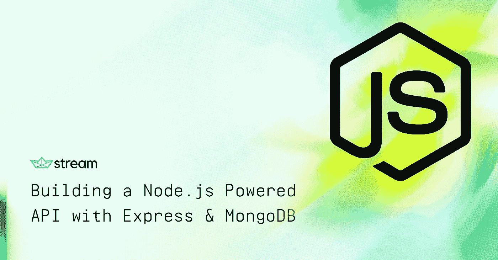
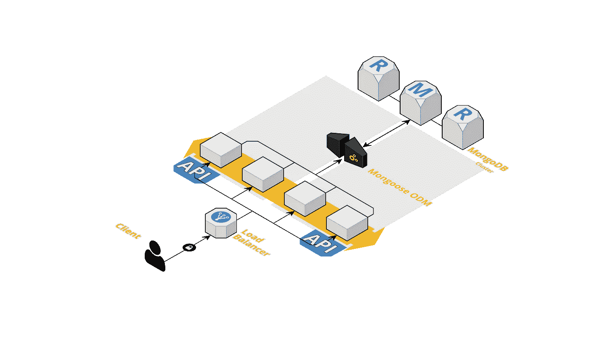

# 用 Express、Mongoose 和 MongoDB 构建 Node.js 驱动的 API

> 原文：<https://medium.com/hackernoon/building-a-node-js-powered-api-with-express-mongoose-mongodb-19b14fd4b51e>

作为一名在 [Stream](https://getstream.io) 工作的开发人员，我最喜欢的工作之一就是构建示例应用程序。这是一种吸引潜在和现有客户并与之互动的方式，也是展示我们每天使用和构建的有趣技术的方式。我构建的应用程序范围很广，从概述如何执行基本操作的小代码片段，如在流中将项目标记为“已读”，到基于大型微服务的应用程序，这些应用程序通常需要健壮的后端架构，如 [Winds](https://github.com/GetStream/Winds) 。

去年，我写了一篇关于[如何用 Restify](/@nparsons08/in-depth-guide-on-building-a-rest-api-with-node-js-restify-mongodb-a8e92efbb50f) 构建 RESTful API 的文章。现在 [Express](http://expressjs.com/) 和 [Restify](http://restify.com/) 在每秒请求数方面几乎与[并驾齐驱](https://raygun.com/blog/node-js-performance-2017/)，我想向您展示我如何用 *Express* 构建我的 API 可能会很有趣(只是为了加入一点友好的竞争/扮演魔鬼操纵者的拥护者😉).

## 构建您的 API

您选择构建 API 的方式是您将做出的最重要的决定之一。你必须确保它的智能、灵活和易用——这是**必须**做的事情。如果它不容易使用，其他开发人员将不会理解你在构建什么，也不会知道如何在它的基础上构建。建之前先思考(我知道。计划糟透了。尤其是当你兴奋地想要开始的时候，但是这是值得的。

├── build.sh
├──区
│├──…
├──package . JSON
├──src
│├──config
│└──index . js
│├──控制器
│├──
│├──型号
│├──
│├──package . JSON
│├──型号
。

所有源代码都存储在 **/src** 中。它从 ES6+到 ES5 向下编译到 **/dist** 目录中，以便在服务器上执行。你可能会问自己，为什么要多花一步去写一些将要被编译下来的东西？好问题。ES6+标准提供了一些非常棒的附加功能，比如箭头函数、修改的作用域、析构、rest/spread 参数处理，以及更多的！

让我们来看看发生在 **build.sh** 文件中的编译:

这就是你需要能够用一种超级棒的语言来写，同时在所有通常的地方仍然被支持的全部！也就是说，上面的代码可能看起来像是乱码，所以让我们来分解一下🤓：

1.  #!/bin/bash

*   表示这是一个可执行的 bash 文件

2.rm -rf 距离和 mkdir 距离

*   删除 **/dist** 目录(如果存在的话)(清理)。
*   创建一个新的 **/dist** 目录。

3.npx babel src —输出方向—忽略节点模块

*   将每个文件编译到 ES5，并将文件移动到 **/dist** 目录，除了 **node_modules** (那些已经被编译)。

4.cp src/package.json dist

*   按照设计，npx 不迁移 json 文件，所以我们需要使用 **cp** 命令自己复制它。

5.cd 分配和纱线安装—生产—模块—文件夹节点 _ 模块

进入 **/dist** 目录，使用[线](https://yarnpkg.com/en/)安装 npm 模块

运行构建就像从终端运行以下命令一样简单:

***注意:*** *你需要确保 build.sh 文件是可执行的……* 
或者如果你像我一样喜欢自动化*一切*，你可以创建一个 npm 脚本，如下所示:

这可以通过在终端上运行以下命令来执行:

## 主文件

下面的文件 **server.js** ，包含了最重要的逻辑，位于我们代码库的顶层。开始部分导入所有必要的 npm 模块，随后是我们的**配置**和**记录器实用程序**。

接下来，我们利用 Express **use** 方法来调用我们导入的几个中间件库( [cors](https://www.npmjs.com/package/cors) 、 [compression](https://www.npmjs.com/package/compression) 和我们的 [body-parser](https://www.npmjs.com/package/body-parser) )。**请注意* *，我们还为附加功能(例如电子邮件、日志、jwt 身份验证等)提供了其他几个中间件库。).最后但同样重要的是，在一点初始化之后，我们动态地包含所有路由，并将 **API** 上下文传递给路由进行绑定。

***注:*** *客户日志模块可用于大多数日志服务(*[*paper trail*](https://papertrailapp.com/)*、*[*Loggly*](https://www.loggly.com/)*等)。).对于这个演示，以及其他项目，我喜欢使用 Papertrail。如果您使用 Papertrail 以外的东西，可能需要调整设置和 ENV 变量。*

## 按指定路线发送

为了保持整洁有序，所有路由逻辑(例如 GET /users)都保存在自己的路由文件中，该文件位于 **/routes** 目录下。

正如您所看到的，上面的 route 文件的内容保存了对控制器的所有引用，用于**获取**、**发布**、**放置**和**删除**操作。这是因为我们导入并引用了**用户** **控制器**，通过*传递每个* API 调用所需的参数和/或数据。

## 控制器

管制员包括与他们将要处理的数据相关联的数据库模型，从路线接收数据，然后就如何处理数据做出明智的决定。最后，控制器通过与数据库对话的模型进行通信，并返回一个带有有效负载的状态代码。

如果你是一个视觉型的人，一个生产实例应该看起来像这样:

示例用户控制器的代码如下所示:

## 猫鼬模型(MongoDB)

[mongose](http://mongoosejs.com/)是 Node.js 和 [MongoDB](http://mbsy.co/mongodb/228644) 的精彩 ODM(对象数据建模)库。如果你熟悉 Node.js 的参考 ORM(对象资源映射)和库，比如 [Sequelize](http://docs.sequelizejs.com/) 和 [Bookshelf](http://bookshelfjs.org/) ，Mongoose 相当简单。Mongoose 的最大好处是构造 MongoDB 模式非常容易——不需要为定制的业务逻辑操心。

更令人兴奋的是许多好东西，如中间件、[插件、](http://plugins.mongoosejs.com/)、对象填充和模式验证，或者内置，或者安装一个 [yarn](https://yarnpkg.com/en/) (我爱 yarn)或一个 [npm](https://www.npmjs.com/) 。这个项目在使用 MongoDB 的开发人员中变得如此受欢迎，这真的很了不起。

当涉及到猫鼬模型时，我倾向于保持事物有点扁平(或者至少最多 3 个深度嵌套的对象)以避免混淆。这里有一个用户模型的例子，它直接来自于当前正在开发的项目:

***注:*** *说到托管和运行 MongoDB，我喜欢用*[*MongoDB Atlas*](http://mbsy.co/mongodb/228644)*。它是由 MongoDB 的制作者自己提供的数据库即服务。如果不想使用免费的 MongoDB Atlas 实例，欢迎使用本地版本。另外，如果你想监控你的数据，*[*MongoDB Compass*](https://www.mongodb.com/products/compass)*是一个绝佳的选择！*

## 公用事业

自定义实用程序可以用于多种用途——基本上是您想要的任何用途。我通常保留它们来分离关注点和保持代码的整洁。一些例子包括建立数据库连接、发送电子邮件、登录到外部服务，甚至与基于 HTTP 的流服务通信。

我经常被问到什么时候把一些东西变成实用工具的问题，我的回答总是一样的…当你发现自己 **1)** 重用代码或者 **2)** 在感觉不合适的地方把第三方服务塞进代码。

这里有一个我写的实用程序的例子，叫做[流个性化 REST API](https://getstream.io/personalization/) 。这种集成用了大约十几行代码就完成了:

现在可以从任何文件中调用上面的代码，如下所示:

## 最后的想法

API 是现代应用程序的构建模块。它们控制着应用程序如何与另一个应用程序以及数据库进行通信。而我们有其他风格的 API 结构( [GraphQL](https://graphql.org) 等)。)，RESTful APIs 继续发挥自己的作用，不会很快消失。

如果您有兴趣查看用 Node.js、Express、Mongoose 和 MongoDB 构建的 REST API 的完整框架，请访问这个 [GitHub repo](https://github.com/GetStream/node-express-mongo-api) 。

一如既往，如果你有任何问题，请不要犹豫，通过[推特](https://twitter.com/nickparsons)或下面的评论联系我。谢谢大家！