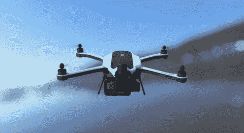

# 解释四轴飞行器部件

> 原文：<https://medium.com/hackernoon/building-a-quadcopter-components-explained-diary-of-a-flying-car-engineer-2-c9410b52fe61>

## 飞行汽车工程师日记之二

Source: [https://www.producthunt.com/posts/gopro-karma-4](https://www.producthunt.com/posts/gopro-karma-4)

这篇文章通过演示我们的[飞行汽车](https://hackernoon.com/tagged/flying-car)测试平台 Crazyflie 2.0 的组件，提供了构建四轴飞行器所涉及的组件的演示

Crazyflie 2.0

如果您喜欢观看通过组装展示组件的视频，请查看以下链接:

> 注意:对于 Crazyflie，机身有 ESCs，飞行计算机和机身都内置在机身上。

# 机身

*   这是我们院子的底盘。
*   将所有电机和电子悬架控制系统固定到位。
*   所有的元件都安装在上面。
*   理想的候选者足够轻以允许飞行，并且足够坚固以承受碰撞。
*   这里选择的材料是[碳纤维](https://hackernoon.com/tagged/carbon-fibre)。
*   我们的[无人机](https://hackernoon.com/tagged/drone)套件采用塑料机身

# 自动驾驶仪+飞行控制器

*注意:为简单起见，这两者是作为一个组合单元提到的，但是它们有一些重要的技术上不同的任务。自动驾驶仪控制发动机和飞行控制器-飞行执行。*

*   [无人机](https://hackernoon.com/tagged/drone)的大脑。
*   控制发动机并执行飞行计划。
*   基于 IMU 和 GPS 的读数工作。
*   在发动机罩下运行控制电子稳定控制系统所需的计算

# 经济社会委员会

*   电子速度控制
*   用于发动机和飞行控制器之间的接口
*   在两个组件之间引导电池电源和控制

# 电池

*   无人驾驶飞机的动力室，为整个机器提供动力。
*   应该足够轻以允许飞行，并且足够强以允许在飞行期间持续飞行。
*   我们的工具包里有一个微型脂肪电池。
*   脂肪是再次选择的材料，因为它提供了上述所有因素。

# 发动机

*   马达应该有足够的动力来飞行。
*   它们还应该足够有效以允许长时间的飞行。
*   BLDC 汽车公司是捆绑销售的特色，因为他们支持上述因素。

# （供烤肉或煮菜用的）浅炊坑

*   惯性测量单元。
*   顾名思义，给出惯量变化的各种测量。
*   简单来说，给出我们的四轴飞行器当前的方向和航向。

# 螺旋桨

*   向下拉动空气(拖拉机)
*   充当飞行的翅膀。
*   应该能产生足够的推力来满足我们的飞行需求。

注意:螺距:螺旋桨的扭转——是螺旋桨旋转一周所移动的直线距离。

*   一般来说，推力取决于发动机的转速。
*   更大的螺旋桨效率更高。
*   更大的螺距允许更大的机动性。

[*如果你喜欢这篇文章并想聊天，你可以在 twitter 上找到我*](http://twitter.com/bhutanisanyam1)

[*如果你对深度学习、计算机视觉以及自主和飞行技术的每周阅读清单感兴趣，你可以在这里订阅我的简讯*](http://tinyletter.com/sanyambhutani/)