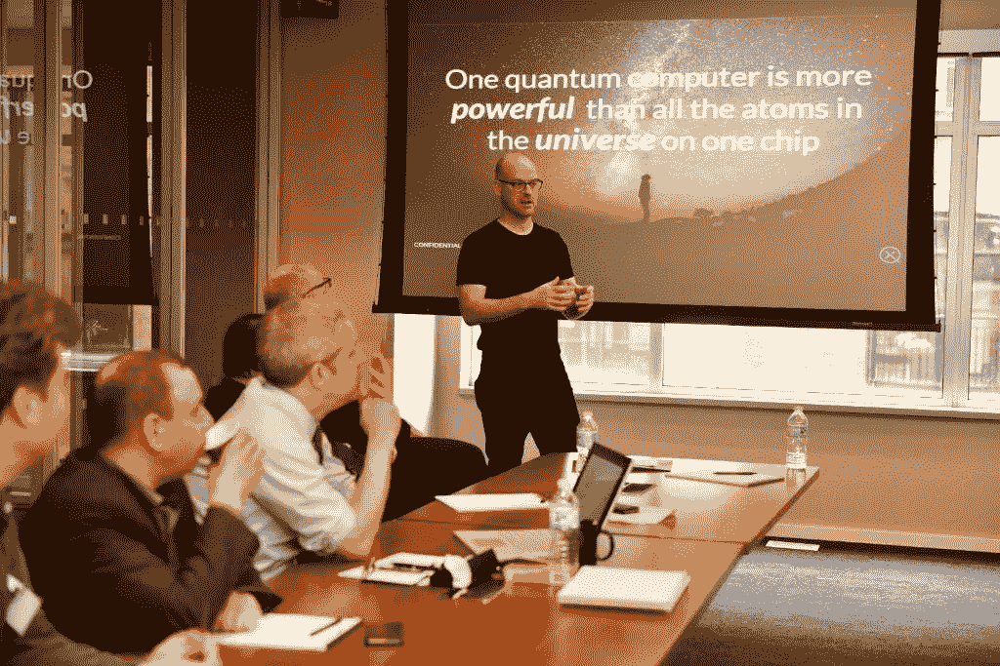

# 在加拿大建设量子未来

> 原文：<https://medium.com/hackernoon/building-a-quantum-future-in-canada-bb556e376e69>

## 采访 Xanadu Quantum Technologies 首席执行官 Christian Weedbrook

Christian Weedbrook addressing senior technologists in Montreal. Photo Courtesy: Morgan Stanley

Christian Weedbrook 是一家由光驱动的量子技术公司 [*Xanadu*](https://medium.com/u/368e65c02846?source=post_page-----bb556e376e69--------------------------------) *的创始人兼首席执行官。Xanadu 设计并将量子硅光子芯片集成到现有硬件中，以创建真正的全栈量子计算。他们的方法将以超乎想象的速度解决当今最棘手的商业问题。*

*世外桃源刚刚* [*推出了*](https://www.newswire.ca/news-releases/xanadu-releases-pennylane-the-first-dedicated-machine-learning-software-for-quantum-computers-700378642.html) *世界上第一个专门针对量子计算机的机器学习软件，叫 Penny Lane(没错，就是披头士的歌之后)。设想为“量子计算的张量流”，硬件不可知的平台内置了对现有量子位和光子量子硬件的支持。*

*Xanadu 是一家 SVB 客户，我在 Xanadu 的多伦多总部采访了 Christian。以下是为长度和清晰度编辑的。*

娜塔莉:作为一名澳大利亚人，是什么让你搬到多伦多并决定成为加拿大公民的？是为了建立这家公司吗？

克里斯蒂安:实际上是出于个人原因。在澳大利亚获得博士学位后，我去了波士顿，然后去了多伦多。我几乎爱上了多伦多。我在大城市长大，所以我真的很想住在大城市。这里有城市元素，也有多元文化的一面。

就公司而言，Xanadu 不会去任何地方——我们可能在该国的其他地方设有办事处，但总部将永远在多伦多。

在我们网站的“关于”页面上，我们甚至有一张加拿大国家电视塔的照片，所以很多人告诉我不要把那张照片放在那里，说它看起来太俗气了，但当你来自不同的国家，你对多伦多有不同的欣赏。如果我有遗嘱，它会说“把我的骨灰撒在加拿大国家电视塔上”。

> 我从来不想离开多伦多。如果我有遗嘱，它会说“把我的骨灰撒在加拿大国家电视塔上”

Xanadu’s “About” page prominently featuring Toronto’s CN Tower

N:在招聘人才方面，这里怎么样？

c:我们有点独特，因为我们正在开发的技术来自学术界，所以这意味着我们必须从学术界招聘。我们现在大约有 35 个人，我告诉每一个人，在这里工作就像一个博士后职位——试试看你是否喜欢它，我们会公布一切。让我们得到优秀的人才。公司里的每一个人，要么是我以前共事过的，要么是从学术界朋友的朋友那里认识的。这意味着我们从世界各地的人们中汲取营养。我们这里有这么多国籍的人——这太疯狂了。这向你展示了量子计算在世界各地的大学中变得多么受欢迎。我是多伦多大学的博士后，我想我们已经雇佣了四名博士毕业生。我在许多大学工作过——包括哈佛大学和麻省理工学院——这里的精英中的精英在任何地方都是精英中的精英。

> 我在许多大学工作过——包括哈佛和麻省理工——这里(多伦多)的精英中的精英在任何地方都是精英中的精英。

那招聘商业人才呢？

C: 90%的员工都是量子工程师，所以我们现在正在寻找更多的商业雇员。

最近，我看到将会有一个新的[火星](https://medium.com/u/53e3245f088b?source=post_page-----bb556e376e69--------------------------------)创新中心在水边，微软和 Spotify 正在投资。我们现在可以开始利用这些人才，特别是从非技术业务方面。我们参观了[创造性破坏实验室](https://medium.com/u/72d6d0383256?source=post_page-----bb556e376e69--------------------------------)，总的来说，这些孵化器项目是一个很好的例子——它们吸引了很多人才。

未来几年，这里所有公司都需要克服的挑战之一是——我们如何从中赚钱？似乎人才、创意和 R&D 都在发生，但我们如何开始将它们转化为顾客购买的东西呢？我们需要将人才转化为实际利润。

这是我们非常关注的事情。我们正在解决一个非常棘手的技术问题，但我们也想表明，我们是像企业一样思考，而不是像科学实验一样思考。我们说我们是全栈，这意味着硬件、软件和业务。我们从第一天开始就与客户交谈，并专注于使用技术解决他们的问题，而不是相反。

> 我们说我们是全栈，这意味着硬件、软件和业务。我们从第一天开始就与客户交谈，并专注于使用技术解决他们的问题，而不是相反。

在这里筹集资金感觉如何？

c:我们从所有加拿大风投那里筹集了 900 万美元，这些风投包括 [OMERS Ventures](https://medium.com/u/1b8d4a5567c9?source=post_page-----bb556e376e69--------------------------------) 、 [Golden Ventures](https://medium.com/u/62a683eca42a?source=post_page-----bb556e376e69--------------------------------) 和 [Real Ventures](https://medium.com/u/60148c1bc38e?source=post_page-----bb556e376e69--------------------------------) 。有人说，仅仅从加拿大基金中筹集到 900 万美元的种子资金是不寻常的，所以我们真的为此感到骄傲，这太棒了。对于下一个阶段，首轮融资，我们希望让加拿大投资者跟进，但也要放眼硅谷。

很好奇你的一些预测。量子里的杀手级 app 会是什么？

c:我认为这一直在变化，这意味着每年都会有重要的突破。与客户交谈会给我们带来灵感，但就整个行业而言，主要领域是:

1.  量子化学——你可以想到材料设计、制药药物发现、分子发现。大多数人认为那是最容易摘到的果子。
2.  机器学习的量子版本——这也是非常有前途的。
3.  物流
4.  金融

这是四个主要领域，但量子机器学习也可以贯穿其他三个想法。我认为量子化学之所以容易实现，是因为它本身就是量子力学。在化学中，很多时候你必须进行近似，所以这个想法是一旦你建造了一个小型量子计算机，你就可以实际模拟制药，材料设计等。

建造大规模量子计算机的最大挑战是容错。你如何确保量子计算机按照你想要的方式运行？你减轻了计算机的故障和错误——这非常困难，但是量子化学只需要一点点，或者一点都不需要，所以这就是为什么它是易得之果。这就是它可能成为杀手级应用的原因。对我们来说，我们是一家光子量子计算公司，这意味着我们可以在相同的四个主要垂直领域运营，但解决不同类型的问题。我们的杀手级应用之一是分子和 OLEDs 的高效设计，这是 Xanadu 所独有的。

**N:除了容错，现在制造量子计算机最大的挑战是什么？**

你可以分割量子计算的各个阶段，每个阶段都对应着技术变得更加成熟。最后一个阶段是完全容错。初始阶段的规模仍然很小，比如说 100 奎比特左右。这是可行的，但仍是一个挑战。当你进入下一阶段时，要确保它是向前兼容的，这意味着你会开发出不需要容错的近期应用程序，可能还需要一点纠错，但你已经走上了完全容错的道路。像相干时间、损耗，以及我们的环境如何与量子环境相互作用，这些都是目前影响量子化的因素。

我喜欢 quantumness 这个词，很好。

列车员:我也是。

了解更多关于世外桃源的信息(他们正在招人！)和他们新的“[量子计算的 tensor flow](https://www.newswire.ca/news-releases/xanadu-releases-pennylane-the-first-dedicated-machine-learning-software-for-quantum-computers-700378642.html)平台，查看 [www.xanadu.ai](https://www.xanadu.ai/)