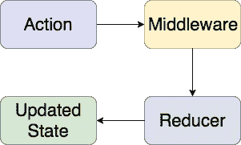
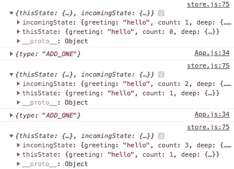

# 通过构建一个类似 Redux 的库来理解 JavaScript 中的状态管理

> 原文：<https://medium.com/hackernoon/building-a-redux-like-state-manager-for-react-cd75cc2853b3>

> 对于任何想跳过这篇文章并看到最终结果的人来说，我已经把我写在这里的东西用钩子做了一个库: [use-simple-state](https://github.com/Jahans3/use-simple-state) 。它没有依赖性(除了反应为对等依赖性之外),只有 3kb，非常轻量级。

近年来，web 应用程序的范围急剧扩大，随着应用程序需求的增长，复杂性也在增加。为了使这种增加的复杂性更容易处理，某些技术和模式越来越多地被用来使开发人员的生活更容易，并帮助我们构建更健壮的应用程序。

复杂性增加的一个主要领域是管理我们的应用程序的状态，因此为了解决这个问题，开发人员正在使用提供抽象的库来更新和访问他们的应用程序的状态。最著名的例子是 [Redux](https://redux.js.org/introduction) ，它是[通量模式](https://facebook.github.io/flux/docs/in-depth-overview.html#content)的一种实现。

一旦开发人员学会了如何使用像 Redux 这样的库，他们可能仍然想知道“引擎盖下”的一切究竟是如何工作的，因为这一开始并不明显，即使更新全局可用对象的更一般的概念很容易理解。

在本文中，我们将完全从零开始为 React 应用程序构建自己的状态管理解决方案。我们将从一个只需几行代码就能实现的基本解决方案开始，然后逐步开发更高级的功能，直到我们有了类似 Redux 的东西。

# 基本思想

任何状态管理工具只需要几样东西:对整个应用程序可用的全局状态值，以及读取和更新它的能力。就这样，说真的。

为了向您展示状态管理器有多简单，这里有一个基本的 JavaScript 实现:

That’s it, seriously

上面的例子是最基本的，但它仍然符合所有的情况:

*   代表我们应用程序状态的全局可用值:`state`
*   读取我们状态的能力:`getState`
*   能够更新我们的状态:`setState`

对于大多数现实世界的应用程序来说，上面的例子太简单了，所以接下来我们将开始实现一个在 React 应用程序中使用的可行的解决方案。我们将从重构前面的例子开始，让它在 React 中工作，并从那里开始构建。

# React 中的状态管理

为了制作我们之前解决方案的基于 React 的版本，我们需要利用两个 React 特性。第一个特征是普通的旧类组件，也称为[有状态组件](https://reactjs.org/docs/state-and-lifecycle.html#adding-local-state-to-a-class)。

第二个特性是[上下文 API](https://reactjs.org/docs/context.html) ，它用于使数据对整个 React 应用程序可用。一个上下文有两部分:一个*提供者*和一个*消费者*。顾名思义，提供者向应用程序提供*上下文*(数据)。而当我们想要访问上下文时使用消费者。

理解上下文的一个好方法是:如果*道具*用于**显式地**通过你的组件传递数据，那么*上下文*用于**隐式地**传递数据。

# 构建我们的状态管理器

现在我们知道了我们想要使用的工具，只是把它们放在一起的问题。我们要做的就是创建一个上下文来保存我们的全局状态，然后将该上下文的*提供者*包装在一个*有状态组件*中，并使用它来管理状态。

首先，让我们使用`React.createContext`来创建我们的上下文，这给了我们`Provider`和`Consumer`:

Baby steps

接下来，我们需要将我们的`Provider`包装在一个*有状态组件*中，以便利用它来管理我们应用程序的状态。我们还想导出具有更具体名称的*消费者*:

So far so good

在上面的代码示例中，我们的`StateProvider`只是一个组件，它接受一个`state`道具作为初始状态，并使该道具中包含的任何内容对组件树中它下面的任何组件都可用。如果没有提供`state`，则使用空对象。

使用我们的`StateProvider`就像将它包装在应用程序的根组件上一样简单:

Simples

现在我们已经完成了，我们可以使用消费者从`MyApp`内部的任何地方访问我们的状态。在这种情况下，我们也已经初始化了我们的状态，使之成为一个只有一个属性的对象:`count`，所以无论何时我们访问我们的状态，我们都会发现。

消费者使用[渲染道具](https://reactjs.org/docs/render-props.html)来传递上下文数据，这可以在下面看到，其中一个函数是`StateConsumer`的子函数。传递给该函数的`state`参数表示我们的应用程序的当前状态，因此根据我们的`initialState` , `state.count`将等于`0`。

Accessing our app’s state

关于我们的`StateConsumer`需要注意的一点是，它自动订阅上下文中的变化，所以当我们的状态改变时，组件将重新呈现以显示更新。这只是消费者的默认行为，我们没有做任何事情来启用它。

# 更新状态

到目前为止，我们已经构建了一些东西，允许我们读取我们的状态，并在它改变时自动更新。现在我们需要一种方法来更新我们的应用程序的状态，为此我们只需在我们的`StateProvider`中更新状态。

您可能已经注意到，我们将一个名为`state`的道具传递给了我们的`StateProvider`，然后这个道具又被传递给了*组件的* `state`属性。这是我们将使用 React 内置的`this.setState`方法更新的内容:

继续保持简单的主题，我们刚刚将`this.setState`传递到我们的上下文。这意味着我们必须稍微改变上下文的值；我们现在不是只传递`this.state`而是传递一个具有两个属性的对象:`state`和`setState`。

每当我们使用我们的`StateConsumer`时，我们将使用一个[析构赋值](https://developer.mozilla.org/en-US/docs/Web/JavaScript/Reference/Operators/Destructuring_assignment)来获取`state`和`setState`，所以现在我们可以读取和写入我们的状态对象:

需要注意的是，由于我们只是简单地将 React 的内置`this.setState`方法作为我们的`setState`函数，额外的属性将与现有状态合并。这意味着如果我们除了`count`之外还有第二个属性，那么它将被自动保留。

现在我们已经建立了一些*可以*在现实世界中工作的东西(尽管不是很有效)。它有一个简单的 API，React 开发人员应该很熟悉，另外它利用了内置工具，所以我们也没有添加任何新的依赖项。如果状态管理库以前感觉有点“神奇”，希望我们已经能够揭示一个库的内部可能是什么样子。

# 附加物

那些已经熟悉 Redux 的人可能已经注意到我们的解决方案在几个方面有所欠缺:

*   它没有处理副作用的内置方式，你可以通过 [Redux 中间件](https://redux.js.org/advanced/middleware)获得功能。
*   当与我们的`setState`函数内联编写时，复杂的状态更新会很混乱，我们依赖 React 的默认`this.setState`行为来处理我们的状态更新逻辑，也没有重用状态更新的内置方式，这是从[Redux reducer](https://redux.js.org/basics/reducers)获得的。
*   我们也无法处理[异步动作](https://redux.js.org/advanced/asyncactions)，这通常是由像 [Redux Thunk](https://github.com/reduxjs/redux-thunk) 和 [Redux Saga](https://github.com/redux-saga/redux-saga) 这样的库提供的。
*   重要的是，我们没有办法让我们的消费者订阅状态的*部分*，这意味着当我们状态的任何部分更新时，每个消费者都将重新呈现。

为了克服这一点，我们将通过实现我们自己的动作、reducers 和中间件来模拟 Redux。我们还将添加对异步操作的内置支持。之后，我们将为我们的消费者实现一种方法，只监听我们状态子集的变化。最后，我们还将看看如何重构我们的代码，因此我们正在使用全新的 [Hooks API](https://reactjs.org/docs/hooks-intro.html) 。

# Redux 简介

> 免责声明:下面的内容只是为了给你足够的理解来继续这篇文章，我强烈推荐阅读 Redux 的官方介绍以获得更全面的解释。
> 
> 如果您已经对 Redux 有了很好的了解，可以跳过这一点。

下面是一个 Redux 应用程序中数据流的简化图:



Redux data flow

正如你所看到的，有一个*单向*数据流——我们*分派*一个动作，我们的 reducers 从这个动作中获得一个更新的状态，没有数据在我们应用程序的不同部分之间来回传输。

更详细地说:

首先，我们分派一个动作，该动作描述了对我们状态的一个改变，例如将一个数字加 1。与我们之前的方法相比，这种方法更有命令性，我们本质上是直接操纵`count`状态:`setState({ count: count + 1 })`。

然后动作通过我们的*中间件。* Redux 中间件是可选功能，可以执行动作的副作用，例如，如果调度了一个`SIGN_OUT`动作，您可以在将动作传递给 reducer 之前，使用中间件功能从本地存储中删除所有用户数据。如果你熟悉 [Express](https://expressjs.com/) 中的中间件，这是一个非常相似的概念。

最后，我们的动作到达采取动作的 reducers，以及任何附带的数据，并使用该数据加上现有状态来派生新的状态。假设我们*发送*一个名为`ADD`的动作，并且我们还发送一个伴随值(名为*有效载荷*)，这是我们希望添加到状态中的数量。我们的 reducer 将检查一个`ADD`动作，当它发现一个动作时，它将获取*有效负载*以及我们状态中的当前值，并将两者相加以产生我们的更新状态。

减速器的功能特征如下:

```
(state, action) => nextState
```

一个缩减器应该只是一个`state`和`action.`的函数。API 简单而强大。需要注意的一个关键点是，归约器应该总是[纯函数](https://en.wikipedia.org/wiki/Pure_function)，这样它们就总是确定的。

# 行动+派遣

现在，我们已经简要介绍了 Redux 应用程序的一些关键部分，我们需要修改我们的应用程序来模拟相同的行为。首先:我们需要一些动作和一种调度它们的方法。

对于我们的动作，我们将使用动作创建器，这些只是创建动作的函数。动作创建者使得测试、重用和传递有效负载到我们的动作变得更加容易。我们还将创建一些动作类型，这些只是字符串常量，因为它们将在我们的 reducers 中重用，我们将它们存储在变量中:

So far, so good

现在，我们将实现一个占位符`dispatch`函数。我们的占位符将只是一个空函数，我们将用它来替换我们上下文中的`setState`函数。我们一会儿将回到这一点，因为我们还没有任何 reducers 来分派我们的动作。

# 还原剂

现在我们有了动作，我们只需要一些 reducers 来发送它们。回想一下 reducer 函数签名，它只是一个纯粹的动作和状态函数:

```
(state, action) => nextState
```

知道了这一点，我们需要做的就是将组件的状态和分派的动作传递给我们的 reducers。对于 reducers，我们只需要一组符合上述特征的函数。我们使用一个数组，这样我们可以使用`Array.reduce`简单地迭代它，直到我们到达我们的新状态:

正如你所看到的，我们所做的就是使用我们的 reducers 来计算我们的新状态，然后就像之前一样，我们简单地调用`this.setState`来更新`StateProvider`的组件状态。

现在我们只需要一个真正的减速器:

我们的 reducer 只是检查传入的`action.type`，如果发现匹配，它将相应地更新状态，否则我们只是遍历`switch`语句，默认情况下从我们的函数返回一个`undefined`值。Redux 的 reducers 和我们自己的 redox 之间的一个重要区别是，当我们不想更新状态时，通常是因为我们没有找到匹配的动作类型，我们返回一个 [falsy](https://developer.mozilla.org/en-US/docs/Glossary/Falsy) 值，而使用 Redux，您将返回未更改的状态。

并把我们的减速器递给我们的`StateProvider`:

Our reducers need to be passed in an array, even if there’s only a single reducer

现在我们终于可以分派一些动作，并根据我们发送的动作来观察我们的状态更新:

Reducers done!

# 中间件

现在我们已经有了一些类似 Redux 的东西，我们只需要一种方法来处理副作用。为了实现这一点，我们将允许我们的用户传递中间件函数，每当调度一个动作时都会调用这些函数。

我们还希望我们的中间件函数能够帮助我们摆脱状态更新，所以如果`null`从一个返回，我们不会将动作传递给我们的 reducer。Redux 对此的处理略有不同——在 Redux 中间件中，您需要手动将动作传递给下一个中间件，如果没有使用 Redux 的`next`函数传递，动作将不会到达 reducer，状态也不会更新。

现在让我们写一个简单的中间件。我们希望它寻找一个`ADD_N`动作，如果找到，它应该打印出`payload`和现有的`count`状态的总和，但是阻止实际的状态更新。

就像我们的 reducers 一样，我们将把任何中间件传递给数组中的`StateProvider`:

最后，我们需要调用我们所有的中间件，并使用结果来确定我们是否想要中止更新。因为我们刚刚传递了一个数组，并且我们正在寻找一个单一的值，我们将使用`Array.reduce`来获得我们的结果。就像我们的 reducers 一样，我们将在调用每个函数时遍历数组，然后将结果传递给一个名为`continueUpdate`的变量。

由于中间件被认为是一个高级特性[我们不希望它是强制性的，所以如果在我们的`StateProvider`中没有找到`middleware`属性，我们将默认设置`continueUpdate`等于`undefined`。我们还将添加一个`middleware`数组作为默认道具，这样如果没有传递任何东西`middleware.reduce`就不会抛出错误。](https://redux.js.org/advanced)

正如您在第 13 行看到的，我们检查中间件函数返回了什么。如果遇到`null`值，我们将跳过其余的中间件函数，并且`continueUpdate`的值将是`null`，这意味着我们将中止更新。

# 异步操作

因为我们希望我们的状态管理器在现实世界中有用，所以我们将添加对异步操作的支持，这意味着我们可以轻松地处理像网络请求这样的常见任务。由于 API 简单、直观且功能强大，我们将在这里借鉴一下 Redux Thunk。

我们要做的就是检查是否有一个未调用的函数被传递给 dispatch，如果我们找到一个，我们将在传递`dispatch`和`state`的同时调用它，这给了用户编写异步操作所需的一切。以此身份验证操作为例:

在上面的例子中，我们有一个名为`logIn`的动作创建器，但是它没有返回一个对象，而是返回一个接受`dispatch`的函数。这允许用户在异步 API 调用之前和之后调度同步操作。根据 API 调用的结果，将会分派不同的操作，在这种情况下，如果出现问题，我们将发送一个错误操作。

实现这一点就像在我们的`StateProvider`中的`_dispatch`方法中检查`function`类型的`action`一样简单:

这里要注意两件事:当我们调用`action`作为函数时，我们传递`this.state`以便用户可以访问异步动作中的现有状态，我们还返回函数调用的结果，允许开发人员从他们的异步动作中获得返回值，这打开了更多的可能性，例如从`dispatch`链接承诺。

# 避免不必要的重新渲染

经常被忽略的是 Redux(或者更准确地说，[React-Redux](https://github.com/reduxjs/react-redux)—Redux 的 React 绑定)的一个基本特性，即它能够在必要时重新呈现组件。为了实现这一点，它使用了`connect` [高阶组件](https://reactjs.org/docs/higher-order-components.html)，该组件采用了一个映射函数——`mapStateToProps`——并且只有当`mapStateToProps`(从现在开始仅仅是`mapState`)的输出改变时，才会触发它所附加的组件的重新渲染。如果不是这种情况，那么每次状态更新时，使用`connect`订阅存储更改的每个组件都将被重新呈现*。*

想想我们需要做什么，我们需要一种方法来存储以前的`mapState`输出，这样我们就可以将它与任何新的结果进行比较，以决定我们是否要继续并重新呈现我们的组件。为此，我们将使用一个叫做[记忆化](https://en.wikipedia.org/wiki/Memoization)的过程。像我们行业中的许多事情一样，这对于一个相当简单的过程来说是一个大词，尤其是对我们来说，因为我们可以利用`React.Component`将我们状态的子集存储在`this.state`中，并且只有当我们检测到`mapState`的输出发生变化时才更新它。

接下来，我们需要一种方法来跳过不必要的组件更新。React 通过使用生命周期方法`shouldComponentUpdate`为我们提供了一个简单的方法。它将任何传入的属性和状态作为参数，这允许我们将值与现有的属性和状态进行比较，如果我们返回`true`，更新将继续，但如果我们返回`false`，React 将跳过渲染。

以上是我们下一步要做的概述。它拥有所有的主要部分:它从我们的上下文中接收更新，它实现了`getDerivedStateFromProps`和`shouldComponentUpdate`，它还将一个渲染道具作为子对象——就像默认消费者一样。我们还通过使用传递的`mapState`函数初始化消费者的初始状态。

就像现在一样，`shouldComponentUpdate`只会在收到第一次状态更新时渲染一次。之后，它将记录传入和现有状态，并返回`false`，阻止任何更新。

上面的解决方案也调用了`shouldComponentUpdate`中的`this.setState`，正如我们所知`this.setState`总是触发重新渲染。因为我们也从`shouldComponentUpdate`返回`true`，这将导致额外的重新渲染，所以为了避免这种情况，我们将使用生命周期`getDerivedStateFromProps`来导出我们的状态，然后我们将使用`shouldComponentUpdate`来确定我们是否想要基于我们导出的状态继续渲染过程。

如果我们检查我们的控制台，我们可以看到全局状态更新，而我们的组件阻止对它的`this.state`对象的任何更新，因此跳过渲染:



Three attempts to update state, but thisState only changes once

所以现在我们知道了如何防止不必要的更新，我们需要一种方法来智能地确定我们的消费者何时应该呈现。如果我们想的话，我们可以在一个传入的状态对象上[递归](https://en.wikipedia.org/wiki/Recursion_(computer_science))并检查每一个属性，看看它是否被改变了，但是虽然这是一个很好的练习来提高我们的理解，但它可能对性能不利。我们无法知道任何传入的状态对象有多深或多复杂，如果退出条件永远不满足，递归函数将愉快地无限期运行，所以我们将限制比较的范围。

就像 Redux 一样，我们将实现一个*浅层*比较函数。这里的“浅”指的是属性的深度，在这个深度我们将查看我们的对象是否相等，这意味着我们将只检查 1 级深度。因此，我们将检查新状态顶层的每个属性是否等于现有状态上的同名属性，如果同名属性不存在或者它们具有不同的值，我们将继续渲染，否则我们假设我们的状态相同，并中止渲染。

Our shallow comparison function

首先，我们从一个简单的检查开始，检查两种状态是否都是对象，如果不是，那么我们跳过渲染。在这个初始检查之后，我们将当前状态转换为一个键/值对的数组，并通过将数组简化为一个布尔型来对照传入的状态对象检查每个属性的值。

这是最难的部分。现在我们想使用我们的`shallowCompare`函数，本质上只是一个调用它并检查结果的例子。如果它返回`true`，我们将返回`true`以允许重新渲染，否则我们简单地返回`false`以跳过更新(并且我们的派生状态被丢弃)。我们还想应用我们的`mapDispatch`函数，如果它存在的话。

Surprisingly simple

最后，我们需要向消费者传递一个`mapState`函数，该函数仅映射我们的部分状态，因此我们将把它作为道具传递给更新后的`StateConsumer`:

现在我们只订阅了`greeting`中的变化，所以如果我们更新`count`，我们的组件将忽略全局状态中的变化，并避免重新呈现。

# 快速回顾

如果您已经做到了这一步，您将会看到如何实现一个类似 Redux 的状态管理库，包括 Redux 和 actions。我们还讨论了更高级的主题，比如异步操作、中间件，以及如何使它只接收我们想要的状态更新，以避免每次全局状态更新时重新呈现我们的消费者。

虽然 Redux 比我们的解决方案有更多的功能，但希望这有助于澄清一些核心概念，并表明虽然 Redux 通常被认为是一个更高级的主题，但它的实现相对简单。

为了更透彻地理解 Redux 的内部，我强烈推荐阅读 Github 上的[源代码。](https://github.com/reduxjs/redux/tree/master/src)

到目前为止，我们的解决方案已经具备了在现实项目中使用的所有必要工具和属性。我们可以在 React 项目中开始使用它，我们不需要 Redux，除非我们想访问一些真正高级的特性。

# 钩住

如果你还没有听说，钩子很快成为 React 中的下一个大事件。下面是来自官方介绍的简要说明:

> 钩子是一个新的特性提议，它让你不用写类就可以使用状态和其他 React 特性。

钩子给了我们所有高阶组件的能力，并且用一个更干净、更直观的 API 来渲染道具。

让我们用一个简单的例子来看看它们是如何工作的，这个例子展示了基本的钩子`useState`:

在上面的例子中，我们通过将`0`传递给`useState`来初始化一个新的状态，后者返回我们的状态:`count`，以及一个更新函数:`setCount`。如果你以前没有见过这个，你可能会想为什么`useState`不会在每次渲染时都被重新初始化为`0`——这是因为 React 在内部处理这个问题，所以我们不需要担心这个问题。

因此，让我们暂时忘记中间件和异步操作，使用`useReducer`钩子重新实现我们的提供者，它的工作方式和`useState`一样，只是操作被分派到派生新状态的 reducer，就像我们正在构建的一样。

知道了这一点，我们简单地将我们的 reducer 逻辑从旧的`StateProvider`复制到新的功能性`StateProvider`:

这就是它可以有多简单，但是尽管我们想让事情变得简单，我们仍然没有完全利用钩子的力量。我们也可以使用钩子将我们的`StateConsumer`换成我们自己的定制钩子，我们将通过包装`useContext`钩子来实现:

Easy peasy

然而，之前我们在创建上下文时析构了`Provider`和`Consumer`，这次我们将它存储在一个变量中，并将其传递给`useContext`，以便我们在没有`Consumer`的情况下访问上下文。我们还将我们的定制钩子命名为`useStore`，因为`useState`是一个默认钩子。

接下来，我们简单地重构我们消费上下文的方式:

希望这些例子在某种程度上展示了钩子是多么直观、简单和强大。我们减少了所需的代码量，并为自己提供了一个漂亮、简单的 API。

我们还想让我们的中间件和内置的异步操作支持再次工作。为了做到这一点，我们将把我们的`useReducer`包装在一个定制的钩子中，一个专门在我们的`StateProvider`中使用的钩子，然后简单地重用我们旧的有状态组件的先前逻辑。

与我们的旧解决方案一样，我们希望中间件是可选的，所以我们再次添加一个空数组作为缺省值——尽管这一次我们使用一个缺省参数而不是缺省属性。类似于我们以前的调度功能，我们调用我们的中间件，如果`continueUpdate !== null`我们继续状态更新。我们也没有改变处理异步动作的方式。

最后，我们将`useStateProvider`的结果及其参数传递给我们的提供者，这个提供者已经大大缩小了:

就是这样！🎉

## 然而…

你可能已经注意到的一件事是，我们的钩子实现没有办法跳过不必要的更新。这是因为钩子是如何在函数组件的主体中被调用的——在那个阶段，React 没有办法脱离渲染过程(不是没有一些黑客)。不过没必要担心，[React 团队已经意识到了这一点](https://github.com/facebook/react/issues/14110)，并计划为我们提供一种方法来中止来自功能组件的更新。

一旦我们有了一个官方的方法来摆脱函数组件内部的渲染，我会回到这里来更新这篇博文。同时，我在 hooks 实现之外编写的库附带了一个消费者，因此我们可以访问这个功能。

# 概括起来

总而言之，我们已经研究了最基本的状态管理器，并在它的基础上逐步构建，直到我们最终得到了类似 Redux 的东西——包括动作、reducers、中间件和一种区分状态更新以提高性能的方法。我们还研究了如何使用全新的 hooks API 简化我们的代码。

希望您在这篇文章中找到了一些有用的东西，我能够阐明一些更高级的概念，同时表明我们使用的许多工具可能比它们第一次出现时更简单。

> 正如在开始时简要提到的，我在本文后面写了一个库，[使用简单状态](https://github.com/Jahans3/use-simple-state)。你可以在我的 [Github 页面](https://github.com/Jahans3)上看到它，在那里我为[的最终实现](https://github.com/Jahans3/use-simple-state/tree/master/src)使用了钩子，它包括几个额外的特性。

## 推特: [@josh_jahans](https://twitter.com/josh_jahans)