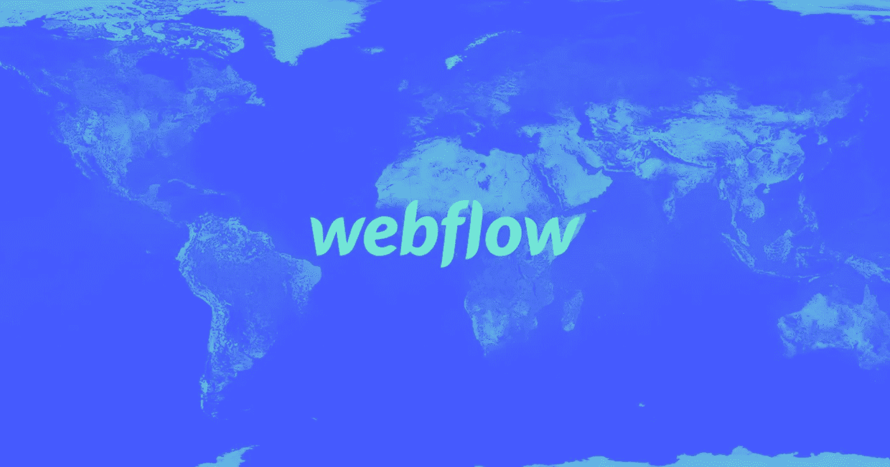

# 打造远程友好型公司:访 Webflow 首席执行官弗拉德·马格达林

> 原文：<https://medium.com/hackernoon/building-a-remote-friendly-company-an-interview-with-webflow-ceo-vlad-magdalin-3597d55df44c>

## Vlad Magdalin 分享了他对在初创公司建立远程文化的见解。了解为什么担心远程工作人员无法工作是一种不成熟的恐惧，写作如何取代白板来改善决策，以及为什么与同事联系与完成任务一样重要，甚至更重要。

Webflow 赋予创意人员构建完全定制、响应迅速的网站的能力——可视化。他们的总部位于旧金山，弗拉德和塞尔吉·马格达林兄弟于 2013 年在那里创办了公司，但他们的团队成员分散在全球各地。Vlad 和我坐下来谈论管理分散团队的早期恐惧、顿悟时刻、高潮和低谷。

我是 Webflow 的众多成员之一——嗯，算是吧。我住在加拿大的温哥华，离旧金山只有 1500 公里(900 多英里)。我也不完全是一名雇员，但我有一份持续的兼职合同，作为 [Webflow 博客](http://webflow.com/blog)的编辑。这意味着在过去的一年半时间里，我已经在后台看到了他们的一些公司文化，以及 Webflow 对工作之外的社交纽带的重视。

Webflow 正在发生一些特别的事情。团队*真的*很兴奋能够成为让 Webflow 更好地为用户服务的一份子。我很想和 Vlad 谈谈他们是如何做到这一点的，现在我很高兴能和你分享我们的对话。

# 我在 Webflow 团队里有 75 个人。你从一开始就知道你会被疏远吗？

是的，我们中只有大约 25 人在旧金山，所以我们 70%是远程的。

我们不知道我们会先被远程控制。我们实际上认为它永远不会工作。我们试图在当地找到我们的第一个雇员。我们知道我们需要一名工程师，但我们唯一能找到的愿意为一家资金严重不足的初创公司工作的人住在萨克拉门托。这是丹·罗杰斯，他仍然和我们在一起。谢谢你，丹！

我们乐观地认为，一旦我们付得起更多的钱，他最终会搬到湾区。

> 因为我们真的在想，*如果你面前没有白板，坐在你合作的人旁边，你如何使用设计工具？*

我们很快认识到这两者都是不必要的。因此，我们“被迫”雇佣第一个远程团队成员是一种巧合和幸运。这让我们有信心雇佣下一个远程人员，他在芬兰，然后是另一个在莫斯科。

所以不。这根本不是计划好的。一部分是运气，一部分是环境。

# 你还在考虑带一个远程雇员去旧金山吗？

只有在团队成员注意到的情况下。如果有人想搬家，我们会尽我们所能提供帮助，比如申请各种签证和支付搬迁费用。

我们可以灵活选择适合每个人的方式。更近的时区意味着更多的时间重叠，但这不是必需的。事实上，我认为从旧金山搬来的人比我们在这里重新安置的人还要多。

如果你是一名创始人，你不能忽视世界上 99.9%最有才华的人都不住在(或不能搬到)旧金山。

> 我的建议是从第一天开始就考虑建立一个远程友好的团队和文化。

# 你是否从已经成功管理远程文化的公司那里获得了灵感？

一半一半。最初，没有多少远程友好型公司。运营 WordPress 的 Automattic 公司有一个远程模型。在过去的五年里，有一个相当大的转变，像 Zapier 和 InVision 这样的公司已经表明，拥有完全分布的劳动力是可能的。

我们中的一些人独立地来到远程模型，因为我们可以雇用谁，我们对雇用远程人员有多开放，以及看到来自其他公司的证据。由于其他公司的成功，许多公司已经越来越适应这个概念。

# 除了不能聚集在白板前，你对分散的团队还有什么恐惧？

一些显而易见但不成熟的比如:你怎么知道有人在工作？你怎么知道他们是有效率的？

随着时间的推移，你会发现这是一种微观管理的恐惧，如果你雇佣了正确的人，设定了正确的期望，这并不重要。如果他们有完成工作的技能和支持，并且你表现出你信任一个人做他们的工作，你会得到更好的工作。

没有这种在白板上进行现场头脑风暴的能力带来了一些好处，比如说产品设计师，而不是与工程师或其他设计师一起在白板上写东西，而是将 Dropbox 纸质文档放在一起。

将文件放在一起需要更多的思考和表达，这是与他人讨论这个想法的重要前提。一旦该文档被阐明，它就可以不仅仅与一个人共享——恰好与你在一个房间中——它是一个可以在整个团队中共享的工件。

因此，您可以更快地对您正在处理的问题达成共识——通过不使用白板，我们找到了更好的协作方式。

# 你能谈谈在每个人都分散的情况下建立团队文化是什么感觉吗？

第一年，对旧金山的少数人来说，社会结构非常有限，因为一切都很遥远。由于大部分的合作都是在 Slack 上进行的——或者我猜当时是 HipChat 没有多少当地人参加团队活动或郊游。

随着越来越多的人加入旧金山的团队，事情变得更容易了，我们有了一间办公室——有了更多的人可以一起做社交活动。这也创造了另一个临界质量，当偏远地区的人们进入城市，有更多的人一起吃午餐，享受欢乐时光，看电影，或探索城市。

# 团队文化如何在几乎没有重叠的时区发挥作用？

我们总是不愿意雇佣来自零重叠时区的人。例如，我们没有在莫斯科东部招聘员工的经验。我们也没有太多来自这些地区的人申请——所以基于经验的缺乏，有些担心。但也不是完全没有可能。

对于那些时区的人来说，有一个临界质量的问题。我们在欧洲的第一个团队成员经历了一段非常艰难的时间，因为他们一天工作 6 个小时，没有人在线。现在我们在欧洲有 10 多人，所以有一个在线社区也有同样的时间。我认为对于最初的几个人来说——比如说印度或中国——要跟上速度并感觉与团队有联系是相当困难的。那是我们到达那里后要经过的一座桥。

# 时区重叠很少的团队成员会调整自己的工作日吗？

是也不是。这取决于团队成员。我们与欧洲有两三个小时的重叠时间——他们傍晚，我们清晨——但我们不会强迫人们完全改变他们的时间表。因此，尽管他们在一天的大部分时间里没有重叠，但总会有一点重叠，人们可以在那里实时交谈，这真的很有帮助。我们不要求人们在晚上工作，尽管这种情况时有发生。

我们确保团队会议的流程尽可能的异步。我们有相当小的团队，他们协调自己的时间表。

# 你如何克服分布式团队带来的沟通挑战？

过度沟通是关键。我们曾经遇到过这样的情况，团队中的一小部分人在空闲时间或面对面地讨论一些事情，这些事情会影响到另一个人或另一个团队，但却没有得到沟通。或者它以一种它*假设*它被传递的方式被传递。或者，有人只是*忘记*传达它。这是一个持续的挑战，我们仍在学习解决这个问题。

随着我们变得越来越大，交流 Webflow 的战略和方向是当务之急。以前我们 10 到 20 个人的时候要容易得多。我们会在产品和工程会议上报道它，人们会自然地吸收这些信息。现在我们已经接近 80 分了，我们开始在全体会议上讨论它，强化它，并重复它。

甚至这还不够。如果有人在报道重要事情时错过了全体会议——即使有录音——我们不得不假设人们不会看。

> 我们现在做的事情就像非正式的咖啡聊天，我们一起出去，作为一个团队谈论任何事情。

但就像在任何公司一样，无论是否遥远，沟通总是一个问题。这总是我们可以做得更好的事情。由于位置偏远，大部分时间都要写东西。决策不是在走廊谈话中做出的——我们使用 GitHub、Slack、Dropbox Paper 或谷歌文档，这些文档有可参考的历史和决策的背景。

# 您使用什么工具来促进远程友好型文化？

Slack 是最大的一个，但它也有自己的挑战——它可能是通知的消防水管，它设定了你总是随叫随到的期望。

但是我很难想象这样工作而没有懈怠。当 Slack 出现故障时，感觉就像沟通被切断了一样。你几乎觉得自己是个哑巴，好像你和你的团队没有这种直接的联系。

GitHub 对我们的工程团队来说是一个巨大的挑战。缩放是我们使用的另一个工具。只要你有屏幕共享，可以面对面交谈，并且有一种异步的交流方式，这就涵盖了基本内容。

# 你鼓励或要求人们在现场工作吗？

旅行是我们鼓励的非常有帮助的事情——每次有人出现在办公室，周围都是拥抱。但是旅行并不是必须的，它只是我们提供的一种选择。

我们正在尝试让特定的团队安排他们自己的场地。也许他们在旧金山或科罗拉多相遇，然后在同一个城市一起工作三四天。

我们正努力鼓励更多这样的活动，以更好地形成社会和团队纽带。对于一个遥远的文化来说，拥有一种超越日常专业工作的凝聚力是很重要的。当人们感到与使命联系在一起时，他们会留下来——不仅与使命联系在一起，还与和他们一起完成使命的人联系在一起。

# 你做年度静修有多久了，它看起来像什么？

从第一年开始，我们就开始了一年一度的静修。

静修通常在异地进行 4 到 5 天，通常是在某个遥远的目的地。我们去了太浩湖、墨西哥、里斯本和其他地方。一部分是计划，一部分是乐趣。这是一个集思广益、创新、分享想法和设定年度工作重点的时刻。我们以小组或整个小组的形式进行许多团队活动。

无论我们碰巧在哪个城市，我们都有时间去闲逛、放松和探索。这是重新联系的好时机，或者在很多情况下，是第一次联系。去年，我亲自见到了一些已经共事两年多的团队成员。这是最好的重置，也是一个机会，让我们重新回到中心，创造出我们追求的北极星——整个团队都为朝着同一个方向划船而兴奋不已。

静修也为完成工作提供了动力。当我们在静修前运送了一些重要的东西，我们有东西要庆祝时，感觉总是很棒——在一个大的成就后休息。

# 你有你所谓的全体会议？

是啊。这是每周一次的会议，我们在会上介绍新的团队成员，提供产品开发的最新信息，发布公告，回答问题，并庆祝里程碑。我们还开展了一项名为“道具”的活动，让团队成员有机会向团队中的其他人致敬。

# 全员会议对公司文化有什么影响？

两年前我们开始了全体会议。当团队还小的时候，我们有非正式的聚会，随着我们的成长，我们开始发现对结构的需求。我们介绍了幻灯片，并开始记录会议。

这是一周中我们作为一个整体团队一起度过的一个有保证的时间。看到每个人的脸，听到他们的声音，谈论公司和个人的事情，分享更新，庆祝，这是非常有价值的。

我们在我们的产品路线图上花了很多时间，这为未来的发展提供了很多透明度。反应是非常积极的。

它还鼓励跨团队协作和反馈。有人可能会说，“嘿，我知道我们正在计划这个功能——我们有没有想过把它带到这个不同的方向？”或者，也许我们实际上有一个创可贴解决方案，有人说，“这里有一个实际的东西，我认为可以解决这个问题。”

# 你提到了信任你雇佣的人的重要性。告诉我更多关于它是如何发展的。

我过去工作过的几乎每家公司都有一个隐含的假设，即在家工作不是真正的工作。事实上，在我工作的一家机构，这甚至都不是一个选项——你必须请一天病假在家工作。

我们都害怕的是:我们怎么知道有人真的在工作？

很快，你就能从输出中知道。如果有人没有完成他们被雇来做的工作，我们需要找出发生了什么。他们在纠结什么吗？期望是否明确？

但如果第一个问题是，“他们在关注网飞吗？”你可能一开始就没有足够的信心雇佣他们。一旦我们看到我们的远程人员完成了相同或更多的工作输出，这些问题就不存在了。

这种信任程度是在我们严格的面试过程中获得的——我们的大多数团队成员都会在一个真实的项目中经历长达一周的带薪合同。它让我们深入了解他们如何工作，问问题，交流。我们对一个人是否能做到他们说他们能做到的，以及他们是否能保持责任心有了一个很好的了解。

基本假设是，我们雇佣的人是可以信任的，我们的招聘流程会对此进行测试。

我们也很挑剔——我们寻找有远程经验的人。加入我们团队的绝大多数人都经营过自己的机构，独立工作，或者为其他美国公司远程工作。他们习惯了远程模式，知道如何在不在现场的情况下完成工作。

# 关于登录时间的 Webflow 理念是什么？

没有人真正从记录时间中获得价值，除了有一个做了什么的追溯记录。

我们有一个超轻量级的在轨/离轨机制，主要是一种沟通媒介，帮助我们的产品团队制定时间表。当你偏离轨道时，有一个机制可以让你回到正轨。

偏离轨道并不是什么可耻的事情。我们使用 RDA 模型—返工、延期、放弃—您可以:

*   **通过切割范围返工**一个轨迹
*   **推迟**当你遇到一些棘手的未知问题，需要时间解决时
*   **放弃**当你得到新的信息，使一个轨道变得不确定，需要决定你是否还应该投入时间

我们相信人们正在尽最大努力，这使得每小时的报告变得没有必要。我们假设人们是值得信任的，并且有着最好的意图。

> 信任是你失去的东西，而不是你得到的东西。

假设每个人都相信团队中的其他人都在尽力而为。然后当事情偏离了轨道，它几乎从来没有失去信任。我们一起努力找出未知的东西。

# 如此大的团队获得如此多的信任令人难以置信。

Webflow 的神奇之处在于，有一群人真正热爱我们的使命——他们关心我们努力的方向。我们团队的很大一部分直接从我们的社区加入。他们的生活被 Webflow 改变了，他们希望其他人也能体验到这一点。

有一种成为真正伟大的公司的内在愿望，以及工具和平台可以成为什么样的外在模型。这种渴望不仅是为了你自己和你的职业生涯，也是为了整个公司和我们的使命。

我想我们有一些特别的东西。因此，如果客户真的不高兴，团队中的每个人都明白我们正在建立一个比我们更大的社区。它由成千上万的其他设计师组成，他们依靠我们做正确的事情。

# 从团队成员和像你这样的领导者的角度来看，管理一个远程团队最大的困难是什么？

第一，我认为是交流。这只是人类状况的一部分。沟通是困难的，我们正在做很多事情来帮助鼓励围绕决策进行更加开放和透明的沟通，并在做出决策时具有包容性。

随着团队越来越大，保持紧密的文化也变得越来越难。我认识所有人，但绝对没有我们 20 人的时候深刻。

这就带来了挑战…我不会称他们为小团体，但是…人们彼此更加了解，因为他们在项目和计划上密切合作。有时你可能会很多很多个月没有和某人见面或相遇。

最近我们遇到了一个情况，我们的一个工程师问，“审查我的代码的这个人是谁？”我们在他们度假的时候雇佣了一些人，所以他们错过了开场白和全体会议。更大的群体意味着联系并不是一开始就存在的，而是随着时间的推移而产生的。

也有很多开销。特别是在其他国家，我们雇佣合同工，这有很多不同的限制。我们必须确保我们在一个国家的指导方针内工作，随着我们在一个特定国家的人员越来越多，我们需要在那里建立一个完整的法律子公司。

但令人鼓舞的是，听到其他公司，如 InVision，他们有数百人，已经能够在没有产生太多摩擦的情况下扩大规模。

> 大多数挑战，如沟通和协调，并不是远程公司独有的。如果每个人都在我们的旧金山办公室工作，我们的奋斗会是相似的。

# 你会给想远程招聘的人什么建议？

两个字:必然。

像脸书和谷歌这样的公司有足够的威望，他们可能会有一个非常严格的非远程政策。他们可以建立一个办公室，在更多的城市全面开展业务，而不是让人们远程工作。

但这种趋势已经在 LinkedIn 和亚马逊等公司身上发生了转变。这两个国家的偏远人口都在增长。亚马逊在雇佣一些人方面遇到了麻烦，因为他们无法搬家。有时候，一个提议——无论是经济上还是实际上——必须大到足以涵盖某人搬家所需的生活变化。

配偶必须换工作，找一份新工作。孩子们不得不放弃朋友，转学。也许你必须卖掉房子，买一个新的。你可能不得不去一个不同的国家学习一门语言。这些都是巨大的障碍，作为一家初创公司，你不具备脸书和谷歌的优势。

你不能只是说，“好吧，好吧，我只打算在伦敦或旧金山雇用你。”与 Webflow、Zapier 和 InVision 等公司的竞争越来越激烈。这份名单每年都在翻倍，如果不是三倍的话。远程团队成员拥有更多的选择，这些选择极具吸引力、报酬丰厚、薪酬合理且有趣。

由于不考虑远程模型，雇主们切断了世界上绝大多数的人才库——这里甚至没有夸大其词。他们本质上是选择在薪酬和股票期权方面与利润最高、资本最雄厚的公司竞争。

> 因此，对于新的创业公司来说，不把远程作为首选似乎是一个巨大的劣势。在大多数情况下，收益远远超过预期的成本。主要的好处是有一个非常非常广泛的人才库来为你的产品或服务工作——这似乎是显而易见的。

如果你以后把它作为一个原则，对你的第一个远程候选人来说，这将是一个非常棘手的经历。你不仅要让那个人习惯你的文化，你还需要重新培训你现有的现场人员，让他们以远程优先的方式思考。

特别是我们今天拥有的 Zoom、Slack 和其他在线实时协作工具的技术，它们正在消除您能够在现场和异地做什么之间的界限。

# 关于这种先远后近的文化，最令人惊讶和愉快的是什么？

它创造了这个思想的熔炉。有些想法我不同意，但随着时间的推移，从许多不同角度学习的动力使我在 Webflow 的体验更好，并最终改进了我们的产品。

由于不从本地人才库中招聘员工，这家公司有很多的多样性。

# 有什么我没提到的你想让人们知道的吗？

远程工作可能很难。尤其是当你是团队中唯一一个在某个特定城市的人时。

我们有一个远程生活频道，人们在那里分享奋斗和策略。我们鼓励人们寻找合作空间——Webflow 将报销一定数量的合作成本。我们认识到，有些人需要一个专用的工作空间，与其他生活活动分开。有些人可能有家庭办公室。有些人可能不会。也许他们的家庭办公室与他们的家庭运作方式不兼容。

确保每个人都觉得自己是团队的一部分是一个持续的挑战，解决这个问题几乎是一种奢侈——它需要像旅行这样的钱。

因此，我们仍在努力应对一些挑战，但看到过去几年取得的所有进展令人鼓舞。新技术总是让事情变得更简单。

# 听起来，如果你有一根魔杖可以集中 Webflow，你不会这样做。

我不会这么做，因为我现在知道——多年后——生活中的非工作领域对我们的团队成员有多重要。如果每个人都在同一个地方，这些东西是不可能复制的。

Anna Kelian 是我们在黎巴嫩的团队成员之一，长期以来一直是黎巴嫩超级联赛中一家主要足球俱乐部的体育记者，她为球员所熟知。无论我们搬到旧金山有多顺利，这都是她生活中必须被切断的一个重要部分——一个她无法远程完成的部分。

我们刚刚聘请了我们最新的 QA 分析师—他叫 Mark，住在英国伦敦附近。他同时也是一名职业魔术师，他在当地建立的社区对他来说意义深远。如果我们不是远程优先，他永远不会加入我们的团队，现在我们不仅受益于他的 QA 专业知识，还受益于他令人惊叹的魔术表演，这些表演让我们着迷。我不知道你怎么想，但是这让这整个遥远的事情变得很…嗯…不可思议。

Webflow 团队里有很多这样的故事。也许正在阅读的人将是我们的下一个故事——因为[我们正在招聘](https://webflow.com/about#jobs)！

只要你有互联网连接，我们在 Webflow 做的工作就可以数字化完成，并且与远程框架非常兼容。但是你的孩子玩的运动，他们的朋友，你的朋友，家人——所有这些东西都与地理位置有着更深的联系。

当你刚从大学毕业，想要尝试一个不同的城市时，集中可能是有意义的，因为这对双方都有好处。但那只是一点点时间。如果你只是在那个时间窗口里招聘人，你最终会得到一个单一文化的大学毕业生，他们都处于人生的同一阶段。这就是每天工作 16 个小时的创业公司是如何出现的——这是不健康的。

如果我*可以*挥舞魔杖，我会让人们更频繁地旅行成为可能——我们到他们那里，他们到我们这里。即使在工作之外，人们也应该旅行——体验更多的地方、文化、地理、美食和人。

# 我希望我们都有一根魔杖。

是的——我听说他们在亚马逊上卖。