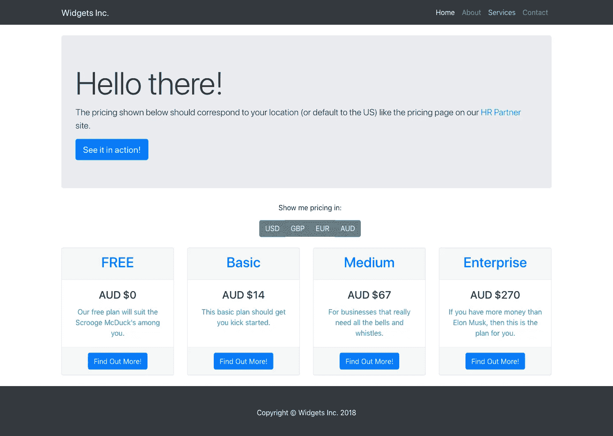

# 构建填充当地货币的 SaaS 定价页面

> 原文：<https://medium.com/hackernoon/building-a-saas-pricing-page-which-reflects-local-currency-a55c7d169bc2>

在我早上散步的时候，我一直喜欢听 [SaaS](https://hackernoon.com/tagged/saas) 相关的播客，昨天早上，我在听简·波特曼的“UI 早餐”播客，在播客中[正在和罗布·特林克谈论 SaaS 定价页面](https://uibreakfast.com/117-best-practices-for-saas-pricing-pages-with-rob-turlinckx/)。

现在，我们刚刚对我们自己的[人力资源合作伙伴定价页面](https://www.hrpartner.io/pricing.html)进行了改造，它实际上满足了他们在播客中谈到的大多数建议，即提供多种货币，在加载时自动显示用户的本地[货币](https://hackernoon.com/tagged/currency)，显示月度与年度定价等。


Our HR Partner pricing page

我们的页面相当复杂(但幸运的是，我的团队中有一个伟大的 UX 设计师，他尽可能地使它易于使用)，但我想我会扩展我们在那里做的一些事情，以便以各种货币显示价格，最重要的是，我们如何检测用户的位置，并以他们自己的本地货币向他们显示相关的价格(或者如果他们在我们通常定价之外的位置，则默认为美元)。

我所做的是在 Github 上整理一个简单的定价页面，欢迎你来探索和剖析。我的目标是能够实现本地化定价，只需(A)最少的 javascript 代码，(B)在一个页面上完成所有工作，以及(c)完全免费——根本不需要调用昂贵的登录页面或 A/B 测试服务来生成不同的定价页面！

这是它看起来的样子(是的，我是一个程序员，不是设计师！):



Our test pricing page

看看它在这里的运行情况:[https://cyberferret.github.io/LocalCurrencyPricing/](https://cyberferret.github.io/LocalCurrencyPricing/)

以下是实际网页代码的要点:

如果你想要完整的源代码(包括引导库和 jQuery 库等)。所以你可以在你自己的服务器上测试)，然后你可以从我的 Github 库克隆我的代码:[https://github.com/CyberFerret/LocalCurrencyPricing](https://github.com/CyberFerret/LocalCurrencyPricing)

让我们在这里分解代码。

首先，我使用了一个简单的 Bootstrap 4 页面布局，它有一个标题块，然后是定价的 4 列。如果您查看每个定价栏，我已经包括了我想展示的 4 种货币:

```
<div class="col-lg-3 col-md-6 mb-4">
          <div class="card">
            <div class="card-header">
              <h2 class="text-primary">FREE</h2>
            </div>
            <div class="card-body">
              <h4 class="card-title pricing USD_pricing">USD $0</h4>
              <h4 class="card-title pricing GBP_pricing collapse">GBP &pound;0</h4>
              <h4 class="card-title pricing EUR_pricing collapse">EUR &euro;0</h4>
              <h4 class="card-title pricing AUD_pricing collapse">AUD $0</h4>
              <p class="card-text text-info">Our free plan will suit the Scrooge McDuck's among you.</p>
            </div>
            <div class="card-footer">
              <a href="#" class="btn btn-primary">Find Out More!</a>
            </div>
          </div>
        </div>
```

但是看看源代码中除了 USD 定价之外的所有使用的` **collapse** '类。这样做的目的是“折叠”其他货币，使它们在页面加载时不可见，而是默认显示美元定价。

我还将所有的定价

#### 标签分为`**定价**和`**XXX _ 定价**`(其中 XXX 是每个地区的 3 个字母的货币代码)。稍后您将看到我如何通过一个简单的 javascript 函数来隐藏和显示相关的价格。

现在让我们看看页面底部的 javascript 代码。我们需要查看两个模块，即:

```
$(document).ready(function () {
        $.get("https://api.ipdata.co?api-key=xxxxxxxxxxxxxxxxxxxxxxxxxxxxxxxxxx", function (response) {
          var detectedCurrency = response.currency.code;
          displayPrice(detectedCurrency)
        }, "jsonp");
      });
```

这段代码一直等到页面完全加载完毕，然后转到 IPData.co 免费服务，查询用户的地区信息，包括与他们的地区相关的货币代码。

该信息包含在来自 IPData 服务的 JSON 响应中，您可以通过 **response.currency.code** 变量获得它。

请注意，即使这个调用是作为后台异步 AJAX 调用完成的，也可能需要几秒钟才能返回结果——这就是为什么我们最初显示的是默认的美元定价，而不是根本没有定价。这可能会导致页面加载时令人不安的闪烁，因此您可能希望在自己的页面上默认显示无定价，这可以通过最初向所有定价行添加“ **collapse** ”类来实现。这完全取决于你。

提示:记住用你从 IPData.co 得到的免费 API 密匙替换上面的“xxxxxxxxx”伪 API 密匙！

javascript 的下一部分是操纵页面 DOM 来显示或隐藏相关货币的部分:

```
displayPrice = function(currency) {
        // First, lets hide all the current pricing
        $(".pricing").hide();
        // Is the currency within the valid range of currencies that we wish to show?
        if (currency !== null || (["USD", "AUD", "GBP", "EUR"].indexOf(currency) > -1)) {
          // If yes, then show the currency
          $("." + currency + "_pricing").show();
        } else {
          // If no, then just show USD pricing
          $(".USD_pricing").show();
        }
      }
```

这个函数只接受一个参数，3 个字母的货币代码，然后它:

1.  默认情况下，隐藏所有定价行，然后
2.  检查货币代码，看它是否是页面上允许的 4 个代码之一，然后
3.  如果允许，显示类别为“*[货币代码]_ 定价*”的定价，或者
4.  显示默认的美元定价行。

最后一件事——我意识到，有时用户可能希望自己看到以其他货币计价的价格，而不是以当地货币计价的价格。最常见的是当他们想要将美元价值与他们使用的其他服务进行比较时。，所以我们应该允许他们有这样做的能力。

这就是为什么我把按钮组放在标题和价格框之间，询问他们想看的货币。单击任何按钮都会调用`***display price()***`函数来显示该地区的货币。

```
<div class="row text-center">
        <div class="col-lg-12 m-2">
          <p>Show me pricing in: </p>
          <div class="btn-group mb-3" role="group" aria-label="Select Currency">
            <button type="button" class="btn btn-secondary" onclick="displayPrice('USD');">USD</button>
            <button type="button" class="btn btn-secondary" onclick="displayPrice('GBP');">GBP</button>
            <button type="button" class="btn btn-secondary" onclick="displayPrice('EUR');">EUR</button>
            <button type="button" class="btn btn-secondary" onclick="displayPrice('AUD');">AUD</button>
          </div>
        </div>
      </div>
```

就是这样！很容易(而且便宜)，不是吗？不需要复杂的内容管理系统，或者 PHP/Ruby 脚本等等。这些都可以在免费的网站托管平台上完成，比如亚马逊 S3(我们正在使用)或者 Github Pages 等等。

好好享受吧。在我的下一篇文章中，我可能会展示如何使用一个免费的外币兑换 API 来动态计算基于当天汇率的其他价格！

> [最初发表于此](http://devan.blaze.com.au/blog/2018/8/1/building-a-pricing-screen-which-reflects-local-currency)