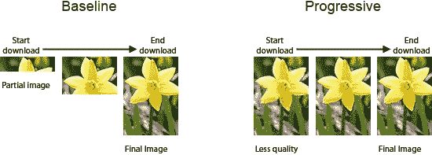
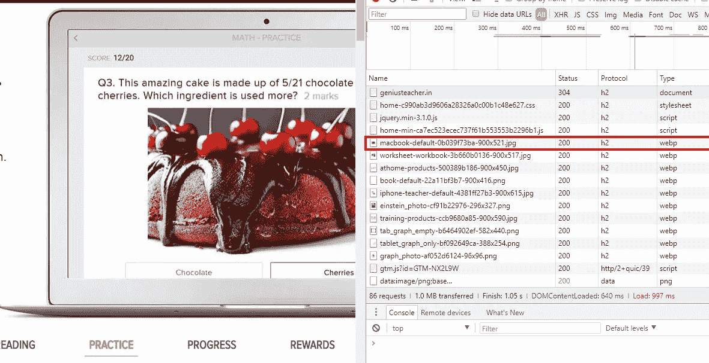
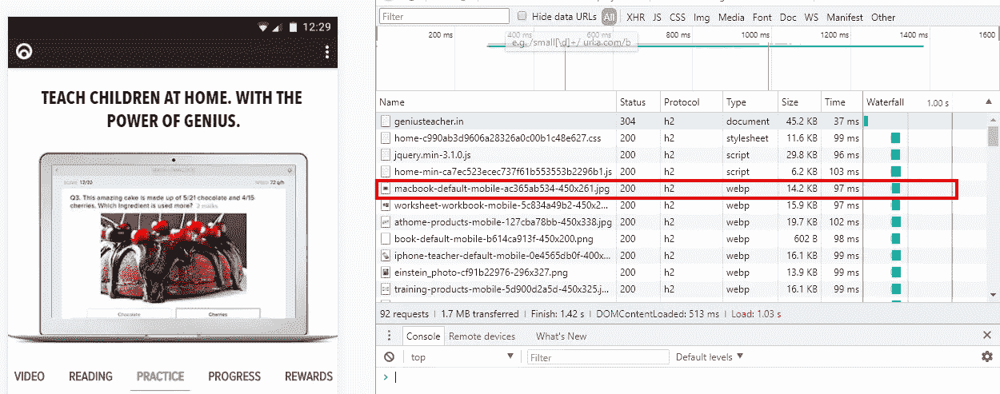
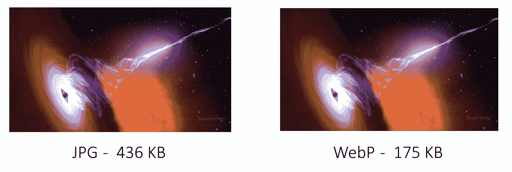
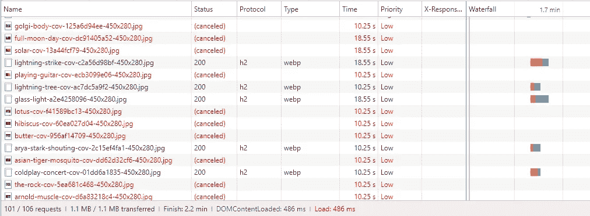
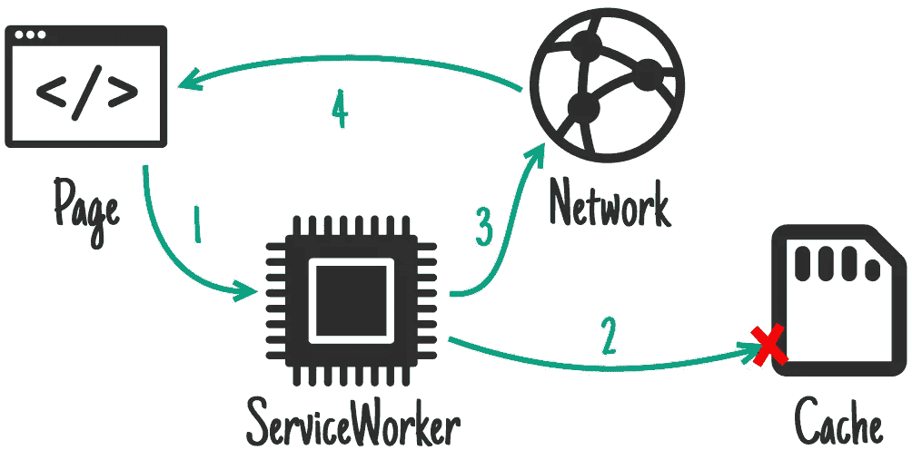

# 为网络构建无缝的图像和视频体验

> 原文：<https://medium.com/hackernoon/building-a-seamless-image-and-video-experience-for-the-web-62d7406f3ef2>

在 [Genius](https://geniusteacher.in) ，我们将现实世界的事件和行动与学术概念联系起来的独特方法使数学、科学和英语对孩子们极具吸引力！我们通过[渐进式网络应用(PWA)](https://developers.google.com/web/progressive-web-apps/) 、Android 和 iOS 提供的引人入胜的解释和有趣的评估，大量使用了静态图像、动画图像和视频。


A Genius way of learning

# 当前的需要

曾经有一段时间，用户有足够的耐心等待媒体加载。现在，0.5 秒或更长的图像加载时间是不可接受的。参差不齐的体验不能让用户满意，违背了伟大产品的宗旨。尽管世界各地的互联网连接正在显著改善，但延迟和带宽波动仍然十分普遍。


A typical Joe, not impressed with your service

这篇文章将帮助你为最坏的情况做准备，并尽可能快地使你的媒体可用。通过优化 3 个主要因素，提供了出色的流畅体验:

1.  **资产下载期间的用户体验**。
2.  **减少下载时间。**
3.  **浏览器缓存**实现近乎即时的加载。

有许多文章有助于解决这样或那样的问题。这篇文章几乎完整地总结了在参差不齐的网络上运行流畅的富媒体 web 应用的解决方案。它是为理解 web 开发基础的用户设计的——HTML、CSS、HTTP 请求和常见的浏览器行为。

在 Genius，我们大量使用 Typescript、React 和 Node.js。我们的 pwa、内部仪表盘、工具和服务器应用程序都是用它们构建的。自然，解决方案也在我们的专业领域中呈现。

# 用户体验

保持用户参与。给他们看一些融入即将到来的东西。以下是我们在 Genius 部署的几种方法，让我们的体验变得更好。

## 动画加载区域

一个简单的矩形，用两种颜色制作动画，在提供一种“有事发生”的心理感觉方面大有帮助。它创造了一个事件，潜意识地记录下来，并欺骗它相信，“让我等着，看看会出现什么。”


An animating box of subconscious trickery

使用普通 CSS 很容易实现这样一个简单的功能。

首先，为背景色定义一组关键帧。

```
[@keyframes](http://twitter.com/keyframes) loading {
  0% { background-color: #e0e0e0; }
  50% { background-color: #eeeeee; }
  100% { background-color: #e0e0e0; }
}
```

在 CSS 类中制作动画。

```
.img-container {
  background-color: #ffffff;
  animation: loading 1.3s ease-in-out infinite;
  -webkit-animation: loading 1.3s ease-in-out infinite;
}
```

使用图像容器中的类，它将有``标签。

```
<div class="img-container" style="height: 500px; width: 650px;">
    
</div>
```

## 渐进加载

JPEG 有两种类型——**基线**和**渐进**。渐进式首先显示完整的低质量图像，并在数据到达时提高精度。这也导致更小的图像(细节如下)。



有许多在线工具[来构建渐进图像。在 Genius，我们构建了一个 Node.js 包(用 Typescript 编写),用于解析和打包我们的内容和媒体。它使用](https://www.jpeg.io/)[洛弗尔富勒的夏普](https://github.com/lovell/sharp)来调整大小，使所有 JPEG 渐进。

渐进式 JPEG 会带来更好的体验吗？答案是不确定的。这可能会导致更多的参与，但研究表明，由于认知负荷的增加，这可能会导致用户幸福感的下降。

在 Genius，我们最终使用了 progressive 来保持用户参与，并保持 JPEG 的最小尺寸(下面将详细介绍)。

## 视频海报图像

视频的[海报图像](https://developer.mozilla.org/en-US/docs/Web/HTML/Element/video#attr-poster)是视频下载时吸引用户的第一个机会。从[用户体验](https://hackernoon.com/tagged/user-experience)的角度来说，不放海报是个馊主意。这有助于保持用户潜意识的参与。

海报图像通过视频元素`<video>`上的属性`poster`提供。

```
<video poster="poster.jpg" controls>
  <source src="movie.mp4" type="video/mp4">
</video>
```

# 减少下载时间

为了缩短任何资源的下载时间，我们可以优化 3 个主要因素:

1.  **资产大小**:降低图像和视频的分辨率，使用正确的编码格式进一步降低尺寸。
2.  **HTTP 协议** : HTTP/2 把 HTTP/1.x 留在尘埃里。
3.  **请求队列**:请求队列中未完成的条目不再需要，增加了需要的资产的加载时间。

## **缩减资产**

最好的情况是在保持可接受的质量的同时，以最佳的格式和压缩提供最小分辨率的图像/视频。人们通常认为，除非你是一家注重质量的“照相馆”，否则就不能提供高分辨率、高质量的图像。主要有两种方法:

1.  让浏览器从一组图像/视频中做出决定的客户端 HTML
2.  服务器以 URL 中指定的分辨率发送精确调整大小的图像

## **客户端 HTML**

使用带有 HTML `[<picture>](https://www.w3schools.com/tags/tag_picture.asp)`和`[<source>](https://www.w3schools.com/tags/tag_source.asp)`标签的 [CSS 媒体查询](https://www.w3schools.com/css/css_rwd_mediaqueries.asp)使得让浏览器决定加载哪个图像变得非常简单。你所要做的就是创建多个版本的图像并保存在服务器上。这里有一个例子:

```
<picture>
  <source media="(min-width: 451px)" srcset="picture-660x414.jpg">
  <source media="(max-width: 450px)" srcset="picture-330x207.jpg">
  
</picture>
```

由于`<picture>`和`<source>`标签相对较新，为了与旧浏览器兼容，我们还包含了``标签。

如果您打开开发人员控制台，您将看到不同的请求。



900 x 521 resolution is loaded on desktop



450 x 261 resolution is loaded on mobile devices

对于视频，用`<video>`元素替换`<picture>`元素将加载相应分辨率的视频。你必须以不同的分辨率对视频进行编码，并将其存储在你的系统中。在 Genius，我们使用 FFmpeg 来自动化我们所有的视频任务。

## **服务器端调整大小和缓存**

这是通过在 URL 中发送图像的预期宽度/高度来实现的。服务器根据每个请求调整目标文件的大小，或者从缓存(如果存在的话)中提供服务。这是一个相对更复杂的解决方案，因为(I)需要在客户机上计算预期的宽度/高度，以便为`src`属性创建 URL，以及(ii)服务器需要理解这些参数，以便(iii)调整图像的大小并缓存图像。

很多 CDN(内容交付网络)服务像 [Cloudflare](https://support.cloudflare.com/hc/en-us/articles/200168106-Does-Cloudflare-offer-image-optimization-features-) 、 [Akamai](https://www.akamai.com/uk/en/products/web-performance/image-manager.jsp) 等。附带图像大小调整功能。甚至像 [Nginx 这样针对静态内容交付优化的软件也支持](http://nginx.org/en/docs/http/ngx_http_image_filter_module.html)它。对于 Node.js，我们用 [image-resizer](https://github.com/jimmynicol/image-resizer) (基于 [Sharp](https://github.com/lovell/sharp) )进行了实验，发现它相当[快](http://sharp.dimens.io/en/stable/performance/)。

## WebP 而不是 JPG 和巴布亚新几内亚

对于相同的质量，WebP 产生的图像比 JPG 和 PNG 小 20-35%。唯一的警告是，它只在 Chrome、Opera 和 Chrome 的变种上受支持。因此，需要注意提供正确的文件(此处极好地概括了[)。](https://developers.google.com/web/fundamentals/performance/optimizing-content-efficiency/automating-image-optimization/#how-do-i-serve-webp)



WebP gives huge savings over JPG and PNG

我们的内部工具使用 [Sharp](http://sharp.pixelplumbing.com/en/stable/api-output/#webp) 来创建所有图像的 WebP 变体。例如，对于`picture.jpg`，我们创建一个优化的 JPEG，`picture.jpg`和一个 WebP，`picture.jpg.webp`。我们有一个 Nginx 反向代理，它通过 HTTP 请求的`Accept`报头检测`webp`支持(在字符串中寻找`webp`)并提供正确的 web 图像。

## **JPEG、PNG 和 SVG 优化**

我们遵循一个简单的两步规则来决定图像类型，并使用 [Sharp](https://github.com/lovell/sharp) 来优化它们。

1.  如果是现实世界的照片或者接近现实世界的照片，就用 JPEG。
2.  如果颜色和曲线的数量有限，请使用 PNG/SVG(徽标和图标)

**渐进式 JPEG** 除了更好的用户体验，将 JPEG 编码为渐进式也会导致图像尺寸变小。只有当源图像超过 10 KB 时，这种情况才会出现。对于小于 10 KB 的文件，首选基准 JPEG。查看[这篇文章](https://yuiblog.com/blog/2008/12/05/imageopt-4/)做一个基础实验。

## 没有 gif。用 MP4。

图形交换格式(GIF)是在互联网的石器时代创建的，甚至不是为动画设计的。GIF 规范[明确指出:](https://www.w3.org/Graphics/GIF/spec-gif89a.txt)

> 图形交换格式并不打算作为一个动画平台，即使它能以一种有限的方式完成。

[根据谷歌](https://developers.google.com/web/fundamentals/performance/optimizing-content-efficiency/automating-image-optimization/)，

> 将相同的文件作为 MP4 视频传输通常可以减少 80%或更多的文件大小。gif 不仅经常浪费大量带宽，而且加载时间更长，颜色更少，用户体验通常也不尽如人意。

在 Genius，我们从工具中调用 [FFmpeg](https://www.ffmpeg.org/) 将 GIF 转换成 MP4。我们已经看到 700 KB 的 GIF 变成了 170 KB 的 MP4。下面是一个将`animated.gif`转换为`video.mp4`的命令(灵感来自[这篇博客](https://rigor.com/blog/2015/12/optimizing-animated-gifs-with-html5-video))。

```
ffmpeg -i animated.gif -movflags faststart -pix_fmt yuv420p -vf "scale=trunc(iw/2)*2:trunc(ih/2)*2" video.mp4
```

## 使用 HTTP/2

HTTP/2 是一个新的用于 HTTP 请求的协议。这是一种二进制、完全多路复用的协议，支持报头压缩。换句话说，它可以使用 1 个 TCP 连接并行加载多个文件。这使得在 HTTP/2 上加载资产非常快，并且因为压缩了头，所以消耗的带宽更少。这篇[css-tricks.com 的博客](https://css-tricks.com/http2-real-world-performance-test-analysis/)有详细的性能分析。

在 Genius，我们使用 AWS [弹性负载平衡器](https://aws.amazon.com/elasticloadbalancing/)和 [CloudFront](https://aws.amazon.com/cloudfront/) 作为我们的端点。默认情况下，这两种服务都使用 HTTP/2。

## 清除请求队列中未完成的条目

当网络变得断断续续时，我们的单页应用程序(SPAs)出现了不良行为。通过前面屏幕上的``和`<video>`元素请求的资产仍然保留在网络下载队列中，即使相应的元素已从 HTML 中删除。这反过来延迟了需要在当前视图中显示的资产的下载。

清除``元素上的`src`属性会立即取消请求。下面是 Typescript 中实现此功能的 React 组件。

对于`<video>`元素，从`source`元素中移除`src`属性，并在挂载的`<video>`元素上调用`load`。

这样，一旦从 HTML 中删除了元素，浏览器就会取消下载请求，并将`(canceled)`设置为这些请求的状态。



Canceled network requests

# 浏览器缓存

正确缓存资源可以帮助浏览器在再次获取相同资源时完全避免网络调用。有两种类型的缓存——一种是将资产持久存储在永久存储器上(持久),另一种是基于内存的(非持久),因此是特定于应用程序会话的。

高级浏览器中有 4 种类型的缓存。请求会按以下顺序遇到它们。

1.  内存缓存——顾名思义，它在内存中缓存资产。
2.  [服务工作者缓存](https://developers.google.com/web/ilt/pwa/caching-files-with-service-worker) —服务工作者使用的永久缓存(使用[缓存 API](https://developer.mozilla.org/en-US/docs/Web/API/Cache) )。
3.  [HTTP 缓存](https://developers.google.com/web/fundamentals/performance/optimizing-content-efficiency/http-caching) —根据 HTTP 请求中设置的`cache-control`头持久保存响应。
4.  HTTP/2 Cache —在内存中缓存由 HTTP/2 推送的资产。

由 Yoav Weiss 撰写的一篇有趣的文章“四个缓存的故事”解释了这四个缓存是如何协同工作的。

## HTML 预加载

HTML `preload`是一个声明性的获取，强制浏览器在使用资源之前请求它。它可以用于将资产预加载到 HTTP 和内存缓存中，这些资产在不久的将来会被用到。例如，当有人阅读博客的第一页时，我们可以预加载第二页的图像。

```
<link rel="preload" as="image" href="sunlight-trees.jpg">
```

还有与`preload`不同的`prefetch`声明。这里有一篇来自艾迪·奥斯马尼的很棒的[文章，深入描述了`prefetch`和`preload`。](/reloading/preload-prefetch-and-priorities-in-chrome-776165961bbf)

有一点我们没有意识到。不像`preload`可以加载资产为`image`、`font`、`script`,`prefetch`声明不能加载资源类型的资产。简单地说，上面块中的`preload`声明将设置`Accept`头，就好像请求是由``元素发出的一样。`prefetch`不支持`as="image"`属性，总是将`Accept`头设置为`*/*`。这使得`prefetch`不受欢迎，因为当它在 HTML 中使用时，浏览器无论如何都会重新获取资源。

## **HTTP 缓存**

浏览器 [HTTP 缓存](https://developers.google.com/web/fundamentals/performance/optimizing-content-efficiency/http-caching)主要有 3 种模式，由`[Cache-Control](https://developers.google.com/web/fundamentals/performance/optimizing-content-efficiency/http-caching/#cache-control)` HTTP 头控制。

1.  不缓存-不存储响应。通过设置响应 HTTP 头`Cache-Control: no-store`实现。
2.  每次都要重新验证—存储响应，但在使用响应之前要经过服务器验证。设置响应 HTTP 头`Cache-Control: no-cache`和`[ETag](https://developers.google.com/web/fundamentals/performance/optimizing-content-efficiency/http-caching/#validating_cached_responses_with_etags)` [头](https://developers.google.com/web/fundamentals/performance/optimizing-content-efficiency/http-caching/#validating_cached_responses_with_etags)，唯一标识交付的资源。如果`ETag`与服务器上的最新文件不匹配，服务器返回新文件，否则返回 HTTP 状态 304。
3.  不要在指定的时间内重新验证—存储响应，直到指定的时间到期时才询问服务器。通过设置`Cache-Control: public, max-age:<seconds>`实现。秒指定时间(最大值为 31536000 (1 年))，直到客户端将提供缓存的响应，而不是向服务器请求新的响应。


当对应于 URL 的资产将来可能改变时，使用第二种模式。例如，如果图像 URL 包含的只是文件名`[https://example.com/pic.jpg](https://example.com/pic.jpg)`。

当您可以为每个资源生成唯一的 URL 时，请使用第三种模式。例如，通过在名称`[https://example.com/pic-6a8sd6d82.jpg](https://example.com/pic.jpg)`中散列图像内容。

在 Genius，我们所有的图像名称都包含 hash。因此，我们总是使用第三种模式。一旦我们发送了图像，客户端不会询问服务器，除非缓存被删除或者一年过去了。这在提供无缝体验的同时，节省了用户和服务器带宽。

## 服务工作者缓存

服务人员[是网络开发的新潮流，用于构建丰富的离线体验等等。服务人员在后台运行脚本，与网页分开。我们感兴趣的特性是能够拦截来自 web 应用程序的请求，并提供来自缓存的响应，作为开发人员，我们为应用程序管理缓存。](https://developers.google.com/web/fundamentals/primers/service-workers/)



Asset caching strategy. Taken from the [offline cookbook](https://developers.google.com/web/fundamentals/instant-and-offline/offline-cookbook/).

构建一个服务人员会变得非常复杂。为了让生活变得简单，谷歌的好人们开发了[工具箱](https://developers.google.com/web/tools/workbox/)，它只需要一个安装服务工人和管理缓存的配置。例如，为了缓存对`[https://example.com/image/](https://example.com/image/,)`的所有请求，我们最多在 1 周内缓存不超过 20 个图像，我们所要做的就是像这样编写一个配置。

```
workboxSW.router.registerRoute(
  '[https://example.com/image/(.*)',](https://httpbin.org/image/(.*)',)
  workboxSW.strategies.cacheFirst({
    cacheName: 'images',
    cacheExpiration: {
      maxEntries: 50,
      maxAgeSeconds: 7 * 24 * 60 * 60,
    },
    cacheableResponse: {statuses: [0, 200]},
  })
);
```

看看这个详细的[例子](https://workbox-samples.glitch.me/examples/workbox-sw/)。

# 结束了

唷！这是很多信息。恭喜你读到最后。如果你发现有任何方面的缺失，请在下面的评论中提出来，这样这个文档就可以得到改进，变得更加有用。谢谢！